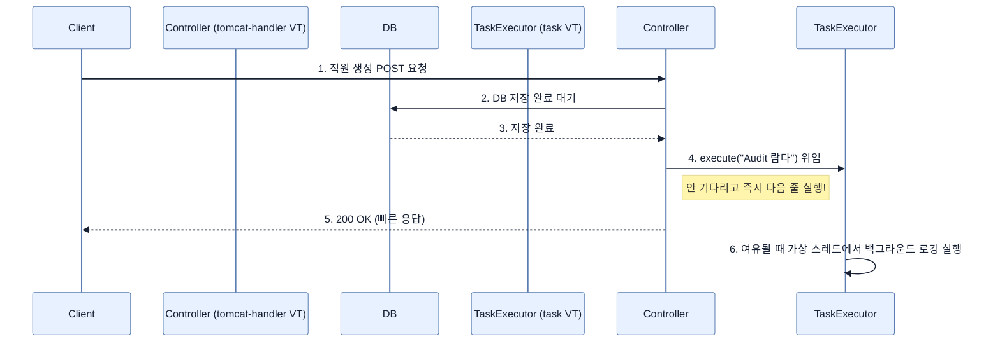

# Integrating Virtual Threads with Spring Boot's TaskExecutor

## 한눈에 보기
| 관점 | 핵심 |
|---|---|
| 이 절의 질문 | 웹 요청HTTP Request을 처리하는 과정에서 필수적이지 않은 부가 작업예: 감사 로그 남기기, 이메일 발송 등을 동기적으로 수행하면 사용자 응답 시간이 불필요하게 길어진다. 스프링 부트의 TaskExecutor를 가상 스레드와 결합하면, 응답 지연 없이 백그라운드 작업을 초경량 스레드에 떠넘겨Offloading 빠… |
| 책에서의 역할 | Chapter 11의 앞뒤 예제를 연결하는 학습 단위 |

## 1. 왜 이게 필요한가

웹 요청(HTTP Request)을 처리하는 과정에서 필수적이지 않은 부가 작업(예: 감사 로그 남기기, 이메일 발송 등)을 동기적으로 수행하면 사용자 응답 시간이 불필요하게 길어진다. 스프링 부트의 **`TaskExecutor`**를 가상 스레드와 결합하면, 응답 지연 없이 백그라운드 작업을 초경량 스레드에 떠넘겨(Offloading) 빠르고 확장성 있게 처리할 수 있다.

### 비유로 잡기
동시성 처리를 식당 주문 흐름에 비유하면, 직원이 한 주문이 끝날 때까지 서 있는 방식과 번호표를 주고 다음 주문을 받는 방식의 차이다.

→ 비유가 깨지는 지점: 소프트웨어에서는 대기뿐 아니라 순서, 취소, 역압력, 재시도, 중복 처리까지 다뤄야 하므로 번호표 비유만으로 정확성을 설명할 수 없다.

### 이 절의 언어
**[[task-executor]]**(= 스프링 프레임워크에서 java.util.concurrent.Executor를 추상화하여 비동기 작업을 스레드 풀에 제출하기 위한 핵심 인터페이스), **[[fire-and-forget]]**(= 메서드를 호출하여 작업을 지시한 후, 그 작업의 완료 여부나 반환값을 기다리지 않고 곧바로 자신의 다음 로직을 진행하는 비동기 패턴)

## 2. 어떻게 동작하는가

먼저 다음 세 축으로 메커니즘을 읽는다.

1. **입력과 전제 확인** — 어떤 요청·설정·데이터가 들어오는지 확인한다. 잘못된 전제를 다음 계층으로 넘기지 않기 위해서다.
2. **Spring 추상화 적용** — 스타터와 자동 구성, 어노테이션 또는 명시적 빈이 실제 처리를 연결한다. 반복 배선보다 도메인 선택에 집중하기 위해서다.
3. **결과와 경계 검증** — 응답·저장 상태·운영 신호를 확인한다. 정상 경로만 보고 장애·버전·성능 차이를 놓치지 않기 위해서다.

### 2.1 TaskExecutor를 이용한 작업 위임(Fire-and-forget)
사용자 등록이 끝난 후 감사(Audit) 로그를 기록하는 상황을 가정해보자. DB 저장이 끝났다면 로그를 남기는 작업은 클라이언트가 알 바 아니다.

```java
@Service
public class AuditService {
    // 스프링 부트가 제공하는 비동기 작업 실행기 (가상 스레드가 활성화되어 있다면 VT 풀을 사용함)
    private final TaskExecutor taskExecutor;

    public AuditService(TaskExecutor taskExecutor) {
        this.taskExecutor = taskExecutor;
    }

    public void registerEmployeeCreation(Employee employee) {
        // 별도의 스레드에서 실행되도록 람다식을 제출(Submit)
        taskExecutor.execute(() -> {
            System.out.println("Audit log... | isVirtual: " + Thread.currentThread().isVirtual());
        });
    }
}
```

### 2.2 메인 컨트롤러 스레드와의 분리
이제 컨트롤러에서는 핵심 비즈니스 로직(DB 저장)만 수행하고, 부가 작업은 `AuditService`에 던진 후 즉시 뷰(View)를 렌더링하거나 응답을 반환할 수 있다.

```java
@PostMapping("/new-employee")
String newEmployee(@ModelAttribute Employee newEmployee) {
    Employee saved = repository.save(newEmployee);
    
    // 비동기로 위임. 이 라인은 기다리지 않고 즉시 통과된다.
    auditService.registerEmployeeCreation(saved);
    
    return "redirect:/"; // 사용자에게 즉시 응답 반환!
}
```
로그를 확인해보면 톰캣 요청을 처리하는 가상 스레드(`tomcat-handler-x`)와 백그라운드 작업을 처리하는 가상 스레드(`task-x`)가 서로 다름을 알 수 있다. 즉, **웹 요청 처리와 백그라운드 작업 모두가 가상 스레드의 엄청난 확장성을 온전히 누리게 된다.**

### 2.3 TaskExecutor vs AsyncTaskExecutor
단순히 "실행하고 잊어버리는(Fire-and-forget)" 작업이라면 `TaskExecutor`로 충분하지만, 백그라운드 작업의 결과를 나중에 다시 추적하거나 조합해야 한다면 반환값이 있는 `Future`나 `CompletableFuture`를 지원하는 **`AsyncTaskExecutor`**를 사용해야 한다.

## 3. 그림으로 보기



## 4. 이 노트에 나온 용어
| 용어 | 한 줄 | 자세히 |
|------|-------|--------|
| task-executor | 스프링 프레임워크에서 `java.util.concurrent.Executor`를 추상화하여 비동기 작업을 스레드 풀에 제출하기 위한 핵심 인터페이스 | [[_glossary#task-executor]] |
| fire-and-forget | 메서드를 호출하여 작업을 지시한 후, 그 작업의 완료 여부나 반환값을 기다리지 않고 곧바로 자신의 다음 로직을 진행하는 비동기 패턴 | [[_glossary#fire-and-forget]] |

## 5. 자주 헷갈리는 것
- 이 주제의 **Spring 추상화**와 그 아래에서 실제로 동작하는 라이브러리·프로토콜을 같은 것으로 보지 않는다. 추상화는 기본 배선을 줄이지만 하위 계층의 비용과 실패를 없애지 않는다.

## 6. 언제 안 쓰나 / 경계
- 책의 예제는 개념을 드러내기 위한 작은 애플리케이션이다. 운영 환경에서는 인증 정보, 장애 복구, 관측성, 부하와 데이터 규모를 별도로 검증한다.
- 이 노트의 API와 기본값은 책의 Spring Boot 4.1·Java 25 맥락을 따른다. 다른 마이너 버전에서는 공식 마이그레이션 문서와 실제 의존성 버전을 함께 확인한다.

## 7. 연결
- [[02-enabling-virtual-threads]] — 같은 장의 학습 흐름에서 Integrating Virtual Threads with Spring Boot's TaskExecutor의 전제 또는 다음 적용 단계와 연결된다.
- [[04-restclient-and-http-proxies]] — 같은 장의 학습 흐름에서 Integrating Virtual Threads with Spring Boot's TaskExecutor의 전제 또는 다음 적용 단계와 연결된다.

## 8. 스스로 확인
1. 기존의 무거운 플랫폼 스레드 기반 스레드 풀을 사용할 때 백그라운드 작업을 남발하면 톰캣 웹 서버가 뻗어버릴 수 있었던 이유는 무엇이며, 가상 스레드는 이를 어떻게 해결하는가?
2. `TaskExecutor` 대신 `AsyncTaskExecutor`를 주입받아 사용해야 하는 구체적인 유스케이스를 한 가지만 상상해보자.

<!-- ==== 아래는 내 영역 · 스킬 수정 금지 ==== -->

## 내 설명 시도

## 막혔던 지점

## 리뷰 이력
