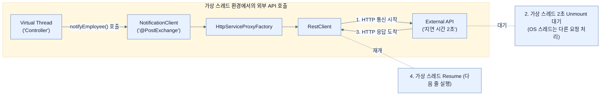

# Using Virtual Threads with RestClient

## 한눈에 보기
| 관점 | 핵심 |
|---|---|
| 이 절의 질문 | 현대의 애플리케이션은 수많은 외부 API결제, 알림, 타 마이크로서비스 등와 통신한다. 스프링 부트의 RestClient나 HTTP Interface Proxy와 같은 동기/블로킹 방식의 HTTP 클라이언트를 사용하더라도, 가상 스레드를 켜두기만 하면 외부 API의 늦은 응답을 기다리는 동안 JVM이 캐리어 스레드를 양… |
| 책에서의 역할 | Chapter 11의 앞뒤 예제를 연결하는 학습 단위 |

## 1. 왜 이게 필요한가

현대의 애플리케이션은 수많은 외부 API(결제, 알림, 타 마이크로서비스 등)와 통신한다. 스프링 부트의 **`RestClient`**나 **HTTP Interface Proxy**와 같은 동기/블로킹 방식의 HTTP 클라이언트를 사용하더라도, 가상 스레드를 켜두기만 하면 외부 API의 늦은 응답을 기다리는 동안 JVM이 캐리어 스레드를 양보(Unmount)하므로 리액티브 웹 클라이언트(`WebClient`) 없이도 극강의 성능을 낼 수 있다.

### 비유로 잡기
동시성 처리를 식당 주문 흐름에 비유하면, 직원이 한 주문이 끝날 때까지 서 있는 방식과 번호표를 주고 다음 주문을 받는 방식의 차이다.

→ 비유가 깨지는 지점: 소프트웨어에서는 대기뿐 아니라 순서, 취소, 역압력, 재시도, 중복 처리까지 다뤄야 하므로 번호표 비유만으로 정확성을 설명할 수 없다.

### 이 절의 언어
**[[rest-client]]**(= Spring Framework 6.1부터 도입된 모던하고 유창한(Fluent) API 방식의 동기식 HTTP 클라이언트로, 구형 RestTemplate의 완벽한 대체재다.), **[[http-interface-proxy]]**(= HTTP 요청의 URL, 파라미터, 헤더 등을 애노테이션(@GetExchange 등)이 달린 Java 인터페이스로 선언하기만 하면 프레임워크가 런타임에 구현체를 생성해주는 선언적 클라이언트 기술), **[[web-client]]**(= Spring WebFlux 모듈에 포함된 비동기/논블로킹 전용 리액티브 HTTP 클라이언트. 가상 스레드 도입 이후 동기식 애플리케이션에서는 잘 쓰지 않게 되었다.)

## 2. 어떻게 동작하는가

먼저 다음 세 축으로 메커니즘을 읽는다.

1. **입력과 전제 확인** — 어떤 요청·설정·데이터가 들어오는지 확인한다. 잘못된 전제를 다음 계층으로 넘기지 않기 위해서다.
2. **Spring 추상화 적용** — 스타터와 자동 구성, 어노테이션 또는 명시적 빈이 실제 처리를 연결한다. 반복 배선보다 도메인 선택에 집중하기 위해서다.
3. **결과와 경계 검증** — 응답·저장 상태·운영 신호를 확인한다. 정상 경로만 보고 장애·버전·성능 차이를 놓치지 않기 위해서다.

### 2.1 RestClient: 동기식 HTTP 통신의 귀환
기존에는 외부 API 통신 시 확장성을 얻기 위해 무조건 리액티브 기반의 `WebClient`를 써야 했다. (동기식인 `RestTemplate`은 스레드를 멈추게 하므로 병목의 원인이었기 때문이다).
그러나 가상 스레드 시대에서는 스레드가 블로킹되는 것 자체가 아무런 비용(오버헤드)을 발생시키지 않는다. 따라서 직관적인 동기식 호출을 지원하는 최신 클라이언트인 **`RestClient`**가 각광받고 있다.

```java
// 의존성: spring-boot-starter-restclient 추가 필요
@Service
public class NotificationService {
    private final RestClient restClient;

    public NotificationService(RestClient.Builder builder) {
        this.restClient = builder.baseUrl("http://localhost:8080").build();
    }

    public void notifyEmployee(Employee employee) {
        // 블로킹(동기) 호출 - 응답이 올 때까지 이 가상 스레드는 멈춰서 쉰다.
        restClient.post()
            .uri("/notify")
            .body(employee)
            .retrieve()
            .toBodilessEntity();
    }
}
```

### 2.2 HTTP Interface Proxy (선언적 클라이언트)
코드로 URL과 바디를 일일이 조립하는 것도 번거롭다. 스프링 6(Spring Boot 3/4)부터는 마치 Spring Data JPA에서 리포지토리 인터페이스를 선언하듯, **HTTP API 규격 자체를 자바 인터페이스로 선언**하여 사용할 수 있는 프록시 기능을 제공한다.

```java
// 1. 인터페이스 선언
public interface NotificationClient {
    @PostExchange("/notify") // HTTP POST 메서드 매핑
    void notifyEmployee(@RequestBody Employee employee);
}
```

```java
// 2. Proxy Factory 설정 빈 (RestClient를 엔진으로 사용)
@Bean
NotificationClient notificationClient(RestClient.Builder builder) {
    RestClient restClient = builder.baseUrl("http://localhost:8080").build();
    HttpServiceProxyFactory factory = HttpServiceProxyFactory.builderFor(
        RestClientAdapter.create(restClient)
    ).build();
    
    // 런타임에 동적으로 구현체(Proxy)를 생성해서 주입
    return factory.createClient(NotificationClient.class);
}
```
이제 서비스 계층에서는 `NotificationClient` 인터페이스만 주입받아 마치 내부 Java 메서드를 호출하듯 깔끔하게 외부 API를 쏠 수 있다.

## 3. 그림으로 보기



## 4. 이 노트에 나온 용어
| 용어 | 한 줄 | 자세히 |
|------|-------|--------|
| rest-client | Spring Framework 6.1부터 도입된 모던하고 유창한(Fluent) API 방식의 동기식 HTTP 클라이언트로, 구형 `RestTemplate`의 완벽한 대체재다. | [[_glossary#rest-client]] |
| http-interface-proxy | HTTP 요청의 URL, 파라미터, 헤더 등을 애노테이션(`@GetExchange` 등)이 달린 Java 인터페이스로 선언하기만 하면 프레임워크가 런타임에 구현체를 생성해주는 선언적 클라이언트 기술 | [[_glossary#http-interface-proxy]] |
| web-client | Spring WebFlux 모듈에 포함된 비동기/논블로킹 전용 리액티브 HTTP 클라이언트. 가상 스레드 도입 이후 동기식 애플리케이션에서는 잘 쓰지 않게 되었다. | [[_glossary#web-client]] |

## 5. 자주 헷갈리는 것
- 이 주제의 **Spring 추상화**와 그 아래에서 실제로 동작하는 라이브러리·프로토콜을 같은 것으로 보지 않는다. 추상화는 기본 배선을 줄이지만 하위 계층의 비용과 실패를 없애지 않는다.

## 6. 언제 안 쓰나 / 경계
- 책의 예제는 개념을 드러내기 위한 작은 애플리케이션이다. 운영 환경에서는 인증 정보, 장애 복구, 관측성, 부하와 데이터 규모를 별도로 검증한다.
- 이 노트의 API와 기본값은 책의 Spring Boot 4.1·Java 25 맥락을 따른다. 다른 마이너 버전에서는 공식 마이그레이션 문서와 실제 의존성 버전을 함께 확인한다.

## 7. 연결
- [[03-integrating-with-taskexecutor]] — 같은 장의 학습 흐름에서 Using Virtual Threads with RestClient의 전제 또는 다음 적용 단계와 연결된다.
- [[05-error-handling-in-concurrent-tasks]] — 같은 장의 학습 흐름에서 Using Virtual Threads with RestClient의 전제 또는 다음 적용 단계와 연결된다.

## 8. 스스로 확인
1. 가상 스레드가 도입된 최신 스프링 부트 애플리케이션에서 외부 API를 호출할 때 굳이 `WebClient`를 사용할 필요성이 크게 줄어든 이유는 무엇인가?
2. HTTP Interface Proxy 방식이 기존의 `RestTemplate`이나 `RestClient`를 수동으로 사용하는 방식과 비교해 비즈니스 로직(Service 계층) 코드에 주는 가장 큰 장점은 무엇인가?

<!-- ==== 아래는 내 영역 · 스킬 수정 금지 ==== -->

## 내 설명 시도

## 막혔던 지점

## 리뷰 이력
