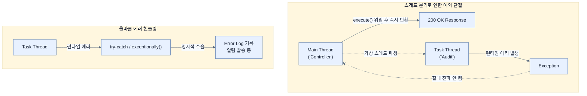

# Error handling in concurrent tasks

## 한눈에 보기
| 관점 | 핵심 |
|---|---|
| 이 절의 질문 | 메인 요청HTTP Request 스레드와 완전히 분리된 백그라운드 스레드TaskExecutor 등에서 에러Exception가 발생하면, 이 에러는 부모 스레드웹 응답로 전파되지 않고 조용히 증발Silent error해버린다. 따라서 동시성 작업에서는 명시적인 try-catch나 CompletableFuture.excep… |
| 책에서의 역할 | Chapter 11의 앞뒤 예제를 연결하는 학습 단위 |

## 1. 왜 이게 필요한가

메인 요청(HTTP Request) 스레드와 완전히 분리된 백그라운드 스레드(TaskExecutor 등)에서 에러(Exception)가 발생하면, 이 에러는 부모 스레드(웹 응답)로 전파되지 않고 조용히 증발(Silent error)해버린다. 따라서 동시성 작업에서는 **명시적인 `try-catch`**나 **`CompletableFuture.exceptionally()`**를 통해 개별 작업의 예외를 반드시 잡아내어 로그를 남기거나 보상 트랜잭션을 수행해야 한다.

### 비유로 잡기
이 기능은 조립 라인의 한 공정과 비슷하다. 입력을 정해진 규칙으로 변환해 다음 공정이 사용할 결과를 만든다.

→ 비유가 깨지는 지점: 애플리케이션은 고정된 조립 라인이 아니다. 조건부 구성과 런타임 실패, 외부 시스템 변화 때문에 공정의 경계를 따로 검증해야 한다.

### 이 절의 언어
**[[completable-future]]**(= 비동기 연산의 결과를 나중에 반환받거나, 여러 비동기 작업들을 조합(체이닝)하고 예외를 선언적으로 처리할 수 있도록 돕는 자바의 동시성 유틸리티 클래스), **[[structured-concurrency]]**(= 비동기 스레드 작업들이 아무렇게나 고아(Orphan) 스레드가 되어 떠돌지 않도록, 하나의 범위를 지정해 자식 작업의 성공/실패 수명 주기를 부모와 묶어 안전하게 관리하는 최신 동시성 패러다임)

## 2. 어떻게 동작하는가

먼저 다음 세 축으로 메커니즘을 읽는다.

1. **입력과 전제 확인** — 어떤 요청·설정·데이터가 들어오는지 확인한다. 잘못된 전제를 다음 계층으로 넘기지 않기 위해서다.
2. **Spring 추상화 적용** — 스타터와 자동 구성, 어노테이션 또는 명시적 빈이 실제 처리를 연결한다. 반복 배선보다 도메인 선택에 집중하기 위해서다.
3. **결과와 경계 검증** — 응답·저장 상태·운영 신호를 확인한다. 정상 경로만 보고 장애·버전·성능 차이를 놓치지 않기 위해서다.

### 2.1 분리된 스레드에서 발생하는 예외의 단절
앞서 만든 `AuditService`를 통해 백그라운드로 로깅을 던졌을 때, 로깅 스레드 내부에서 `RuntimeException`이 발생하더라도 톰캣 컨트롤러는 이미 사용자에게 "200 OK" 응답을 줘버린 상태다. 즉, 백그라운드의 치명적 오류가 전체 트랜잭션을 롤백시키지도 못하고, 서버 콘솔에만 찍히다 사라질 위험이 있다.

```java
public void registerEmployeeCreation(Employee employee) {
    taskExecutor.execute(() -> {
        // 이 안에서 발생한 예외는 메인 톰캣 스레드(HTTP 요청자)에게 닿지 않는다.
        if (employee.getName().equalsIgnoreCase("error")) {
            throw new RuntimeException("Simulated audit failure");
        }
    });
}
```

### 2.2 해결책 1: 로컬 try-catch 블록
가장 직관적인 방법은 람다식 내부에 거대한 보호막(`try-catch`)을 씌워서 예외가 스레드 밖으로 새어 나가는 것을 원천 차단하고 자체적으로 수습(로깅 등)하는 것이다.

```java
taskExecutor.execute(() -> {
    try {
        // 비즈니스 로직
    } catch (Exception ex) {
        // 에러를 삼키고 로그로 남겨 추적성을 확보한다.
        System.err.println("Audit failed: " + ex.getMessage());
    }
});
```

### 2.3 해결책 2: CompletableFuture를 이용한 체이닝
작업의 성공/실패 여부를 나중에 메인 스레드나 다른 후속 파이프라인에서 처리해야 하거나, 여러 개의 병렬 작업을 조율해야 한다면 `CompletableFuture`의 내장 예외 처리 연산자를 사용하는 것이 훨씬 우아하다.

```java
CompletableFuture.runAsync(() -> {
    if (employee.getName().equalsIgnoreCase("error")) {
        throw new RuntimeException("Simulated audit failure");
    }
    System.out.println("Audit log saved.");
}).exceptionally(ex -> {
    // 윗단(runAsync 내부)에서 예외가 발생했을 때만 이 블록이 실행됨
    System.err.println("Audit failed: " + ex.getMessage());
    return null; // 복구값 반환(에러를 덮음)
});
```
- 가상 스레드의 손쉬운 블로킹 모델과 `CompletableFuture`의 강력한 워크플로 제어(예: 3개의 외부 API를 병렬로 쏘고, 모두 성공했을 때만 다음 스텝 진행하기 등)를 결합하면 무적의 동시성 코드가 완성된다.

> [!NOTE]
> **구조적 동시성 (Structured Concurrency, Preview)**
> Project Loom은 독립된 여러 개의 스레드를 하나의 수명 주기(Scope)로 묶어서 부모 스레드와 자식 스레드가 운명 공동체가 되도록 강제하는 "구조적 동시성" API를 준비 중이다. 이를 사용하면 백그라운드 예외가 발생했을 때 묶인 다른 형제 작업들을 일괄 취소(Cancel)하고 부모에게 예외를 일관되게 전파할 수 있다. (자바 21 기준 아직 프리뷰 상태다)

## 3. 그림으로 보기



## 4. 이 노트에 나온 용어
| 용어 | 한 줄 | 자세히 |
|------|-------|--------|
| completable-future | 비동기 연산의 결과를 나중에 반환받거나, 여러 비동기 작업들을 조합(체이닝)하고 예외를 선언적으로 처리할 수 있도록 돕는 자바의 동시성 유틸리티 클래스 | [[_glossary#completable-future]] |
| structured-concurrency | 비동기 스레드 작업들이 아무렇게나 고아(Orphan) 스레드가 되어 떠돌지 않도록, 하나의 범위를 지정해 자식 작업의 성공/실패 수명 주기를 부모와 묶어 안전하게 관리하는 최신 동시성 패러다임 | [[_glossary#structured-concurrency]] |

## 5. 자주 헷갈리는 것
- 이 주제의 **Spring 추상화**와 그 아래에서 실제로 동작하는 라이브러리·프로토콜을 같은 것으로 보지 않는다. 추상화는 기본 배선을 줄이지만 하위 계층의 비용과 실패를 없애지 않는다.

## 6. 언제 안 쓰나 / 경계
- 책의 예제는 개념을 드러내기 위한 작은 애플리케이션이다. 운영 환경에서는 인증 정보, 장애 복구, 관측성, 부하와 데이터 규모를 별도로 검증한다.
- 이 노트의 API와 기본값은 책의 Spring Boot 4.1·Java 25 맥락을 따른다. 다른 마이너 버전에서는 공식 마이그레이션 문서와 실제 의존성 버전을 함께 확인한다.

## 7. 연결
- [[04-restclient-and-http-proxies]] — 같은 장의 학습 흐름에서 Error handling in concurrent tasks의 전제 또는 다음 적용 단계와 연결된다.
- [[03-integrating-with-taskexecutor]] — 같은 장의 학습 흐름에서 Error handling in concurrent tasks의 전제 또는 다음 적용 단계와 연결된다.

## 8. 스스로 확인
1. `@Async` 또는 `TaskExecutor` 안에서 발생한 예외가 기본적으로 사용자 클라이언트 응답 화면(500 에러 등)에 노출되지 않는 기술적인 이유는 무엇인가?
2. `CompletableFuture.exceptionally()`는 `try-catch`와 비교했을 때 코드의 가독성 측면에서 어떤 장점이 있는가?

<!-- ==== 아래는 내 영역 · 스킬 수정 금지 ==== -->

## 내 설명 시도

## 막혔던 지점

## 리뷰 이력
