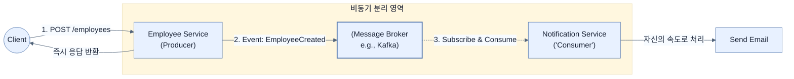

# Introducing asynchronous and event-driven communication

## 한눈에 보기
| 관점 | 핵심 |
|---|---|
| 이 절의 질문 | MSAMicroservices Architecture 환경에서 하나의 비즈니스 흐름예: 회원 가입 후 환영 이메일 발송을 모두 동기식 REST API로 엮어버리면, 이메일 서버가 고장 났을 때 회원 가입 자체가 실패하는 참사가 발생한다. 이벤트 기반Event-Driven 통신은 "무엇을 해라"라고 직접 지시하는 대신,… |
| 책에서의 역할 | Chapter 12의 앞뒤 예제를 연결하는 학습 단위 |

## 1. 왜 이게 필요한가

MSA(Microservices Architecture) 환경에서 하나의 비즈니스 흐름(예: 회원 가입 후 환영 이메일 발송)을 모두 동기식 REST API로 엮어버리면, 이메일 서버가 고장 났을 때 회원 가입 자체가 실패하는 참사가 발생한다. **이벤트 기반(Event-Driven) 통신**은 "무엇을 해라"라고 직접 지시하는 대신, "무언가가 일어났다(Event)"라는 사실만 브로커(Broker)에 던져두고 빠짐으로써, 서비스 간의 결합도를 획기적으로 낮추는 아키텍처 스타일이다.

### 비유로 잡기
동시성 처리를 식당 주문 흐름에 비유하면, 직원이 한 주문이 끝날 때까지 서 있는 방식과 번호표를 주고 다음 주문을 받는 방식의 차이다.

→ 비유가 깨지는 지점: 소프트웨어에서는 대기뿐 아니라 순서, 취소, 역압력, 재시도, 중복 처리까지 다뤄야 하므로 번호표 비유만으로 정확성을 설명할 수 없다.

### 이 절의 언어
**[[event-driven]]**(= 시스템의 상태 변경이나 의미 있는 사건(Event)을 중심으로 컴포넌트들이 비동기적으로 반응하며 작동하는 아키텍처 스타일), **[[broker]]**(= 발행자와 소비자 사이에서 메시지를 임시 보관하고 라우팅해주어, 양쪽 서비스가 서로의 존재나 생사에 신경 쓰지 않게(Decoupling) 해주는 미들웨어 시스템)

## 2. 어떻게 동작하는가

먼저 다음 세 축으로 메커니즘을 읽는다.

1. **입력과 전제 확인** — 어떤 요청·설정·데이터가 들어오는지 확인한다. 잘못된 전제를 다음 계층으로 넘기지 않기 위해서다.
2. **Spring 추상화 적용** — 스타터와 자동 구성, 어노테이션 또는 명시적 빈이 실제 처리를 연결한다. 반복 배선보다 도메인 선택에 집중하기 위해서다.
3. **결과와 경계 검증** — 응답·저장 상태·운영 신호를 확인한다. 정상 경로만 보고 장애·버전·성능 차이를 놓치지 않기 위해서다.

### 2.1 동기식 통신(REST)의 한계
기존의 전통적인 접근 방식에서는 `Employee Service`가 직원을 생성한 직후, `Notification Service`의 REST API를 직접 호출하여 메일 발송을 지시한다.
- **강한 결합도**: 호출자(`Employee Service`)는 수신자(`Notification Service`)의 주소와 스펙을 정확히 알아야 한다.
- **장애 전파(Cascading Failure)**: 수신자가 느려지거나 뻗으면, 호출자의 응답 시간도 느려지고 결국 전체 시스템 장애로 이어진다.

### 2.2 비동기 이벤트 기반 통신으로의 전환
이벤트 기반 모델에서는 서비스 간에 직접 통신하지 않는다. 중간에 메시지 브로커(Message Broker)가 개입한다.
1. 클라이언트가 `Employee Service`에 생성을 요청한다.
2. 직원을 DB에 저장한 뒤, `Employee Service`는 **"직원이 생성됨(EmployeeCreated)"** 이라는 이벤트를 브로커에 발행(Publish)하고, 즉시 클라이언트에게 HTTP 200 OK를 반환한다.
3. `Notification Service`는 브로커에 구독(Subscribe)하고 있다가, 새로운 이벤트가 들어오면 자신의 속도에 맞춰 이메일을 발송(Consume)한다.

이 방식을 사용하면 알림 서비스가 며칠 동안 죽어있더라도 직원 가입은 정상적으로 이루어지며, 알림 서비스가 복구되는 시점에 밀린 이벤트를 이어서 처리할 수 있다.

### 2.3 이벤트 기반 시스템의 핵심 구성 요소
- **Producer (발행자)**: 시스템 내에서 의미 있는 일(Event)이 벌어졌을 때 이를 기록하여 내보내는 주체. (누가 이 이벤트를 가져갈지 전혀 모른다)
- **Event / Message (이벤트/메시지)**: 일어난 사실을 담은 데이터 꾸러미.
- **Broker (브로커)**: 이벤트를 안전하게 수신하고 보관(Store)하며, 관심 있는 곳에 배달해 주는 중간 저장소 (예: Apache Kafka, RabbitMQ).
- **Consumer (소비자)**: 브로커를 쳐다보고 있다가, 관심 있는 이벤트가 도착하면 가져다 처리하는 주체.

## 3. 그림으로 보기

## 4. 이 노트에 나온 용어
| 용어 | 한 줄 | 자세히 |
|------|-------|--------|
| event-driven | 시스템의 상태 변경이나 의미 있는 사건(Event)을 중심으로 컴포넌트들이 비동기적으로 반응하며 작동하는 아키텍처 스타일 | [[_glossary#event-driven]] |
| broker | 발행자와 소비자 사이에서 메시지를 임시 보관하고 라우팅해주어, 양쪽 서비스가 서로의 존재나 생사에 신경 쓰지 않게(Decoupling) 해주는 미들웨어 시스템 | [[_glossary#broker]] |

## 5. 자주 헷갈리는 것
- 이 주제의 **Spring 추상화**와 그 아래에서 실제로 동작하는 라이브러리·프로토콜을 같은 것으로 보지 않는다. 추상화는 기본 배선을 줄이지만 하위 계층의 비용과 실패를 없애지 않는다.

## 6. 언제 안 쓰나 / 경계
- 책의 예제는 개념을 드러내기 위한 작은 애플리케이션이다. 운영 환경에서는 인증 정보, 장애 복구, 관측성, 부하와 데이터 규모를 별도로 검증한다.
- 이 노트의 API와 기본값은 책의 Spring Boot 4.1·Java 25 맥락을 따른다. 다른 마이너 버전에서는 공식 마이그레이션 문서와 실제 의존성 버전을 함께 확인한다.

## 7. 연결
- [[02-understanding-events-messages-and-delivery-semantics]] — 같은 장의 학습 흐름에서 Introducing asynchronous and event-driven communication의 전제 또는 다음 적용 단계와 연결된다.
- [[03-exploring-the-fundamentals-of-apache-kafka]] — 같은 장의 학습 흐름에서 Introducing asynchronous and event-driven communication의 전제 또는 다음 적용 단계와 연결된다.

## 8. 스스로 확인
1. 동기식 REST 호출과 비교했을 때, 비동기 이벤트 통신이 갖는 치명적인 디버깅/운영 상의 단점(Trade-off)은 무엇일까?
2. `Employee Service` 코드를 짤 때 `Notification Service`의 존재를 코드에 명시해야 하는가? 그렇지 않다면 이유는 무엇인가?

<!-- ==== 아래는 내 영역 · 스킬 수정 금지 ==== -->

## 내 설명 시도

## 막혔던 지점

## 리뷰 이력
