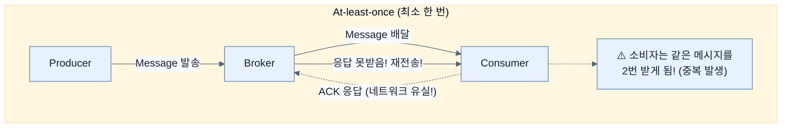

# Understanding events, messages, and delivery semantics

## 한눈에 보기
| 관점 | 핵심 |
|---|---|
| 이 절의 질문 | 이벤트 기반 통신을 설계할 때는 비즈니스적 의미를 갖는 '이벤트Event'와 이를 기술적으로 운반하는 '메시지Message'를 구분해야 한다. 더 중요한 것은, 네트워크 환경에서는 완벽한 메시지 전달을 보장할 수 없으므로, 시스템이 허용할 수 있는 신뢰성 수준에 따라 전달 보장 모델Delivery Semantics을 전… |
| 책에서의 역할 | Chapter 12의 앞뒤 예제를 연결하는 학습 단위 |

## 1. 왜 이게 필요한가

이벤트 기반 통신을 설계할 때는 비즈니스적 의미를 갖는 '이벤트(Event)'와 이를 기술적으로 운반하는 '메시지(Message)'를 구분해야 한다. 더 중요한 것은, 네트워크 환경에서는 완벽한 메시지 전달을 보장할 수 없으므로, 시스템이 허용할 수 있는 신뢰성 수준에 따라 **전달 보장 모델(Delivery Semantics)**을 전략적으로 선택해야 한다는 점이다.

### 비유로 잡기
동시성 처리를 식당 주문 흐름에 비유하면, 직원이 한 주문이 끝날 때까지 서 있는 방식과 번호표를 주고 다음 주문을 받는 방식의 차이다.

→ 비유가 깨지는 지점: 소프트웨어에서는 대기뿐 아니라 순서, 취소, 역압력, 재시도, 중복 처리까지 다뤄야 하므로 번호표 비유만으로 정확성을 설명할 수 없다.

### 이 절의 언어
**[[at-least-once]]**(= 브로커가 소비자의 명시적 수신 확인(ACK)을 받을 때까지 끈질기게 재시도하여 데이터 유실을 0으로 만드는 메시징 전달 전략), **[[idempotency]]**(= 멱등성. 똑같은 연산(이벤트 처리)을 여러 번 반복해서 수행하더라도, 시스템의 최종 상태는 한 번 수행했을 때와 똑같이 유지되도록 만드는 소비자 측의 필수 설계 원칙)

## 2. 어떻게 동작하는가

먼저 다음 세 축으로 메커니즘을 읽는다.

1. **입력과 전제 확인** — 어떤 요청·설정·데이터가 들어오는지 확인한다. 잘못된 전제를 다음 계층으로 넘기지 않기 위해서다.
2. **Spring 추상화 적용** — 스타터와 자동 구성, 어노테이션 또는 명시적 빈이 실제 처리를 연결한다. 반복 배선보다 도메인 선택에 집중하기 위해서다.
3. **결과와 경계 검증** — 응답·저장 상태·운영 신호를 확인한다. 정상 경로만 보고 장애·버전·성능 차이를 놓치지 않기 위해서다.

### 2.1 이벤트(Event) vs 메시지(Message)
- **이벤트(Event)**: "직원이 생성됨", "결제가 완료됨"과 같이 도메인 내에서 발생한 **비즈니스적 사실(Fact)** 그 자체를 말한다. 단순한 자바 레코드(`record`) 등으로 표현된다.
- **메시지(Message)**: 그 이벤트를 다른 시스템으로 운반하기 위해 브로커가 사용하는 **기술적인 컨테이너**다. 즉, 이벤트는 본질이고 메시지는 포장지(봉투)다.

### 2.2 분산 시스템의 전달 보증 모델 (Delivery Semantics)
분산 시스템에서는 브로커나 네트워크 장애로 인해 메시지가 유실되거나 중복 배달될 가능성이 항상 존재한다. 이를 다루는 3가지 기준 모델이 있다.

1. **최대 한 번 (At-most-once delivery)**
   - 메시지를 보내고 재시도(Retry)를 전혀 하지 않는다.
   - **결과**: 처리가 가장 빠르지만, 중간에 뻑이 나면 메시지가 **영원히 유실(Data Loss)**될 수 있다.
   - **용도**: 1~2개쯤 잃어버려도 티가 안 나는 단순 로그 수집이나 실시간 지표(Metrics) 집계 파이프라인.

2. **최소 한 번 (At-least-once delivery)** ✅ (가장 많이 씀)
   - 상대방이 확실히 받았다는 응답(Acknowledge)이 올 때까지 계속 재시도한다.
   - **결과**: 유실은 절대 발생하지 않지만, 응답이 유실되어 재전송하는 경우 소비자(Consumer)가 **같은 메시지를 2번(중복)** 받을 수 있다.
   - **용도**: 절대 유실되면 안 되는 대부분의 비즈니스 트랜잭션. (단, 소비자가 멱등성(Idempotency)을 갖추도록 설계해야 함)

3. **정확히 한 번 (Exactly-once delivery)**
   - 시스템이 엄청난 트랜잭션 오버헤드를 감수하고서라도 유실도 없고 중복도 없게 완벽히 통제한다.
   - **결과**: 가장 이상적이지만 구현이 매우 복잡하고 속도가 느려진다.
   - **용도**: 금융권의 정밀한 송금 처리 등 아주 특수한 경우에만 제한적으로 사용한다.

## 3. 그림으로 보기

## 4. 이 노트에 나온 용어
| 용어 | 한 줄 | 자세히 |
|------|-------|--------|
| at-least-once | 브로커가 소비자의 명시적 수신 확인(ACK)을 받을 때까지 끈질기게 재시도하여 데이터 유실을 0으로 만드는 메시징 전달 전략 | [[_glossary#at-least-once]] |
| idempotency | 멱등성. 똑같은 연산(이벤트 처리)을 여러 번 반복해서 수행하더라도, 시스템의 최종 상태는 한 번 수행했을 때와 똑같이 유지되도록 만드는 소비자 측의 필수 설계 원칙 | [[_glossary#idempotency]] |

## 5. 자주 헷갈리는 것
- 이 주제의 **Spring 추상화**와 그 아래에서 실제로 동작하는 라이브러리·프로토콜을 같은 것으로 보지 않는다. 추상화는 기본 배선을 줄이지만 하위 계층의 비용과 실패를 없애지 않는다.

## 6. 언제 안 쓰나 / 경계
- 책의 예제는 개념을 드러내기 위한 작은 애플리케이션이다. 운영 환경에서는 인증 정보, 장애 복구, 관측성, 부하와 데이터 규모를 별도로 검증한다.
- 이 노트의 API와 기본값은 책의 Spring Boot 4.1·Java 25 맥락을 따른다. 다른 마이너 버전에서는 공식 마이그레이션 문서와 실제 의존성 버전을 함께 확인한다.

## 7. 연결
- [[01-introducing-asynchronous-and-event-driven-communication]] — 같은 장의 학습 흐름에서 Understanding events, messages, and delivery semantics의 전제 또는 다음 적용 단계와 연결된다.
- [[03-exploring-the-fundamentals-of-apache-kafka]] — 같은 장의 학습 흐름에서 Understanding events, messages, and delivery semantics의 전제 또는 다음 적용 단계와 연결된다.

## 8. 스스로 확인
1. 당신이 쇼핑몰의 '결제 완료 문자 발송 서비스'를 만든다면, At-most-once와 At-least-once 중 어느 모델을 선택하겠는가? 그리고 그 선택으로 인해 발생하는 부작용은 무엇인가?
2. 이벤트와 메시지의 차이를 '편지 내용'과 '우편 봉투'에 비유하여 설명해보자.

<!-- ==== 아래는 내 영역 · 스킬 수정 금지 ==== -->

## 내 설명 시도

## 막혔던 지점

## 리뷰 이력
