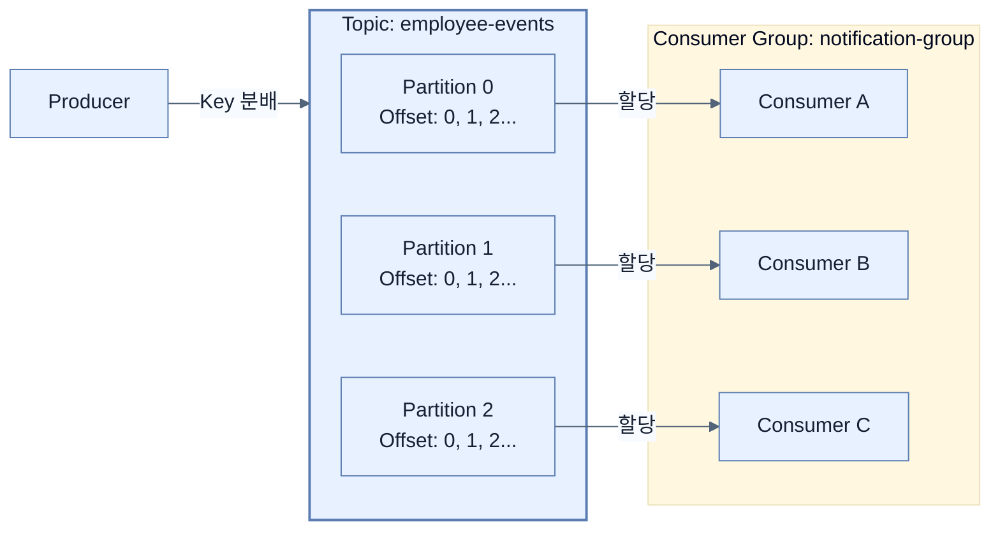

# Exploring the fundamentals of Apache Kafka

## 한눈에 보기
| 관점 | 핵심 |
|---|---|
| 이 절의 질문 | 아파치 카프카Apache Kafka는 단순한 메시지 큐Message Queue가 아니라, 데이터를 지우지 않고 순차적으로 쌓아두는 '분산 이벤트 스트리밍 플랫폼'이다. 토픽Topic, 파티션Partition, 오프셋Offset, 그리고 컨슈머 그룹Consumer Group이라는 4가지 핵심 개념을 통해 무한한 확장성과… |
| 책에서의 역할 | Chapter 12의 앞뒤 예제를 연결하는 학습 단위 |

## 1. 왜 이게 필요한가

**아파치 카프카(Apache Kafka)**는 단순한 메시지 큐(Message Queue)가 아니라, 데이터를 지우지 않고 순차적으로 쌓아두는 '분산 이벤트 스트리밍 플랫폼'이다. **토픽(Topic)**, **파티션(Partition)**, **오프셋(Offset)**, 그리고 **컨슈머 그룹(Consumer Group)**이라는 4가지 핵심 개념을 통해 무한한 확장성과 장애 복구 능력을 제공한다.

### 비유로 잡기
동시성 처리를 식당 주문 흐름에 비유하면, 직원이 한 주문이 끝날 때까지 서 있는 방식과 번호표를 주고 다음 주문을 받는 방식의 차이다.

→ 비유가 깨지는 지점: 소프트웨어에서는 대기뿐 아니라 순서, 취소, 역압력, 재시도, 중복 처리까지 다뤄야 하므로 번호표 비유만으로 정확성을 설명할 수 없다.

### 이 절의 언어
**[[apache-kafka]]**(= 링크드인(LinkedIn)에서 개발한 분산 이벤트 스트리밍 플랫폼으로, 디스크에 순차 로그를 기록하는 방식을 채택해 엄청난 처리량과 확장성을 자랑한다), **[[topic-and-partition]]**(= 토픽은 이벤트의 주제별 분류함이고, 파티션은 그 분류함을 여러 개로 쪼개어 병렬(Concurrent) 읽기/쓰기를 가능하게 만드는 물리적 조각이다), **[[consumer-group]]**(= 여러 컨슈머 인스턴스를 하나로 묶어 서로 중복 없이 파티션 데이터를 나누어 소비하게 만들고, 인스턴스 장애 시 파티션 할당을 재조정(Rebalance)해주는 그룹 논리)

## 2. 어떻게 동작하는가

먼저 다음 세 축으로 메커니즘을 읽는다.

1. **입력과 전제 확인** — 어떤 요청·설정·데이터가 들어오는지 확인한다. 잘못된 전제를 다음 계층으로 넘기지 않기 위해서다.
2. **Spring 추상화 적용** — 스타터와 자동 구성, 어노테이션 또는 명시적 빈이 실제 처리를 연결한다. 반복 배선보다 도메인 선택에 집중하기 위해서다.
3. **결과와 경계 검증** — 응답·저장 상태·운영 신호를 확인한다. 정상 경로만 보고 장애·버전·성능 차이를 놓치지 않기 위해서다.

### 2.1 토픽(Topic)과 파티션(Partition)
- **토픽(Topic)**: 데이터가 들어가는 논리적인 채널(통로)이다. (예: `employee-events` 토픽)
- **파티션(Partition)**: 하나의 토픽은 성능 확장을 위해 여러 개의 쪼개진 '파티션'으로 나뉜다. 파티션이 3개라면, 3명의 소비자가 동시에 달라붙어 데이터를 병렬로 쑥쑥 빼갈 수 있다. 
  - 메시지를 보낼 때 Key를 지정하면 같은 Key를 가진 메시지는 항상 같은 파티션에 들어간다. (순서 보장)
  - Key가 없으면 라운드 로빈(Round-robin) 방식으로 골고루 분배된다.

### 2.2 오프셋(Offset)과 커밋 로그(Commit Log)
전통적인 메시지 큐(RabbitMQ 등)는 소비자가 메시지를 읽어가면 브로커에서 해당 메시지를 쿨하게 지워버린다. 하지만 카프카는 데이터를 지우지 않고 디스크에 차곡차곡 쌓아둔다(Immutable Commit Log).
- **오프셋(Offset)**: 파티션 내부에 쌓인 메시지들에 부여된 고유 번호(인덱스)다.
- 소비자는 자신이 어디까지 읽었는지 오프셋 번호를 기억(Commit)해둔다. 만약 서버가 죽었다 살아나면, 마지막으로 기억한 오프셋 다음 번호부터 다시 읽어오면 된다. 필요하다면 오프셋을 과거로 돌려(Replay) 데이터를 재처리할 수도 있다.

### 2.3 컨슈머 그룹(Consumer Group)
카프카에서 가장 빛나는 분산 처리 마법이다. 소비자를 하나의 '그룹(Group)'으로 묶으면, 카프카는 토픽의 파티션들을 그룹 내의 소비자들에게 겹치지 않게 골고루 분배해준다.
- 파티션이 3개일 때, 그룹 내 인스턴스가 1대면 혼자 3개를 다 읽는다.
- 인스턴스가 3대로 늘어나면, 각 인스턴스가 파티션을 1개씩 전담(1:1 매핑)하여 완벽한 분산 처리를 이룬다.
- 만약 인스턴스가 4대로 늘어나면? 파티션은 3개뿐이므로 남는 1대는 놀게 된다(Idle). (파티션 수 >= 컨슈머 수로 유지해야 함)

## 3. 그림으로 보기

## 4. 이 노트에 나온 용어
| 용어 | 한 줄 | 자세히 |
|------|-------|--------|
| apache-kafka | 링크드인(LinkedIn)에서 개발한 분산 이벤트 스트리밍 플랫폼으로, 디스크에 순차 로그를 기록하는 방식을 채택해 엄청난 처리량과 확장성을 자랑한다 | [[_glossary#apache-kafka]] |
| topic-and-partition | 토픽은 이벤트의 주제별 분류함이고, 파티션은 그 분류함을 여러 개로 쪼개어 병렬(Concurrent) 읽기/쓰기를 가능하게 만드는 물리적 조각이다 | [[_glossary#topic-and-partition]] |
| consumer-group | 여러 컨슈머 인스턴스를 하나로 묶어 서로 중복 없이 파티션 데이터를 나누어 소비하게 만들고, 인스턴스 장애 시 파티션 할당을 재조정(Rebalance)해주는 그룹 논리 | [[_glossary#consumer-group]] |

## 5. 자주 헷갈리는 것
- 이 주제의 **Spring 추상화**와 그 아래에서 실제로 동작하는 라이브러리·프로토콜을 같은 것으로 보지 않는다. 추상화는 기본 배선을 줄이지만 하위 계층의 비용과 실패를 없애지 않는다.

## 6. 언제 안 쓰나 / 경계
- 책의 예제는 개념을 드러내기 위한 작은 애플리케이션이다. 운영 환경에서는 인증 정보, 장애 복구, 관측성, 부하와 데이터 규모를 별도로 검증한다.
- 이 노트의 API와 기본값은 책의 Spring Boot 4.1·Java 25 맥락을 따른다. 다른 마이너 버전에서는 공식 마이그레이션 문서와 실제 의존성 버전을 함께 확인한다.

## 7. 연결
- [[02-understanding-events-messages-and-delivery-semantics]] — 같은 장의 학습 흐름에서 Exploring the fundamentals of Apache Kafka의 전제 또는 다음 적용 단계와 연결된다.
- [[04-building-event-driven-services]] — 같은 장의 학습 흐름에서 Exploring the fundamentals of Apache Kafka의 전제 또는 다음 적용 단계와 연결된다.

## 8. 스스로 확인
1. 쇼핑몰 주문 이벤트(토픽)에 대해, 배송 서비스 그룹과 마일리지 적립 서비스 그룹이 각각 존재한다. 한 주문이 발생했을 때 카프카는 이 데이터를 몇 번 지우지 않고 두 그룹 모두에게 어떻게 제공하는가?
2. 토픽의 파티션이 2개인데, 동일한 `groupId`를 가진 컨슈머 서버를 5대 띄웠다면 데이터 처리는 어떻게 분배되는가?

<!-- ==== 아래는 내 영역 · 스킬 수정 시도 금지 ==== -->

<!-- ==== 아래는 내 영역 · 스킬 수정 금지 ==== -->

## 내 설명 시도

## 막혔던 지점

## 리뷰 이력
