# Building event-driven services with Spring Boot and Apache Kafka

## 한눈에 보기
| 관점 | 핵심 |
|---|---|
| 이 절의 질문 | 스프링 부트에 spring-boot-starter-kafka 의존성을 추가하면 끔찍하게 복잡한 카프카 네이티브 API직렬화, 브로커 연결, 폴링 루프 등를 프레임워크가 모조리 자동 설정Auto-configuration해준다. 개발자는 보내고 싶을 때 KafkaTemplate으로 쏘고, 받고 싶을 때 @KafkaListe… |
| 책에서의 역할 | Chapter 12의 앞뒤 예제를 연결하는 학습 단위 |

## 1. 왜 이게 필요한가

스프링 부트에 `spring-boot-starter-kafka` 의존성을 추가하면 끔찍하게 복잡한 카프카 네이티브 API(직렬화, 브로커 연결, 폴링 루프 등)를 프레임워크가 모조리 자동 설정(Auto-configuration)해준다. 개발자는 보내고 싶을 때 **`KafkaTemplate`**으로 쏘고, 받고 싶을 때 **`@KafkaListener`**만 달아주면 완벽한 이벤트 기반 서비스가 뚝딱 완성된다.

### 비유로 잡기
동시성 처리를 식당 주문 흐름에 비유하면, 직원이 한 주문이 끝날 때까지 서 있는 방식과 번호표를 주고 다음 주문을 받는 방식의 차이다.

→ 비유가 깨지는 지점: 소프트웨어에서는 대기뿐 아니라 순서, 취소, 역압력, 재시도, 중복 처리까지 다뤄야 하므로 번호표 비유만으로 정확성을 설명할 수 없다.

### 이 절의 언어
**[[kafka-template]]**(= JdbcTemplate, RestTemplate처럼 카프카 브로커로 메시지를 안전하게 전송하는 보일러플레이트 코드를 추상화해 둔 스프링의 유틸리티 클래스), **[[kafkalistener]]**(= 빈(Bean) 메서드 위에 달아두면, 지정된 토픽을 백그라운드 스레드에서 무한히 폴링(Polling)하다가 메시지가 오면 해당 메서드를 호출해주는 선언적 컨슈머 애노테이션), **[[auto-offset-reset]]**(= 새로 띄워진 컨슈머 그룹이 카프카에 기존 읽기 이력(커밋된 오프셋)이 없을 때, 토픽의 맨 처음(earliest)부터 읽을지 아니면 지금부터 들어오는 최신(latest) 데이터만 읽을지 결정하는 설정)

## 2. 어떻게 동작하는가

먼저 다음 세 축으로 메커니즘을 읽는다.

1. **입력과 전제 확인** — 어떤 요청·설정·데이터가 들어오는지 확인한다. 잘못된 전제를 다음 계층으로 넘기지 않기 위해서다.
2. **Spring 추상화 적용** — 스타터와 자동 구성, 어노테이션 또는 명시적 빈이 실제 처리를 연결한다. 반복 배선보다 도메인 선택에 집중하기 위해서다.
3. **결과와 경계 검증** — 응답·저장 상태·운영 신호를 확인한다. 정상 경로만 보고 장애·버전·성능 차이를 놓치지 않기 위해서다.

### 2.1 카프카 의존성과 직렬화 설정 (application.yml)
자바 객체(`EmployeeCreatedEvent`)를 네트워크로 쏘려면 바이트(Byte) 배열로 변환(Serialization)해야 하고, 반대로 받을 때는 바이트를 다시 객체로 변환(Deserialization)해야 한다. 최신 스프링 부트 4(Spring Boot 4)에서는 기본 JSON 라이브러리인 **Jackson 3**와 호환되는 전용 직렬화 클래스를 사용하도록 설정해야 한다.

```yaml
spring:
  kafka:
    bootstrap-servers: localhost:9092
    producer:
      key-serializer: org.apache.kafka.common.serialization.StringSerializer
      # (주의) 구버전 JsonSerializer 대신 JacksonJsonSerializer 사용
      value-serializer: org.springframework.kafka.support.serializer.JacksonJsonSerializer
    consumer:
      group-id: notification-group
      auto-offset-reset: earliest # 처음부터 빠짐없이 읽어라
      key-deserializer: org.apache.kafka.common.serialization.StringDeserializer
      value-deserializer: org.springframework.kafka.support.serializer.JacksonJsonDeserializer
      properties:
        spring.json.trusted.packages: "*" # 보안상 신뢰할 패키지 지정 (개발용은 전체 허용)
```

### 2.2 Producer (발행자) 구현: KafkaTemplate
DB에 엔티티를 저장한 후, 직원의 ID를 Key로, 이벤트 객체를 Value로 담아 카프카로 쏜다.
```java
@Service
public class EmployeeService {
    private final KafkaTemplate<String, EmployeeCreatedEvent> kafkaTemplate;

    // ... 생성자 주입 ...

    public Employee createEmployee(Employee employee) {
        Employee saved = employeeRepository.save(employee);
        
        EmployeeCreatedEvent event = new EmployeeCreatedEvent(
            saved.getId(), saved.getName(), saved.getEmail(), LocalDateTime.now()
        );

        // 첫 번째 인자는 Topic, 두 번째는 Key(파티션 분배용), 세 번째는 Value(페이로드)
        kafkaTemplate.send("employee-events", saved.getId().toString(), event);
        
        return saved;
    }
}
```

### 2.3 Consumer (소비자) 구현: @KafkaListener
알림 서비스 측에서는 특정 토픽을 구독(Subscribe)하고 있다가 메시지가 들어오면 자동으로 메서드를 실행한다.
```java
@Service
public class NotificationService {
    
    @KafkaListener(topics = "employee-events", groupId = "notification-group")
    public void handleEmployeeCreated(EmployeeCreatedEvent event) {
        // 이미 JacksonJsonDeserializer에 의해 바이트에서 완전한 객체로 변환된 상태로 주입됨
        System.out.println("Sending notification to: " + event.email());
    }
}
```

## 3. 그림으로 보기

```mermaid
%%{init: {"theme": "base", "themeVariables": {"background": "#ffffff", "primaryColor": "#e8f1ff", "primaryTextColor": "#172033", "primaryBorderColor": "#5b7db1", "lineColor": "#52647a", "secondaryColor": "#f7fbff", "tertiaryColor": "#fff7df"}}}%%
flowchart LR
    subgraph ProducerApp ["Producer App"]
        ES["EmployeeService\n('DB 저장 완료')"] -->|1. Event 객체| KT["KafkaTemplate"]
        KT -->|"2. Jackson Serialize (객체 ➔ JSON Bytes)"| KProducer["Kafka Producer"]
    end
    
    KProducer -.->|3. 네트워크 전송| Broker["Kafka Broker\ntopic: employee-events"]
    
    subgraph ConsumerApp ["Consumer App"]
        Broker -.->|"4. 폴링(Polling)"| KConsumer["Kafka Consumer"]
        KConsumer -->|"5. Jackson Deserialize (JSON Bytes ➔ 객체)"| Listener["@KafkaListener\nhandleEmployeeCreated()"]
    end
```



## 4. 이 노트에 나온 용어
| 용어 | 한 줄 | 자세히 |
|------|-------|--------|
| kafka-template | `JdbcTemplate`, `RestTemplate`처럼 카프카 브로커로 메시지를 안전하게 전송하는 보일러플레이트 코드를 추상화해 둔 스프링의 유틸리티 클래스 | [[_glossary#kafka-template]] |
| @KafkaListener | 빈(Bean) 메서드 위에 달아두면, 지정된 토픽을 백그라운드 스레드에서 무한히 폴링(Polling)하다가 메시지가 오면 해당 메서드를 호출해주는 선언적 컨슈머 애노테이션 | [[_glossary#kafkalistener]] |
| auto-offset-reset | 새로 띄워진 컨슈머 그룹이 카프카에 기존 읽기 이력(커밋된 오프셋)이 없을 때, 토픽의 맨 처음(`earliest`)부터 읽을지 아니면 지금부터 들어오는 최신(`latest`) 데이터만 읽을지 결정하는 설정 | [[_glossary#auto-offset-reset]] |

## 5. 자주 헷갈리는 것
- 이 주제의 **Spring 추상화**와 그 아래에서 실제로 동작하는 라이브러리·프로토콜을 같은 것으로 보지 않는다. 추상화는 기본 배선을 줄이지만 하위 계층의 비용과 실패를 없애지 않는다.

## 6. 언제 안 쓰나 / 경계
- 책의 예제는 개념을 드러내기 위한 작은 애플리케이션이다. 운영 환경에서는 인증 정보, 장애 복구, 관측성, 부하와 데이터 규모를 별도로 검증한다.
- 이 노트의 API와 기본값은 책의 Spring Boot 4.1·Java 25 맥락을 따른다. 다른 마이너 버전에서는 공식 마이그레이션 문서와 실제 의존성 버전을 함께 확인한다.

## 7. 연결
- [[03-exploring-the-fundamentals-of-apache-kafka]] — 같은 장의 학습 흐름에서 Building event-driven services with Spring Boot and Apache Kafka의 전제 또는 다음 적용 단계와 연결된다.
- [[05-applying-reliability-patterns]] — 같은 장의 학습 흐름에서 Building event-driven services with Spring Boot and Apache Kafka의 전제 또는 다음 적용 단계와 연결된다.

## 8. 스스로 확인
1. 프로듀서가 `kafkaTemplate.send()`를 호출할 때 두 번째 인자로 직원의 식별자(`id`)를 Key로 준 이유는 무엇일까? (힌트: 파티션 분배)
2. 스프링 부트 4 환경에서 `JsonSerializer` 대신 굳이 `JacksonJsonSerializer`를 사용하도록 설정한 이유는 무엇인가?

<!-- ==== 아래는 내 영역 · 스킬 수정 금지 ==== -->

## 내 설명 시도

## 막혔던 지점

## 리뷰 이력
