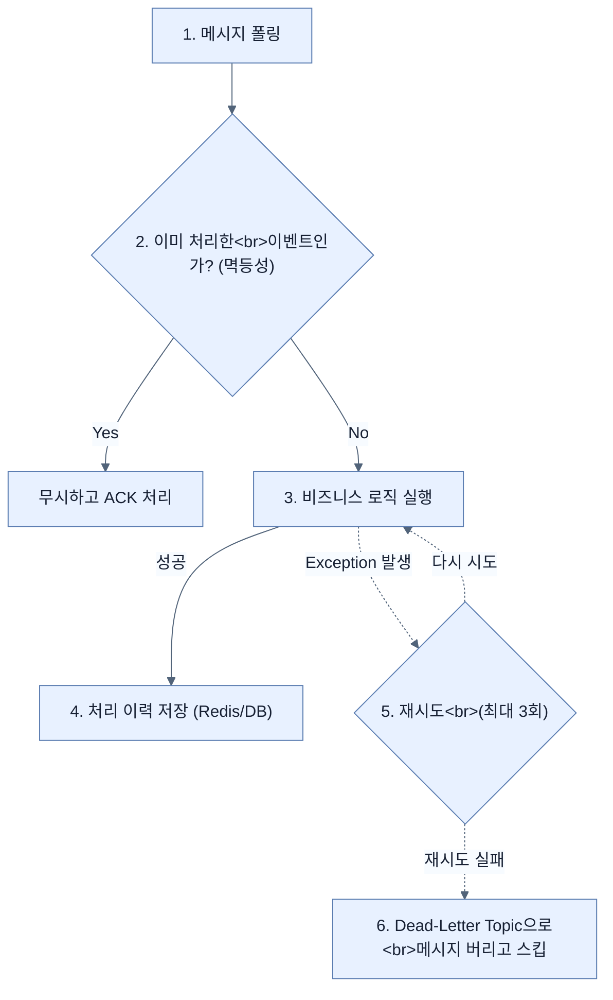

# Applying reliability patterns: retries, DLQs, and idempotency

## 한눈에 보기
| 관점 | 핵심 |
|---|---|
| 이 절의 질문 | 비동기 메시지를 처리하다 보면 필연적으로 일시적 장애네트워크 끊김, 영구적 장애잘못된 형식의 데이터, 그리고 중복 수신이라는 3가지 재앙을 만난다. 스프링 카프카는 이를 극복하기 위해 재시도Retry, 데드 레터 토픽DLT, 그리고 애플리케이션 레벨의 멱등성Idempotency 체크라는 3종 신뢰성 세트를 제공한다. |
| 책에서의 역할 | Chapter 12의 앞뒤 예제를 연결하는 학습 단위 |

## 1. 왜 이게 필요한가

비동기 메시지를 처리하다 보면 필연적으로 **일시적 장애(네트워크 끊김)**, **영구적 장애(잘못된 형식의 데이터)**, 그리고 **중복 수신**이라는 3가지 재앙을 만난다. 스프링 카프카는 이를 극복하기 위해 **재시도(Retry)**, **데드 레터 토픽(DLT)**, 그리고 애플리케이션 레벨의 **멱등성(Idempotency) 체크**라는 3종 신뢰성 세트를 제공한다.

### 비유로 잡기
이 기능은 조립 라인의 한 공정과 비슷하다. 입력을 정해진 규칙으로 변환해 다음 공정이 사용할 결과를 만든다.

→ 비유가 깨지는 지점: 애플리케이션은 고정된 조립 라인이 아니다. 조건부 구성과 런타임 실패, 외부 시스템 변화 때문에 공정의 경계를 따로 검증해야 한다.

### 이 절의 언어
**[[fixed-back-off]]**(= 일시적인 장애를 극복하기 위해, 실패한 작업을 일정 시간(예: 2초) 고정되게 대기한 후 다시 시도하도록 설정하는 전략), **[[dead-letter-topic]]**(= DLQ(Dead Letter Queue). 아무리 재시도해도 처리에 실패하거나 형식이 깨져 영구적으로 처리 불가능한 '독이 든 메시지(Poison Pill)'를 따로 격리해두는 특수 토픽), **[[inbox-outbox-pattern]]**(= 실무에서 멱등성을 보장하기 위해 수신 이력을 DB에 기록하는 Inbox 패턴과, 이벤트를 DB 트랜잭션과 묶어 안전하게 발행하는 Outbox 패턴의 조합)

## 2. 어떻게 동작하는가

먼저 다음 세 축으로 메커니즘을 읽는다.

1. **입력과 전제 확인** — 어떤 요청·설정·데이터가 들어오는지 확인한다. 잘못된 전제를 다음 계층으로 넘기지 않기 위해서다.
2. **Spring 추상화 적용** — 스타터와 자동 구성, 어노테이션 또는 명시적 빈이 실제 처리를 연결한다. 반복 배선보다 도메인 선택에 집중하기 위해서다.
3. **결과와 경계 검증** — 응답·저장 상태·운영 신호를 확인한다. 정상 경로만 보고 장애·버전·성능 차이를 놓치지 않기 위해서다.

### 2.1 일시적 장애를 위한 백오프 재시도 (FixedBackOff)
수신자(Consumer) 쪽에서 외부 API를 찌르거나 DB에 접근할 때 잠깐 타임아웃이 발생했다면, 즉시 포기하지 않고 몇 초 쉬었다가 다시 시도하면 성공할 확률이 높다.

```java
@Configuration
public class KafkaConsumerConfig {
    @Bean
    public DefaultErrorHandler errorHandler() {
        // 2초(2000ms) 간격으로 최대 3번까지 끈질기게 재시도한다.
        FixedBackOff fixedBackOff = new FixedBackOff(2000L, 3L);
        return new DefaultErrorHandler(fixedBackOff);
    }
}
```

### 2.2 영구적 장애를 위한 데드 레터 토픽 (DLQ / DLT)
하지만 이메일 주소가 아예 누락된 메시지 등은 3만 번을 재시도해도 무조건 실패한다. 이런 메시지를 계속 붙들고 있으면 뒤에 밀린 정상적인 메시지들까지 병목(Head-of-line Blocking)에 걸린다.
그래서 3번의 재시도가 모두 실패하면, 스프링은 해당 메시지를 쓰레기통 격인 **Dead-Letter Topic (DLT)**으로 던져버리고(Recover) 다음 메시지를 읽기 시작한다. 기본적으로 원본 토픽명 뒤에 `-dlt`가 붙는다 (예: `employee-events-dlt`).

```java
@Bean
public DefaultErrorHandler errorHandler(KafkaTemplate<Object, Object> template) {
    FixedBackOff backOff = new FixedBackOff(2000L, 3L);
    // 재시도가 모두 실패하면 원본 이벤트를 그대로 DLT 토픽으로 발행해버리는 구원자(Recoverer)
    DeadLetterPublishingRecoverer recoverer = new DeadLetterPublishingRecoverer(template);
    return new DefaultErrorHandler(recoverer, backOff);
}
```
> 이렇게 격리된 DLT 메시지는 개발자가 나중에 수동으로 검사하고 원인을 분석하거나, 스크립트를 통해 원본 토픽으로 다시 쏟아부어(Replay) 재처리할 수 있다.

### 2.3 중복 수신 방어를 위한 멱등성 (Idempotency)
"최소 한 번(At-least-once)" 전달 전략에서는 컨슈머가 똑같은 메시지를 두 번 받을 수 있다. 만약 "결제 완료" 메시지가 2번 와서 포인트를 2번 적립해주면 큰일 난다.
따라서 컨슈머는 **이 메시지를 이미 처리한 적이 있는지(Idempotency)** 스스로 방어해야 한다.

```java
private final Set<Long> processedEvents = ConcurrentHashMap.newKeySet(); // 실무에선 DB나 Redis 사용

@KafkaListener(topics = "employee-events", groupId = "notification-group")
public void handleEmployeeCreated(EmployeeCreatedEvent event) {
    // 1. 멱등성 방어: 이미 처리한 ID라면 그냥 무시하고 리턴한다.
    if (processedEvents.contains(event.employeeId())) {
        System.out.println("Skipping duplicate event: " + event.employeeId());
        return; 
    }
    
    // 2. 실제 비즈니스 로직 처리 (메일 발송 등)
    sendNotification(event);
    
    // 3. 처리 이력 저장
    processedEvents.add(event.employeeId());
}
```

## 3. 그림으로 보기



## 4. 이 노트에 나온 용어
| 용어 | 한 줄 | 자세히 |
|------|-------|--------|
| fixed-back-off | 일시적인 장애를 극복하기 위해, 실패한 작업을 일정 시간(예: 2초) 고정되게 대기한 후 다시 시도하도록 설정하는 전략 | [[_glossary#fixed-back-off]] |
| dead-letter-topic | DLQ(Dead Letter Queue). 아무리 재시도해도 처리에 실패하거나 형식이 깨져 영구적으로 처리 불가능한 '독이 든 메시지(Poison Pill)'를 따로 격리해두는 특수 토픽 | [[_glossary#dead-letter-topic]] |
| inbox-outbox-pattern | 실무에서 멱등성을 보장하기 위해 수신 이력을 DB에 기록하는 Inbox 패턴과, 이벤트를 DB 트랜잭션과 묶어 안전하게 발행하는 Outbox 패턴의 조합 | [[_glossary#inbox-outbox-pattern]] |

## 5. 자주 헷갈리는 것
- 이 주제의 **Spring 추상화**와 그 아래에서 실제로 동작하는 라이브러리·프로토콜을 같은 것으로 보지 않는다. 추상화는 기본 배선을 줄이지만 하위 계층의 비용과 실패를 없애지 않는다.

## 6. 언제 안 쓰나 / 경계
- 책의 예제는 개념을 드러내기 위한 작은 애플리케이션이다. 운영 환경에서는 인증 정보, 장애 복구, 관측성, 부하와 데이터 규모를 별도로 검증한다.
- 이 노트의 API와 기본값은 책의 Spring Boot 4.1·Java 25 맥락을 따른다. 다른 마이너 버전에서는 공식 마이그레이션 문서와 실제 의존성 버전을 함께 확인한다.

## 7. 연결
- [[04-building-event-driven-services]] — 같은 장의 학습 흐름에서 Applying reliability patterns: retries, DLQs, and idempotency의 전제 또는 다음 적용 단계와 연결된다.
- [[06-choosing-between-rest-and-messaging]] — 같은 장의 학습 흐름에서 Applying reliability patterns: retries, DLQs, and idempotency의 전제 또는 다음 적용 단계와 연결된다.

## 8. 스스로 확인
1. 카프카에서 컨슈머가 3번의 재시도 중일 때, 해당 파티션 뒤에 줄 서 있는 다른 정상적인 메시지들은 어떻게 되는가? (힌트: 순차 처리의 한계)
2. `ConcurrentHashMap.newKeySet()`을 메모리에 올려 멱등성을 체크하는 방식이 운영(Production) 환경에서 절대 쓰일 수 없는 두 가지 결정적인 이유는 무엇인가?

<!-- ==== 아래는 내 영역 · 스킬 수정 금지 ==== -->

## 내 설명 시도

## 막혔던 지점

## 리뷰 이력
