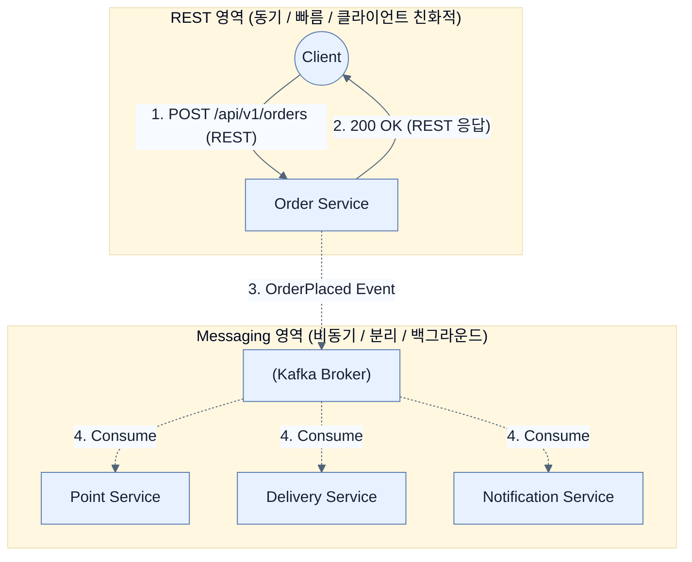

# Choosing between REST and messaging

## 한눈에 보기
| 관점 | 핵심 |
|---|---|
| 이 절의 질문 | 통신 방식에 정답은 없다. REST동기식는 즉각적인 응답이 필요하고 제어의 흐름이 직관적이어야 할 때 적합하며, Messaging비동기식 카프카은 시스템 간 결합도를 낮추고 백그라운드에서 병렬적으로 처리해도 무방할 때 적합하다. 실무의 시스템은 이 두 가지를 적재적소에 혼합Hybrid하여 사용한다. |
| 책에서의 역할 | Chapter 12의 앞뒤 예제를 연결하는 학습 단위 |

## 1. 왜 이게 필요한가

통신 방식에 정답은 없다. **REST(동기식)**는 즉각적인 응답이 필요하고 제어의 흐름이 직관적이어야 할 때 적합하며, **Messaging(비동기식 카프카)**은 시스템 간 결합도를 낮추고 백그라운드에서 병렬적으로 처리해도 무방할 때 적합하다. 실무의 시스템은 이 두 가지를 적재적소에 혼합(Hybrid)하여 사용한다.

### 비유로 잡기
동시성 처리를 식당 주문 흐름에 비유하면, 직원이 한 주문이 끝날 때까지 서 있는 방식과 번호표를 주고 다음 주문을 받는 방식의 차이다.

→ 비유가 깨지는 지점: 소프트웨어에서는 대기뿐 아니라 순서, 취소, 역압력, 재시도, 중복 처리까지 다뤄야 하므로 번호표 비유만으로 정확성을 설명할 수 없다.

### 이 절의 언어
**[[request-response]]**(= 클라이언트가 요청을 보내면 서버가 처리를 마친 후 즉시 응답을 돌려줄 때까지 통신 채널이 묶여 있는 전통적인 동기 통신 모델), **[[eventual-consistency]]**(= 비동기 시스템에서 데이터가 모든 서비스에 즉시 똑같이 반영되지는 않지만, 시간이 지나면 "결국에는(Eventual)" 일관된 상태를 맞추게 될 것이라는 분산 데이터베이스 원칙)

## 2. 어떻게 동작하는가

먼저 다음 세 축으로 메커니즘을 읽는다.

1. **입력과 전제 확인** — 어떤 요청·설정·데이터가 들어오는지 확인한다. 잘못된 전제를 다음 계층으로 넘기지 않기 위해서다.
2. **Spring 추상화 적용** — 스타터와 자동 구성, 어노테이션 또는 명시적 빈이 실제 처리를 연결한다. 반복 배선보다 도메인 선택에 집중하기 위해서다.
3. **결과와 경계 검증** — 응답·저장 상태·운영 신호를 확인한다. 정상 경로만 보고 장애·버전·성능 차이를 놓치지 않기 위해서다.

### 2.1 REST (요청-응답 방식)
클라이언트가 요청을 보내면 즉각적인(Immediate) 결과나 상태를 기다리는 방식이다.
- **장점**: 단순하고, 예측 가능하며, 흐름(Flow)을 파악하기 쉽다. "사용자 생성 완료"라는 결과를 즉시 화면에 보여줘야 할 때 필수적이다.
- **단점**: 통신이 성공할 때까지 스레드와 시간을 점유하므로 상대방이 느려지면 나도 느려지는 강한 결합(Coupling)이 발생한다.
- **언제 써야 하나?**:
  - 클라이언트가 성공/실패 여부를 그 자리에서 바로 알아야 할 때
  - 데이터를 단순히 조회(GET)해서 가져와야 할 때 (카프카로 조회 데이터를 달라고 요청하는 것은 비효율의 극치다)

### 2.2 Messaging (이벤트 기반 비동기)
이벤트를 발행한 측은 결과를 기다리지 않고 자신의 볼일만 보고 빠지는 방식이다.
- **장점**: 발행자는 소비자의 생사나 속도에 전혀 영향을 받지 않으므로 엄청난 확장성(Scalability)과 내결함성(Fault Tolerance)을 가진다.
- **단점**: 코드를 추적하기 어렵고, 결과가 "언젠가는 동기화되겠지(Eventual Consistency)"라는 비동기적 특성 때문에 복잡한 롤백(보상 트랜잭션 등) 처리가 필요해진다.
- **언제 써야 하나?**:
  - 하나의 사건(Event)에 대해 이메일도 보내고, 통계도 내고, 검색 엔진에도 밀어 넣는 등 여러 서비스가 동시에 반응해야 할 때
  - 처리 시간이 길어서 백그라운드 작업으로 미뤄도 상관없는 작업일 때

### 2.3 조화로운 아키텍처 (혼합 사용)
실제 아키텍처에서는 이 두 가지가 결합된다.
1. 사용자가 브라우저에서 '직원 생성'을 누르면 (REST API 호출)
2. `Employee Service`는 직원을 DB에 저장하고 즉시 "201 Created"를 브라우저에 반환한다. (REST 응답)
3. 동시에 브로커에 `EmployeeCreatedEvent`를 던진다. (Messaging 시작)
4. 다른 백그라운드 마이크로서비스들이 이 이벤트를 주워가서 천천히 처리한다.

## 3. 그림으로 보기

## 4. 이 노트에 나온 용어
| 용어 | 한 줄 | 자세히 |
|------|-------|--------|
| request-response | 클라이언트가 요청을 보내면 서버가 처리를 마친 후 즉시 응답을 돌려줄 때까지 통신 채널이 묶여 있는 전통적인 동기 통신 모델 | [[_glossary#request-response]] |
| eventual-consistency | 비동기 시스템에서 데이터가 모든 서비스에 즉시 똑같이 반영되지는 않지만, 시간이 지나면 "결국에는(Eventual)" 일관된 상태를 맞추게 될 것이라는 분산 데이터베이스 원칙 | [[_glossary#eventual-consistency]] |

## 5. 자주 헷갈리는 것
- 이 주제의 **Spring 추상화**와 그 아래에서 실제로 동작하는 라이브러리·프로토콜을 같은 것으로 보지 않는다. 추상화는 기본 배선을 줄이지만 하위 계층의 비용과 실패를 없애지 않는다.

## 6. 언제 안 쓰나 / 경계
- 책의 예제는 개념을 드러내기 위한 작은 애플리케이션이다. 운영 환경에서는 인증 정보, 장애 복구, 관측성, 부하와 데이터 규모를 별도로 검증한다.
- 이 노트의 API와 기본값은 책의 Spring Boot 4.1·Java 25 맥락을 따른다. 다른 마이너 버전에서는 공식 마이그레이션 문서와 실제 의존성 버전을 함께 확인한다.

## 7. 연결
- [[05-applying-reliability-patterns]] — 같은 장의 학습 흐름에서 Choosing between REST and messaging의 전제 또는 다음 적용 단계와 연결된다.
- [[04-building-event-driven-services]] — 같은 장의 학습 흐름에서 Choosing between REST and messaging의 전제 또는 다음 적용 단계와 연결된다.

## 8. 스스로 확인
1. '상품 목록 검색' 기능을 이벤트 기반(Kafka) 비동기 방식으로 구현하려고 시도한다면 어떤 우스꽝스러운 일들이 벌어지게 될까?
2. 마이크로서비스 아키텍처에서 모든 통신을 오직 REST API로만 구축했을 때, 특정 서비스 하나가 죽으면 벌어지는 연쇄적인 재앙(Cascading Failure)의 시나리오를 그려보자.

<!-- ==== 아래는 내 영역 · 스킬 수정 금지 ==== -->

## 내 설명 시도

## 막혔던 지점

## 리뷰 이력
