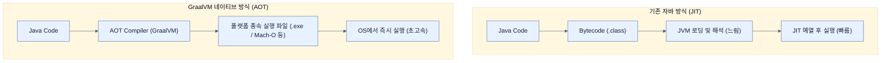

# What is GraalVM and why do we care?

## 한눈에 보기
| 관점 | 핵심 |
|---|---|
| 이 절의 질문 | 클라우드 네이티브 시대와 Serverless예: AWS Lambda 환경에서는 수많은 인스턴스가 떴다 지는 동작을 반복한다. 기존 JVM 기반 자바 애플리케이션은 구동 시 많은 메모리와 긴 예열Warm-up 시간을 요구하므로 클라우드 비용을 폭증시킬 수 있다. GraalVM을 통해 자바 코드를 플랫폼 종속적인 네이티브… |
| 책에서의 역할 | Chapter 8의 앞뒤 예제를 연결하는 학습 단위 |

## 1. 왜 이게 필요한가

클라우드 네이티브 시대와 Serverless(예: AWS Lambda) 환경에서는 수많은 인스턴스가 떴다 지는 동작을 반복한다. 기존 JVM 기반 자바 애플리케이션은 구동 시 많은 메모리와 긴 예열(Warm-up) 시간을 요구하므로 클라우드 비용을 폭증시킬 수 있다. **GraalVM**을 통해 자바 코드를 플랫폼 종속적인 **네이티브 실행 파일(Native Executable)**로 미리 컴파일하면, 눈 깜짝할 새(0.1초 미만)에 구동되고 메모리를 극히 적게 사용하는 강력한 성능을 얻을 수 있다.

### 비유로 잡기
배포 산출물은 제품을 포장해 운송하는 과정과 닮았다. 코드와 런타임을 어디까지 한 상자에 넣느냐에 따라 재현성과 크기가 달라진다.

→ 비유가 깨지는 지점: 소프트웨어 포장은 상자를 만들고 끝나지 않는다. 대상 CPU·OS, 보안 패치, 시작 시간, 런타임 진단 가능성까지 선택에 포함된다.

### 이 절의 언어
**[[graalvm]]**(= 오라클에서 개발한 고성능 런타임이자, 자바 애플리케이션을 AOT 컴파일을 통해 플랫폼 네이티브 실행 파일로 변환해주는 도구), **[[ahead-of-time-compilation]]**(= 런타임에 바이트코드를 번역하는 JIT와 달리, 빌드 시점에 기계어로 모두 번역해버리는 컴파일 방식), **[[cold-start]]**(= 애플리케이션이 처음 메모리에 로드되고 예열(Warm-up)되기 전까지 초기 응답이 매우 느린 현상)

## 2. 어떻게 동작하는가

먼저 다음 세 축으로 메커니즘을 읽는다.

1. **입력과 전제 확인** — 어떤 요청·설정·데이터가 들어오는지 확인한다. 잘못된 전제를 다음 계층으로 넘기지 않기 위해서다.
2. **Spring 추상화 적용** — 스타터와 자동 구성, 어노테이션 또는 명시적 빈이 실제 처리를 연결한다. 반복 배선보다 도메인 선택에 집중하기 위해서다.
3. **결과와 경계 검증** — 응답·저장 상태·운영 신호를 확인한다. 정상 경로만 보고 장애·버전·성능 차이를 놓치지 않기 위해서다.

### 2.1 자바의 오랜 숙제: "시작 시간(Startup Time)"
자바는 JIT(Just-In-Time) 컴파일러와 고도화된 GC를 통해 런타임 최고 성능(Peak Throughput)은 타 언어에 밀리지 않게 발전했다. 
그러나 한 번 구동될 때 수많은 클래스를 로드하고 메모리를 할당하며 JIT 컴파일을 예열하는 시간 때문에 콜드 스타트(Cold Start)가 매우 느리다는 단점이 있다.

- **전통적인 환경**: 며칠~몇 달간 서버를 끄지 않는 모놀리식/Long-running 환경에서는 구동에 30초가 걸려도 문제 되지 않았다.
- **현대 클라우드 환경**: 1만 개의 인스턴스를 동적으로 띄우고 부하가 줄면 곧장 삭제하는 환경에서는, 20초의 시작 시간이 1만 대 분량의 엄청난 클라우드 과금(빌링)으로 이어진다.

### 2.2 GraalVM의 등장
오라클(Oracle)이 주도하는 GraalVM은 단순히 자바뿐만 아니라 다양한 언어를 지원하는 고성능 런타임이다. 
가장 강력한 기능은 **Native Image (AOT 컴파일)** 기술로, 자바 바이트코드를 JVM 환경 위에서 돌리는 것이 아니라 **운영체제가 직접 실행할 수 있는 기계어(Machine Code)로 사전 컴파일(Ahead-Of-Time)**해버린다.

### 2.3 Spring Boot 4의 네이티브 선언
스프링 진영은 과거 'Spring Native'라는 실험적인 프로젝트로 시작하여, 이제 Spring Boot 4와 Spring Framework 7에서는 GraalVM 네이티브 지원을 **일급 시민(First-class citizen)**으로 내장했다. 별도의 외부 프레임워크 추가 없이 빌드 툴링과 AOT 훅(Hook)을 통해 자연스럽게 네이티브 이미지를 생성할 수 있다.

## 3. 그림으로 보기

## 4. 이 노트에 나온 용어
| 용어 | 한 줄 | 자세히 |
|------|-------|--------|
| graalvm | 오라클에서 개발한 고성능 런타임이자, 자바 애플리케이션을 AOT 컴파일을 통해 플랫폼 네이티브 실행 파일로 변환해주는 도구 | [[_glossary#graalvm]] |
| ahead-of-time-compilation (aot) | 런타임에 바이트코드를 번역하는 JIT와 달리, 빌드 시점에 기계어로 모두 번역해버리는 컴파일 방식 | [[_glossary#ahead-of-time-compilation]] |
| cold-start | 애플리케이션이 처음 메모리에 로드되고 예열(Warm-up)되기 전까지 초기 응답이 매우 느린 현상 | [[_glossary#cold-start]] |

## 5. 자주 헷갈리는 것
- 이 주제의 **Spring 추상화**와 그 아래에서 실제로 동작하는 라이브러리·프로토콜을 같은 것으로 보지 않는다. 추상화는 기본 배선을 줄이지만 하위 계층의 비용과 실패를 없애지 않는다.

## 6. 언제 안 쓰나 / 경계
- 책의 예제는 개념을 드러내기 위한 작은 애플리케이션이다. 운영 환경에서는 인증 정보, 장애 복구, 관측성, 부하와 데이터 규모를 별도로 검증한다.
- 이 노트의 API와 기본값은 책의 Spring Boot 4.1·Java 25 맥락을 따른다. 다른 마이너 버전에서는 공식 마이그레이션 문서와 실제 의존성 버전을 함께 확인한다.

## 7. 연결
- [[02-retrofitting-for-graalvm]] — 같은 장의 학습 흐름에서 What is GraalVM and why do we care?의 전제 또는 다음 적용 단계와 연결된다.
- [[03-running-native-spring-boot]] — 같은 장의 학습 흐름에서 What is GraalVM and why do we care?의 전제 또는 다음 적용 단계와 연결된다.

## 8. 스스로 확인
1. 클라우드 기반의 서버리스(Serverless) 아키텍처에서 기존 JVM 기반 자바 애플리케이션이 비용 측면에서 불리했던 가장 큰 이유는 무엇인가?
2. AOT 컴파일과 JIT 컴파일의 가장 핵심적인 차이는 무엇인가?

<!-- ==== 아래는 내 영역 · 스킬 수정 금지 ==== -->

## 내 설명 시도

## 막혔던 지점

## 리뷰 이력
