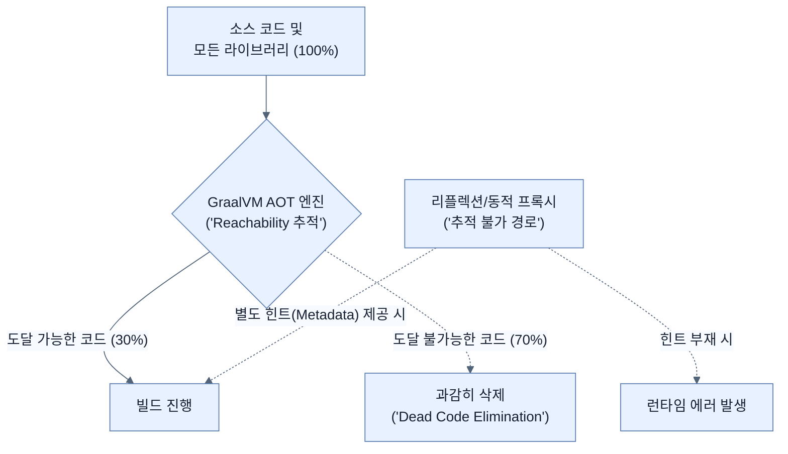

# Retrofitting our application for GraalVM

## 한눈에 보기
| 관점 | 핵심 |
|---|---|
| 이 절의 질문 | 모든 자바 애플리케이션을 당장 GraalVM 네이티브로 컴파일하면 좋겠지만, AOT 컴파일 방식은 닫힌 세계의 가정Closed-world assumption이라는 거대한 제약을 가진다. 리플렉션Reflection, 동적 프록시Dynamic Proxy, 조건부 빈 생성 등을 런타임에 수행할 수 없으므로, 빌드 타임에 모든… |
| 책에서의 역할 | Chapter 8의 앞뒤 예제를 연결하는 학습 단위 |

## 1. 왜 이게 필요한가

모든 자바 애플리케이션을 당장 GraalVM 네이티브로 컴파일하면 좋겠지만, AOT 컴파일 방식은 **닫힌 세계의 가정(Closed-world assumption)**이라는 거대한 제약을 가진다. 리플렉션(Reflection), 동적 프록시(Dynamic Proxy), 조건부 빈 생성 등을 런타임에 수행할 수 없으므로, 빌드 타임에 모든 경로를 분석할 수 있도록 코드를 개조하거나 메타데이터(힌트)를 제공해야 한다.

### 비유로 잡기
배포 산출물은 제품을 포장해 운송하는 과정과 닮았다. 코드와 런타임을 어디까지 한 상자에 넣느냐에 따라 재현성과 크기가 달라진다.

→ 비유가 깨지는 지점: 소프트웨어 포장은 상자를 만들고 끝나지 않는다. 대상 CPU·OS, 보안 패치, 시작 시간, 런타임 진단 가능성까지 선택에 포함된다.

### 이 절의 언어
**[[closed-world-assumption]]**(= 애플리케이션 실행 시점에 로드될 모든 클래스와 메서드를 빌드 타임에 완전히 알 수 있다는 가정 (새로운 클래스의 런타임 로드를 허용하지 않음)), **[[reachability]]**(= 정적 코드 분석을 통해 시작점부터 호출 트리를 따라가며 특정 코드가 실제로 쓰이는지(도달 가능한지) 판별하는 과정)

## 2. 어떻게 동작하는가

먼저 다음 세 축으로 메커니즘을 읽는다.

1. **입력과 전제 확인** — 어떤 요청·설정·데이터가 들어오는지 확인한다. 잘못된 전제를 다음 계층으로 넘기지 않기 위해서다.
2. **Spring 추상화 적용** — 스타터와 자동 구성, 어노테이션 또는 명시적 빈이 실제 처리를 연결한다. 반복 배선보다 도메인 선택에 집중하기 위해서다.
3. **결과와 경계 검증** — 응답·저장 상태·운영 신호를 확인한다. 정상 경로만 보고 장애·버전·성능 차이를 놓치지 않기 위해서다.

### 2.1 자바의 "Write Once, Run Anywhere" 포기
기존 자바 바이트코드는 OS와 무관하게 모든 기기(JVM)에서 동작했지만, GraalVM을 통해 생성된 실행 파일은 빌드된 플랫폼(예: macOS ARM, Linux x86)에 강하게 종속된다. 플랫폼 독립성을 포기하는 대신 압도적인 시작 속도를 얻는 **트레이드오프(Trade-off)**다.

### 2.2 도달 가능성 분석 (Reachability Analysis)
GraalVM은 컴파일 시점에 `main` 메서드부터 시작하여 호출되는 모든 코드 경로를 추적한다. 이 과정에서 도달 불가능하다고 판단된(사용되지 않는) 코드와 라이브러리는 최종 실행 파일에서 **완전히 삭제(Dead code elimination)**된다. 이를 통해 용량을 극적으로 줄인다.

### 2.3 Closed-world Assumption의 한계점
런타임에 동적으로 코드를 조작하는 기술들은 정적 분석(AOT)의 추적을 벗어나기 때문에 다음과 같은 한계가 발생한다.
- **리플렉션(Reflection) 제한**: 런타임에 클래스 이름을 문자열로 받아 인스턴스를 생성하는 코드는 컴파일러가 예측할 수 없다. 명시적인 메타데이터(힌트)가 필요하다.
- **동적 프록시(Dynamic Proxy) 제한**: 런타임 바이트코드 생성(`CGLIB` 등)이 불가하므로, 필요한 프록시 클래스는 빌드 타임에 미리 만들어져야 한다.
- **조건부 설정 평가**: `@Profile`이나 `@ConditionalOnProperty` 같은 스프링의 조건부 빈 설정은 애플리케이션 구동 시(Runtime)가 아니라 **빌드 시(Build-time)**에 평가되어 고정된다. 따라서 런타임에 프로퍼티를 바꿔도 빈 구성이 변하지 않는다.

### 2.4 스프링 부트의 대비 (Spring AOT)
스프링 진영은 이러한 한계를 극복하기 위해 프레임워크 내부의 리플렉션 의존도를 크게 줄이고 프록시 사용을 최소화했다.
또한 Spring Initializr에서 `GraalVM Native Support`를 추가하면 `spring-boot-starter-parent`의 **native Maven 프로필**이 활성화되어, 컴파일 전에 Spring AOT 엔진이 미리 메타데이터를 생성하여 GraalVM에 전달하도록 세팅된다.

> [!WARNING]
> JPA/Hibernate처럼 지연 로딩(Lazy Loading)을 위해 바이트코드 조작을 강하게 사용하는 라이브러리는 네이티브 환경에서 까다롭다. 스프링 데이터 JPA가 기본적인 AOT 구성을 돕지만, 고급 기능(Dirty tracking 등)을 쓴다면 빌드 타임에 바이트코드를 주입하는 `hibernate-maven-plugin` 추가 설정이 필요하다.

## 3. 그림으로 보기

## 4. 이 노트에 나온 용어
| 용어 | 한 줄 | 자세히 |
|------|-------|--------|
| closed-world-assumption | 애플리케이션 실행 시점에 로드될 모든 클래스와 메서드를 빌드 타임에 완전히 알 수 있다는 가정 (새로운 클래스의 런타임 로드를 허용하지 않음) | [[_glossary#closed-world-assumption]] |
| reachability | 정적 코드 분석을 통해 시작점부터 호출 트리를 따라가며 특정 코드가 실제로 쓰이는지(도달 가능한지) 판별하는 과정 | [[_glossary#reachability]] |

## 5. 자주 헷갈리는 것
- 이 주제의 **Spring 추상화**와 그 아래에서 실제로 동작하는 라이브러리·프로토콜을 같은 것으로 보지 않는다. 추상화는 기본 배선을 줄이지만 하위 계층의 비용과 실패를 없애지 않는다.

## 6. 언제 안 쓰나 / 경계
- 책의 예제는 개념을 드러내기 위한 작은 애플리케이션이다. 운영 환경에서는 인증 정보, 장애 복구, 관측성, 부하와 데이터 규모를 별도로 검증한다.
- 이 노트의 API와 기본값은 책의 Spring Boot 4.1·Java 25 맥락을 따른다. 다른 마이너 버전에서는 공식 마이그레이션 문서와 실제 의존성 버전을 함께 확인한다.

## 7. 연결
- [[01-what-is-graalvm]] — 같은 장의 학습 흐름에서 Retrofitting our application for GraalVM의 전제 또는 다음 적용 단계와 연결된다.
- [[03-running-native-spring-boot]] — 같은 장의 학습 흐름에서 Retrofitting our application for GraalVM의 전제 또는 다음 적용 단계와 연결된다.

## 8. 스스로 확인
1. 네이티브 이미지 환경에서는 `@Profile` 애노테이션이 평소처럼 작동하지 않는다. 그 이유는 무엇인가?
2. GraalVM이 생성하는 파일의 용량이 기존 자바 환경에서 필요한 전체 의존성들의 합보다 훨씬 작은 이유는 무엇인가?

<!-- ==== 아래는 내 영역 · 스킬 수정 금지 ==== -->

## 내 설명 시도

## 막혔던 지점

## 리뷰 이력
