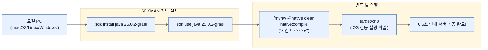

# Running our native Spring Boot application inside GraalVM

## 한눈에 보기
| 관점 | 핵심 |
|---|---|
| 이 절의 질문 | 스프링 부트 애플리케이션을 네이티브 실행 파일로 변환하려면 로컬 환경에 GraalVM JDK가 설치되어 있어야 한다. SDKMAN 같은 도구로 쉽게 버전을 관리할 수 있으며, 준비가 완료되면 Maven 커맨드 하나로 네이티브 컴파일을 수행하여 빛의 속도로 켜지는 초경량 실행 파일을 얻을 수 있다. |
| 책에서의 역할 | Chapter 8의 앞뒤 예제를 연결하는 학습 단위 |

## 1. 왜 이게 필요한가

스프링 부트 애플리케이션을 네이티브 실행 파일로 변환하려면 로컬 환경에 **GraalVM JDK**가 설치되어 있어야 한다. SDKMAN 같은 도구로 쉽게 버전을 관리할 수 있으며, 준비가 완료되면 Maven 커맨드 하나로 네이티브 컴파일을 수행하여 빛의 속도로 켜지는 초경량 실행 파일을 얻을 수 있다.

### 비유로 잡기
배포 산출물은 제품을 포장해 운송하는 과정과 닮았다. 코드와 런타임을 어디까지 한 상자에 넣느냐에 따라 재현성과 크기가 달라진다.

→ 비유가 깨지는 지점: 소프트웨어 포장은 상자를 만들고 끝나지 않는다. 대상 CPU·OS, 보안 패치, 시작 시간, 런타임 진단 가능성까지 선택에 포함된다.

### 이 절의 언어
**[[sdkman]]**(= 자바 계열의 여러 JDK 및 빌드 도구(Maven, Gradle)의 버전을 쉽게 다운로드하고 교체(switch)하게 해주는 쉘 도구), **[[native-image]]**(= GraalVM 툴체인에 포함된 AOT 컴파일러 툴의 이름이자, 그 결과물로 나오는 실행 파일 포맷)

## 2. 어떻게 동작하는가

먼저 다음 세 축으로 메커니즘을 읽는다.

1. **입력과 전제 확인** — 어떤 요청·설정·데이터가 들어오는지 확인한다. 잘못된 전제를 다음 계층으로 넘기지 않기 위해서다.
2. **Spring 추상화 적용** — 스타터와 자동 구성, 어노테이션 또는 명시적 빈이 실제 처리를 연결한다. 반복 배선보다 도메인 선택에 집중하기 위해서다.
3. **결과와 경계 검증** — 응답·저장 상태·운영 신호를 확인한다. 정상 경로만 보고 장애·버전·성능 차이를 놓치지 않기 위해서다.

### 2.1 GraalVM 설치 (SDKMAN 활용)
자바 애플리케이션을 네이티브 코드로 AOT 컴파일하려면 표준 JDK가 아닌 **GraalVM 배포판 (native-image 툴체인 포함)**이 필요하다. macOS나 리눅스에서는 SDKMAN을 통해 쉽게 전환이 가능하다. (윈도우의 경우 오라클 공식 홈페이지 다운로드 및 Microsoft C++ 컴파일러 추가 필요)

```bash
$ sdk install java 25.0.2-graal

# 방금 설치한 버전으로 터미널 런타임 전환
$ sdk use java 25.0.2-graal

# 설치 확인 (출력에 GraalVM 문구가 포함되어야 함)
$ java -version
```

### 2.2 네이티브 컴파일 (Native Compile) 수행
GraalVM 기반으로 세팅되었다면, Maven에 내장된 `native` 프로필을 활성화하여 빌드한다.
```bash
$ ./mvnw -Pnative clean native:compile
```
- `-Pnative`: Spring Boot parent POM에 정의된 `native` 프로필을 켠다.
- `native:compile`: 네이티브 메이븐 플러그인을 호출하여 AOT 분석 및 네이티브 이미지 빌드를 수행한다.
- 이 과정은 수많은 정적 분석을 거치기 때문에 일반적인 JAR 패키징보다 시간이 훨씬 오래 걸린다 (수 분 이상 소요).

### 2.3 실행 파일 결과물 확인 및 실행
빌드가 끝나면 `.jar` 파일이 아닌, **해당 OS 전용의 실행 파일**(예: Mac의 경우 Mach-O 64-bit executable)이 `target/` 폴더에 생성된다.

```bash
# 로컬 바이너리 파일 직접 실행
$ target/ch8
```
실행 결과를 보면 `Started Chapter8Application in 0.528 seconds` 처럼 일반 자바 구동 시간(수 초~수십 초)에 비해 0.x초 대의 믿을 수 없는 구동 속도를 보여준다.

> [!NOTE]
> 이 파일은 `java -jar` 로 실행하는 것이 아니다. OS의 독자적인 실행 파일로 변환되었기 때문에 JVM 환경 변수 등의 영향을 받지 않으며, 개발한 머신과 동일한 아키텍처(OS)에서만 동작한다.

## 3. 그림으로 보기



## 4. 이 노트에 나온 용어
| 용어 | 한 줄 | 자세히 |
|------|-------|--------|
| sdkman | 자바 계열의 여러 JDK 및 빌드 도구(Maven, Gradle)의 버전을 쉽게 다운로드하고 교체(switch)하게 해주는 쉘 도구 | [[_glossary#sdkman]] |
| native-image | GraalVM 툴체인에 포함된 AOT 컴파일러 툴의 이름이자, 그 결과물로 나오는 실행 파일 포맷 | [[_glossary#native-image]] |

## 5. 자주 헷갈리는 것
- 이 주제의 **Spring 추상화**와 그 아래에서 실제로 동작하는 라이브러리·프로토콜을 같은 것으로 보지 않는다. 추상화는 기본 배선을 줄이지만 하위 계층의 비용과 실패를 없애지 않는다.

## 6. 언제 안 쓰나 / 경계
- 책의 예제는 개념을 드러내기 위한 작은 애플리케이션이다. 운영 환경에서는 인증 정보, 장애 복구, 관측성, 부하와 데이터 규모를 별도로 검증한다.
- 이 노트의 API와 기본값은 책의 Spring Boot 4.1·Java 25 맥락을 따른다. 다른 마이너 버전에서는 공식 마이그레이션 문서와 실제 의존성 버전을 함께 확인한다.

## 7. 연결
- [[02-retrofitting-for-graalvm]] — 같은 장의 학습 흐름에서 Running our native Spring Boot application inside GraalVM의 전제 또는 다음 적용 단계와 연결된다.
- [[04-baking-a-docker-container-with-graalvm]] — 같은 장의 학습 흐름에서 Running our native Spring Boot application inside GraalVM의 전제 또는 다음 적용 단계와 연결된다.

## 8. 스스로 확인
1. `target/ch8` 로 생성된 파일을 우분투(Ubuntu) 리눅스 서버로 복사해서 실행하려 하면 동작하지 않는다. 그 이유는 무엇인가?
2. 네이티브 빌드 시 명령어에 `-Pnative` 옵션을 주어야 하는 이유는 무엇인가?

<!-- ==== 아래는 내 영역 · 스킬 수정 금지 ==== -->

## 내 설명 시도

## 막혔던 지점

## 리뷰 이력
