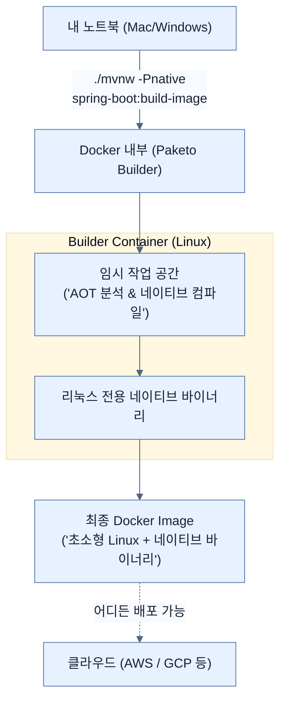

# Baking a Docker container with GraalVM

## 한눈에 보기
| 관점 | 핵심 |
|---|---|
| 이 절의 질문 | 로컬 PCMac이나 Windows에서 네이티브 이미지를 빌드하면 해당 OS 전용 실행 파일이 만들어진다. 이를 클라우드주로 리눅스 환경에 그대로 배포할 수는 없다. 스프링 부트의 Cloud Native Buildpacks Paketo를 이용하면, 개발자의 PC 환경과 상관없이 타겟 운영 환경에 맞는 리눅스 기반 네이티브… |
| 책에서의 역할 | Chapter 8의 앞뒤 예제를 연결하는 학습 단위 |

## 1. 왜 이게 필요한가

로컬 PC(Mac이나 Windows)에서 네이티브 이미지를 빌드하면 해당 OS 전용 실행 파일이 만들어진다. 이를 클라우드(주로 리눅스) 환경에 그대로 배포할 수는 없다. 스프링 부트의 **Cloud Native Buildpacks (Paketo)**를 이용하면, 개발자의 PC 환경과 상관없이 타겟 운영 환경에 맞는 리눅스 기반 네이티브 컨테이너 이미지를 손쉽게 만들어낼 수 있다.

### 비유로 잡기
AI 애플리케이션을 사서와 대화하는 과정에 비유하면, 모델은 답을 만들고 검색기는 관련 책을 찾으며 도구는 실제 업무를 수행한다.

→ 비유가 깨지는 지점: 사서는 출처와 권한을 스스로 보장하지만 모델은 그럴 수 없다. 검색 결과와 도구 인자는 반드시 애플리케이션이 검증해야 한다.

### 이 절의 언어
**[[cross-compile]]**(= 특정 OS나 아키텍처(예: Mac) 위에서 동작하는 툴체인을 가지고, 다른 아키텍처(예: Linux)용 바이너리를 생성해내는 컴파일 방식)

## 2. 어떻게 동작하는가

먼저 다음 세 축으로 메커니즘을 읽는다.

1. **입력과 전제 확인** — 어떤 요청·설정·데이터가 들어오는지 확인한다. 잘못된 전제를 다음 계층으로 넘기지 않기 위해서다.
2. **Spring 추상화 적용** — 스타터와 자동 구성, 어노테이션 또는 명시적 빈이 실제 처리를 연결한다. 반복 배선보다 도메인 선택에 집중하기 위해서다.
3. **결과와 경계 검증** — 응답·저장 상태·운영 신호를 확인한다. 정상 경로만 보고 장애·버전·성능 차이를 놓치지 않기 위해서다.

### 2.1 크로스 컴파일의 한계
네이티브 이미지는 C/C++ 컴파일처럼 컴파일을 수행하는 호스트 OS 아키텍처에 강하게 종속된다(예: Mac에서 컴파일하면 Mach-O 바이너리 생성).
따라서 클라우드 서버(리눅스)에 배포하기 위해 맥(Mac) 환경에서 크로스 컴파일(Cross-compile)을 억지로 시도하기보다는, 리눅스 환경과 동일한 도커 컨테이너 안에서 빌드를 수행하는 편이 가장 깔끔하다.

### 2.2 Buildpacks를 이용한 네이티브 컨테이너 빌드
Chapter 7에서 사용했던 도커 이미지 생성 명령어에 `-Pnative` 프로필만 추가해주면 된다.

```bash
$ ./mvnw -Pnative spring-boot:build-image
```
이 명령어의 흐름은 다음과 같다:
1. Paketo 빌드팩이 구동되어 도커 빌드용 임시 컨테이너를 생성한다.
2. 해당 컨테이너 내부(리눅스 기반)로 코드를 가져와 **네이티브 AOT 컴파일**을 수행한다.
3. 생성된 리눅스용 네이티브 바이너리를 베이스 이미지(초경량 OS)에 얹어 최종 도커 이미지를 구워낸다.

> [!NOTE]
> 네이티브 컴파일은 CPU와 메모리를 많이 사용하므로 로컬 빌드보다 시간이 더 오래 걸릴 수 있다. 하지만 결과물(컨테이너 이미지) 안에는 뚱뚱한 JVM이나 관련 라이브러리 레이어가 없어서, 이미지 크기도 획기적으로 줄고(수십 MB 수준) 실행 속도도 비약적으로 빠르다.

### 2.3 Spring Native 프로젝트에서 Spring Boot 4 기본 내장으로
과거에는 `Spring Native`라는 별도의 실험 프로젝트로 존재했으나, Spring Boot 4와 Spring Framework 7에서는 이러한 도구 연동과 메타데이터(힌트) 생성이 코어 기능으로 편입되었다. 추가 외부 프레임워크를 덧붙일 필요 없이 플러그인 설정 하나로 자연스럽게 구동된다.

## 3. 그림으로 보기



## 4. 이 노트에 나온 용어
| 용어 | 한 줄 | 자세히 |
|------|-------|--------|
| cross-compile | 특정 OS나 아키텍처(예: Mac) 위에서 동작하는 툴체인을 가지고, 다른 아키텍처(예: Linux)용 바이너리를 생성해내는 컴파일 방식 | [[_glossary#cross-compile]] |

## 5. 자주 헷갈리는 것
- 이 주제의 **Spring 추상화**와 그 아래에서 실제로 동작하는 라이브러리·프로토콜을 같은 것으로 보지 않는다. 추상화는 기본 배선을 줄이지만 하위 계층의 비용과 실패를 없애지 않는다.

## 6. 언제 안 쓰나 / 경계
- 책의 예제는 개념을 드러내기 위한 작은 애플리케이션이다. 운영 환경에서는 인증 정보, 장애 복구, 관측성, 부하와 데이터 규모를 별도로 검증한다.
- 이 노트의 API와 기본값은 책의 Spring Boot 4.1·Java 25 맥락을 따른다. 다른 마이너 버전에서는 공식 마이그레이션 문서와 실제 의존성 버전을 함께 확인한다.

## 7. 연결
- [[03-running-native-spring-boot]] — 같은 장의 학습 흐름에서 Baking a Docker container with GraalVM의 전제 또는 다음 적용 단계와 연결된다.
- [[05-configuring-reflection-and-runtime-hints]] — 같은 장의 학습 흐름에서 Baking a Docker container with GraalVM의 전제 또는 다음 적용 단계와 연결된다.

## 8. 스스로 확인
1. 로컬 Mac에서 `./mvnw -Pnative clean native:compile`로 만든 실행 파일을 도커의 `Ubuntu` 쌩 이미지(Base image) 안에 집어넣어 실행하면 구동될까? 그 이유는 무엇인가?
2. `spring-boot:build-image`에 `-Pnative` 옵션을 주어 빌드했을 때 만들어지는 도커 이미지가, 주지 않았을 때 만들어지는 도커 이미지보다 가지는 장단점은 각각 무엇인가?

<!-- ==== 아래는 내 영역 · 스킬 수정 금지 ==== -->

## 내 설명 시도

## 막혔던 지점

## 리뷰 이력
