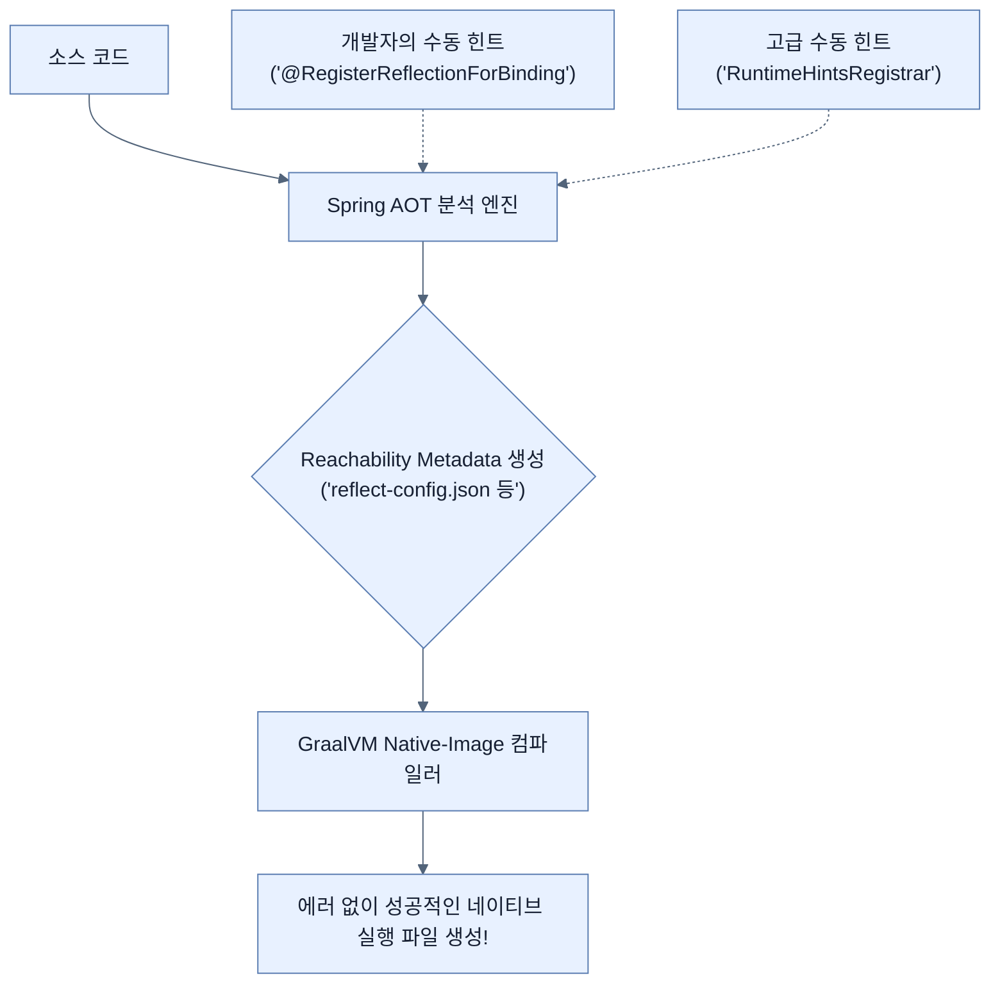

# Configuring Reflection and Runtime Hints

## 한눈에 보기
| 관점 | 핵심 |
|---|---|
| 이 절의 질문 | 스프링 부트의 AOT 엔진이 자동으로 메타데이터를 잘 생성해주지만, 개발자가 독자적으로 리플렉션Reflection을 사용하거나 특정 클래스의 직렬화Serialization를 수행하는 코드 등은 예측하지 못할 수 있다. 이때 명시적으로 런타임 힌트Runtime Hints를 스프링 AOT 엔진에 제공하여 네이티브 이미지에… |
| 책에서의 역할 | Chapter 8의 앞뒤 예제를 연결하는 학습 단위 |

## 1. 왜 이게 필요한가

스프링 부트의 AOT 엔진이 자동으로 메타데이터를 잘 생성해주지만, 개발자가 독자적으로 **리플렉션(Reflection)**을 사용하거나 특정 클래스의 직렬화(Serialization)를 수행하는 코드 등은 예측하지 못할 수 있다. 이때 명시적으로 **런타임 힌트(Runtime Hints)**를 스프링 AOT 엔진에 제공하여 네이티브 이미지에 누락되지 않도록 해야 한다.

### 비유로 잡기
설정을 여러 겹의 투명 필름에 비유하면, 아래의 기본값 위에 환경별 필름을 겹쳐 최종 값을 읽는 셈이다.

→ 비유가 깨지는 지점: 실제 설정은 필름처럼 단순히 마지막 줄만 보는 것이 아니라 소스별 우선순위, 바인딩 규칙, 활성화 조건까지 함께 평가한다.

### 이 절의 언어
**[[runtime-hints]]**(= GraalVM 네이티브 빌드 시 컴파일러가 자동 분석하지 못하는 동적 코드(리플렉션, 프록시, 리소스 읽기 등)의 구조를 명시적으로 알려주는 메타데이터 API)

## 2. 어떻게 동작하는가

먼저 다음 세 축으로 메커니즘을 읽는다.

1. **입력과 전제 확인** — 어떤 요청·설정·데이터가 들어오는지 확인한다. 잘못된 전제를 다음 계층으로 넘기지 않기 위해서다.
2. **Spring 추상화 적용** — 스타터와 자동 구성, 어노테이션 또는 명시적 빈이 실제 처리를 연결한다. 반복 배선보다 도메인 선택에 집중하기 위해서다.
3. **결과와 경계 검증** — 응답·저장 상태·운영 신호를 확인한다. 정상 경로만 보고 장애·버전·성능 차이를 놓치지 않기 위해서다.

### 2.1 간단한 애노테이션 방식 (`@RegisterReflectionForBinding`)
데이터 바인딩(예: JSON 직렬화/역직렬화)을 위해 특정 클래스의 리플렉션 정보가 필요할 때 가장 직관적으로 쓸 수 있는 애노테이션이다.

```java
@RegisterReflectionForBinding(VideoEntity.class)
@Configuration
public class NativeConfig {
}
```
위와 같이 설정해두면 스프링 AOT 엔진이 빌드 타임에 `VideoEntity` 클래스 구조(필드, 생성자, 메서드)를 런타임 리플렉션용으로 유지하도록 힌트를 기록한다.

### 2.2 고급 프로그래밍 방식 (`RuntimeHintsRegistrar`)
보다 세밀하게 어떤 요소(생성자만, 특정 메서드만)를 살려둘지 결정하거나 복잡한 조건을 태워야 할 때 인터페이스를 직접 구현할 수 있다.

```java
public class VideoRuntimeHints implements RuntimeHintsRegistrar {
    @Override
    public void registerHints(RuntimeHints hints, ClassLoader classLoader) {
        hints.reflection().registerType(
            VideoEntity.class,
            MemberCategory.INVOKE_DECLARED_CONSTRUCTORS, // 객체 생성 허용
            MemberCategory.INVOKE_PUBLIC_METHODS         // Getter/Setter 접근 허용
        );
    }
}
```
구현한 힌트 클래스는 `@ImportRuntimeHints` 애노테이션을 통해 등록해야 스프링 AOT 프로세스가 빌드 타임에 이를 읽어들인다.

```java
@Configuration
@ImportRuntimeHints(VideoRuntimeHints.class)
public class NativeAdvancedConfig {
}
```

### 2.3 제3자(Third-party) 라이브러리와 네이티브
스프링 코어 라이브러리는 모두 네이티브를 완벽 지원하지만, 프로젝트에 도입한 외부 라이브러리(Third-party)가 런타임 리플렉션을 강하게 사용한다면 네이티브 빌드 시 에러가 날 확률이 높다.
이럴 땐 스프링 커뮤니티가 제공하는 리치빌리티(Reachability) 메타데이터 레포지토리를 참조하거나, 위와 같은 힌트 방식을 이용해 개발자가 손수 보완해주어야 한다.

## 3. 그림으로 보기



## 4. 이 노트에 나온 용어
| 용어 | 한 줄 | 자세히 |
|------|-------|--------|
| runtime-hints | GraalVM 네이티브 빌드 시 컴파일러가 자동 분석하지 못하는 동적 코드(리플렉션, 프록시, 리소스 읽기 등)의 구조를 명시적으로 알려주는 메타데이터 API | [[_glossary#runtime-hints]] |

## 5. 자주 헷갈리는 것
- 이 주제의 **Spring 추상화**와 그 아래에서 실제로 동작하는 라이브러리·프로토콜을 같은 것으로 보지 않는다. 추상화는 기본 배선을 줄이지만 하위 계층의 비용과 실패를 없애지 않는다.

## 6. 언제 안 쓰나 / 경계
- 책의 예제는 개념을 드러내기 위한 작은 애플리케이션이다. 운영 환경에서는 인증 정보, 장애 복구, 관측성, 부하와 데이터 규모를 별도로 검증한다.
- 이 노트의 API와 기본값은 책의 Spring Boot 4.1·Java 25 맥락을 따른다. 다른 마이너 버전에서는 공식 마이그레이션 문서와 실제 의존성 버전을 함께 확인한다.

## 7. 연결
- [[04-baking-a-docker-container-with-graalvm]] — 같은 장의 학습 흐름에서 Configuring Reflection and Runtime Hints의 전제 또는 다음 적용 단계와 연결된다.
- [[06-using-buildpacks-with-java-aot-cache]] — 같은 장의 학습 흐름에서 Configuring Reflection and Runtime Hints의 전제 또는 다음 적용 단계와 연결된다.

## 8. 스스로 확인
1. `@RegisterReflectionForBinding(MyDTO.class)` 코드를 추가하는 것은 런타임 성능 향상을 위한 것인가, 아니면 네이티브 빌드 후 오류를 방지하기 위한 것인가?
2. `RuntimeHintsRegistrar` 인터페이스를 구현한 클래스를 만들었으나 네이티브 빌드 후에도 리플렉션 에러가 났다. 어떤 과정을 빠뜨렸기 때문일 확률이 높은가?

<!-- ==== 아래는 내 영역 · 스킬 수정 금지 ==== -->

## 내 설명 시도

## 막혔던 지점

## 리뷰 이력
