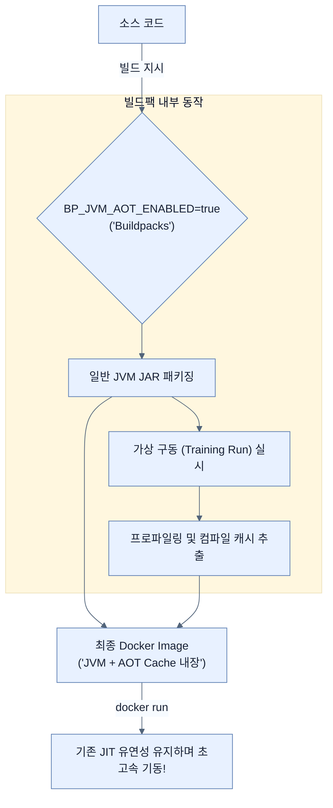

# Using Buildpacks with Java AOT Cache

## 한눈에 보기
| 관점 | 핵심 |
|---|---|
| 이 절의 질문 | GraalVM 네이티브 이미지 빌드는 빠르지만 리플렉션이나 동적 바인딩에 제약Closed-world이 많고 빌드 시간도 무겁다. 만약 기존의 유연한 JVM 런타임과 JIT 최적화를 포기하지 않으면서도 구동 시간Warm-up만 획기적으로 줄이고 싶다면, 빌드팩 과정에 Java AOT Cache 기술을 활성화하는 대안을 쓸… |
| 책에서의 역할 | Chapter 8의 앞뒤 예제를 연결하는 학습 단위 |

## 1. 왜 이게 필요한가

GraalVM 네이티브 이미지 빌드는 빠르지만 리플렉션이나 동적 바인딩에 제약(Closed-world)이 많고 빌드 시간도 무겁다. 만약 기존의 유연한 **JVM 런타임과 JIT 최적화를 포기하지 않으면서도 구동 시간(Warm-up)만 획기적으로 줄이고 싶다면**, 빌드팩 과정에 **Java AOT Cache** 기술을 활성화하는 대안을 쓸 수 있다.

### 비유로 잡기
배포 산출물은 제품을 포장해 운송하는 과정과 닮았다. 코드와 런타임을 어디까지 한 상자에 넣느냐에 따라 재현성과 크기가 달라진다.

→ 비유가 깨지는 지점: 소프트웨어 포장은 상자를 만들고 끝나지 않는다. 대상 CPU·OS, 보안 패치, 시작 시간, 런타임 진단 가능성까지 선택에 포함된다.

### 이 절의 언어
**[[java-aot-cache]]**(= JVM 레벨의 최적화 기술로, 훈련 주행(Training Run)을 통해 얻은 프로파일링과 컴파일 아티팩트를 디스크에 캐시해두고 다음 구동 시 재사용하는 방식), **[[training-run]]**(= 애플리케이션을 시범적으로 구동하여 주로 사용되는 경로(Hot paths)나 클래스 정보를 JIT 컴파일러가 수집할 수 있게 하는 과정)

## 2. 어떻게 동작하는가

먼저 다음 세 축으로 메커니즘을 읽는다.

1. **입력과 전제 확인** — 어떤 요청·설정·데이터가 들어오는지 확인한다. 잘못된 전제를 다음 계층으로 넘기지 않기 위해서다.
2. **Spring 추상화 적용** — 스타터와 자동 구성, 어노테이션 또는 명시적 빈이 실제 처리를 연결한다. 반복 배선보다 도메인 선택에 집중하기 위해서다.
3. **결과와 경계 검증** — 응답·저장 상태·운영 신호를 확인한다. 정상 경로만 보고 장애·버전·성능 차이를 놓치지 않기 위해서다.

### 2.1 Java AOT Cache란?
전통적인 JVM은 애플리케이션 시작 시 클래스를 로드하고 JIT 컴파일러가 코드를 분석하며 서서히 머신 코드로 최적화하는 "예열(Warm-up)" 과정을 거친다. 
**Java AOT Cache** 기술은 이를 보완하기 위해, 애플리케이션을 빌드하는 도중 **한 번 가상으로 실행(Training Run)**시켜보면서 발생한 JIT 컴파일 및 프로파일링 결과물을 캐시(Cache)로 저장해둔다. 이후 런타임에 이 캐시를 재사용하여 예열 과정을 건너뛰고 시작 속도를 대폭 줄인다.

### 2.2 빌드팩(Buildpacks)으로 AOT 캐시 이미지 생성
스프링 부트는 컨테이너(Docker) 이미지를 생성할 때 환경 변수를 하나 주입함으로써 쉽게 훈련(Training) 런과 캐시 저장을 자동화할 수 있다.

```bash
$ BP_JVM_AOT_ENABLED=true ./mvnw spring-boot:build-image
```
- `BP_JVM_AOT_ENABLED=true`: Paketo 빌드팩에게 이미지 빌드 도중 애플리케이션을 띄워보고 JVM 컴파일 캐시를 구워 넣도록 지시한다.

### 2.3 실행과 이점
생성된 이미지를 평소처럼 Docker로 구동하면 된다.
```bash
$ docker run -p 8080:8080 your-image-name
```
- **GraalVM 대비 장점**: 엄격한 네이티브 규칙(Runtime Hints 작성 등)에 얽매이지 않고 기존 JVM 위에서 똑같이 동작한다. 구동 중 발생하는 새로운 패턴에 대해 여전히 동적 JIT 최적화가 가능하다.
- **기존 JVM 대비 장점**: 컨테이너 내부에 훈련된 캐시가 포함되어 있어 처음 시작할 때의 레이턴시(Cold Start)가 훨씬 짧다.

## 3. 그림으로 보기



## 4. 이 노트에 나온 용어
| 용어 | 한 줄 | 자세히 |
|------|-------|--------|
| java-aot-cache | JVM 레벨의 최적화 기술로, 훈련 주행(Training Run)을 통해 얻은 프로파일링과 컴파일 아티팩트를 디스크에 캐시해두고 다음 구동 시 재사용하는 방식 | [[_glossary#java-aot-cache]] |
| training-run | 애플리케이션을 시범적으로 구동하여 주로 사용되는 경로(Hot paths)나 클래스 정보를 JIT 컴파일러가 수집할 수 있게 하는 과정 | [[_glossary#training-run]] |

## 5. 자주 헷갈리는 것
- 이 주제의 **Spring 추상화**와 그 아래에서 실제로 동작하는 라이브러리·프로토콜을 같은 것으로 보지 않는다. 추상화는 기본 배선을 줄이지만 하위 계층의 비용과 실패를 없애지 않는다.

## 6. 언제 안 쓰나 / 경계
- 책의 예제는 개념을 드러내기 위한 작은 애플리케이션이다. 운영 환경에서는 인증 정보, 장애 복구, 관측성, 부하와 데이터 규모를 별도로 검증한다.
- 이 노트의 API와 기본값은 책의 Spring Boot 4.1·Java 25 맥락을 따른다. 다른 마이너 버전에서는 공식 마이그레이션 문서와 실제 의존성 버전을 함께 확인한다.

## 7. 연결
- [[05-configuring-reflection-and-runtime-hints]] — 같은 장의 학습 흐름에서 Using Buildpacks with Java AOT Cache의 전제 또는 다음 적용 단계와 연결된다.
- [[07-java-25-aot-cache]] — 같은 장의 학습 흐름에서 Using Buildpacks with Java AOT Cache의 전제 또는 다음 적용 단계와 연결된다.

## 8. 스스로 확인
1. Java AOT Cache 방식을 적용한 컨테이너 이미지가 GraalVM Native Image 방식보다 유리한 가장 큰 아키텍처적 이점은 무엇인가?
2. `BP_JVM_AOT_ENABLED` 환경 변수를 사용하면 빌드 과정 중에 컨테이너 내부에서 구체적으로 어떤 추가 동작이 일어나는가?

<!-- ==== 아래는 내 영역 · 스킬 수정 금지 ==== -->

## 내 설명 시도

## 막혔던 지점

## 리뷰 이력
