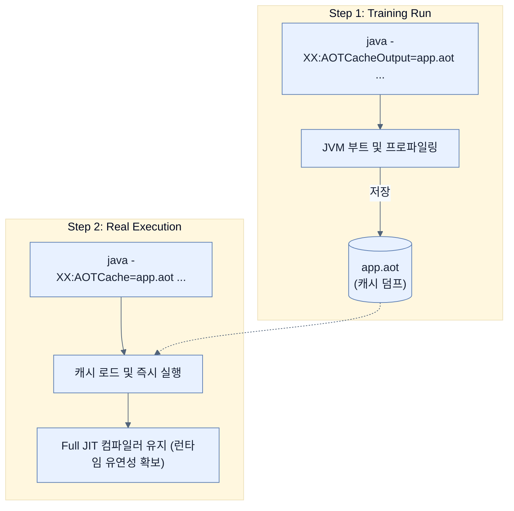

# Using Java 25 AOT Cache to reduce startup times

## 한눈에 보기
| 관점 | 핵심 |
|---|---|
| 이 절의 질문 | Java 25에서는 프로젝트 레이든Project Leyden의 결과물인 AOT Cache 기능이 JVM 레벨에서 완전히 지원되어 단일 명령어로 손쉽게 다룰 수 있게 되었다. 스프링의 AOT 구조 변경이나 컨테이너 빌드팩 없이도, 순수 JVM 옵션만으로 애플리케이션 훈련Training과 기동 속도 개선을 직접 달성할 수… |
| 책에서의 역할 | Chapter 8의 앞뒤 예제를 연결하는 학습 단위 |

## 1. 왜 이게 필요한가

Java 25에서는 프로젝트 레이든(Project Leyden)의 결과물인 **AOT Cache** 기능이 JVM 레벨에서 완전히 지원되어 단일 명령어로 손쉽게 다룰 수 있게 되었다. 스프링의 AOT 구조 변경이나 컨테이너 빌드팩 없이도, 순수 JVM 옵션만으로 애플리케이션 훈련(Training)과 기동 속도 개선을 직접 달성할 수 있으며 **CRaC** 등 다양한 최적화 전략과 장단점을 비교하여 아키텍처를 선택할 수 있다.

### 비유로 잡기
배포 산출물은 제품을 포장해 운송하는 과정과 닮았다. 코드와 런타임을 어디까지 한 상자에 넣느냐에 따라 재현성과 크기가 달라진다.

→ 비유가 깨지는 지점: 소프트웨어 포장은 상자를 만들고 끝나지 않는다. 대상 CPU·OS, 보안 패치, 시작 시간, 런타임 진단 가능성까지 선택에 포함된다.

### 이 절의 언어
**[[project-leyden]]**(= 자바 생태계에서 JVM 애플리케이션의 시작(Startup) 시간과 메모리 발자국을 줄이기 위해 시작된 OpenJDK의 장기 최적화 프로젝트), **[[crac]]**(= Coordinated Restore at Checkpoint의 약자로 런타임 상태를 체크포인트로 저장하고 이후 빠르게 복원하는 JVM 기술)

## 2. 어떻게 동작하는가

먼저 다음 세 축으로 메커니즘을 읽는다.

1. **입력과 전제 확인** — 어떤 요청·설정·데이터가 들어오는지 확인한다. 잘못된 전제를 다음 계층으로 넘기지 않기 위해서다.
2. **Spring 추상화 적용** — 스타터와 자동 구성, 어노테이션 또는 명시적 빈이 실제 처리를 연결한다. 반복 배선보다 도메인 선택에 집중하기 위해서다.
3. **결과와 경계 검증** — 응답·저장 상태·운영 신호를 확인한다. 정상 경로만 보고 장애·버전·성능 차이를 놓치지 않기 위해서다.

### 2.1 순수 JVM 옵션으로 캐시 훈련하기 (Training Run)
빌드팩(Paketo)에 맡기지 않고 로컬 서버 환경에서 직접 AOT 캐시를 생성할 수 있다.

```bash
$ java -XX:AOTCacheOutput=app.aot -Dspring.context.exit=onRefresh -jar target/ch8-0.0.1-SNAPSHOT.jar
```
- `-XX:AOTCacheOutput=app.aot`: JVM에게 실행 과정을 프로파일링하고 컴파일된 결과를 `app.aot` 파일로 저장하라고 지시한다.
- `-Dspring.context.exit=onRefresh`: 스프링이 ApplicationContext 로딩을 완료한 직후 스스로 종료(Exit)하도록 명령한다. 훈련 런을 무한 대기하지 않고 끝내기 위한 옵션이다.

> [!WARNING]
> 만약 훈련 런 도중 단순 로딩뿐 아니라 DB 쿼리나 중요 API 호출 등 '진짜로 주로 사용하는 로직(Hot Paths)'을 더 깊이 훈련시키려면 수동 테스트 스크립트를 연결하거나 통합 테스트 단계에 연동하는 것이 더 효과적일 수 있다.

### 2.2 캐시를 사용하여 실제 구동하기
훈련 파일(`app.aot`)이 준비되면 다음 명령어로 훨씬 빠르게 서버를 구동시킬 수 있다.
```bash
$ java -XX:AOTCache=app.aot -jar target/ch8-0.0.1-SNAPSHOT.jar
```
이렇게 하면 JVM은 콜드 스타트 상태가 아니라, `app.aot`에서 미리 컴파일된 아티팩트를 불러들여 예열 시간을 대폭 줄인 채로 서비스를 시작한다. 이후에도 필요시 동적 JIT 컴파일은 정상 작동한다.

### 2.3 4가지 시작 최적화 전략 비교
스프링 부트 환경에서 서버의 시작 속도를 다루는 전략은 4가지 관점으로 요약된다.

| 접근 방식 | 시작 속도(Startup) | 런타임 특성 (JIT) | 메모리 점유율 | 빌드/설정 복잡도 |
| --- | --- | --- | --- | --- |
| **Standard JVM** | 가장 느림 (예열 필요) | **Full JIT (최상)** | 기본 | 낮음 |
| **JVM with AOT Cache** | 기본보다 빠름 | Full JIT 보존 | 약간 향상 | 중간 (훈련 런 필요) |
| **GraalVM Native Image** | **압도적으로 빠름** | JIT 없음 (AOT 고정) | **매우 적음** | **높음 (Closed-world)** |
| **CRaC (Restore)** | 복원 시 매우 빠름 | 복원 시점 기준 보존 | 설정에 따라 다름 | 중간~높음 (리눅스 CRIU 종속 등) |

> [!NOTE] 
> **CRaC (Coordinated Restore at Checkpoint)**은 리눅스 기반으로 JVM을 실행 후 '완벽히 로딩된 상태' 통째로 메모리를 덤프 떠놓고(Checkpoint), 추후 그대로 복원(Restore)하여 즉각 기동시키는 기술이다.

## 3. 그림으로 보기



## 4. 이 노트에 나온 용어
| 용어 | 한 줄 | 자세히 |
|------|-------|--------|
| project-leyden | 자바 생태계에서 JVM 애플리케이션의 시작(Startup) 시간과 메모리 발자국을 줄이기 위해 시작된 OpenJDK의 장기 최적화 프로젝트 | [[_glossary#project-leyden]] |
| crac | Coordinated Restore at Checkpoint의 약자로 런타임 상태를 체크포인트로 저장하고 이후 빠르게 복원하는 JVM 기술 | [[_glossary#crac]] |

## 5. 자주 헷갈리는 것
- 이 주제의 **Spring 추상화**와 그 아래에서 실제로 동작하는 라이브러리·프로토콜을 같은 것으로 보지 않는다. 추상화는 기본 배선을 줄이지만 하위 계층의 비용과 실패를 없애지 않는다.

## 6. 언제 안 쓰나 / 경계
- 책의 예제는 개념을 드러내기 위한 작은 애플리케이션이다. 운영 환경에서는 인증 정보, 장애 복구, 관측성, 부하와 데이터 규모를 별도로 검증한다.
- 이 노트의 API와 기본값은 책의 Spring Boot 4.1·Java 25 맥락을 따른다. 다른 마이너 버전에서는 공식 마이그레이션 문서와 실제 의존성 버전을 함께 확인한다.

## 7. 연결
- [[06-using-buildpacks-with-java-aot-cache]] — 같은 장의 학습 흐름에서 Using Java 25 AOT Cache to reduce startup times의 전제 또는 다음 적용 단계와 연결된다.
- [[05-configuring-reflection-and-runtime-hints]] — 같은 장의 학습 흐름에서 Using Java 25 AOT Cache to reduce startup times의 전제 또는 다음 적용 단계와 연결된다.

## 8. 스스로 확인
1. 로컬 환경에서 `-XX:AOTCacheOutput=app.aot` 를 사용할 때 같이 부여하는 `-Dspring.context.exit=onRefresh` 속성은 구체적으로 어떤 유용성을 가지는가?
2. 애플리케이션의 소스 코드를 한 줄 수정하여 다시 빌드했을 때 기존에 만들어둔 `app.aot` 파일을 그대로 재사용하면 성능 향상이 있을까?

<!-- ==== 아래는 내 영역 · 스킬 수정 금지 ==== -->

## 내 설명 시도

## 막혔던 지점

## 리뷰 이력
