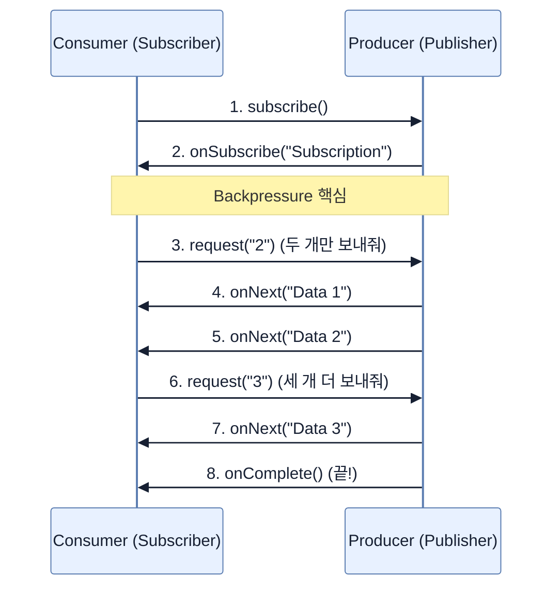

# What is Reactive and why do we care?

## 한눈에 보기
| 관점 | 핵심 |
|---|---|
| 이 절의 질문 | 현대의 대규모 웹 서비스 환경에서는 수천, 수만 명의 동시 접속자를 적은 서버 자원으로 효율적으로 처리해야 한다. 리액티브 프로그래밍Reactive Programming은 스레드가 멈춰서 기다리는 '블로킹Blocking' 방식을 버리고, 이벤트 기반의 '논블로킹Non-blocking' 방식과 백프레셔Backpressur… |
| 책에서의 역할 | Chapter 9의 앞뒤 예제를 연결하는 학습 단위 |

## 1. 왜 이게 필요한가

현대의 대규모 웹 서비스 환경에서는 수천, 수만 명의 동시 접속자를 적은 서버 자원으로 효율적으로 처리해야 한다. **리액티브 프로그래밍(Reactive Programming)**은 스레드가 멈춰서 기다리는 '블로킹(Blocking)' 방식을 버리고, 이벤트 기반의 '논블로킹(Non-blocking)' 방식과 **백프레셔(Backpressure)**를 통해 시스템이 감당할 수 있는 만큼만 데이터를 흘려보내는 고도로 최적화된 데이터 처리 패러다임이다.

### 비유로 잡기
동시성 처리를 식당 주문 흐름에 비유하면, 직원이 한 주문이 끝날 때까지 서 있는 방식과 번호표를 주고 다음 주문을 받는 방식의 차이다.

→ 비유가 깨지는 지점: 소프트웨어에서는 대기뿐 아니라 순서, 취소, 역압력, 재시도, 중복 처리까지 다뤄야 하므로 번호표 비유만으로 정확성을 설명할 수 없다.

### 이 절의 언어
**[[reactive-streams]]**(= 비동기 스트림 처리와 논블로킹 백프레셔를 표준화하기 위한 JVM 및 JavaScript 런타임 대상의 명세), **[[backpressure]]**(= 생산자의 데이터 발행 속도가 소비자의 처리 속도를 압도하지 못하도록, 소비자가 처리 가능한 데이터 양을 역으로 제어하는 메커니즘), **[[project-reactor]]**(= 스프링 팀에서 만든 Reactive Streams의 강력한 구현체로, Flux와 Mono를 제공하는 리액티브 툴킷)

## 2. 어떻게 동작하는가

먼저 다음 세 축으로 메커니즘을 읽는다.

1. **입력과 전제 확인** — 어떤 요청·설정·데이터가 들어오는지 확인한다. 잘못된 전제를 다음 계층으로 넘기지 않기 위해서다.
2. **Spring 추상화 적용** — 스타터와 자동 구성, 어노테이션 또는 명시적 빈이 실제 처리를 연결한다. 반복 배선보다 도메인 선택에 집중하기 위해서다.
3. **결과와 경계 검증** — 응답·저장 상태·운영 신호를 확인한다. 정상 경로만 보고 장애·버전·성능 차이를 놓치지 않기 위해서다.

### 2.1 전통적인 블로킹(Blocking) 방식의 한계
전통적인 웹 서버(예: Spring MVC + Tomcat)는 요청이 들어오면 전용 스레드를 하나 할당한다(Thread-per-request 모델).
만약 스레드가 DB 쿼리나 외부 API를 호출하면, 응답이 올 때까지 스레드는 멈춰서 대기(Idle)한다. 트래픽이 몰리면 스레드 풀(Thread Pool)이 고갈되고, 너무 많은 스레드를 생성하면 잦은 **컨텍스트 스위칭(Context Switching)**으로 인해 CPU 낭비와 메모리 폭발이 발생한다.

### 2.2 논블로킹(Non-blocking) 방식의 해결책
논블로킹 모델에서는 I/O 작업(DB 조회 등)을 요청한 뒤 스레드가 대기하지 않고 즉시 반환되어 다른 사용자의 요청을 처리하러 떠난다. 이후 데이터가 준비되면 '이벤트(콜백)'를 통해 작업을 이어받는다. 
덕분에 코어 수와 비슷한 극히 적은 수의 스레드만으로도 엄청난 양의 동시 요청을 소화할 수 있다.

### 2.3 Reactive Streams와 백프레셔(Backpressure)
[Reactive Streams](https://www.reactive-streams.org/)는 이러한 비동기/논블로킹 데이터 스트림 처리를 위한 자바 표준 명세(인터페이스 4개)다.
- **Publisher**: 데이터를 생성하고 발행한다.
- **Subscriber**: 데이터를 소비한다.
- **Subscription**: 구독 정보와 데이터 요청량을 관리한다.
- **Processor**: Publisher와 Subscriber의 역할을 동시에 수행한다.

가장 중요한 핵심은 **백프레셔(Backpressure, 배압)**다. 
생산자(Publisher)가 소비자(Subscriber)의 처리 속도를 무시하고 데이터를 폭격하면 시스템이 터진다. 백프레셔는 소비자가 "내가 지금 처리할 수 있는 만큼(예: 10개)만 보내줘"라고 명시적으로 요청(Demand)함으로써 데이터 흐름의 주도권을 소비자가 쥐게 하여 시스템 안정성을 보장한다.

### 2.4 Project Reactor
스프링 진영에서 선택한 Reactive Streams 구현체다. Spring WebFlux의 심장이기도 하며, 자바 8의 스트림(Stream) API와 유사한 함수형(Functional) 조작 메서드들을 제공한다.
- **Flux**: 0개에서 N개의 데이터를 비동기적으로 방출하는 타입
- **Mono**: 0개 또는 1개의 데이터를 비동기적으로 방출하는 타입

## 3. 그림으로 보기

## 4. 이 노트에 나온 용어
| 용어 | 한 줄 | 자세히 |
|------|-------|--------|
| reactive-streams | 비동기 스트림 처리와 논블로킹 백프레셔를 표준화하기 위한 JVM 및 JavaScript 런타임 대상의 명세 | [[_glossary#reactive-streams]] |
| backpressure | 생산자의 데이터 발행 속도가 소비자의 처리 속도를 압도하지 못하도록, 소비자가 처리 가능한 데이터 양을 역으로 제어하는 메커니즘 | [[_glossary#backpressure]] |
| project-reactor | 스프링 팀에서 만든 Reactive Streams의 강력한 구현체로, `Flux`와 `Mono`를 제공하는 리액티브 툴킷 | [[_glossary#project-reactor]] |

## 5. 자주 헷갈리는 것
- 이 주제의 **Spring 추상화**와 그 아래에서 실제로 동작하는 라이브러리·프로토콜을 같은 것으로 보지 않는다. 추상화는 기본 배선을 줄이지만 하위 계층의 비용과 실패를 없애지 않는다.

## 6. 언제 안 쓰나 / 경계
- 책의 예제는 개념을 드러내기 위한 작은 애플리케이션이다. 운영 환경에서는 인증 정보, 장애 복구, 관측성, 부하와 데이터 규모를 별도로 검증한다.
- 이 노트의 API와 기본값은 책의 Spring Boot 4.1·Java 25 맥락을 따른다. 다른 마이너 버전에서는 공식 마이그레이션 문서와 실제 의존성 버전을 함께 확인한다.

## 7. 연결
- [[02-reactive-spring-boot]] — 같은 장의 학습 흐름에서 What is Reactive and why do we care?의 전제 또는 다음 적용 단계와 연결된다.
- [[03-scaling-with-reactor]] — 같은 장의 학습 흐름에서 What is Reactive and why do we care?의 전제 또는 다음 적용 단계와 연결된다.

## 8. 스스로 확인
1. 기존의 블로킹 방식에서 대규모 트래픽을 감당하기 위해 스레드 풀의 크기를 10,000개로 늘린다면 어떤 치명적인 성능 저하가 발생하는가?
2. Reactive Streams에서 백프레셔를 구현하기 위해 소비자가 생산자에게 보내는 신호(메서드)는 무엇인가?

<!-- ==== 아래는 내 영역 · 스킬 수정 금지 ==== -->

## 내 설명 시도

## 막혔던 지점

## 리뷰 이력
