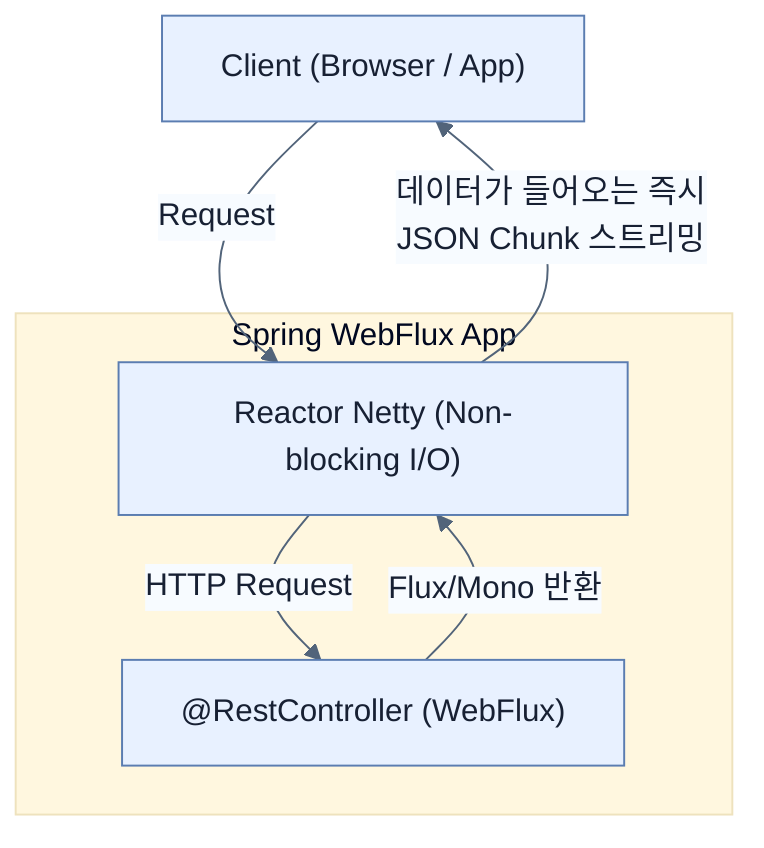

# Creating a Reactive Spring Boot application

## 한눈에 보기
| 관점 | 핵심 |
|---|---|
| 이 절의 질문 | 스프링 부트에서 리액티브 웹 애플리케이션을 만들려면 기존의 spring-boot-starter-webSpring MVC 대신 spring-boot-starter-webflux Spring WebFlux를 사용해야 한다. 이를 통해 기본 내장 서버가 Tomcat에서 논블로킹에 최적화된 Reactor Netty로 교체되며,… |
| 책에서의 역할 | Chapter 9의 앞뒤 예제를 연결하는 학습 단위 |

## 1. 왜 이게 필요한가

스프링 부트에서 리액티브 웹 애플리케이션을 만들려면 기존의 `spring-boot-starter-web`(Spring MVC) 대신 **`spring-boot-starter-webflux` (Spring WebFlux)**를 사용해야 한다. 이를 통해 기본 내장 서버가 Tomcat에서 논블로킹에 최적화된 **Reactor Netty**로 교체되며, `Flux`와 `Mono`를 활용한 리액티브 컨트롤러를 작성할 수 있다.

### 비유로 잡기
동시성 처리를 식당 주문 흐름에 비유하면, 직원이 한 주문이 끝날 때까지 서 있는 방식과 번호표를 주고 다음 주문을 받는 방식의 차이다.

→ 비유가 깨지는 지점: 소프트웨어에서는 대기뿐 아니라 순서, 취소, 역압력, 재시도, 중복 처리까지 다뤄야 하므로 번호표 비유만으로 정확성을 설명할 수 없다.

### 이 절의 언어
**[[webflux]]**(= 스프링 프레임워크 5.0부터 도입된, 서블릿 스택을 탈피하여 Reactive Streams 기반으로 완전히 새로 짜여진 논블로킹 웹 프레임워크), **[[reactor-netty]]**(= Netty의 이벤트 기반 고성능 네트워킹 성능과 Project Reactor의 백프레셔 메커니즘을 결합한 비동기 서버 엔진)

## 2. 어떻게 동작하는가

먼저 다음 세 축으로 메커니즘을 읽는다.

1. **입력과 전제 확인** — 어떤 요청·설정·데이터가 들어오는지 확인한다. 잘못된 전제를 다음 계층으로 넘기지 않기 위해서다.
2. **Spring 추상화 적용** — 스타터와 자동 구성, 어노테이션 또는 명시적 빈이 실제 처리를 연결한다. 반복 배선보다 도메인 선택에 집중하기 위해서다.
3. **결과와 경계 검증** — 응답·저장 상태·운영 신호를 확인한다. 정상 경로만 보고 장애·버전·성능 차이를 놓치지 않기 위해서다.

### 2.1 Spring WebFlux와 Reactor Netty
Spring Initializr에서 `Spring Reactive Web` 의존성을 추가하면 다음과 같은 핵심 컴포넌트가 구성된다.
- **Reactor Netty**: Tomcat 같은 전통적인 서블릿(Servlet) 컨테이너는 본질적으로 블로킹 I/O를 상정하고 설계되었다. 반면 Netty는 비동기 이벤트 기반의 네트워크 엔진이며, 이를 Project Reactor와 결합한 Reactor Netty가 WebFlux의 기본 서버로 동작한다.
- **WebFlux**: 서블릿 API에 의존하지 않는 스프링의 리액티브 웹 프레임워크다.

### 2.2 데이터를 제공하는 Reactive GET 메서드 (Flux)
리액티브 웹 컨트롤러는 겉보기에는 기존 Spring MVC의 애노테이션(`@RestController`, `@GetMapping`)을 그대로 사용하지만, 반환 타입이 리액티브 타입이어야 한다.

```java
@RestController
public class ApiController {
    @GetMapping("/api/employees")
    Flux<Employee> employees() {
        // 실제로는 DB나 외부 API에서 비동기적으로 조회해온다.
        return Flux.just(
            new Employee("alice", "management"),
            new Employee("bob", "payroll")
        );
    }
}
```
- 반환 타입이 `List<Employee>`가 아니라 `Flux<Employee>`다.
- 스프링 WebFlux는 반환된 `Flux`를 구독(Subscribe)하고, 데이터가 생성되는 족족(비동기적으로) 직렬화하여 JSON 응답으로 클라이언트에게 밀어 넣어준다(Streaming).

### 2.3 데이터를 소비하는 Reactive POST 메서드 (Mono)
클라이언트가 데이터를 생성(POST)하기 위해 보내는 요청의 Body 데이터 역시 비동기 스트림으로 다루어야 한다.

```java
@PostMapping("/api/employees")
Mono<Employee> add(@RequestBody Mono<Employee> newEmployee) {
    return newEmployee.map(employee -> {
        DATABASE.put(employee.name(), employee);
        return employee;
    });
}
```
- `@RequestBody Mono<Employee>`: 클라이언트가 보낸 JSON 바디가 네트워크를 통해 들어오는 과정 자체도 비동기적으로 처리되어 `Mono`로 감싸져서 전달된다.
- 이 `Mono` 내부의 값에 접근하려면 블로킹 방식(`block()`)으로 값을 꺼내는 것이 아니라, `map()`이나 `flatMap()` 같은 리액티브 연산자 내부에서 콜백 형태로 처리해야 한다.

## 3. 그림으로 보기



## 4. 이 노트에 나온 용어
| 용어 | 한 줄 | 자세히 |
|------|-------|--------|
| webflux | 스프링 프레임워크 5.0부터 도입된, 서블릿 스택을 탈피하여 Reactive Streams 기반으로 완전히 새로 짜여진 논블로킹 웹 프레임워크 | [[_glossary#webflux]] |
| reactor-netty | Netty의 이벤트 기반 고성능 네트워킹 성능과 Project Reactor의 백프레셔 메커니즘을 결합한 비동기 서버 엔진 | [[_glossary#reactor-netty]] |

## 5. 자주 헷갈리는 것
- 이 주제의 **Spring 추상화**와 그 아래에서 실제로 동작하는 라이브러리·프로토콜을 같은 것으로 보지 않는다. 추상화는 기본 배선을 줄이지만 하위 계층의 비용과 실패를 없애지 않는다.

## 6. 언제 안 쓰나 / 경계
- 책의 예제는 개념을 드러내기 위한 작은 애플리케이션이다. 운영 환경에서는 인증 정보, 장애 복구, 관측성, 부하와 데이터 규모를 별도로 검증한다.
- 이 노트의 API와 기본값은 책의 Spring Boot 4.1·Java 25 맥락을 따른다. 다른 마이너 버전에서는 공식 마이그레이션 문서와 실제 의존성 버전을 함께 확인한다.

## 7. 연결
- [[01-what-is-reactive]] — 같은 장의 학습 흐름에서 Creating a Reactive Spring Boot application의 전제 또는 다음 적용 단계와 연결된다.
- [[03-scaling-with-reactor]] — 같은 장의 학습 흐름에서 Creating a Reactive Spring Boot application의 전제 또는 다음 적용 단계와 연결된다.

## 8. 스스로 확인
1. 기존 Spring MVC에서 자주 사용하던 내장 서버(Tomcat)가 Spring WebFlux에서는 왜 적합하지 않은가?
2. 클라이언트가 POST 요청으로 보낸 데이터를 컨트롤러에서 `Employee` 객체가 아닌 `Mono<Employee>`로 받는 이유는 무엇인가?

<!-- ==== 아래는 내 영역 · 스킬 수정 금지 ==== -->

## 내 설명 시도

## 막혔던 지점

## 리뷰 이력
