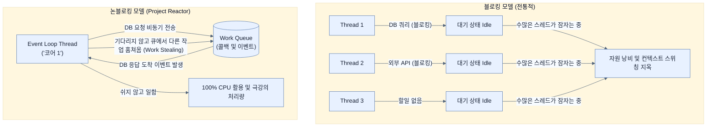

# Scaling applications with Project Reactor

## 한눈에 보기
| 관점 | 핵심 |
|---|---|
| 이 절의 질문 | Project Reactor로 작성한 코드는 기존의 명령형Imperative 코드처럼 즉시 실행되는 것이 아니라, 데이터 처리의 '레시피'를 조립Assembly할 뿐이다. 실제 실행은 누군가 구독Subscribe했을 때 비로소 시작되며, Reactor의 내부 스케줄러가 논블로킹 I/O 대기 시간에 다른 작업을 가로채서… |
| 책에서의 역할 | Chapter 9의 앞뒤 예제를 연결하는 학습 단위 |

## 1. 왜 이게 필요한가

Project Reactor로 작성한 코드는 기존의 명령형(Imperative) 코드처럼 즉시 실행되는 것이 아니라, 데이터 처리의 '레시피'를 **조립(Assembly)**할 뿐이다. 실제 실행은 누군가 **구독(Subscribe)**했을 때 비로소 시작되며, Reactor의 내부 스케줄러가 논블로킹 I/O 대기 시간에 다른 작업을 가로채서 처리하는 **작업 훔치기(Work Stealing)** 기법을 통해 스레드 코어 수만으로도 무한에 가까운 확장성(Scalability)을 달성한다.

### 비유로 잡기
이 기능은 조립 라인의 한 공정과 비슷하다. 입력을 정해진 규칙으로 변환해 다음 공정이 사용할 결과를 만든다.

→ 비유가 깨지는 지점: 애플리케이션은 고정된 조립 라인이 아니다. 조건부 구성과 런타임 실패, 외부 시스템 변화 때문에 공정의 경계를 따로 검증해야 한다.

### 이 절의 언어
**[[assembly]]**(= 리액티브 연산자(map, filter 등)를 체이닝하여 데이터가 흘러갈 경로와 수행할 작업 명세(레시피)를 선언적으로 구성하는 단계), **[[lazy-execution]]**(= 작성된 코드가 그 즉시 실행되는 것이 아니라, 최종적으로 누군가(Subscriber)가 데이터를 요구(Subscribe)할 때 비로소 실행되는 특성), **[[work-stealing]]**(= 스레드가 특정 I/O 작업의 완료를 멍하니 기다리지 않고, 큐에 쌓인 다른 유효한 작업을 가져와 빈틈없이 처리하는 기법), **[[scheduler]]**(= Project Reactor 내에서 작업 큐를 관리하고 스레드에 작업을 할당하여 비동기 실행을 관장하는 엔진 (예: boundedElastic, parallel))

## 2. 어떻게 동작하는가

먼저 다음 세 축으로 메커니즘을 읽는다.

1. **입력과 전제 확인** — 어떤 요청·설정·데이터가 들어오는지 확인한다. 잘못된 전제를 다음 계층으로 넘기지 않기 위해서다.
2. **Spring 추상화 적용** — 스타터와 자동 구성, 어노테이션 또는 명시적 빈이 실제 처리를 연결한다. 반복 배선보다 도메인 선택에 집중하기 위해서다.
3. **결과와 경계 검증** — 응답·저장 상태·운영 신호를 확인한다. 정상 경로만 보고 장애·버전·성능 차이를 놓치지 않기 위해서다.

### 2.1 조립(Assembly)과 게으른 실행(Lazy Execution)
```java
Flux<String> sample = Flux.just("learning", "spring")
    .filter(s -> s.contains("spring"))
    .map(s -> s.toUpperCase());
```
위 코드가 실행될 때 필터링이나 대문자 변환 로직이 즉시 작동하는 것이 아니다. 이 코드는 단순히 "데이터가 들어오면 필터링을 하고 변환을 해라"라는 **명령 객체(Command Object)들의 체인(레시피)**을 조립(Assembly)한 것에 불과하다.

리액티브 프로그래밍의 대원칙 중 하나는 **"구독(Subscribe)하기 전까지는 아무 일도 일어나지 않는다"**는 것이다.
스프링 WebFlux에서는 우리가 컨트롤러에서 리액티브 타입(`Flux`, `Mono`)을 반환하기만 하면, 프레임워크가 적절한 시점(클라이언트 요청)에 자동으로 `subscribe()`를 호출하여 실행을 촉발시킨다.

### 2.2 스레드 풀 크기와 문맥 교환(Context Switching)
과거의 자바 멀티스레드 프로그래밍에서는 스레드를 200개, 500개씩 거대한 풀(Pool)로 관리했다. 그러나 스레드 수가 CPU 코어 수를 넘어서면, CPU는 여러 스레드를 번갈아 실행하기 위해 현재 상태를 저장하고 다음 상태를 불러오는 데 막대한 비용(Context Switching Overhead)을 소모한다.
Project Reactor의 기본 스케줄러(Scheduler)는 **CPU 코어 수와 동일한 개수의 스레드**만 생성하여 이 오버헤드를 완전히 없앴다.

### 2.3 작업 훔치기(Work Stealing)와 블로킹의 위험성
코어 수만큼의 적은 스레드로 어떻게 엄청난 트래픽을 처리할까?
스레드가 DB나 외부 API로부터 데이터를 기다려야 할 때(I/O 대기), 스레드를 멈춰두는(Block) 대신 내부 작업 큐(Queue)로 돌아가 대기 중인 다른 작업을 가져와 처리(Work Stealing)한다.
이러한 구조이기 때문에, **단 하나의 블로킹 코드(예: 전통적인 JDBC, Thread.sleep 등)라도 리액티브 파이프라인 안에 섞여 있으면 안 된다.** 코어가 4개인 서버에서 1개의 스레드가 블로킹되면 시스템 전체 처리량의 25%가 즉시 날아가는 대형 사고로 이어지기 때문이다. 만약 어쩔 수 없이 블로킹 코드를 써야 한다면 `boundedElastic` 같은 별도의 격리된 스케줄러로 빼내야 한다.

## 3. 그림으로 보기



## 4. 이 노트에 나온 용어
| 용어 | 한 줄 | 자세히 |
|------|-------|--------|
| assembly | 리액티브 연산자(`map`, `filter` 등)를 체이닝하여 데이터가 흘러갈 경로와 수행할 작업 명세(레시피)를 선언적으로 구성하는 단계 | [[_glossary#assembly]] |
| lazy-execution | 작성된 코드가 그 즉시 실행되는 것이 아니라, 최종적으로 누군가(Subscriber)가 데이터를 요구(Subscribe)할 때 비로소 실행되는 특성 | [[_glossary#lazy-execution]] |
| work-stealing | 스레드가 특정 I/O 작업의 완료를 멍하니 기다리지 않고, 큐에 쌓인 다른 유효한 작업을 가져와 빈틈없이 처리하는 기법 | [[_glossary#work-stealing]] |
| scheduler | Project Reactor 내에서 작업 큐를 관리하고 스레드에 작업을 할당하여 비동기 실행을 관장하는 엔진 (예: `boundedElastic`, `parallel`) | [[_glossary#scheduler]] |

## 5. 자주 헷갈리는 것
- 이 주제의 **Spring 추상화**와 그 아래에서 실제로 동작하는 라이브러리·프로토콜을 같은 것으로 보지 않는다. 추상화는 기본 배선을 줄이지만 하위 계층의 비용과 실패를 없애지 않는다.

## 6. 언제 안 쓰나 / 경계
- 책의 예제는 개념을 드러내기 위한 작은 애플리케이션이다. 운영 환경에서는 인증 정보, 장애 복구, 관측성, 부하와 데이터 규모를 별도로 검증한다.
- 이 노트의 API와 기본값은 책의 Spring Boot 4.1·Java 25 맥락을 따른다. 다른 마이너 버전에서는 공식 마이그레이션 문서와 실제 의존성 버전을 함께 확인한다.

## 7. 연결
- [[02-reactive-spring-boot]] — 같은 장의 학습 흐름에서 Scaling applications with Project Reactor의 전제 또는 다음 적용 단계와 연결된다.
- [[04-reactive-templates-with-thymeleaf]] — 같은 장의 학습 흐름에서 Scaling applications with Project Reactor의 전제 또는 다음 적용 단계와 연결된다.

## 8. 스스로 확인
1. Spring WebFlux 컨트롤러 메서드 안에서 `Thread.sleep(1000)`을 호출하면 전체 웹 서버에 어떤 악영향을 미치는가?
2. `Flux.just(1, 2, 3).map(i -> i * 2);` 라는 코드를 작성했지만, 콘솔에 출력도 안 되고 아무 변화도 없다면 무엇을 빼먹었기 때문인가?

<!-- ==== 아래는 내 영역 · 스킬 수정 금지 ==== -->

## 내 설명 시도

## 막혔던 지점

## 리뷰 이력
