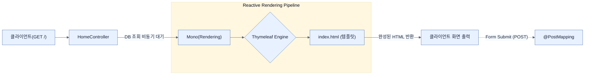

# Serving a Reactive template

## 한눈에 보기
| 관점 | 핵심 |
|---|---|
| 이 절의 질문 | 웹 API로 JSON 데이터만 반환하는 것을 넘어 사용자에게 시각적인 HTML 페이지를 제공해야 할 때도 리액티브 스택의 이점을 포기해선 안 된다. Thymeleaf는 Spring WebFlux와 완벽하게 통합되어 리액티브 데이터 스트림Flux, Mono을 템플릿 모델Model로 전달받아 논블로킹Non-blocking… |
| 책에서의 역할 | Chapter 9의 앞뒤 예제를 연결하는 학습 단위 |

## 1. 왜 이게 필요한가

웹 API로 JSON 데이터만 반환하는 것을 넘어 사용자에게 시각적인 HTML 페이지를 제공해야 할 때도 리액티브 스택의 이점을 포기해선 안 된다. **Thymeleaf**는 Spring WebFlux와 완벽하게 통합되어 리액티브 데이터 스트림(`Flux`, `Mono`)을 템플릿 모델(Model)로 전달받아 **논블로킹(Non-blocking)** 방식으로 HTML을 렌더링할 수 있다.

### 비유로 잡기
동시성 처리를 식당 주문 흐름에 비유하면, 직원이 한 주문이 끝날 때까지 서 있는 방식과 번호표를 주고 다음 주문을 받는 방식의 차이다.

→ 비유가 깨지는 지점: 소프트웨어에서는 대기뿐 아니라 순서, 취소, 역압력, 재시도, 중복 처리까지 다뤄야 하므로 번호표 비유만으로 정확성을 설명할 수 없다.

### 이 절의 언어
**[[rendering-builder]]**(= WebFlux 환경에서 렌더링할 뷰의 이름과 모델 속성들을 유연하게 결합하여 불변 객체인 Rendering 인스턴스를 만들어주는 스프링의 빌더 클래스)

## 2. 어떻게 동작하는가

먼저 다음 세 축으로 메커니즘을 읽는다.

1. **입력과 전제 확인** — 어떤 요청·설정·데이터가 들어오는지 확인한다. 잘못된 전제를 다음 계층으로 넘기지 않기 위해서다.
2. **Spring 추상화 적용** — 스타터와 자동 구성, 어노테이션 또는 명시적 빈이 실제 처리를 연결한다. 반복 배선보다 도메인 선택에 집중하기 위해서다.
3. **결과와 경계 검증** — 응답·저장 상태·운영 신호를 확인한다. 정상 경로만 보고 장애·버전·성능 차이를 놓치지 않기 위해서다.

### 2.1 WebFlux용 Thymeleaf 의존성 추가

Spring MVC가 아닌 Spring WebFlux 환경에서 템플릿을 구동하려면 기존의 `spring-boot-starter-web` 대신 WebFlux 전용 스타터를 쓴 상태에서 Thymeleaf를 추가해야 한다.

- `spring-boot-starter-webflux`
- `spring-boot-starter-thymeleaf`

### 2.2 리액티브 컨트롤러 작성 (Mono<Rendering>)

Spring MVC에서는 주로 `String`(뷰 이름)이나 `ModelAndView` 객체를 반환했다면, WebFlux 환경에서는 뷰 렌더링 명세 또한 리액티브 타입으로 감싸서 반환하는 함수형 스타일(Builder 패턴)을 주로 사용한다.

```java
@Controller
public class HomeController {
    @GetMapping("/")
    public Mono<Rendering> index() {
        return Flux.fromIterable(DATABASE.values())
             .collectList()
             .map(employees -> Rendering
                                 .view("index")
                                 .modelAttribute("employees", employees)
                                 .modelAttribute("newEmployee", new Employee("", ""))
                                 .build());
    }
}
```

- **`Mono<Rendering>`**: 렌더링할 뷰의 이름("index")과 모델 속성(데이터)들을 결합한 불변 객체(`Rendering`)를 `Mono` 안에 담아 반환한다.
- `collectList()`: 개별 요소로 쪼개져 흐르던 `Flux` 스트림 데이터를 모아서 하나의 `List`를 담은 `Mono`로 변환한다.
- `map()`: `Mono` 안에 담긴 리스트 데이터를 이용해 최종 `Rendering` 객체를 생성한다. **(중요: 리액티브 컨테이너인 `Mono` 껍데기를 깨고 나오는 것이 아니라 안에서 데이터만 변환한다)**

### 2.3 HTML Form 처리 (POST)

폼 전송(POST) 처리 역시 들어오는 데이터를 `Mono`로 받아 처리하고, 처리 결과로 이동할 경로(Redirect)를 반환한다.

```java
@PostMapping("/new-employee")
public Mono<String> newEmployee(@ModelAttribute Mono<Employee> newEmployee) {
    return newEmployee.map(employee -> {
        DATABASE.put(employee.name(), employee);
        return "redirect:/";
    });
}
```

- `@ModelAttribute`: JSON이 아니라 HTML Form(`application/x-www-form-urlencoded`)으로 들어온 데이터를 바인딩한다.
- 폼 데이터를 `Mono<Employee>`로 받은 뒤 내부 데이터 조작을 완료하면, 리다이렉트 지시어 문자열을 담은 `Mono<String>`을 반환한다.

## 3. 그림으로 보기



## 4. 이 노트에 나온 용어
| 용어 | 한 줄 | 자세히 |
|------|-------|--------|
| rendering-builder | WebFlux 환경에서 렌더링할 뷰의 이름과 모델 속성들을 유연하게 결합하여 불변 객체인 `Rendering` 인스턴스를 만들어주는 스프링의 빌더 클래스 | [[_glossary#rendering-builder]] |

## 5. 자주 헷갈리는 것
- 이 주제의 **Spring 추상화**와 그 아래에서 실제로 동작하는 라이브러리·프로토콜을 같은 것으로 보지 않는다. 추상화는 기본 배선을 줄이지만 하위 계층의 비용과 실패를 없애지 않는다.

## 6. 언제 안 쓰나 / 경계
- 책의 예제는 개념을 드러내기 위한 작은 애플리케이션이다. 운영 환경에서는 인증 정보, 장애 복구, 관측성, 부하와 데이터 규모를 별도로 검증한다.
- 이 노트의 API와 기본값은 책의 Spring Boot 4.1·Java 25 맥락을 따른다. 다른 마이너 버전에서는 공식 마이그레이션 문서와 실제 의존성 버전을 함께 확인한다.

## 7. 연결
- [[03-scaling-with-reactor]] — 같은 장의 학습 흐름에서 Serving a Reactive template의 전제 또는 다음 적용 단계와 연결된다.
- [[05-creating-hypermedia-reactively]] — 같은 장의 학습 흐름에서 Serving a Reactive template의 전제 또는 다음 적용 단계와 연결된다.

## 8. 스스로 확인
1. 기존 Spring MVC에서 문자열(String) 타입으로 "index"를 반환하여 템플릿을 찾던 방식과 비교해, WebFlux 환경에서 `Mono<Rendering>`을 빌드해 반환하는 방식의 구조적 차이는 무엇인가?
2. `Flux.fromIterable(...)` 로 데이터를 나열한 뒤 `collectList()` 를 사용하면 반환 타입은 어떻게 변하는가?

<!-- ==== 아래는 내 영역 · 스킬 수정 금지 ==== -->

## 내 설명 시도

## 막혔던 지점

## 리뷰 이력
