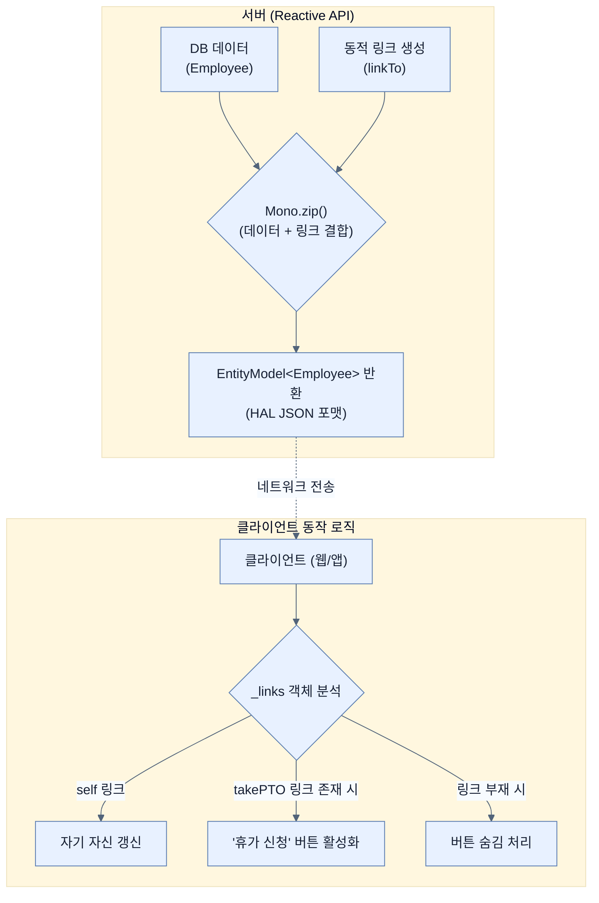

# Creating hypermedia reactively

## 한눈에 보기
| 관점 | 핵심 |
|---|---|
| 이 절의 질문 | 단순히 데이터만 내려주는 메마른 JSON API를 넘어, 클라이언트가 데이터의 상태에 따라 다음에 수행할 수 있는 '행동링크'까지 스스로 발견할 수 있도록 안내하는 것이 HATEOASHypermedia As The Engine Of Application State 아키텍처다. 스프링 부트는 WebFlux 환경에서도 Sp… |
| 책에서의 역할 | Chapter 9의 앞뒤 예제를 연결하는 학습 단위 |

## 1. 왜 이게 필요한가

단순히 데이터만 내려주는 메마른 JSON API를 넘어, 클라이언트가 데이터의 상태에 따라 다음에 수행할 수 있는 '행동(링크)'까지 스스로 발견할 수 있도록 안내하는 것이 **HATEOAS(Hypermedia As The Engine Of Application State)** 아키텍처다. 스프링 부트는 WebFlux 환경에서도 **Spring HATEOAS** 라이브러리를 통해 리액티브 방식으로 하이퍼미디어 API를 유연하게 구축할 수 있도록 지원한다.

### 비유로 잡기
동시성 처리를 식당 주문 흐름에 비유하면, 직원이 한 주문이 끝날 때까지 서 있는 방식과 번호표를 주고 다음 주문을 받는 방식의 차이다.

→ 비유가 깨지는 지점: 소프트웨어에서는 대기뿐 아니라 순서, 취소, 역압력, 재시도, 중복 처리까지 다뤄야 하므로 번호표 비유만으로 정확성을 설명할 수 없다.

### 이 절의 언어
**[[hateoas]]**(= 클라이언트가 서버로부터 받은 응답(상태)에 포함된 동적 하이퍼미디어 링크만을 바탕으로 다음 상태(애플리케이션 상태 전이)로 이동하게 하는 REST 아키텍처 성숙도의 최고 단계), **[[hal]]**(= Hypertext Application Language의 약자로 JSON 형식 내에서 하이퍼링크 리소스(_links)와 임베디드 리소스(_embedded)를 일관된 규격으로 표현하기 위한 표준 스펙)

## 2. 어떻게 동작하는가

먼저 다음 세 축으로 메커니즘을 읽는다.

1. **입력과 전제 확인** — 어떤 요청·설정·데이터가 들어오는지 확인한다. 잘못된 전제를 다음 계층으로 넘기지 않기 위해서다.
2. **Spring 추상화 적용** — 스타터와 자동 구성, 어노테이션 또는 명시적 빈이 실제 처리를 연결한다. 반복 배선보다 도메인 선택에 집중하기 위해서다.
3. **결과와 경계 검증** — 응답·저장 상태·운영 신호를 확인한다. 정상 경로만 보고 장애·버전·성능 차이를 놓치지 않기 위해서다.

### 2.1 Spring HATEOAS 추가 주의점
WebFlux 환경에서는 Spring Initializr에서 제공하는 `spring-boot-starter-hateoas` 스타터를 쓰면 안 된다. 해당 스타터는 서블릿(Spring MVC) 스택을 끌고 들어와 Reactor Netty 구동 환경과 충돌을 일으킨다.
대신 스프링 부트 의존성 관리의 도움을 받아 순수 `spring-hateoas` 코어 라이브러리만 직접 추가해야 한다.

```xml
<dependency>
    <groupId>org.springframework.hateoas</groupId>
    <artifactId>spring-hateoas</artifactId>
</dependency>
```
스타터를 빼버렸기 때문에 자동 구성(Auto-configuration)이 빠져있으므로, `@EnableHypermediaSupport(type = HAL)` 애노테이션을 붙여 수동으로 기능을 활성화해주어야 한다.

### 2.2 리액티브 HATEOAS 컨트롤러 구현
하이퍼미디어 API는 데이터를 단순히 반환하는 것을 넘어, 링크(Link) 메타데이터를 포함하는 전용 컨테이너(`EntityModel`, `CollectionModel` 등)에 데이터를 감싸서 반환해야 한다.

```java
@GetMapping("/hypermedia/employees/{key}")
Mono<EntityModel<Employee>> employee(@PathVariable String key) {
    // 1. 자기 자신(Self)을 가리키는 링크 생성 (WebFlux 컨트롤러 메서드 타겟팅)
    Mono<Link> selfLink = linkTo(methodOn(HypermediaController.class).employee(key))
            .withSelfRel().toMono();
            
    // 2. 집계 루트(전체 목록)를 가리키는 링크 생성
    Mono<Link> aggregateRoot = linkTo(methodOn(HypermediaController.class).employees())
            .withRel(LinkRelation.of("employees")).toMono();
            
    // 3. Reactor 연산자로 두 Mono(비동기 링크)가 모두 완성되길 기다린 후(zip), 합쳐서 반환
    Mono<Tuple2<Link, Link>> links = Mono.zip(selfLink, aggregateRoot);
    
    return links.map(objects ->
        EntityModel.of(DATABASE.get(key), objects.getT1(), objects.getT2())
    );
}
```
- `linkTo(methodOn(...))`: 하드코딩된 URL 대신 컨트롤러의 자바 메서드 시그니처를 리플렉션으로 읽어 동적으로 안전한 URL 링크를 만들어낸다.
- `Mono.zip()`: 2개 이상의 별개 비동기 작업(`Mono`)을 병렬로 수행한 뒤, 모든 작업이 완료되면 결과를 하나의 `Tuple`로 묶어서 후속 작업으로 넘겨주는 강력한 리액티브 연산자다.

### 2.3 하이퍼미디어의 목적
하이퍼미디어(HAL 규격의 `_links` 필드)는 클라이언트의 하드코딩을 방지한다.
클라이언트는 휴가 일수가 남아있는 직원 데이터에만 떨어지는 "takePTO" 링크를 보고 버튼을 노출할 수 있으며, 백엔드의 비즈니스 로직(상태 변화)이 프론트엔드로 자연스럽게 전이되어 시스템 간 결합도를 획기적으로 낮춘다.

## 3. 그림으로 보기



## 4. 이 노트에 나온 용어
| 용어 | 한 줄 | 자세히 |
|------|-------|--------|
| hateoas | 클라이언트가 서버로부터 받은 응답(상태)에 포함된 동적 하이퍼미디어 링크만을 바탕으로 다음 상태(애플리케이션 상태 전이)로 이동하게 하는 REST 아키텍처 성숙도의 최고 단계 | [[_glossary#hateoas]] |
| hal | Hypertext Application Language의 약자로 JSON 형식 내에서 하이퍼링크 리소스(`_links`)와 임베디드 리소스(`_embedded`)를 일관된 규격으로 표현하기 위한 표준 스펙 | [[_glossary#hal]] |

## 5. 자주 헷갈리는 것
- 이 주제의 **Spring 추상화**와 그 아래에서 실제로 동작하는 라이브러리·프로토콜을 같은 것으로 보지 않는다. 추상화는 기본 배선을 줄이지만 하위 계층의 비용과 실패를 없애지 않는다.

## 6. 언제 안 쓰나 / 경계
- 책의 예제는 개념을 드러내기 위한 작은 애플리케이션이다. 운영 환경에서는 인증 정보, 장애 복구, 관측성, 부하와 데이터 규모를 별도로 검증한다.
- 이 노트의 API와 기본값은 책의 Spring Boot 4.1·Java 25 맥락을 따른다. 다른 마이너 버전에서는 공식 마이그레이션 문서와 실제 의존성 버전을 함께 확인한다.

## 7. 연결
- [[04-reactive-templates-with-thymeleaf]] — 같은 장의 학습 흐름에서 Creating hypermedia reactively의 전제 또는 다음 적용 단계와 연결된다.
- [[03-scaling-with-reactor]] — 같은 장의 학습 흐름에서 Creating hypermedia reactively의 전제 또는 다음 적용 단계와 연결된다.

## 8. 스스로 확인
1. Spring WebFlux 프로젝트에서 HATEOAS 기능을 켜기 위해 `spring-boot-starter-hateoas`를 사용하지 말라고 하는 이유는 구체적으로 어떤 기술적 충돌 때문인가?
2. `Mono.zip()` 연산자는 어떨 때 사용하며, 이를 통해 여러 링크를 비동기적으로 만들 때 얻는 장점은 무엇인가?

<!-- ==== 아래는 내 영역 · 스킬 수정 금지 ==== -->

## 내 설명 시도

## 막혔던 지점

## 리뷰 이력
