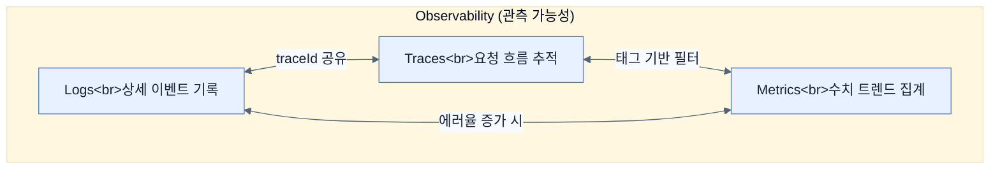

# Understanding the three pillars of observability

## 한눈에 보기
| 관점 | 핵심 |
|---|---|
| 이 절의 질문 | 분산된 시스템마이크로서비스에서는 문제가 발생했을 때 "서버가 죽었네모니터링" 수준을 넘어, "왜 죽었지? 어디서부터 병목이 생겼지?"를 추적해야 한다. 이를 가능하게 하는 능력을 옵저버빌리티Observability, 관측 가능성라 부르며, 이를 구성하는 3대 기둥이 바로 Logs로그, Metrics메트릭, Traces트… |
| 책에서의 역할 | Chapter 13의 앞뒤 예제를 연결하는 학습 단위 |

## 1. 왜 이게 필요한가

분산된 시스템(마이크로서비스)에서는 문제가 발생했을 때 "서버가 죽었네(모니터링)" 수준을 넘어, "왜 죽었지? 어디서부터 병목이 생겼지?"를 추적해야 한다. 이를 가능하게 하는 능력을 **옵저버빌리티(Observability, 관측 가능성)**라 부르며, 이를 구성하는 3대 기둥이 바로 **Logs(로그)**, **Metrics(메트릭)**, **Traces(트레이스)** 다.

### 비유로 잡기
관측성은 환자의 상태를 보는 진료와 닮았다. 사건 기록, 수치 추세, 몸 안을 지나간 경로를 함께 봐야 원인을 찾을 수 있다.

→ 비유가 깨지는 지점: 운영 신호는 진단 결과 자체가 아니다. 상관관계가 원인을 보장하지 않으며, 계측 누락과 샘플링이 판단을 왜곡할 수 있다.

### 이 절의 언어
**[[observability]]**(= 시스템의 외부 출력 데이터를 바탕으로 시스템 내부의 상태를 완벽하게 이해하고 진단할 수 있는 능력), **[[continuous-profiling]]**(= 운영 환경에서 코드 레벨의 CPU, 메모리 성능 데이터를 지속적으로 수집하여 소스 코드의 병목을 찾아내는 기법)

## 2. 어떻게 동작하는가

먼저 다음 세 축으로 메커니즘을 읽는다.

1. **입력과 전제 확인** — 어떤 요청·설정·데이터가 들어오는지 확인한다. 잘못된 전제를 다음 계층으로 넘기지 않기 위해서다.
2. **Spring 추상화 적용** — 스타터와 자동 구성, 어노테이션 또는 명시적 빈이 실제 처리를 연결한다. 반복 배선보다 도메인 선택에 집중하기 위해서다.
3. **결과와 경계 검증** — 응답·저장 상태·운영 신호를 확인한다. 정상 경로만 보고 장애·버전·성능 차이를 놓치지 않기 위해서다.

### 2.1 기존 모니터링(Monitoring)의 한계
전통적인 모니터링은 CPU 사용량, 메모리, 시스템 가동 시간(Uptime) 등 고정된 지표를 바탕으로 대시보드를 그린다. 하지만 현대의 시스템에서는 장애가 예측 불가능한 곳(느린 DB 쿼리, 다른 서비스의 지연 등)에서 연쇄적으로 발생한다. 모니터링만으로는 "시스템이 아프다"는 건 알 수 있지만, "어디가 어떻게 아픈지"는 진단할 수 없다.

### 2.2 옵저버빌리티의 3대 기둥 (The Three Pillars)

1. **Logs (로그)**
   - 시스템 내에서 **"무언가 일어났다"**는 개별 이벤트의 상세한 기록이다.
   - 예: "10:00에 NullPointerException 발생", "회원가입 트랜잭션 시작됨"
   - 디버깅의 가장 기본적이고 상세한 자료지만, 시스템 전체의 흐름을 보기는 어렵다.

2. **Metrics (메트릭/지표)**
   - 시간에 따라 수집된 **"숫자(수치) 데이터"**다.
   - 예: "최근 1분간 에러 발생 횟수: 50번", "현재 CPU 점유율: 80%"
   - 시스템의 전체적인 추세(Trend)와 비정상적인 스파이크(Spike)를 한눈에 파악하고 알림(Alert)을 보내는 데 최적화되어 있다.

3. **Traces (트레이스/추적)**
   - 하나의 요청(Request)이 시스템에 들어와서 나갈 때까지 **전체 서비스와 컴포넌트들을 관통하는 경로(Path)**를 인과 관계에 따라 보여준다.
   - 요청이 컨트롤러에서 10ms, DB에서 200ms, 외부 API에서 3000ms가 걸렸다면, 트레이스는 이 병목 지점을 정확히 짚어낸다.

### 2.3 통합과 상관관계 (Correlation)
이 3가지 기둥은 단독으로 쓰일 때보다 **하나로 연결될 때** 진정한 위력을 발휘한다.
어떤 요청이 5초나 걸렸다면(Metrics), 해당 요청의 트레이스(Traces)를 열어 어디서 지연됐는지 확인하고, 그 지연된 컴포넌트의 로그(Logs)를 클릭해 상세 에러 메시지를 확인하는 식이다.

> **(참고) Continuous Profiling (지속적 프로파일링)**
> 최근에는 CPU나 메모리 누수 같은 코드 레벨의 병목을 실시간으로 분석하는 프로파일링(예: Grafana Pyroscope)이 4번째 요소로 추가되기도 한다.

## 3. 그림으로 보기

## 4. 이 노트에 나온 용어
| 용어 | 한 줄 | 자세히 |
|------|-------|--------|
| observability | 시스템의 외부 출력 데이터를 바탕으로 시스템 내부의 상태를 완벽하게 이해하고 진단할 수 있는 능력 | [[_glossary#observability]] |
| continuous-profiling | 운영 환경에서 코드 레벨의 CPU, 메모리 성능 데이터를 지속적으로 수집하여 소스 코드의 병목을 찾아내는 기법 | [[_glossary#continuous-profiling]] |

## 5. 자주 헷갈리는 것
- 이 주제의 **Spring 추상화**와 그 아래에서 실제로 동작하는 라이브러리·프로토콜을 같은 것으로 보지 않는다. 추상화는 기본 배선을 줄이지만 하위 계층의 비용과 실패를 없애지 않는다.

## 6. 언제 안 쓰나 / 경계
- 책의 예제는 개념을 드러내기 위한 작은 애플리케이션이다. 운영 환경에서는 인증 정보, 장애 복구, 관측성, 부하와 데이터 규모를 별도로 검증한다.
- 이 노트의 API와 기본값은 책의 Spring Boot 4.1·Java 25 맥락을 따른다. 다른 마이너 버전에서는 공식 마이그레이션 문서와 실제 의존성 버전을 함께 확인한다.

## 7. 연결
- [[02-observability-architecture-with-spring-boot-4]] — 같은 장의 학습 흐름에서 Understanding the three pillars of observability의 전제 또는 다음 적용 단계와 연결된다.
- [[03-structuring-logging-with-logback-loki-and-grafana]] — 같은 장의 학습 흐름에서 Understanding the three pillars of observability의 전제 또는 다음 적용 단계와 연결된다.

## 8. 스스로 확인
1. 갑자기 새벽에 알림(Alert)이 울렸다. 옵저버빌리티 관점에서 Logs, Metrics, Traces를 어떤 순서로 활용하여 원인을 찾아내는 것이 가장 효율적일까?
2. 트레이스(Traces) 기술이 발달했는데도 여전히 개발자들이 전통적인 로그(Logs)를 남겨야만 하는 이유는 무엇일까?

<!-- ==== 아래는 내 영역 · 스킬 수정 금지 ==== -->

## 내 설명 시도

## 막혔던 지점

## 리뷰 이력
