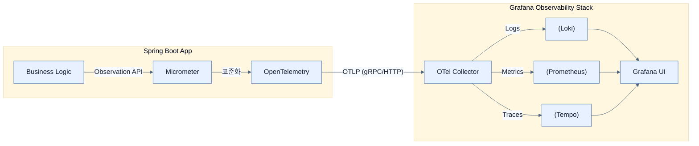

# Observability architecture with Spring Boot 4

## 한눈에 보기
| 관점 | 핵심 |
|---|---|
| 이 절의 질문 | 스프링 부트 4의 옵저버빌리티 아키텍처는 비즈니스 로직과 원격 모니터링 서버를 완전히 분리한다. 마이크로미터Micrometer가 애플리케이션 내부에서 데이터를 계측Instrumentation하고, 오픈텔레메트리OpenTelemetry 표준과 OTLP 프로토콜을 통해 중앙의 콜렉터Collector로 쏘아보내면, 최종적으로… |
| 책에서의 역할 | Chapter 13의 앞뒤 예제를 연결하는 학습 단위 |

## 1. 왜 이게 필요한가

스프링 부트 4의 옵저버빌리티 아키텍처는 비즈니스 로직과 원격 모니터링 서버를 완전히 분리한다. **마이크로미터(Micrometer)**가 애플리케이션 내부에서 데이터를 계측(Instrumentation)하고, **오픈텔레메트리(OpenTelemetry)** 표준과 **OTLP** 프로토콜을 통해 중앙의 **콜렉터(Collector)**로 쏘아보내면, 최종적으로 그라파나 스택(Loki, Prometheus, Tempo)에 저장되고 시각화된다.

### 비유로 잡기
관측성은 환자의 상태를 보는 진료와 닮았다. 사건 기록, 수치 추세, 몸 안을 지나간 경로를 함께 봐야 원인을 찾을 수 있다.

→ 비유가 깨지는 지점: 운영 신호는 진단 결과 자체가 아니다. 상관관계가 원인을 보장하지 않으며, 계측 누락과 샘플링이 판단을 왜곡할 수 있다.

### 이 절의 언어
**[[opentelemetry]]**(= 벤더(Vendor) 종속성을 없애기 위해 텔레메트리 데이터(로그, 메트릭, 트레이스)의 수집과 전송 표준을 통일한 CNCF의 오픈소스 프로젝트), **[[opentelemetry-collector]]**(= 애플리케이션으로부터 텔레메트리 데이터를 받아 필터링, 배치 처리, 속성 강화를 수행한 후 적절한 백엔드로 라우팅하는 독립적인 파이프라인 컴포넌트), **[[otlp]]**(= 오픈텔레메트리 프로젝트에서 규정한, 텔레메트리 데이터를 gRPC나 HTTP를 통해 효율적으로 전송하는 범용 프로토콜)

## 2. 어떻게 동작하는가

먼저 다음 세 축으로 메커니즘을 읽는다.

1. **입력과 전제 확인** — 어떤 요청·설정·데이터가 들어오는지 확인한다. 잘못된 전제를 다음 계층으로 넘기지 않기 위해서다.
2. **Spring 추상화 적용** — 스타터와 자동 구성, 어노테이션 또는 명시적 빈이 실제 처리를 연결한다. 반복 배선보다 도메인 선택에 집중하기 위해서다.
3. **결과와 경계 검증** — 응답·저장 상태·운영 신호를 확인한다. 정상 경로만 보고 장애·버전·성능 차이를 놓치지 않기 위해서다.

### 2.1 통합된 관측 모델: Micrometer와 Observation API
스프링 부트 4에서는 메트릭, 트레이스, 로그 상관관계를 따로따로 짜지 않는다. 
**Micrometer Observation API**라는 단일 추상화를 사용하여 "하나의 작업(Unit of Work)"을 계측하면, 스프링이 알아서 메트릭도 남기고, 트레이스 범위(Span)도 만들고, 로그에 `traceId`도 박아준다.

### 2.2 표준화와 전송: OpenTelemetry와 OTLP
과거에는 그라파나용 에이전트, 뉴렐릭(New Relic)용 에이전트 등 백엔드 시스템마다 의존성이 달랐다.
- **OpenTelemetry (OTel)**: 원격 측정 데이터(Telemetry)의 생성 및 표준화 포맷을 통일한 업계 표준이다.
- **OTLP (OpenTelemetry Protocol)**: 이 표준화된 데이터를 네트워크로 쏘아보내는 공용 프로토콜이다. 스프링 부트는 OTLP를 이용해 특정 모니터링 벤더에 종속되지 않고 데이터를 밖으로 보낸다.

### 2.3 중계자: OpenTelemetry Collector (OTel Collector)
애플리케이션이 OTLP 포맷으로 데이터를 쏘면, 이를 중간에 받아주는 서버다. (프로덕션 환경 필수)
- **Batching & Enriching**: 데이터를 모아서(Batch) 보내고, 서버 이름 등 공통 메타데이터를 덧붙인다.
- **Routing**: 로그는 Loki로, 메트릭은 Prometheus로, 트레이스는 Tempo로 데이터를 분류해서 라우팅해주는 똑똑한 우체국 역할을 한다.
이 콜렉터 덕분에 스프링 부트 애플리케이션은 백엔드 DB가 뭘 쓰는지 전혀 알 필요 없이 OTLP 규격으로 던지기만 하면 된다.

### 2.4 관측 백엔드: Grafana Stack
- **Loki**: 로그(Logs) 저장. (텍스트 전체를 인덱싱하지 않고 라벨만 인덱싱해 매우 가볍다)
- **Prometheus**: 메트릭(Metrics) 저장. (시계열 데이터베이스)
- **Tempo**: 트레이스(Traces) 저장.
- **Grafana**: 위 3개의 데이터소스를 하나로 묶어 대시보드로 시각화하는 프론트엔드.

## 3. 그림으로 보기

## 4. 이 노트에 나온 용어
| 용어 | 한 줄 | 자세히 |
|------|-------|--------|
| opentelemetry | 벤더(Vendor) 종속성을 없애기 위해 텔레메트리 데이터(로그, 메트릭, 트레이스)의 수집과 전송 표준을 통일한 CNCF의 오픈소스 프로젝트 | [[_glossary#opentelemetry]] |
| opentelemetry-collector | 애플리케이션으로부터 텔레메트리 데이터를 받아 필터링, 배치 처리, 속성 강화를 수행한 후 적절한 백엔드로 라우팅하는 독립적인 파이프라인 컴포넌트 | [[_glossary#opentelemetry-collector]] |
| OTLP | 오픈텔레메트리 프로젝트에서 규정한, 텔레메트리 데이터를 gRPC나 HTTP를 통해 효율적으로 전송하는 범용 프로토콜 | [[_glossary#otlp]] |

## 5. 자주 헷갈리는 것
- 이 주제의 **Spring 추상화**와 그 아래에서 실제로 동작하는 라이브러리·프로토콜을 같은 것으로 보지 않는다. 추상화는 기본 배선을 줄이지만 하위 계층의 비용과 실패를 없애지 않는다.

## 6. 언제 안 쓰나 / 경계
- 책의 예제는 개념을 드러내기 위한 작은 애플리케이션이다. 운영 환경에서는 인증 정보, 장애 복구, 관측성, 부하와 데이터 규모를 별도로 검증한다.
- 이 노트의 API와 기본값은 책의 Spring Boot 4.1·Java 25 맥락을 따른다. 다른 마이너 버전에서는 공식 마이그레이션 문서와 실제 의존성 버전을 함께 확인한다.

## 7. 연결
- [[01-understanding-the-three-pillars-of-observability]] — 같은 장의 학습 흐름에서 Observability architecture with Spring Boot 4의 전제 또는 다음 적용 단계와 연결된다.
- [[03-structuring-logging-with-logback-loki-and-grafana]] — 같은 장의 학습 흐름에서 Observability architecture with Spring Boot 4의 전제 또는 다음 적용 단계와 연결된다.

## 8. 스스로 확인
1. 스프링 부트 애플리케이션이 Prometheus나 Loki의 드라이버를 직접 가지고 있지 않고 OTLP만을 사용하는 아키텍처의 장점은 무엇인가?
2. OpenTelemetry Collector가 없다면 스프링 부트 애플리케이션의 설정과 성능(네트워크 통신)에 어떤 부담이 생길까?

<!-- ==== 아래는 내 영역 · 스킬 수정 금지 ==== -->

## 내 설명 시도

## 막혔던 지점

## 리뷰 이력
