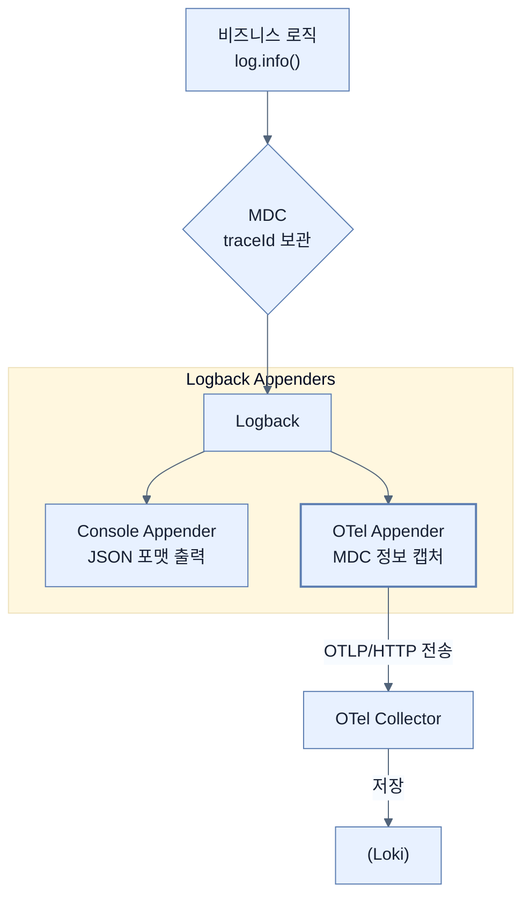

# Structuring logging with Logback, Loki, and Grafana

## 한눈에 보기
| 관점 | 핵심 |
|---|---|
| 이 절의 질문 | 콘솔에 찍히는 단순한 문자열 로그로는 분산 환경에서 검색이나 분석이 불가능하다. 스프링 부트 4에서는 Logback을 이용해 로그를 구조화된 JSON 형태로 만들고, MDC를 통해 트레이스 정보를 주입한 뒤, OpenTelemetry Appender를 달아 OTLP 포맷으로 콜렉터Loki까지 우아하게 쏘아보내는 파이프라… |
| 책에서의 역할 | Chapter 13의 앞뒤 예제를 연결하는 학습 단위 |

## 1. 왜 이게 필요한가

콘솔에 찍히는 단순한 문자열 로그로는 분산 환경에서 검색이나 분석이 불가능하다. 스프링 부트 4에서는 **Logback**을 이용해 로그를 구조화된 JSON 형태로 만들고, **MDC**를 통해 트레이스 정보를 주입한 뒤, **OpenTelemetry Appender**를 달아 OTLP 포맷으로 콜렉터(Loki)까지 우아하게 쏘아보내는 파이프라인을 구축한다.

### 비유로 잡기
관측성은 환자의 상태를 보는 진료와 닮았다. 사건 기록, 수치 추세, 몸 안을 지나간 경로를 함께 봐야 원인을 찾을 수 있다.

→ 비유가 깨지는 지점: 운영 신호는 진단 결과 자체가 아니다. 상관관계가 원인을 보장하지 않으며, 계측 누락과 샘플링이 판단을 왜곡할 수 있다.

### 이 절의 언어
**[[structured-logging]]**(= 사람이 읽는 텍스트 문장이 아닌, 기계(시스템)가 빠르게 검색하고 분석할 수 있도록 JSON 같은 key-value 구조로 로그를 남기는 방식), **[[mdc]]**(= Mapped Diagnostic Context. 현재 실행 중인 스레드에 찰싹 달라붙어 요청자의 ID나 Trace ID 등을 로깅 프레임워크에 넘겨주는 스레드 로컬(ThreadLocal) 저장소), **[[slf4j]]**(= Simple Logging Facade for Java. 직접 로그를 찍는 구현체가 아니라, Logback이나 Log4j 같은 구현체를 언제든 갈아끼울 수 있게 해주는 자바의 표준 로깅 인터페이스)

## 2. 어떻게 동작하는가

먼저 다음 세 축으로 메커니즘을 읽는다.

1. **입력과 전제 확인** — 어떤 요청·설정·데이터가 들어오는지 확인한다. 잘못된 전제를 다음 계층으로 넘기지 않기 위해서다.
2. **Spring 추상화 적용** — 스타터와 자동 구성, 어노테이션 또는 명시적 빈이 실제 처리를 연결한다. 반복 배선보다 도메인 선택에 집중하기 위해서다.
3. **결과와 경계 검증** — 응답·저장 상태·운영 신호를 확인한다. 정상 경로만 보고 장애·버전·성능 차이를 놓치지 않기 위해서다.

### 2.1 왜 구조화된 로그(Structured Logging)인가?
일반 텍스트 로그(`INFO  --- [nio-8080-exec-1] User created: id=123`)는 사람이 읽기는 좋지만, 시스템(Loki, ElasticSearch)이 파싱하고 필터링하기는 매우 어렵다.
스프링 부트 4는 기본적으로 `structured-console-appender`를 지원하여, 로그를 완벽한 JSON 구조로 출력할 수 있다. 이렇게 하면 쿼리(`{service_name="employee-service", level="ERROR"}`)가 획기적으로 빠르고 쉬워진다.

### 2.2 OpenTelemetry Appender와 MDC 결합
스프링 부트의 기본 로그 프레임워크인 Logback에 OpenTelemetry 전용 어펜더(`OpenTelemetryAppender`)를 부착한다.
이 어펜더의 핵심은 애플리케이션의 **MDC(Mapped Diagnostic Context)** 공간에 들어 있는 `traceId`와 `spanId`를 가로채서(Capture) 로그 데이터에 박아 넣는 것이다.
```xml
<!-- logback-spring.xml -->
<appender name="OTEL" class="io.opentelemetry.instrumentation.logback.appender.v1_0.OpenTelemetryAppender">
    <!-- 트레이스와 로그를 영혼결혼식 맺어주는 핵심 설정 -->
    <captureMdcAttributes>traceId,spanId</captureMdcAttributes>
    <captureKeyValuePairAttributes>true</captureKeyValuePairAttributes>
</appender>
```

### 2.3 application.yml과 인프라 연동 설정
스프링 부트가 OTLP 로그를 콜렉터로 쏘게 하려면 약간의 속성(Attribute) 설정이 필요하다.
```yaml
spring:
  application:
    name: employee-service
management:
  opentelemetry:
    resource-attributes:
      service.name: ${spring.application.name} # 모든 로그에 서비스명 메타데이터 부착
      deployment.environment: local
    logging:
      export:
        otlp:
          endpoint: http://localhost:4318/v1/logs # 콜렉터의 OTLP HTTP 엔드포인트
```
이렇게 설정해두면, 개발자는 그저 평소처럼 `log.info("Hello {}!", name)`을 호출하기만 해도, 이 로그가 JSON으로 감싸지고 `traceId`가 박힌 채로 OTel Collector를 거쳐 Loki에 무사히 저장된다.

## 3. 그림으로 보기



![[_assets/learning-spring-boot-4-simplify-the-deve-p390-fig13-4.png]]
> 출처: *Learning Spring Boot 4*, 책 p.365 (그림 13.4). Grafana Loki에서 구조화된 애플리케이션 로그를 조회한 실제 화면.

## 4. 이 노트에 나온 용어
| 용어 | 한 줄 | 자세히 |
|------|-------|--------|
| structured-logging | 사람이 읽는 텍스트 문장이 아닌, 기계(시스템)가 빠르게 검색하고 분석할 수 있도록 JSON 같은 key-value 구조로 로그를 남기는 방식 | [[_glossary#structured-logging]] |
| MDC | Mapped Diagnostic Context. 현재 실행 중인 스레드에 찰싹 달라붙어 요청자의 ID나 Trace ID 등을 로깅 프레임워크에 넘겨주는 스레드 로컬(ThreadLocal) 저장소 | [[_glossary#mdc]] |
| slf4j | Simple Logging Facade for Java. 직접 로그를 찍는 구현체가 아니라, Logback이나 Log4j 같은 구현체를 언제든 갈아끼울 수 있게 해주는 자바의 표준 로깅 인터페이스 | [[_glossary#slf4j]] |

## 5. 자주 헷갈리는 것
- 이 주제의 **Spring 추상화**와 그 아래에서 실제로 동작하는 라이브러리·프로토콜을 같은 것으로 보지 않는다. 추상화는 기본 배선을 줄이지만 하위 계층의 비용과 실패를 없애지 않는다.

## 6. 언제 안 쓰나 / 경계
- 책의 예제는 개념을 드러내기 위한 작은 애플리케이션이다. 운영 환경에서는 인증 정보, 장애 복구, 관측성, 부하와 데이터 규모를 별도로 검증한다.
- 이 노트의 API와 기본값은 책의 Spring Boot 4.1·Java 25 맥락을 따른다. 다른 마이너 버전에서는 공식 마이그레이션 문서와 실제 의존성 버전을 함께 확인한다.

## 7. 연결
- [[02-observability-architecture-with-spring-boot-4]] — 같은 장의 학습 흐름에서 Structuring logging with Logback, Loki, and Grafana의 전제 또는 다음 적용 단계와 연결된다.
- [[04-collecting-and-visualizing-metrics]] — 같은 장의 학습 흐름에서 Structuring logging with Logback, Loki, and Grafana의 전제 또는 다음 적용 단계와 연결된다.

## 8. 스스로 확인
1. 콘솔에 출력되는 로그를 JSON 포맷(Structured Logging)으로 변경했을 때, 로컬 개발 환경의 개발자 입장에서 겪게 되는 불편함은 무엇일까?
2. `OpenTelemetryAppender`가 없다면, 분산 환경에서 특정 사용자의 결제 실패 로그들만 쫙 뽑아서 검색하는 것이 왜 불가능에 가까운지 MDC의 역할과 연관 지어 설명해보자.

<!-- ==== 아래는 내 영역 · 스킬 수정 금지 ==== -->

## 내 설명 시도

## 막혔던 지점

## 리뷰 이력
