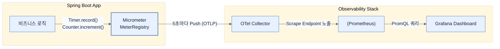

# Collecting and visualizing metrics with Prometheus and Grafana

## 한눈에 보기
| 관점 | 핵심 |
|---|---|
| 이 절의 질문 | 인프라 메트릭CPU, 메모리만으로는 비즈니스 건강 상태를 알 수 없다. 스프링 부트에서는 마이크로미터Micrometer의 MeterRegistry를 주입받아 비즈니스 지표예: 직원 생성 횟수, 처리 시간, 알림 실패율를 직접 기록Timer, Counter할 수 있다. 이 데이터들은 OTLP를 거쳐 프로메테우스Promet… |
| 책에서의 역할 | Chapter 13의 앞뒤 예제를 연결하는 학습 단위 |

## 1. 왜 이게 필요한가

인프라 메트릭(CPU, 메모리)만으로는 비즈니스 건강 상태를 알 수 없다. 스프링 부트에서는 **마이크로미터(Micrometer)**의 `MeterRegistry`를 주입받아 비즈니스 지표(예: 직원 생성 횟수, 처리 시간, 알림 실패율)를 직접 기록(Timer, Counter)할 수 있다. 이 데이터들은 OTLP를 거쳐 **프로메테우스(Prometheus)**에 시계열로 저장되며, 그라파나 대시보드에서 쿼리된다.

### 비유로 잡기
관측성은 환자의 상태를 보는 진료와 닮았다. 사건 기록, 수치 추세, 몸 안을 지나간 경로를 함께 봐야 원인을 찾을 수 있다.

→ 비유가 깨지는 지점: 운영 신호는 진단 결과 자체가 아니다. 상관관계가 원인을 보장하지 않으며, 계측 누락과 샘플링이 판단을 왜곡할 수 있다.

### 이 절의 언어
**[[micrometer]]**(= 스프링 생태계의 메트릭 수집 파사드(Facade)로, 프로메테우스, 데이터독 등 다양한 모니터링 시스템의 규격을 추상화한 라이브러리), **[[prometheus]]**(= 시계열 데이터(Time-Series Data)를 다차원 라벨 기반으로 저장하고 강력한 쿼리 언어(PromQL)를 제공하는 오픈소스 메트릭 서버), **[[meter-registry]]**(= 타이머(Timer), 카운터(Counter), 게이지(Gauge) 등 마이크로미터의 다양한 계측 도구들을 생성하고 관리하는 중앙 저장소 인터페이스)

## 2. 어떻게 동작하는가

먼저 다음 세 축으로 메커니즘을 읽는다.

1. **입력과 전제 확인** — 어떤 요청·설정·데이터가 들어오는지 확인한다. 잘못된 전제를 다음 계층으로 넘기지 않기 위해서다.
2. **Spring 추상화 적용** — 스타터와 자동 구성, 어노테이션 또는 명시적 빈이 실제 처리를 연결한다. 반복 배선보다 도메인 선택에 집중하기 위해서다.
3. **결과와 경계 검증** — 응답·저장 상태·운영 신호를 확인한다. 정상 경로만 보고 장애·버전·성능 차이를 놓치지 않기 위해서다.

### 2.1 인프라 메트릭 vs 비즈니스 메트릭
스프링 부트 액추에이터(Actuator)를 켜면 CPU 사용량이나 HTTP 응답 시간 같은 인프라 메트릭이 기본적으로 수집된다.
하지만 정작 중요한 것은 **"알림 발송에 몇 번 실패했나?"**, **"어떤 직군(Role)의 가입이 가장 많은가?"** 같은 비즈니스 메트릭이다. 이를 위해 애플리케이션 코드 내부에 계측(Instrumentation) 코드를 추가해야 한다.

### 2.2 Micrometer로 비즈니스 메트릭 기록하기
`MeterRegistry`를 주입받아 `Counter`(단순 증가 횟수)와 `Timer`(작업 소요 시간)를 기록할 수 있다.

```java
@Service
public class EmployeeService {
    private final MeterRegistry meterRegistry; // Micrometer의 핵심 레지스트리

    public Employee createEmployee(Employee employee) {
        String role = employee.getRole();
        
        // Timer: 블록 안의 코드 실행 시간을 측정한다.
        return Timer.builder("employee.create.time")
                .description("Time taken to create an employee")
                .tag("role", role) // 다차원 분석을 위한 태그(Tag) 추가
                .register(meterRegistry)
                .record(() -> {
                    Employee saved = employeeRepository.save(employee);
                    
                    // Counter: 직원이 생성될 때마다 1씩 증가시킨다.
                    meterRegistry.counter("employee.created.count", "role", role).increment();
                    return saved;
                });
    }
}
```

### 2.3 태그(Tag/Label)의 강력함
위 코드에서 `"role"`이라는 태그를 붙였다. 만약 태그가 없다면 프로메테우스는 단순히 "전체 직원 생성 횟수"만 알려준다.
태그를 붙이면 `sum by (role) (employee_created_count_total)` 같은 PromQL 쿼리를 통해 엔지니어(ENGINEER)가 몇 명, 매니저(MANAGER)가 몇 명 생성되었는지 **차원을 쪼개서(Dimension)** 분석할 수 있다.

### 2.4 데이터 흐름과 application.yml 설정
수집된 메트릭은 주기적으로(기본 5초) 콜렉터로 밀어낸다(Push).
```yaml
management:
  otlp:
    metrics:
      export:
        enabled: true
        url: http://localhost:4318/v1/metrics
        step: 5s # 5초에 한 번씩 수집된 메트릭을 콜렉터로 쏜다
```
콜렉터는 이를 프로메테우스 포맷으로 변환하여 노출하고, 프로메테우스 서버가 주기적으로 이를 긁어간다(Scrape).

## 3. 그림으로 보기



![[_assets/learning-spring-boot-4-simplify-the-deve-p402-fig13-7.png]]
> 출처: *Learning Spring Boot 4*, 책 p.377 (그림 13.7). 사용자 정의 비즈니스 메트릭을 조합한 Grafana 대시보드.

## 4. 이 노트에 나온 용어
| 용어 | 한 줄 | 자세히 |
|------|-------|--------|
| micrometer | 스프링 생태계의 메트릭 수집 파사드(Facade)로, 프로메테우스, 데이터독 등 다양한 모니터링 시스템의 규격을 추상화한 라이브러리 | [[_glossary#micrometer]] |
| prometheus | 시계열 데이터(Time-Series Data)를 다차원 라벨 기반으로 저장하고 강력한 쿼리 언어(PromQL)를 제공하는 오픈소스 메트릭 서버 | [[_glossary#prometheus]] |
| meter-registry | 타이머(Timer), 카운터(Counter), 게이지(Gauge) 등 마이크로미터의 다양한 계측 도구들을 생성하고 관리하는 중앙 저장소 인터페이스 | [[_glossary#meter-registry]] |

## 5. 자주 헷갈리는 것
- 이 주제의 **Spring 추상화**와 그 아래에서 실제로 동작하는 라이브러리·프로토콜을 같은 것으로 보지 않는다. 추상화는 기본 배선을 줄이지만 하위 계층의 비용과 실패를 없애지 않는다.

## 6. 언제 안 쓰나 / 경계
- 책의 예제는 개념을 드러내기 위한 작은 애플리케이션이다. 운영 환경에서는 인증 정보, 장애 복구, 관측성, 부하와 데이터 규모를 별도로 검증한다.
- 이 노트의 API와 기본값은 책의 Spring Boot 4.1·Java 25 맥락을 따른다. 다른 마이너 버전에서는 공식 마이그레이션 문서와 실제 의존성 버전을 함께 확인한다.

## 7. 연결
- [[03-structuring-logging-with-logback-loki-and-grafana]] — 같은 장의 학습 흐름에서 Collecting and visualizing metrics with Prometheus and Grafana의 전제 또는 다음 적용 단계와 연결된다.
- [[05-tracing-propagation-with-grafana-tempo]] — 같은 장의 학습 흐름에서 Collecting and visualizing metrics with Prometheus and Grafana의 전제 또는 다음 적용 단계와 연결된다.

## 8. 스스로 확인
1. 직원 가입 시 입력받은 '이메일 주소'나 '유저 ID'를 메트릭 태그(Tag)로 넣으면 시스템에 어떤 끔찍한 일(High Cardinality 문제)이 벌어질까?
2. 인프라 메트릭(CPU, Memory)만 띄워둔 대시보드와 비즈니스 메트릭(가입 성공/실패율)을 함께 띄워둔 대시보드는 장애 대응 관점에서 어떤 차이를 만들어낼까?

<!-- ==== 아래는 내 영역 · 스킬 수정 금지 ==== -->

## 내 설명 시도

## 막혔던 지점

## 리뷰 이력
