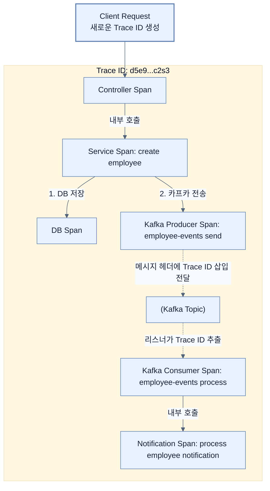

# Tracing propagation with Grafana Tempo

## 한눈에 보기
| 관점 | 핵심 |
|---|---|
| 이 절의 질문 | 분산 시스템에서는 하나의 사용자 요청이 여러 서비스와 메시지 브로커를 핑퐁치며 돌아다닌다. 이 여정을 한눈에 보려면 트레이스 IDTrace ID가 모든 통신 구간을 끊임없이 타고 넘어가야 한다Propagation. 스프링 부트 4의 Micrometer Observation API는 이를 자동으로 처리하며, 수집된 트레이… |
| 책에서의 역할 | Chapter 13의 앞뒤 예제를 연결하는 학습 단위 |

## 1. 왜 이게 필요한가

분산 시스템에서는 하나의 사용자 요청이 여러 서비스와 메시지 브로커를 핑퐁치며 돌아다닌다. 이 여정을 한눈에 보려면 **트레이스 ID(Trace ID)**가 모든 통신 구간을 끊임없이 타고 넘어가야 한다(Propagation). 스프링 부트 4의 **Micrometer Observation API**는 이를 자동으로 처리하며, 수집된 트레이스 데이터는 **Grafana Tempo**에 저장되어 병목 구간을 시각적인 폭포수(Waterfall) 차트로 보여준다.

### 비유로 잡기
관측성은 환자의 상태를 보는 진료와 닮았다. 사건 기록, 수치 추세, 몸 안을 지나간 경로를 함께 봐야 원인을 찾을 수 있다.

→ 비유가 깨지는 지점: 운영 신호는 진단 결과 자체가 아니다. 상관관계가 원인을 보장하지 않으며, 계측 누락과 샘플링이 판단을 왜곡할 수 있다.

### 이 절의 언어
**[[observation-api]]**(= 메트릭 수집 코드와 트레이싱 추적 코드를 분리하지 않고 한 번의 래핑(Wrapping)으로 둘 다 달성하게 해주는 스프링 부트의 통합 계측 API), **[[trace-and-span]]**(= 트레이스는 전체 사용자 요청의 시작부터 끝까지를 아우르는 나무(Tree)이고, 스팬은 그 나무를 구성하는 각각의 가지(단위 작업)를 의미한다), **[[high-low-cardinality]]**(= 카디널리티(Cardinality)는 데이터 값의 다양성을 의미하며, 이메일 주소처럼 값이 다양한 데이터(High)는 시계열 DB를 마비시키므로 태그로 사용해서는 안 된다)

## 2. 어떻게 동작하는가

먼저 다음 세 축으로 메커니즘을 읽는다.

1. **입력과 전제 확인** — 어떤 요청·설정·데이터가 들어오는지 확인한다. 잘못된 전제를 다음 계층으로 넘기지 않기 위해서다.
2. **Spring 추상화 적용** — 스타터와 자동 구성, 어노테이션 또는 명시적 빈이 실제 처리를 연결한다. 반복 배선보다 도메인 선택에 집중하기 위해서다.
3. **결과와 경계 검증** — 응답·저장 상태·운영 신호를 확인한다. 정상 경로만 보고 장애·버전·성능 차이를 놓치지 않기 위해서다.

### 2.1 Trace와 Span의 개념
- **Trace (트레이스)**: 시스템에 들어온 '하나의 사용자 요청 전체'를 의미한다. (가장 큰 범위, 고유한 `Trace ID`를 가짐)
- **Span (스팬)**: 그 요청 안에서 이루어지는 '개별 작업 단위'다. (컨트롤러 실행 ➔ 1번 스팬, DB 쿼리 ➔ 2번 스팬, 카프카 발송 ➔ 3번 스팬). 각 스팬은 시작 시간과 종료 시간을 가지며, 부모 스팬을 참조하여 계층 구조를 이룬다.

### 2.2 Micrometer Observation API 활용
이전 4번 노트에서 메트릭을 기록할 때 `Timer`를 사용했다. 하지만 분산 추적(Tracing)까지 원한다면 `Timer` 대신 **`Observation`**이라는 더 큰 개념의 캡슐로 코드를 감싸야 한다. `Observation`을 쓰면 **메트릭과 트레이스 생성이 동시에 해결**된다.

```java
@Service
public class EmployeeService {
    private final ObservationRegistry observationRegistry;

    public Employee createEmployee(Employee employee) {
        String role = employee.getRole();
        
        // Timer 대신 Observation.createNotStarted()로 스팬(Span)을 만든다.
        return Observation.createNotStarted("employee.create", observationRegistry)
                .contextualName("create employee") // 템포(Tempo) UI에 예쁘게 표시될 이름
                .lowCardinalityKeyValue("employee.role", role) // 안전한 메트릭/트레이스 태그
                .observe(() -> {
                    // 이 안에서 실행되는 로직은 'create employee'라는 하나의 스팬(Span)으로 묶인다.
                    return createEmployeeAndPublishEvent(employee, role);
                });
    }
}
```

### 2.3 Kafka 횡단 추적 활성화 (application.yml)
HTTP 요청뿐만 아니라 카프카 메시지 발행/구독 시에도 트레이스 ID가 끊어지지 않고 이어지도록(Propagate) 스프링 카프카의 Observation 기능을 켜주어야 한다.
```yaml
spring:
  kafka:
    listener:
      observation-enabled: true # 컨슈머 스팬 생성 및 ID 이어받기 허용
    template:
      observation-enabled: true # 프로듀서 스팬 생성 및 메시지 헤더에 ID 심기 허용
management:
  tracing:
    export:
      enabled: true
    sampling:
      probability: 1.0 # 1.0이면 100% 모든 요청 추적 (개발용). 운영에서는 0.01~0.1 수준으로 낮춤
```

### 2.4 High vs Low Cardinality
- **Low Cardinality (저기수성)**: 종류가 몇 개 없는 데이터. (예: `SUCCESS/FAIL`, 직군 `ADMIN/USER`). 메트릭에 집어넣어도 안전하며, 통계를 내기에 적합하다.
- **High Cardinality (고기수성)**: 값이 무한대로 뻗어나가는 데이터. (예: `User ID`, `Email`, `Order ID`). 이걸 메트릭 태그로 쓰면 시계열 DB(Prometheus)가 폭발(OOM)한다. 트레이스(Span)의 상세 속성으로만 제한적으로 사용해야 한다.

## 3. 그림으로 보기



![[_assets/learning-spring-boot-4-simplify-the-deve-p414-fig13-10.png]]
> 출처: *Learning Spring Boot 4*, 책 p.389 (그림 13.10). 하나의 Trace ID로 동기·비동기 작업의 span을 이어 본 실제 Tempo 화면.

## 4. 이 노트에 나온 용어
| 용어 | 한 줄 | 자세히 |
|------|-------|--------|
| observation-api | 메트릭 수집 코드와 트레이싱 추적 코드를 분리하지 않고 한 번의 래핑(Wrapping)으로 둘 다 달성하게 해주는 스프링 부트의 통합 계측 API | [[_glossary#observation-api]] |
| trace-and-span | 트레이스는 전체 사용자 요청의 시작부터 끝까지를 아우르는 나무(Tree)이고, 스팬은 그 나무를 구성하는 각각의 가지(단위 작업)를 의미한다 | [[_glossary#trace-and-span]] |
| high-low-cardinality | 카디널리티(Cardinality)는 데이터 값의 다양성을 의미하며, 이메일 주소처럼 값이 다양한 데이터(High)는 시계열 DB를 마비시키므로 태그로 사용해서는 안 된다 | [[_glossary#high-low-cardinality]] |

## 5. 자주 헷갈리는 것
- 이 주제의 **Spring 추상화**와 그 아래에서 실제로 동작하는 라이브러리·프로토콜을 같은 것으로 보지 않는다. 추상화는 기본 배선을 줄이지만 하위 계층의 비용과 실패를 없애지 않는다.

## 6. 언제 안 쓰나 / 경계
- 책의 예제는 개념을 드러내기 위한 작은 애플리케이션이다. 운영 환경에서는 인증 정보, 장애 복구, 관측성, 부하와 데이터 규모를 별도로 검증한다.
- 이 노트의 API와 기본값은 책의 Spring Boot 4.1·Java 25 맥락을 따른다. 다른 마이너 버전에서는 공식 마이그레이션 문서와 실제 의존성 버전을 함께 확인한다.

## 7. 연결
- [[04-collecting-and-visualizing-metrics]] — 같은 장의 학습 흐름에서 Tracing propagation with Grafana Tempo의 전제 또는 다음 적용 단계와 연결된다.
- [[06-correlating-logs-metrics-and-traces]] — 같은 장의 학습 흐름에서 Tracing propagation with Grafana Tempo의 전제 또는 다음 적용 단계와 연결된다.

## 8. 스스로 확인
1. 카프카 프로듀서가 메시지를 쏠 때, 대체 어떤 마법을 부리길래 카프카 컨슈머 쪽 애플리케이션이 동일한 `Trace ID`를 이어서 스팬을 생성할 수 있을까?
2. `sampling.probability`를 1.0으로 두면 로컬 개발은 좋지만, 초당 1만 건의 결제가 일어나는 대형 커머스의 프로덕션 환경에 그대로 배포하면 시스템 인프라에 어떤 참사가 벌어질까?

<!-- ==== 아래는 내 영역 · 스킬 수정 금지 ==== -->

## 내 설명 시도

## 막혔던 지점

## 리뷰 이력
