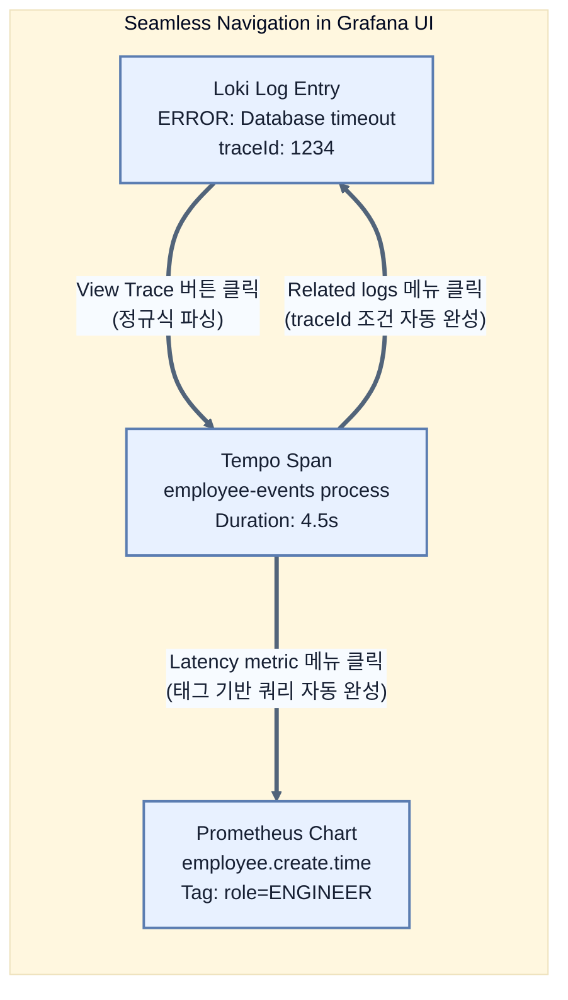

# Correlating logs, metrics, and traces

## 한눈에 보기
| 관점 | 핵심 |
|---|---|
| 이 절의 질문 | 스프링 부트가 내뱉은 로그, 메트릭, 트레이스를 각각 Loki, Prometheus, Tempo에 저장하는 것만으로는 훌륭한 시스템이라고 할 수 없다. 진정한 옵저버빌리티의 완성은 그라파나Grafana 대시보드에서 traceId를 매개체로 이 3가지 데이터소스를 톱니바퀴처럼 서로 연결Correlation하여, 화면 전환… |
| 책에서의 역할 | Chapter 13의 앞뒤 예제를 연결하는 학습 단위 |

## 1. 왜 이게 필요한가

스프링 부트가 내뱉은 로그, 메트릭, 트레이스를 각각 Loki, Prometheus, Tempo에 저장하는 것만으로는 훌륭한 시스템이라고 할 수 없다. 진정한 옵저버빌리티의 완성은 **그라파나(Grafana)** 대시보드에서 **`traceId`**를 매개체로 이 3가지 데이터소스를 톱니바퀴처럼 서로 연결(Correlation)하여, 화면 전환이나 수동 검색 없이 클릭 한 번에 에러 로그에서 병목 스팬(Span)으로, 스팬에서 다시 지표(Metric)로 자유롭게 넘나드는 것이다.

### 비유로 잡기
관측성은 환자의 상태를 보는 진료와 닮았다. 사건 기록, 수치 추세, 몸 안을 지나간 경로를 함께 봐야 원인을 찾을 수 있다.

→ 비유가 깨지는 지점: 운영 신호는 진단 결과 자체가 아니다. 상관관계가 원인을 보장하지 않으며, 계측 누락과 샘플링이 판단을 왜곡할 수 있다.

### 이 절의 언어
**[[correlation]]**(= 독립적으로 수집된 로그, 메트릭, 트레이스 데이터를 traceId나 시스템 태그 같은 공통 속성을 이용해 서로 연결하여 통합된 맥락(Context)을 제공하는 기술), **[[derived-fields]]**(= 그라파나에서 텍스트 로그 내부에 숨어있는 특정 값(Trace ID 등)을 정규식으로 추출하여, 다른 데이터소스로 이동할 수 있는 클릭 가능한 하이퍼링크 필드를 동적으로 생성하는 기능)

## 2. 어떻게 동작하는가

먼저 다음 세 축으로 메커니즘을 읽는다.

1. **입력과 전제 확인** — 어떤 요청·설정·데이터가 들어오는지 확인한다. 잘못된 전제를 다음 계층으로 넘기지 않기 위해서다.
2. **Spring 추상화 적용** — 스타터와 자동 구성, 어노테이션 또는 명시적 빈이 실제 처리를 연결한다. 반복 배선보다 도메인 선택에 집중하기 위해서다.
3. **결과와 경계 검증** — 응답·저장 상태·운영 신호를 확인한다. 정상 경로만 보고 장애·버전·성능 차이를 놓치지 않기 위해서다.

### 2.1 상관관계(Correlation)가 없는 세계의 고통
에러 알림이 울렸다. 
1. 대시보드(Metrics)를 보니 500 에러율이 치솟았다. 
2. 개발자는 로그 탭(Loki)을 열어 시간대를 맞추고 `ERROR`로 텍스트를 검색한다.
3. 수상한 로그를 찾은 뒤, 텍스트 안에 찍힌 `traceId: d5e9...`를 마우스로 드래그해서 복사(`Ctrl+C`)한다.
4. 트레이스 탭(Tempo)을 열고 복사한 ID를 붙여넣기(`Ctrl+V`)해서 어떤 함수가 문제인지 찾는다.
*이 끔찍한 수동 반복 작업을 그라파나의 데이터소스 설정을 통해 완전 자동화할 수 있다.*

### 2.2 Log to Trace (로그에서 트레이스로)
로그 메시지를 보다가 "이 요청 전체 흐름이 궁금한데?" 싶을 때 쓰는 기능이다.
- Loki 데이터소스 설정(`grafana-datasources.yml`)에 **파생 필드(Derived Fields)**를 추가한다.
- 그라파나가 로그 텍스트를 정규식(`"traceId":"([A-Fa-f0-9]+)"`)으로 파싱하여 숨어있는 Trace ID를 추출한다.
- 로그 옆에 마법처럼 **`View Trace`** 버튼이 생기고, 누르면 바로 Tempo 화면으로 넘어가 폭포수(Waterfall) 차트를 보여준다.

### 2.3 Trace to Log / Trace to Metric (트레이스에서 로그와 메트릭으로)
폭포수 차트에서 유독 빨간색으로 오래 걸린 스팬(Span)을 발견했다. "여기서 도대체 무슨 로그가 찍혔지? 이 구간의 5분간 실패율은?" 
- Tempo 데이터소스 설정에 **`tracesToLogsV2`**와 **`tracesToMetrics`**를 구성한다.
- 특정 스팬의 링크 아이콘을 누르면 메뉴가 나타난다.
- **Related logs**를 누르면, 해당 `traceId`로 필터링 된 쿼리가 자동으로 작성되어 Loki 화면이 열린다.
- **Employee creation latency**를 누르면, 스팬에 묻어있던 태그(`service.name`, `role` 등)가 쿼리 조건으로 자동 치환되어 Prometheus 차트가 열린다.

### 2.4 결론: 왜 이 연결이 중요한가?
옵저버빌리티의 목표는 "증상(Symptom)에서 근본 원인(Root Cause)까지 도달하는 시간(MTTR)을 단축하는 것"이다. 애플리케이션 코드는 `Observation API`를 사용해 이미 훌륭하게 `traceId`를 퍼트려 놓았다. 남은 건 그라파나 인프라 설정을 통해 이 데이터들을 실로 꿰어 구슬 목걸이로 만드는 것뿐이다.

## 3. 그림으로 보기

## 4. 이 노트에 나온 용어
| 용어 | 한 줄 | 자세히 |
|------|-------|--------|
| correlation | 독립적으로 수집된 로그, 메트릭, 트레이스 데이터를 `traceId`나 시스템 태그 같은 공통 속성을 이용해 서로 연결하여 통합된 맥락(Context)을 제공하는 기술 | [[_glossary#correlation]] |
| derived-fields | 그라파나에서 텍스트 로그 내부에 숨어있는 특정 값(Trace ID 등)을 정규식으로 추출하여, 다른 데이터소스로 이동할 수 있는 클릭 가능한 하이퍼링크 필드를 동적으로 생성하는 기능 | [[_glossary#derived-fields]] |

## 5. 자주 헷갈리는 것
- 이 주제의 **Spring 추상화**와 그 아래에서 실제로 동작하는 라이브러리·프로토콜을 같은 것으로 보지 않는다. 추상화는 기본 배선을 줄이지만 하위 계층의 비용과 실패를 없애지 않는다.

## 6. 언제 안 쓰나 / 경계
- 책의 예제는 개념을 드러내기 위한 작은 애플리케이션이다. 운영 환경에서는 인증 정보, 장애 복구, 관측성, 부하와 데이터 규모를 별도로 검증한다.
- 이 노트의 API와 기본값은 책의 Spring Boot 4.1·Java 25 맥락을 따른다. 다른 마이너 버전에서는 공식 마이그레이션 문서와 실제 의존성 버전을 함께 확인한다.

## 7. 연결
- [[05-tracing-propagation-with-grafana-tempo]] — 같은 장의 학습 흐름에서 Correlating logs, metrics, and traces의 전제 또는 다음 적용 단계와 연결된다.
- [[04-collecting-and-visualizing-metrics]] — 같은 장의 학습 흐름에서 Correlating logs, metrics, and traces의 전제 또는 다음 적용 단계와 연결된다.

## 8. 스스로 확인
1. 만약 애플리케이션 로그 포맷을 JSON(Structured)이 아니라 옛날 방식인 텍스트 포맷으로 되돌려버린다면, 그라파나의 Correlation 기능 중 어떤 부분이 가장 먼저 망가질까?
2. 트레이스(Tempo) 화면에서 특정 스팬과 관련된 메트릭(Prometheus)으로 넘어갈 때, 단순 `traceId`가 아니라 해당 스팬의 `service.name`이나 `role` 같은 **태그(Tag)**가 쿼리로 자동 변환되어야 하는 이유는 무엇인가?

<!-- ==== 아래는 내 영역 · 스킬 수정 금지 ==== -->

## 내 설명 시도

## 막혔던 지점

## 리뷰 이력
