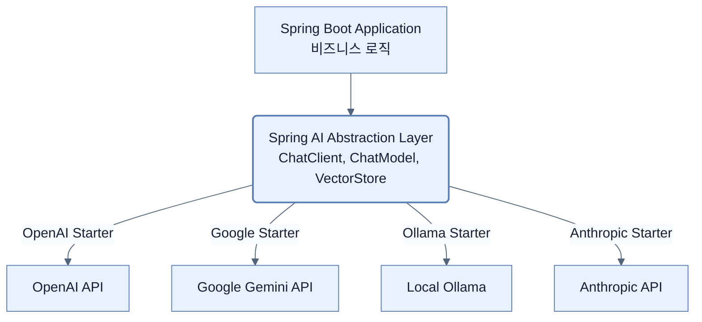

# Introducing LLMs and Spring AI

## 한눈에 보기
| 관점 | 핵심 |
|---|---|
| 이 절의 질문 | 대규모 언어 모델LLM을 엔터프라이즈 애플리케이션에 도입할 때, 특정 벤더OpenAI, Google 등의 전용 SDK에 강하게 결합되면 향후 모델 교체나 확장이 매우 어려워진다. Spring AI는 JPA가 데이터베이스 벤더를 추상화하듯, 여러 AI 벤더들의 공통 개념Prompt, Model, Response을 단일 추… |
| 책에서의 역할 | Chapter 14의 앞뒤 예제를 연결하는 학습 단위 |

## 1. 왜 이게 필요한가

대규모 언어 모델(LLM)을 엔터프라이즈 애플리케이션에 도입할 때, 특정 벤더(OpenAI, Google 등)의 전용 SDK에 강하게 결합되면 향후 모델 교체나 확장이 매우 어려워진다. **Spring AI**는 JPA가 데이터베이스 벤더를 추상화하듯, 여러 AI 벤더들의 공통 개념(Prompt, Model, Response)을 **단일 추상화 레이어**로 제공하여 애플리케이션 코드를 벤더 종속성으로부터 해방시킨다.

### 비유로 잡기
AI 애플리케이션을 사서와 대화하는 과정에 비유하면, 모델은 답을 만들고 검색기는 관련 책을 찾으며 도구는 실제 업무를 수행한다.

→ 비유가 깨지는 지점: 사서는 출처와 권한을 스스로 보장하지만 모델은 그럴 수 없다. 검색 결과와 도구 인자는 반드시 애플리케이션이 검증해야 한다.

### 이 절의 언어
**[[spring-ai]]**(= AI 모델 벤더(Vendor)들의 서로 다른 API 스펙을 하나의 공통 자바 인터페이스로 추상화하여, 벤더 종속성 없이 AI 애플리케이션을 개발할 수 있게 해주는 스프링 생태계 프로젝트), **[[hallucination]]**(= LLM이 자신이 모르는 내용이거나 사실이 아닌 정보에 대해 마치 100% 진실인 것처럼 그럴듯하게 거짓말을 지어내는 현상), **[[context-window]]**(= LLM이 한 번의 상호작용(프롬프트 + 응답)에서 컨텍스트를 잃지 않고 인지하고 처리할 수 있는 최대 텍스트(토큰) 허용량)

## 2. 어떻게 동작하는가

먼저 다음 세 축으로 메커니즘을 읽는다.

1. **입력과 전제 확인** — 어떤 요청·설정·데이터가 들어오는지 확인한다. 잘못된 전제를 다음 계층으로 넘기지 않기 위해서다.
2. **Spring 추상화 적용** — 스타터와 자동 구성, 어노테이션 또는 명시적 빈이 실제 처리를 연결한다. 반복 배선보다 도메인 선택에 집중하기 위해서다.
3. **결과와 경계 검증** — 응답·저장 상태·운영 신호를 확인한다. 정상 경로만 보고 장애·버전·성능 차이를 놓치지 않기 위해서다.

### 2.1 LLM의 핵심 특징과 한계
LLM(Large Language Model)은 수많은 텍스트를 학습하여 확률적으로 다음 단어를 예측하는 시스템이다. 
- **Context Window**: 한 번의 요청/응답에서 모델이 기억할 수 있는 텍스트의 최대 한도.
- **Temperature**: 답변의 창의성과 무작위성을 제어하는 수치 (낮으면 결정적, 높으면 창의적).
- **한계점 (Limitations)**: LLM은 라이브 데이터베이스에 접근할 수 없고, 최신 정보를 모르며, 그럴듯한 거짓말(Hallucination)을 지어낼 위험이 있다.

### 2.2 Spring AI가 해결하는 문제: 벤더 종속성(Vendor Lock-in) 타파
과거에는 OpenAI를 쓰려면 OpenAI SDK를, Google Gemini를 쓰려면 Google SDK를 따로 배워서 연동해야 했다.
Spring AI는 **JPA(Java Persistence API)** 철학을 그대로 가져왔다. 개발자는 Spring AI의 표준 인터페이스(`ChatModel`, `ChatClient`)만 사용해 비즈니스 로직을 짜면 되고, 하위 의존성(Starter)만 갈아 끼우면 코드를 한 줄도 수정하지 않고 OpenAI에서 Anthropic이나 로컬 LLM(Ollama)으로 교체할 수 있다.

### 2.3 Spring AI의 주요 추상화 개념
- **ChatClient**: 마치 `WebClient`나 `RestClient`처럼, LLM과 통신하기 위한 부드러운 플루언트(Fluent) API.
- **Structured Responses**: LLM의 응답은 기본적으로 단순 문자열(String)이지만, Spring AI는 이를 자바 레코드(Record)나 POJO 형태의 JSON 객체로 매핑해주는 강력한 기능을 제공한다.
- **Tool Calling**: LLM이 대답을 하다가 "이건 내 지식으론 모르겠고 서버 DB를 조회해야겠어"라고 판단하면, 개발자가 짜둔 자바 메서드(`@Tool`)를 호출하도록 위임할 수 있다.
- **RAG & Vector Store**: 환각 현상(Hallucination)을 줄이기 위해, 회사 내부 문서를 벡터(Vector) 형태로 저장하고 유사도 검색을 통해 프롬프트에 주입하는 기능.

## 3. 그림으로 보기

## 4. 이 노트에 나온 용어
| 용어 | 한 줄 | 자세히 |
|------|-------|--------|
| spring-ai | AI 모델 벤더(Vendor)들의 서로 다른 API 스펙을 하나의 공통 자바 인터페이스로 추상화하여, 벤더 종속성 없이 AI 애플리케이션을 개발할 수 있게 해주는 스프링 생태계 프로젝트 | [[_glossary#spring-ai]] |
| hallucination | LLM이 자신이 모르는 내용이거나 사실이 아닌 정보에 대해 마치 100% 진실인 것처럼 그럴듯하게 거짓말을 지어내는 현상 | [[_glossary#hallucination]] |
| context-window | LLM이 한 번의 상호작용(프롬프트 + 응답)에서 컨텍스트를 잃지 않고 인지하고 처리할 수 있는 최대 텍스트(토큰) 허용량 | [[_glossary#context-window]] |

## 5. 자주 헷갈리는 것
- 이 주제의 **Spring 추상화**와 그 아래에서 실제로 동작하는 라이브러리·프로토콜을 같은 것으로 보지 않는다. 추상화는 기본 배선을 줄이지만 하위 계층의 비용과 실패를 없애지 않는다.

## 6. 언제 안 쓰나 / 경계
- 책의 예제는 개념을 드러내기 위한 작은 애플리케이션이다. 운영 환경에서는 인증 정보, 장애 복구, 관측성, 부하와 데이터 규모를 별도로 검증한다.
- 이 노트의 API와 기본값은 책의 Spring Boot 4.1·Java 25 맥락을 따른다. 다른 마이너 버전에서는 공식 마이그레이션 문서와 실제 의존성 버전을 함께 확인한다.

## 7. 연결
- [[02-building-llm-integrations-with-chatclient]] — 같은 장의 학습 흐름에서 Introducing LLMs and Spring AI의 전제 또는 다음 적용 단계와 연결된다.
- [[03-designing-prompts-and-tool-calling]] — 같은 장의 학습 흐름에서 Introducing LLMs and Spring AI의 전제 또는 다음 적용 단계와 연결된다.

## 8. 스스로 확인
1. 애플리케이션이 OpenAI에 강하게 결합(Coupled)되었을 때, 회사 정책으로 인해 갑자기 내부망 폐쇄형 로컬 AI(Ollama)로 전환해야 한다면 어떤 일이 벌어질까? Spring AI는 이를 어떻게 방어하는가?
2. AI 모델의 `Temperature` 값을 0.9(높음)로 설정한 '코드 리뷰 봇'과 0.1(낮음)로 설정한 '코드 리뷰 봇'은 각각 어떤 성향의 피드백을 주게 될까?

<!-- ==== 아래는 내 영역 · 스킬 수정 금지 ==== -->

## 내 설명 시도

## 막혔던 지점

## 리뷰 이력
