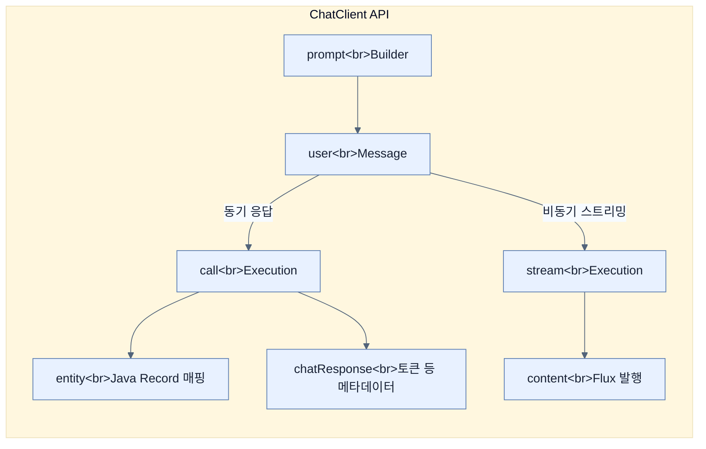

# Building LLM integrations with ChatClient

## 한눈에 보기
| 관점 | 핵심 |
|---|---|
| 이 절의 질문 | 스프링 AI에서 모델과 통신하는 주 진입점은 ChatClient다. ChatClient의 플루언트 API를 사용해 시스템 역할System Prompt을 부여하고, 단순 텍스트뿐만 아니라 구조화된 객체Structured Response로 매핑하여 결과를 받을 수 있다. 또한, 응답이 길어지는 AI의 특성상 WebFlux를… |
| 책에서의 역할 | Chapter 14의 앞뒤 예제를 연결하는 학습 단위 |

## 1. 왜 이게 필요한가

스프링 AI에서 모델과 통신하는 주 진입점은 **`ChatClient`**다. `ChatClient`의 플루언트 API를 사용해 시스템 역할(System Prompt)을 부여하고, 단순 텍스트뿐만 아니라 **구조화된 객체(Structured Response)**로 매핑하여 결과를 받을 수 있다. 또한, 응답이 길어지는 AI의 특성상 WebFlux를 이용한 **리액티브 스트리밍(Reactive Streaming)** 응답도 쉽게 구현할 수 있다.

### 비유로 잡기
AI 애플리케이션을 사서와 대화하는 과정에 비유하면, 모델은 답을 만들고 검색기는 관련 책을 찾으며 도구는 실제 업무를 수행한다.

→ 비유가 깨지는 지점: 사서는 출처와 권한을 스스로 보장하지만 모델은 그럴 수 없다. 검색 결과와 도구 인자는 반드시 애플리케이션이 검증해야 한다.

### 이 절의 언어
**[[chat-client]]**(= 외부 API 호출을 돕는 RestClient처럼, 복잡한 LLM 호출 과정을 빌더 패턴과 체이닝으로 단순화시킨 Spring AI의 핵심 통신 컴포넌트), **[[structured-response]]**(= LLM이 생성한 자연어 텍스트를 애플리케이션이 다루기 쉬운 JSON이나 자바 객체(Record 등) 형태로 강제 변환하여 반환받는 기법), **[[sse]]**(= Server-Sent Events. HTTP 연결을 끊지 않고 유지한 상태에서, 서버가 클라이언트(브라우저) 쪽으로 스트리밍 데이터(AI 응답 토큰 등)를 실시간으로 계속 밀어내는(Push) 웹 기술)

## 2. 어떻게 동작하는가

먼저 다음 세 축으로 메커니즘을 읽는다.

1. **입력과 전제 확인** — 어떤 요청·설정·데이터가 들어오는지 확인한다. 잘못된 전제를 다음 계층으로 넘기지 않기 위해서다.
2. **Spring 추상화 적용** — 스타터와 자동 구성, 어노테이션 또는 명시적 빈이 실제 처리를 연결한다. 반복 배선보다 도메인 선택에 집중하기 위해서다.
3. **결과와 경계 검증** — 응답·저장 상태·운영 신호를 확인한다. 정상 경로만 보고 장애·버전·성능 차이를 놓치지 않기 위해서다.

### 2.1 ChatClient 설정과 기본 통신 (Synchronous)
`ChatClient`는 `RestClient`나 `WebClient`처럼 `Builder`를 이용해 공통 속성을 설정한 뒤 빈(Bean)으로 등록하여 사용한다.
```java
@Bean
ChatClient chatClient(ChatClient.Builder builder) {
    return builder
            .defaultSystem("You are a helpful technical specialist...") // 모든 요청에 공통으로 들어갈 시스템 프롬프트
            .build();
}
```
통신은 매우 직관적이다.
```java
String response = chatClient.prompt()
        .user("What is Spring Boot?") // 유저 프롬프트
        .call()
        .content(); // String으로만 응답 받기
```

### 2.2 메타데이터와 전체 응답 (ChatResponse)
단순 텍스트(`.content()`) 외에, 소모된 토큰(Token)량이나 모델 정보 같은 메타데이터가 필요할 때는 `.chatResponse()`를 호출하여 전체 객체를 받는다.
- `response.getMetadata().getUsage().getTotalTokens()` 처럼 비용 계산을 위한 토큰 사용량을 뽑아낼 수 있다.

### 2.3 구조화된 응답 (Structured Responses)
비즈니스 애플리케이션은 AI의 장황한 줄글보다 정형화된 JSON 데이터(POJO)를 선호한다. 
Spring AI는 프롬프트에 몰래 "JSON 포맷으로 줘"라는 시스템 메시지를 알아서 삽입하고, 응답을 자바 객체(Record)로 디시리얼라이즈(Deserialize) 해주는 강력한 기능을 제공한다.
```java
public record AiAnswer(String title, String explanation, String example) {}

AiAnswer answer = chatClient.prompt()
        .user(question)
        .call()
        .entity(AiAnswer.class); // 마법처럼 자바 객체로 변환되어 반환된다.
```

### 2.4 실시간 스트리밍 (Reactive Streaming)
코딩이나 긴 문서를 요약할 때, AI가 답변을 다 만들 때까지 기다리면(Synchronous) 타임아웃이 나거나 사용자 경험(UX)이 박살 난다.
Spring WebFlux의 `Flux<String>`과 Server-Sent Events(SSE)를 조합하면 한 글자씩 실시간으로 화면에 렌더링할 수 있다.
```java
@GetMapping(value = "/ask/stream", produces = MediaType.TEXT_EVENT_STREAM_VALUE)
public Flux<String> askStream(@RequestParam String question) {
    return chatClient.prompt()
            .user(question)
            .stream() // call() 대신 stream() 사용
            .content();
}
```

## 3. 그림으로 보기



## 4. 이 노트에 나온 용어
| 용어 | 한 줄 | 자세히 |
|------|-------|--------|
| chat-client | 외부 API 호출을 돕는 `RestClient`처럼, 복잡한 LLM 호출 과정을 빌더 패턴과 체이닝으로 단순화시킨 Spring AI의 핵심 통신 컴포넌트 | [[_glossary#chat-client]] |
| structured-response | LLM이 생성한 자연어 텍스트를 애플리케이션이 다루기 쉬운 JSON이나 자바 객체(Record 등) 형태로 강제 변환하여 반환받는 기법 | [[_glossary#structured-response]] |
| sse | Server-Sent Events. HTTP 연결을 끊지 않고 유지한 상태에서, 서버가 클라이언트(브라우저) 쪽으로 스트리밍 데이터(AI 응답 토큰 등)를 실시간으로 계속 밀어내는(Push) 웹 기술 | [[_glossary#sse]] |

## 5. 자주 헷갈리는 것
- 이 주제의 **Spring 추상화**와 그 아래에서 실제로 동작하는 라이브러리·프로토콜을 같은 것으로 보지 않는다. 추상화는 기본 배선을 줄이지만 하위 계층의 비용과 실패를 없애지 않는다.

## 6. 언제 안 쓰나 / 경계
- 책의 예제는 개념을 드러내기 위한 작은 애플리케이션이다. 운영 환경에서는 인증 정보, 장애 복구, 관측성, 부하와 데이터 규모를 별도로 검증한다.
- 이 노트의 API와 기본값은 책의 Spring Boot 4.1·Java 25 맥락을 따른다. 다른 마이너 버전에서는 공식 마이그레이션 문서와 실제 의존성 버전을 함께 확인한다.

## 7. 연결
- [[01-introducing-llms-and-spring-ai]] — 같은 장의 학습 흐름에서 Building LLM integrations with ChatClient의 전제 또는 다음 적용 단계와 연결된다.
- [[03-designing-prompts-and-tool-calling]] — 같은 장의 학습 흐름에서 Building LLM integrations with ChatClient의 전제 또는 다음 적용 단계와 연결된다.

## 8. 스스로 확인
1. AI가 작성해주는 "코드 리뷰 결과"를 프론트엔드 화면에 보여주려 한다. `call().content()` 방식과 `stream().content()` 방식 중 어느 것이 사용자 체감 속도 측면에서 유리하며, 그 이유는 무엇인가?
2. 굳이 복잡하게 `ChatResponse` 객체를 통째로 받아서 메타데이터(Metadata)를 꺼내봐야 하는 비즈니스적인 이유는 무엇일까? (힌트: 돈)

<!-- ==== 아래는 내 영역 · 스킬 수정 금지 ==== -->

## 내 설명 시도

## 막혔던 지점

## 리뷰 이력
