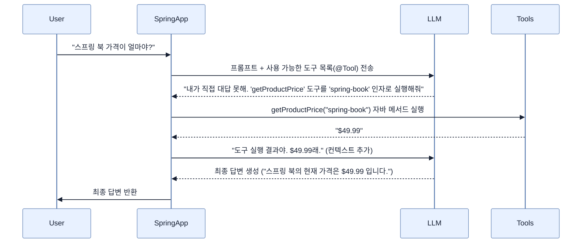

# Designing prompts and tool calling

## 한눈에 보기
| 관점 | 핵심 |
|---|---|
| 이 절의 질문 | 하드코딩된 프롬프트로는 동적인 비즈니스 요구사항을 처리할 수 없다. PromptTemplate을 통해 프롬프트를 외부 파일.st로 분리하여 유지보수성을 높이고, LLM이 애플리케이션의 라이브 데이터예: 현재 시각, 실시간 상품 가격에 접근할 수 있도록 자바 메서드를 쥐여주는 @Tool Tool Calling 기능을 결합… |
| 책에서의 역할 | Chapter 14의 앞뒤 예제를 연결하는 학습 단위 |

## 1. 왜 이게 필요한가

하드코딩된 프롬프트로는 동적인 비즈니스 요구사항을 처리할 수 없다. **`PromptTemplate`**을 통해 프롬프트를 외부 파일(`.st`)로 분리하여 유지보수성을 높이고, LLM이 애플리케이션의 라이브 데이터(예: 현재 시각, 실시간 상품 가격)에 접근할 수 있도록 자바 메서드를 쥐여주는 **`@Tool` (Tool Calling)** 기능을 결합하면 모델의 한계를 돌파할 수 있다.

### 비유로 잡기
AI 애플리케이션을 사서와 대화하는 과정에 비유하면, 모델은 답을 만들고 검색기는 관련 책을 찾으며 도구는 실제 업무를 수행한다.

→ 비유가 깨지는 지점: 사서는 출처와 권한을 스스로 보장하지만 모델은 그럴 수 없다. 검색 결과와 도구 인자는 반드시 애플리케이션이 검증해야 한다.

### 이 절의 언어
**[[prompt-template]]**(= 하드코딩된 프롬프트 문자열 대신, {language} 같은 플레이스홀더를 가진 외부 파일(.st)을 정의하고 런타임에 Map 데이터와 치환하여 완성된 프롬프트를 찍어내는 템플릿 엔진), **[[tool-calling]]**(= 모델 스스로 해결할 수 없는 문제(실시간 데이터 조회, 외부 API 통신 등)를 마주했을 때, 사전에 제공받은 개발자의 함수(Tool)를 역으로 호출하여 결괏값을 받아낸 뒤 답변을 완성하는 AI 추론 기법)

## 2. 어떻게 동작하는가

먼저 다음 세 축으로 메커니즘을 읽는다.

1. **입력과 전제 확인** — 어떤 요청·설정·데이터가 들어오는지 확인한다. 잘못된 전제를 다음 계층으로 넘기지 않기 위해서다.
2. **Spring 추상화 적용** — 스타터와 자동 구성, 어노테이션 또는 명시적 빈이 실제 처리를 연결한다. 반복 배선보다 도메인 선택에 집중하기 위해서다.
3. **결과와 경계 검증** — 응답·저장 상태·운영 신호를 확인한다. 정상 경로만 보고 장애·버전·성능 차이를 놓치지 않기 위해서다.

### 2.1 PromptTemplate과 외부화(Externalization)
자바 소스 코드 안에 `String prompt = "당신은... 유저의 언어는 " + lang + "입니다."` 형태로 문자열을 결합하면 코드가 매우 지저분해진다.
Spring AI는 `.st` (StringTemplate) 형식의 외부 파일을 리소스로 읽어와, 런타임에 동적으로 변수를 바인딩하는 `PromptTemplate` 기능을 제공한다.

```text
// src/main/resources/prompts/code-review.st
You are a senior Java developer.
Review the following {language} code.
Code:
{code}
```
```java
var template = new PromptTemplate(reviewPromptResource); // 리소스 파일 로드
var prompt = template.create(Map.of(
    "language", "Java",
    "code", "SELECT * FROM users"
));
```

### 2.2 Tool Calling (함수 호출)의 마법
LLM은 학습된 시점 이후의 데이터나 회사의 프라이빗 데이터베이스에 접근할 수 없다. "지금 몇 시야?" 또는 "스프링 책 가격이 얼마야?"라는 질문을 받으면 대답할 수 없다.
**Tool Calling**은 이 한계를 우회하는 기술이다.
1. 개발자가 `@Tool` 어노테이션이 붙은 자바 메서드를 만든다.
2. AI에게 질문을 던질 때, "혹시 네가 대답하기 위해 필요한 도구가 있으면 이 자바 메서드들을 써도 좋아"라고 목록을 함께 넘긴다.
3. AI가 판단하길 "아, 가격 정보가 필요하네" 싶으면 답변 대신 **도구 실행 요청**을 응답으로 보낸다.
4. Spring AI가 내부적으로 그 자바 메서드를 실행해서 결과값을 다시 AI에게 몰래(Transparently) 전달한다.
5. AI가 최종적으로 "스프링 책은 49달러입니다."라고 유저에게 대답한다.

```java
@Component
public class ProductTools {
    // LLM이 언제 이 도구를 써야 할지 알 수 있도록 description을 아주 명확하게 적어야 한다.
    @Tool(description = "Returns the current price of a product given its SKU.")
    public String getProductPrice(String sku) {
        return priceService.findPrice(sku); // 라이브 DB 조회
    }
}
```

### 2.3 다중 도구(Multi-Tool) 조합
한 번의 질문에 여러 도구가 필요한 경우에도(예: "현재 시간과, 스프링 책 가격을 알려줘"), LLM은 스스로 판단하여 필요한 도구들을 차례대로 호출(Orchestration)한 뒤 최종 답변을 완성해낸다.
개발자는 그저 `.tools(dateTimeTools, productTools)`로 도구 빈(Bean)들을 넘겨주기만 하면 된다.

## 3. 그림으로 보기



## 4. 이 노트에 나온 용어
| 용어 | 한 줄 | 자세히 |
|------|-------|--------|
| prompt-template | 하드코딩된 프롬프트 문자열 대신, `{language}` 같은 플레이스홀더를 가진 외부 파일(`.st`)을 정의하고 런타임에 Map 데이터와 치환하여 완성된 프롬프트를 찍어내는 템플릿 엔진 | [[_glossary#prompt-template]] |
| tool-calling | 모델 스스로 해결할 수 없는 문제(실시간 데이터 조회, 외부 API 통신 등)를 마주했을 때, 사전에 제공받은 개발자의 함수(Tool)를 역으로 호출하여 결괏값을 받아낸 뒤 답변을 완성하는 AI 추론 기법 | [[_glossary#tool-calling]] |

## 5. 자주 헷갈리는 것
- 이 주제의 **Spring 추상화**와 그 아래에서 실제로 동작하는 라이브러리·프로토콜을 같은 것으로 보지 않는다. 추상화는 기본 배선을 줄이지만 하위 계층의 비용과 실패를 없애지 않는다.

## 6. 언제 안 쓰나 / 경계
- 책의 예제는 개념을 드러내기 위한 작은 애플리케이션이다. 운영 환경에서는 인증 정보, 장애 복구, 관측성, 부하와 데이터 규모를 별도로 검증한다.
- 이 노트의 API와 기본값은 책의 Spring Boot 4.1·Java 25 맥락을 따른다. 다른 마이너 버전에서는 공식 마이그레이션 문서와 실제 의존성 버전을 함께 확인한다.

## 7. 연결
- [[02-building-llm-integrations-with-chatclient]] — 같은 장의 학습 흐름에서 Designing prompts and tool calling의 전제 또는 다음 적용 단계와 연결된다.
- [[04-implementing-rag-with-vector-stores-and-advisors]] — 같은 장의 학습 흐름에서 Designing prompts and tool calling의 전제 또는 다음 적용 단계와 연결된다.

## 8. 스스로 확인
1. `@Tool` 어노테이션에서 메서드의 `description` 속성에 "DB 조회" 같은 모호한 문장 대신 "특정 SKU를 입력받아 현재 상품 가격을 반환한다"처럼 구체적으로 적어야 하는 이유는 무엇인가?
2. 프롬프트를 자바 코드 안에 상수로 두지 않고 `code-review.st` 같은 외부 리소스 파일로 분리했을 때, 비개발자(예: 프롬프트 엔지니어)와의 협업 관점에서 어떤 장점이 생길까?

<!-- ==== 아래는 내 영역 · 스킬 수정 금지 ==== -->

## 내 설명 시도

## 막혔던 지점

## 리뷰 이력
