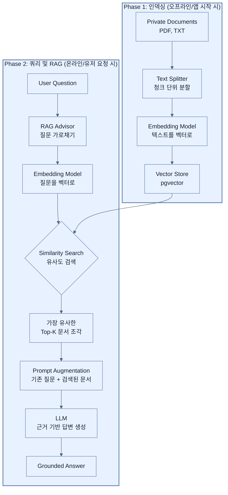

# Implementing RAG with vector stores and advisors

## 한눈에 보기
| 관점 | 핵심 |
|---|---|
| 이 절의 질문 | 사내 매뉴얼, 정책 문서, 과거 계약서 등 LLM이 학습하지 못한 '나만의 프라이빗 데이터'를 바탕으로 답변하게 만드는 기술이 RAG Retrieval-Augmented Generation다. Spring AI는 이 RAG 파이프라인을 구축하기 위해 문서를 읽고Reader 쪼개서Splitter 벡터Vector로 임베딩E… |
| 책에서의 역할 | Chapter 14의 앞뒤 예제를 연결하는 학습 단위 |

## 1. 왜 이게 필요한가

사내 매뉴얼, 정책 문서, 과거 계약서 등 LLM이 학습하지 못한 **'나만의 프라이빗 데이터'**를 바탕으로 답변하게 만드는 기술이 **RAG (Retrieval-Augmented Generation)**다. 
Spring AI는 이 RAG 파이프라인을 구축하기 위해 문서를 읽고(Reader) 쪼개서(Splitter) 벡터(Vector)로 임베딩(Embedding)한 뒤 `pgvector` 같은 저장소에 넣는 **ETL 프로세스**와, 질문이 들어왔을 때 관련 문서를 낚아채서 프롬프트에 몰래 끼워 넣는 **Advisor(인터셉터 역할)** 기능을 제공한다.

### 비유로 잡기
AI 애플리케이션을 사서와 대화하는 과정에 비유하면, 모델은 답을 만들고 검색기는 관련 책을 찾으며 도구는 실제 업무를 수행한다.

→ 비유가 깨지는 지점: 사서는 출처와 권한을 스스로 보장하지만 모델은 그럴 수 없다. 검색 결과와 도구 인자는 반드시 애플리케이션이 검증해야 한다.

### 이 절의 언어
**[[rag]]**(= Retrieval-Augmented Generation. AI에게 질문할 때 질문 내용만 보내는 것이 아니라, 관련된 프라이빗 문서를 검색(Retrieval)해서 프롬프트에 추가(Augmented)하여 답변을 생성(Generation)하는 기술), **[[vector-store]]**(= 텍스트의 의미적 특성을 실수 배열(벡터) 형태로 저장하고, 유저의 질문과 수학적 거리가 가장 가까운(유사한) 문서를 빠르게 찾을 수 있도록 최적화된 데이터베이스 (예: pgvector, Chroma)), **[[advisor]]**(= Spring AI에서 ChatClient의 요청 전/후를 가로채어 공통된 부가 기능(문서 검색 후 프롬프트 주입, 대화 기록 로깅, 이전 대화 내용 주입 등)을 끼워 넣을 수 있게 해주는 인터셉터 패턴 객체)

## 2. 어떻게 동작하는가

먼저 다음 세 축으로 메커니즘을 읽는다.

1. **입력과 전제 확인** — 어떤 요청·설정·데이터가 들어오는지 확인한다. 잘못된 전제를 다음 계층으로 넘기지 않기 위해서다.
2. **Spring 추상화 적용** — 스타터와 자동 구성, 어노테이션 또는 명시적 빈이 실제 처리를 연결한다. 반복 배선보다 도메인 선택에 집중하기 위해서다.
3. **결과와 경계 검증** — 응답·저장 상태·운영 신호를 확인한다. 정상 경로만 보고 장애·버전·성능 차이를 놓치지 않기 위해서다.

### 2.1 RAG (검색 증강 생성)의 필요성
- LLM은 세상의 모든 지식을 학습했지만, **우리 회사의 환불 규정**이나 **이번 주에 올라온 새로운 상품 매뉴얼**은 모른다.
- 모델 자체를 새로 학습(Fine-tuning)시키는 것은 비용과 시간이 너무 많이 든다.
- **RAG**는 사용자가 질문을 하면, 그 질문과 **가장 의미가 비슷한(유사한)** 우리 회사 문서를 먼저 검색한 다음, 그 문서를 LLM에게 주면서 "이 문서 내용을 바탕으로 답변해!"라고 지시하는 패턴이다.

### 2.2 임베딩(Embedding)과 벡터 스토어(Vector Store)
- **임베딩(Embedding)**: 문장(텍스트)을 단순한 문자열이 아니라, 의미(Semantic)를 가진 거대한 실수형 배열(수많은 차원의 벡터)로 변환하는 기술이다. "자동차가 고장 났다"와 "차량이 퍼졌다"는 단어가 달라도 벡터 공간에서는 아주 가깝게(유사하게) 배치된다.
- **벡터 스토어(Vector Store)**: 일반적인 DB가 '정확히 일치하는 단어(Keyword)'를 찾는다면, 벡터 스토어는 '의미가 가장 비슷한 텍스트(근접 이웃)'를 빛의 속도로 찾아내는 특수 데이터베이스다. 본 장에서는 PostgreSQL의 확장 기능인 **`pgvector`**를 사용한다.

### 2.3 ETL 파이프라인 (문서 씹어먹기)
앱 시작 시점에 문서(FAQ.txt 등)를 읽어서 벡터 스토어에 밀어 넣는(Ingestion) 과정이 필요하다.
1. **Reader**: 텍스트, PDF 등을 자바의 `Document` 객체로 읽어 들인다.
2. **Transformer (Splitter)**: 책 한 권 분량을 통째로 임베딩하면 LLM의 문맥(Context) 한도를 초과하므로, 적절한 크기(예: 800 토큰 단위)의 조각(Chunk)으로 쪼갠다.
3. **Writer (VectorStore)**: 쪼개진 텍스트 조각들을 임베딩 모델(OpenAI 등)을 거쳐 벡터로 변환한 뒤, DB에 저장한다.

### 2.4 RetrievalAugmentationAdvisor (어드바이저)
Spring AI의 `Advisor`는 Spring Web의 인터셉터(Interceptor)와 비슷하다.
LLM에게 질문이 날아가는 과정을 중간에 가로채서(Intercept), 질문의 키워드로 벡터 스토어를 검색해 관련 문서 조각 4개(`topK(4)`)를 가져온 뒤, 프롬프트의 백그라운드 지식으로 몰래 집어넣는다.
```java
String reply = chatClient.prompt()
    .user(question) // "환불 규정이 뭐야?"
    .advisors(RetrievalAugmentationAdvisor.builder() // 어드바이저 장착!
        .documentRetriever(VectorStoreDocumentRetriever.builder()
            .vectorStore(vectorStore)
            .topK(4) // 관련 문서 상위 4개만 가져와라
            .build())
        .build())
    .call()
    .content();
```

## 3. 그림으로 보기



## 4. 이 노트에 나온 용어
| 용어 | 한 줄 | 자세히 |
|------|-------|--------|
| rag | Retrieval-Augmented Generation. AI에게 질문할 때 질문 내용만 보내는 것이 아니라, 관련된 프라이빗 문서를 검색(Retrieval)해서 프롬프트에 추가(Augmented)하여 답변을 생성(Generation)하는 기술 | [[_glossary#rag]] |
| vector-store | 텍스트의 의미적 특성을 실수 배열(벡터) 형태로 저장하고, 유저의 질문과 수학적 거리가 가장 가까운(유사한) 문서를 빠르게 찾을 수 있도록 최적화된 데이터베이스 (예: pgvector, Chroma) | [[_glossary#vector-store]] |
| advisor | Spring AI에서 ChatClient의 요청 전/후를 가로채어 공통된 부가 기능(문서 검색 후 프롬프트 주입, 대화 기록 로깅, 이전 대화 내용 주입 등)을 끼워 넣을 수 있게 해주는 인터셉터 패턴 객체 | [[_glossary#advisor]] |

## 5. 자주 헷갈리는 것
- 이 주제의 **Spring 추상화**와 그 아래에서 실제로 동작하는 라이브러리·프로토콜을 같은 것으로 보지 않는다. 추상화는 기본 배선을 줄이지만 하위 계층의 비용과 실패를 없애지 않는다.

## 6. 언제 안 쓰나 / 경계
- 책의 예제는 개념을 드러내기 위한 작은 애플리케이션이다. 운영 환경에서는 인증 정보, 장애 복구, 관측성, 부하와 데이터 규모를 별도로 검증한다.
- 이 노트의 API와 기본값은 책의 Spring Boot 4.1·Java 25 맥락을 따른다. 다른 마이너 버전에서는 공식 마이그레이션 문서와 실제 의존성 버전을 함께 확인한다.

## 7. 연결
- [[03-designing-prompts-and-tool-calling]] — 같은 장의 학습 흐름에서 Implementing RAG with vector stores and advisors의 전제 또는 다음 적용 단계와 연결된다.
- [[05-building-chatbots-and-mcp-integration]] — 같은 장의 학습 흐름에서 Implementing RAG with vector stores and advisors의 전제 또는 다음 적용 단계와 연결된다.

## 8. 스스로 확인
1. 문서를 벡터 스토어에 넣기 전, 굳이 잘게 쪼개는(Split) 과정을 거치지 않고 거대한 PDF 파일 통째로 하나의 임베딩을 만들어 저장하면 검색과 프롬프트 주입 과정에서 어떤 문제가 발생할까?
2. 기존의 전통적인 키워드 검색 엔진(예: Elasticsearch 단순 매칭)과 벡터 스토어 기반의 유사도 검색(Semantic Search)은 어떤 차이점이 있는가? "차가 안 움직여요"라는 질문으로 "엔진 고장 시 대처법" 문서를 찾을 수 있는 이유는 무엇인가?

<!-- ==== 아래는 내 영역 · 스킬 수정 금지 ==== -->

## 내 설명 시도

## 막혔던 지점

## 리뷰 이력
