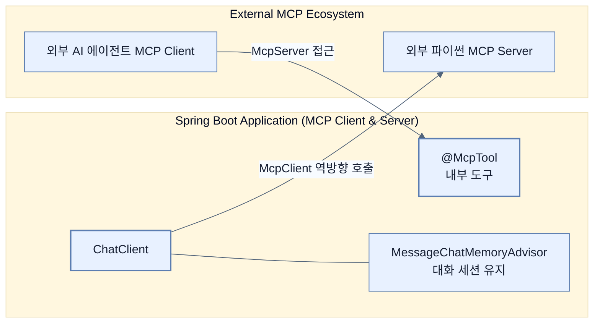

# Building chatbots and MCP integration

## 한눈에 보기
| 관점 | 핵심 |
|---|---|
| 이 절의 질문 | LLM의 API 호출은 근본적으로 상태가 없는Stateless 단발성 요청이다. 연속적인 대화를 나누는 챗봇Chatbot을 만들려면 과거의 대화 기록Memory을 매번 프롬프트에 주입해야 하며, Spring AI는 이를 MessageChatMemoryAdvisor로 우아하게 해결한다. 더 나아가, 내 애플리케이션에 있는… |
| 책에서의 역할 | Chapter 14의 앞뒤 예제를 연결하는 학습 단위 |

## 1. 왜 이게 필요한가

LLM의 API 호출은 근본적으로 상태가 없는(Stateless) 단발성 요청이다. 연속적인 대화를 나누는 **챗봇(Chatbot)**을 만들려면 과거의 대화 기록(Memory)을 매번 프롬프트에 주입해야 하며, Spring AI는 이를 `MessageChatMemoryAdvisor`로 우아하게 해결한다. 
더 나아가, 내 애플리케이션에 있는 `@Tool`을 외부 AI 에이전트가 호출할 수 있게 표준 규격으로 열어두거나 반대로 다른 AI 서버의 도구를 내가 가져다 쓰는 기술이 **MCP (Model Context Protocol)** 다.

### 비유로 잡기
AI 애플리케이션을 사서와 대화하는 과정에 비유하면, 모델은 답을 만들고 검색기는 관련 책을 찾으며 도구는 실제 업무를 수행한다.

→ 비유가 깨지는 지점: 사서는 출처와 권한을 스스로 보장하지만 모델은 그럴 수 없다. 검색 결과와 도구 인자는 반드시 애플리케이션이 검증해야 한다.

### 이 절의 언어
**[[message-window-chat-memory]]**(= 이전 대화 내역 전체를 무한정 저장하지 않고, 가장 최근에 주고받은 특정 갯수(또는 크기)의 윈도우(Window)만큼만 잘라서 메모리에 유지하는 챗봇 컨텍스트 관리 기법), **[[mcp]]**(= Model Context Protocol. 서로 다른 프레임워크나 언어로 만들어진 AI 애플리케이션 간에 툴(도구)과 데이터 리소스를 표준화된 규격으로 공유하고 호출할 수 있게 해주는 공용 프로토콜)

## 2. 어떻게 동작하는가

먼저 다음 세 축으로 메커니즘을 읽는다.

1. **입력과 전제 확인** — 어떤 요청·설정·데이터가 들어오는지 확인한다. 잘못된 전제를 다음 계층으로 넘기지 않기 위해서다.
2. **Spring 추상화 적용** — 스타터와 자동 구성, 어노테이션 또는 명시적 빈이 실제 처리를 연결한다. 반복 배선보다 도메인 선택에 집중하기 위해서다.
3. **결과와 경계 검증** — 응답·저장 상태·운영 신호를 확인한다. 정상 경로만 보고 장애·버전·성능 차이를 놓치지 않기 위해서다.

### 2.1 챗봇을 위한 메모리 유지 (MessageChatMemoryAdvisor)
사용자가 "내일 제주도 날씨 어때?"라고 묻고, 이어지는 두 번째 질문으로 "거기 맛집은 어딨어?"라고 물었을 때, LLM은 '거기'가 제주도인지 알 방법이 없다(Stateless).
과거 대화 내역(Context)을 저장해두고 다음 질문 때 몰래 같이 보내주는 역할(메모리 주입)이 필요하다.
- **MessageWindowChatMemory**: 전체 대화 기록을 다 보내면 토큰 비용이 폭발하므로, 가장 최근 N개의 메시지 창(Window)만 유지하는 전략을 쓴다.
- **InMemoryChatMemoryRepository**: 대화 기록을 단순히 서버의 인메모리에 저장한다 (운영 환경에서는 Redis 등 외부 DB 기반 레포지토리로 교체 가능).
- **MessageChatMemoryAdvisor**: 이전 질문과 답변들을 꺼내서 현재 프롬프트에 주입해주는 어드바이저다. `conversationId`를 키 값으로 세션을 식별한다.

### 2.2 Model Context Protocol (MCP)의 등장 배경
`@Tool`로 만든 "우리 회사 상품 가격 조회" 기능은 내 Spring 앱 내부의 ChatClient만 호출할 수 있다. 만약 다른 팀이 만든 파이썬 기반 AI 에이전트가 우리 회사의 이 도구를 가져다 쓰고 싶다면 어떻게 해야 할까?
과거에는 서로 API 규격을 맞추고 연동 코드를 짜느라 골치를 썩었지만, 이제 **MCP**라는 벤더 중립적 표준 프로토콜이 생겼다. MCP를 통하면 AI 시스템끼리 도구(Tools), 리소스(Resources), 프롬프트(Prompts)를 공용어처럼 서로 주고받을 수 있다.

### 2.3 Spring AI의 MCP Server와 Client
- **MCP Server**: 내 스프링 애플리케이션을 MCP 서버로 띄운다. `@McpTool` 어노테이션을 붙여 기능을 정의하고 `spring-ai-starter-mcp-server-webmvc`를 추가하면, 내 앱의 메서드들이 SSE(Server-Sent Events)나 Streamable HTTP 같은 표준 전송 규격을 통해 외부로 노출된다.
- **MCP Client**: 외부의 MCP 서버(예: 로컬 파일 시스템 제어, 날씨 서비스 등)가 제공하는 툴들을 동적으로 긁어와(Discover) 내 `ChatClient`에 탑재한다.
```java
// 외부 MCP 서버의 도구들을 내 ChatClient에 장착!
String reply = chatClient.prompt()
    .user("저쪽 팀 서버의 상품 가격 조회해서 알려줘")
    .toolCallbacks(toolCallbackProvider.getToolCallbacks())
    .call()
    .content();
```

## 3. 그림으로 보기



## 4. 이 노트에 나온 용어
| 용어 | 한 줄 | 자세히 |
|------|-------|--------|
| message-window-chat-memory | 이전 대화 내역 전체를 무한정 저장하지 않고, 가장 최근에 주고받은 특정 갯수(또는 크기)의 윈도우(Window)만큼만 잘라서 메모리에 유지하는 챗봇 컨텍스트 관리 기법 | [[_glossary#message-window-chat-memory]] |
| mcp | Model Context Protocol. 서로 다른 프레임워크나 언어로 만들어진 AI 애플리케이션 간에 툴(도구)과 데이터 리소스를 표준화된 규격으로 공유하고 호출할 수 있게 해주는 공용 프로토콜 | [[_glossary#mcp]] |

## 5. 자주 헷갈리는 것
- 이 주제의 **Spring 추상화**와 그 아래에서 실제로 동작하는 라이브러리·프로토콜을 같은 것으로 보지 않는다. 추상화는 기본 배선을 줄이지만 하위 계층의 비용과 실패를 없애지 않는다.

## 6. 언제 안 쓰나 / 경계
- 책의 예제는 개념을 드러내기 위한 작은 애플리케이션이다. 운영 환경에서는 인증 정보, 장애 복구, 관측성, 부하와 데이터 규모를 별도로 검증한다.
- 이 노트의 API와 기본값은 책의 Spring Boot 4.1·Java 25 맥락을 따른다. 다른 마이너 버전에서는 공식 마이그레이션 문서와 실제 의존성 버전을 함께 확인한다.

## 7. 연결
- [[04-implementing-rag-with-vector-stores-and-advisors]] — 같은 장의 학습 흐름에서 Building chatbots and MCP integration의 전제 또는 다음 적용 단계와 연결된다.
- [[06-operating-llm-applications-security-and-evaluation]] — 같은 장의 학습 흐름에서 Building chatbots and MCP integration의 전제 또는 다음 적용 단계와 연결된다.

## 8. 스스로 확인
1. `InMemoryChatMemoryRepository`를 운영(Production) 서버(특히 다중 인스턴스로 오토 스케일링되는 클라우드 환경)에 그대로 배포했을 때 발생할 수 있는 치명적인 버그는 무엇인가?
2. 일반적인 REST API를 열어서 다른 팀에게 연동하라고 문서(Swagger 등)를 주는 것과, MCP 서버 형태로 툴을 노출(`@McpTool`)하는 것은 외부 AI 시스템 입장에서 어떤 차별적 장점이 있는가?

<!-- ==== 아래는 내 영역 · 스킬 수정 금지 ==== -->

## 내 설명 시도

## 막혔던 지점

## 리뷰 이력
