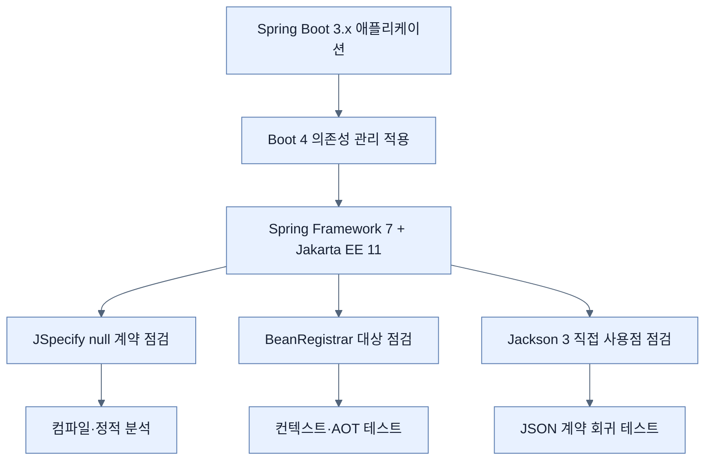

# Core framework changes in Spring Boot 4

## 한눈에 보기

| 변화 | 개발자가 확인할 곳 |
|---|---|
| Spring Framework 7·Jakarta EE 11 기반 | Servlet 6.1, Persistence 3.2, Validation 3.1과 전이 의존성 |
| JSpecify null 계약 | `org.springframework.lang`에서 JSpecify 어노테이션으로 이동 |
| `BeanRegistrar` | 조건·반복이 있는 프로그램 방식 빈 등록 |
| Jackson 3 우선 | 패키지·좌표·커스터마이저·설정 속성의 호환성 |

## 1. 왜 이게 필요한가

Spring Boot 3 애플리케이션을 4로 올렸는데 소스의 비즈니스 로직은 그대로인데도 import, JSON 커스터마이저, null 경고, 테스트가 한꺼번에 깨질 수 있다. Boot 버전 숫자 하나가 바뀐 것이 아니라 기반 프레임워크와 Jakarta 사양, JSON 라이브러리의 세대가 함께 이동하기 때문이다.

**[[spring-framework-7]]**(= Spring Boot 4가 기반으로 삼는 프레임워크 세대), **[[jakarta-ee-11]]**(= Servlet·Persistence·Validation 등의 표준 묶음), **[[jspecify]]**(= 도구 중립적인 Java null 계약 어노테이션), **[[bean-registrar]]**(= 초기화 시점에 빈 정의를 프로그램으로 등록하는 API), **[[jackson-3]]**(= Spring Boot 4가 우선 사용하는 JSON 처리 세대)를 각각 다른 마이그레이션 축으로 본다.

### 비유로 잡기

플랫폼 업그레이드는 건물의 간판만 바꾸는 일이 아니라 전기 규격, 배관 연결구, 소방 규정을 한 번에 최신 규격으로 바꾸는 공사와 비슷하다. 각 방의 가구는 그대로여도 연결 지점에서 문제가 드러난다.

→ 비유가 깨지는 지점: 소프트웨어 의존성은 물리 규격처럼 한 번에 전환되지 않는다. Jackson 2 호환 모듈처럼 구세대와 신세대를 한동안 함께 운용할 수 있어 경계가 더 복잡하다.

## 2. 어떻게 동작하는가

1. **기반 스택을 먼저 올린다** — Boot 4가 관리하는 Spring Framework 7과 Jakarta EE 11 버전 조합을 기준으로 전이 의존성을 정렬하기 위해서다.
2. **null 계약을 JSpecify로 이동한다** — IDE와 정적 분석기가 파라미터·반환값의 null 가능성을 같은 모델로 해석하게 하기 위해서다. 기존 Spring 전용 어노테이션을 사용했다면 `@NullMarked`, `@Nullable` 등의 새 계약을 검토한다.
3. **조건부 프로그램 등록은 `BeanRegistrar`로 표현한다** — 환경 값, 반복, 조건에 따라 여러 빈을 만드는 코드를 낮은 수준의 후처리기보다 명시적으로 드러내 AOT 분석에도 유리하게 하기 위해서다.
4. **Jackson 직접 사용 지점을 찾는다** — Boot의 의존성 관리만 썼다면 자동 이동이 많지만, 직접 좌표·import·serializer·mixin·`ObjectMapper` 커스터마이저를 사용한 곳은 깨질 수 있기 때문이다.
5. **Jackson 3 이름과 속성을 바꾼다** — 대다수 패키지가 `tools.jackson`으로 이동하고, `@JsonComponent` 계열과 빌더 커스터마이저, `spring.jackson.json.*` 설정 구조가 바뀌기 때문이다. `jackson-annotations`는 주요 예외로 남는다.
6. **호환 모드를 임시 다리로만 사용한다** — Jackson 2 지원과 `spring.jackson.use-jackson2-defaults`는 점진 이전에 도움이 되지만 장기 목표는 3의 기본 동작에 맞추는 것이다.

## 3. 그림으로 보기

## 4. 이 노트에 나온 용어

| 용어 | 한 줄 | 자세히 |
|---|---|---|
| spring-framework-7 | Spring Boot 4의 핵심 컨테이너·웹 기반 프레임워크 세대 | [[_glossary#spring-framework-7]] |
| jakarta-ee-11 | Boot 4 런타임이 맞추는 Jakarta 표준 세대 | [[_glossary#jakarta-ee-11]] |
| jspecify | Java API의 null 가능성을 표현하는 표준화 어노테이션 모델 | [[_glossary#jspecify]] |
| bean-registrar | 조건과 반복을 코드로 표현하는 프로그램 방식 빈 등록 API | [[_glossary#bean-registrar]] |
| jackson-3 | 패키지와 기본 동작에 호환성 변화가 있는 JSON 라이브러리 세대 | [[_glossary#jackson-3]] |

## 5. 자주 헷갈리는 것

- **Boot 자동 구성 변경 vs 라이브러리 자체 변경** — JSON 문제가 Boot 설정 때문인지 Jackson 3 API·기본값 때문인지 먼저 나눈다.
- **`BeanRegistrar` vs 일반 `@Bean`** — 고정된 몇 개의 빈은 `@Bean`이 더 읽기 쉽다. 조건·반복·재사용 가능한 인프라 등록에서 `BeanRegistrar`의 가치가 커진다.

## 6. 언제 안 쓰나 / 경계

- 새 API가 생겼다고 모든 설정 클래스를 `BeanRegistrar`로 다시 쓸 필요는 없다.
- JSpecify는 런타임 null 검사를 자동으로 넣는 도구가 아니라 계약을 표현해 도구가 분석하도록 돕는 모델이다.
- Jackson 2 호환 지원은 아직 이전하지 못한 라이브러리를 위한 과도기 수단이다. 같은 애플리케이션에서 2와 3의 타입을 혼동하지 않도록 경계를 명시한다.

## 7. 연결

- [[01-renamed-and-restructured-starters]] — 기반 프레임워크 변경 다음에는 더 명시적으로 분리된 스타터 의존성을 정리해야 한다.
- [[02-web-api-and-security-changes]] — Jackson 3과 null 계약 변화가 웹 API의 직렬화·버전 계약에 직접 나타난다.

## 8. 스스로 확인

1. Spring Boot 의존성 관리만 사용한 애플리케이션과 Jackson 좌표·serializer를 직접 관리한 애플리케이션의 마이그레이션 위험이 다른 이유는 무엇인가?
2. `BeanRegistrar`가 `BeanDefinitionRegistryPostProcessor`보다 AOT 방향에 잘 맞는 이유를 설명할 수 있는가?
3. JSpecify 어노테이션을 붙였는데도 런타임에서 `NullPointerException`이 발생할 수 있는 이유는 무엇인가?

<!-- ==== 아래는 내 영역 · 스킬 수정 금지 ==== -->

## 내 설명 시도

## 막혔던 지점

## 리뷰 이력
