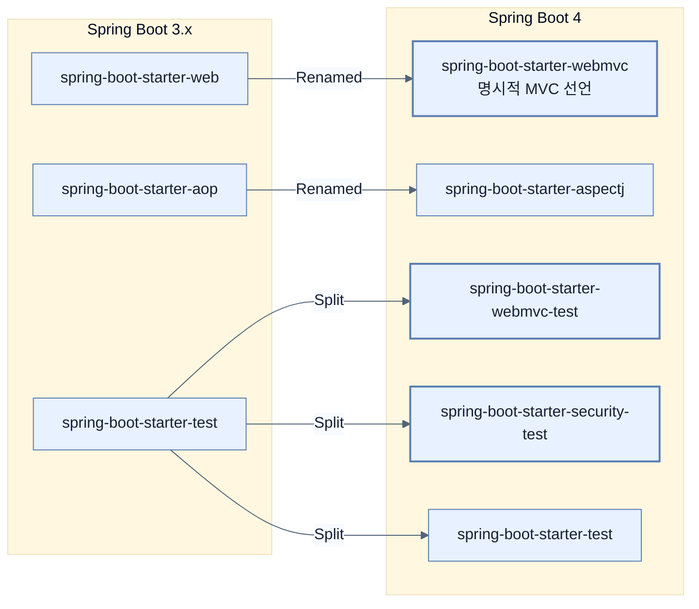

# Renamed and restructured starters

## 한눈에 보기
| 관점 | 핵심 |
|---|---|
| 이 절의 질문 | Spring Boot 4는 애플리케이션이 사용하는 기술 스택을 보다 명시적Explicit으로 선언하도록 유도하기 위해, 기존의 광범위했던Broad 스타터Starter 의존성들을 분리하고 이름을 변경했다. 특히 가장 많이 쓰이던 spring-boot-starter-web이 spring-boot-starter-webmvc로… |
| 책에서의 역할 | Chapter 15의 앞뒤 예제를 연결하는 학습 단위 |

## 1. 왜 이게 필요한가

Spring Boot 4는 애플리케이션이 사용하는 기술 스택을 보다 **명시적(Explicit)**으로 선언하도록 유도하기 위해, 기존의 광범위했던(Broad) 스타터(Starter) 의존성들을 분리하고 이름을 변경했다. 
특히 가장 많이 쓰이던 `spring-boot-starter-web`이 `spring-boot-starter-webmvc`로 이름이 바뀐 점이 가장 큰 변화다.

### 비유로 잡기
웹 계층은 주문 창구와 비슷하다. 요청을 받아 형식을 확인하고, 알맞은 작업자에게 넘긴 뒤 HTML이나 JSON으로 결과를 돌려준다.

→ 비유가 깨지는 지점: 실제 HTTP 요청은 한 창구에서 끝나지 않는다. 필터, 보안, 직렬화, 예외 변환과 네트워크 경계가 함께 작동한다.

### 이 절의 언어
**[[starter]]**(= 개발자가 복잡한 라이브러리 의존성 버전을 일일이 맞추지 않도록, 특정 목적(예: 웹 개발, DB 연결)에 필요한 의존성들을 한 덩어리로 묶어놓은 Spring Boot의 편리한 의존성 패키지), **[[classic-starter]]**(= Spring Boot 4의 깐깐해진 명시적 의존성 선언 규칙 때문에 3.x에서 마이그레이션하기 힘든 개발자들을 위해 제공되는, 과거의 관대한(Broad) 의존성 묶음을 그대로 제공하는 임시 스타터)

## 2. 어떻게 동작하는가

먼저 다음 세 축으로 메커니즘을 읽는다.

1. **입력과 전제 확인** — 어떤 요청·설정·데이터가 들어오는지 확인한다. 잘못된 전제를 다음 계층으로 넘기지 않기 위해서다.
2. **Spring 추상화 적용** — 스타터와 자동 구성, 어노테이션 또는 명시적 빈이 실제 처리를 연결한다. 반복 배선보다 도메인 선택에 집중하기 위해서다.
3. **결과와 경계 검증** — 응답·저장 상태·운영 신호를 확인한다. 정상 경로만 보고 장애·버전·성능 차이를 놓치지 않기 위해서다.

### 2.1 Web 계층 스타터의 분리
Spring Boot 3.x까지는 서블릿 기반의 Spring MVC 애플리케이션을 만들 때 무조건 `spring-boot-starter-web`을 사용했다. 
하지만 이름만 봐서는 이것이 서블릿 기반(MVC)인지 리액티브 기반(WebFlux)인지 헷갈리는 문제가 있었다. Spring Boot 4는 이 구분을 명확히 했다.
- `spring-boot-starter-web` ➡️ **`spring-boot-starter-webmvc`** (이름 변경)
- `spring-boot-starter-webflux` (유지)

### 2.2 기타 주요 스타터 이름 변경
애플리케이션이 사용하는 기술의 경계를 명확히 하기 위해 다양한 스타터 이름이 변경되었다.
- `spring-boot-starter-web-services` ➡️ **`spring-boot-starter-webservices`**
- `spring-boot-starter-aop` ➡️ **`spring-boot-starter-aspectj`**

### 2.3 암묵적 자동 구성에서 명시적 스타터 선언으로
과거에는 라이브러리(Jar)만 클래스패스에 존재하면 Spring Boot가 알아서 자동 구성(Auto-configuration)을 켜주는 경우가 많았다. 
이제는 해당 기술을 사용하려면 **전용 스타터를 명시적으로 선언**해야 한다.
- 예: Flyway 마이그레이션을 사용할 경우, 단순히 `flyway-core` 의존성만 추가하는 것이 아니라 **`spring-boot-starter-flyway`**를 반드시 선언해야 한다.

### 2.4 테스트 스타터의 모듈화
과거 `spring-boot-starter-test` 하나에 뭉쳐있던 테스트 관련 인프라들도 각 기술별로 쪼개졌다. (테스트에 불필요한 의존성이 끌려오는 것을 방지)
- **`spring-boot-starter-webmvc-test`**
- **`spring-boot-starter-webflux-test`**
- **`spring-boot-starter-security-test`**

### 2.5 마이그레이션을 돕는 Classic Starter
갑작스러운 변경으로 인한 마이그레이션 부담을 줄이기 위해, 이전 Spring Boot 3.x의 스타일과 유사하게 넓은 범위를 커버하는 **클래식 스타터**가 임시로 제공된다.
- `spring-boot-starter-classic`
- `spring-boot-starter-test-classic`
- 단, 이는 어디까지나 마이그레이션 과도기용이므로, 신규 프로젝트나 장기 유지보수를 위해서는 명시적(Focused) 스타터를 사용하는 것이 권장된다.

## 3. 그림으로 보기

## 4. 이 노트에 나온 용어
| 용어 | 한 줄 | 자세히 |
|------|-------|--------|
| starter | 개발자가 복잡한 라이브러리 의존성 버전을 일일이 맞추지 않도록, 특정 목적(예: 웹 개발, DB 연결)에 필요한 의존성들을 한 덩어리로 묶어놓은 Spring Boot의 편리한 의존성 패키지 | [[_glossary#starter]] |
| classic-starter | Spring Boot 4의 깐깐해진 명시적 의존성 선언 규칙 때문에 3.x에서 마이그레이션하기 힘든 개발자들을 위해 제공되는, 과거의 관대한(Broad) 의존성 묶음을 그대로 제공하는 임시 스타터 | [[_glossary#classic-starter]] |

## 5. 자주 헷갈리는 것
- 이 주제의 **Spring 추상화**와 그 아래에서 실제로 동작하는 라이브러리·프로토콜을 같은 것으로 보지 않는다. 추상화는 기본 배선을 줄이지만 하위 계층의 비용과 실패를 없애지 않는다.

## 6. 언제 안 쓰나 / 경계
- 책의 예제는 개념을 드러내기 위한 작은 애플리케이션이다. 운영 환경에서는 인증 정보, 장애 복구, 관측성, 부하와 데이터 규모를 별도로 검증한다.
- 이 노트의 API와 기본값은 책의 Spring Boot 4.1·Java 25 맥락을 따른다. 다른 마이너 버전에서는 공식 마이그레이션 문서와 실제 의존성 버전을 함께 확인한다.

## 7. 연결
- [[00-core-framework-changes]] — 기반 프레임워크와 Jackson 세대 변경 위에서 스타터 구성이 더 세분화된다.
- [[02-web-api-and-security-changes]] — 같은 장의 학습 흐름에서 Renamed and restructured starters의 전제 또는 다음 적용 단계와 연결된다.

## 8. 스스로 확인
1. Spring Boot 4에서 `spring-boot-starter-web`을 `spring-boot-starter-webmvc`로 이름을 바꾼 가장 결정적인 철학적 이유는 무엇일까? (힌트: `spring-boot-starter-webflux`와의 관계)
2. 기존에 Flyway를 쓰던 애플리케이션을 Spring Boot 4로 올렸더니 갑자기 DB 마이그레이션이 돌지 않는다. `pom.xml`에는 `flyway-core`가 멀쩡히 들어있다. 원인이 무엇일까?

<!-- ==== 아래는 내 영역 · 스킬 수정 금지 ==== -->

## 내 설명 시도

## 막혔던 지점

## 리뷰 이력
