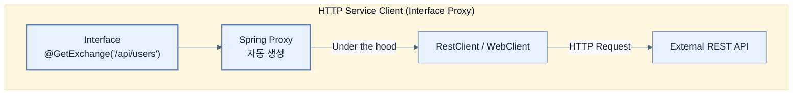

# Web, API, and Security changes

## 한눈에 보기
| 관점 | 핵심 |
|---|---|
| 이 절의 질문 | Spring Boot 4는 Spring Framework 7과 Spring Security 7의 강력한 기능들을 흡수했다. 특히 가장 주목할 만한 웹 계층의 변화는 API 버저닝Versioning 공식 지원, 인터페이스 기반의 선언적 HTTP Service Client, 그리고 오래된 서블릿 컨테이너인 Undertow의… |
| 책에서의 역할 | Chapter 15의 앞뒤 예제를 연결하는 학습 단위 |

## 1. 왜 이게 필요한가

Spring Boot 4는 **Spring Framework 7**과 **Spring Security 7**의 강력한 기능들을 흡수했다. 특히 가장 주목할 만한 웹 계층의 변화는 **API 버저닝(Versioning)** 공식 지원, 인터페이스 기반의 선언적 **HTTP Service Client**, 그리고 오래된 서블릿 컨테이너인 **Undertow의 지원 중단**이다.

### 비유로 잡기
보안 계층은 건물의 출입 체계와 비슷하다. 신분 확인, 출입구별 권한, 내부 금고의 소유권 검사가 서로 다른 문에서 반복된다.

→ 비유가 깨지는 지점: 웹 보안은 물리 출입처럼 한 번 확인하고 끝나지 않는다. 요청마다 컨텍스트와 토큰, 세션, 데이터 소유권을 다시 판단한다.

### 이 절의 언어
**[[api-versioning]]**(= 클라이언트 하위 호환성을 유지하기 위해 URL이나 헤더를 통해 API의 버전을 관리하는 기법 (예: v1, v2)), **[[http-service-proxy]]**(= RestClient 코드를 직접 짤 필요 없이, 인터페이스에 @GetExchange 같은 애노테이션만 붙여두면 스프링이 런타임에 HTTP 통신 코드를 대신 작성(프록시 생성)해주는 선언적 통신 기술)

## 2. 어떻게 동작하는가

먼저 다음 세 축으로 메커니즘을 읽는다.

1. **입력과 전제 확인** — 어떤 요청·설정·데이터가 들어오는지 확인한다. 잘못된 전제를 다음 계층으로 넘기지 않기 위해서다.
2. **Spring 추상화 적용** — 스타터와 자동 구성, 어노테이션 또는 명시적 빈이 실제 처리를 연결한다. 반복 배선보다 도메인 선택에 집중하기 위해서다.
3. **결과와 경계 검증** — 응답·저장 상태·운영 신호를 확인한다. 정상 경로만 보고 장애·버전·성능 차이를 놓치지 않기 위해서다.

### 2.1 API 버저닝 (API Versioning) 기본 탑재
이전까지 스프링에서 `/api/v1/...` 같은 버저닝을 하려면 개발자가 직접 URI를 파싱하거나 커스텀 애노테이션을 만들어야 했다.
Spring Framework 7부터는 API 버저닝이 공식 지원되며, Spring Boot 4가 이를 자동 구성해준다.
- **다양한 전략 지원**: URL 경로, 쿼리 파라미터, 헤더, Media Type 등 원하는 곳에서 버전을 추출할 수 있다. (`ApiVersionStrategy`)
- **Deprecation Hints**: 특정 버전의 API가 곧 종료될 예정(Sunset)임을 응답 헤더(`ApiVersionDeprecationHandler`)를 통해 클라이언트에게 우아하게 알려줄 수 있다.
- 설정 파일에서 `spring.mvc.apiversion.*` (또는 `spring.webflux.apiversion.*`) 로 쉽게 켤 수 있다.

### 2.2 선언적 HTTP 서비스 클라이언트 (Interface Proxies)
MSA 환경에서 다른 서버의 API를 호출할 때마다 `RestClient`나 `WebClient` 코드를 반복해서 짜는 것은 고역이다.
이제 자바 **인터페이스(Interface)**만 선언하고 `@GetExchange`, `@PostExchange` 애노테이션만 붙여두면, 스프링이 런타임에 **동적 프록시(Proxy)**를 만들어 실제 HTTP 호출 구현체를 주입해준다 (마치 Spring Data JPA가 인터페이스만으로 DB 쿼리를 만들어주는 것과 똑같은 원리다).

### 2.3 정적 리소스(Static Resources) 경로 변경: Fonts 디렉토리
보안 설정 시 흔히 사용하는 `PathRequest#toStaticResources().atCommonLocations()`의 기본 경로에 `/fonts/**` 가 새롭게 추가되었다. 
- WOFF, WOFF2, TTF 같은 웹 폰트 파일들을 `src/main/resources/static/fonts/`에 넣으면 다른 정적 자원(CSS, JS)과 동일한 보안(인증 무시) 혜택을 받는다.

### 2.4 Undertow 컨테이너 지원 중단
Spring Boot 4는 서블릿 스펙의 최소 기준을 **Servlet 6.1**로 올렸다.
하지만 JBoss의 `Undertow` 컨테이너는 아직 Servlet 6.1을 지원하지 못하기 때문에, Spring Boot 4에서는 **Undertow 지원이 완전히 제거**되었다.
- 기존에 Undertow를 쓰던 프로젝트는 **Tomcat**이나 **Jetty**로 마이그레이션해야 한다.

### 2.5 Security 7: 최신 보안 스펙 강제
- `WebSecurityConfigurerAdapter` 모델이 완전히 삭제되고, 이제 무조건 **`SecurityFilterChain` 빈(Bean) 등록 방식**만 사용해야 한다.
- OAuth 2.1 스펙 정비, PKCE 기본 적용, Authorization Server 통합 등 최신 보안 트렌드가 기본값으로 적용되었다.

## 3. 그림으로 보기

## 4. 이 노트에 나온 용어
| 용어 | 한 줄 | 자세히 |
|------|-------|--------|
| api-versioning | 클라이언트 하위 호환성을 유지하기 위해 URL이나 헤더를 통해 API의 버전을 관리하는 기법 (예: v1, v2) | [[_glossary#api-versioning]] |
| http-service-proxy | `RestClient` 코드를 직접 짤 필요 없이, 인터페이스에 `@GetExchange` 같은 애노테이션만 붙여두면 스프링이 런타임에 HTTP 통신 코드를 대신 작성(프록시 생성)해주는 선언적 통신 기술 | [[_glossary#http-service-proxy]] |

## 5. 자주 헷갈리는 것
- 이 주제의 **Spring 추상화**와 그 아래에서 실제로 동작하는 라이브러리·프로토콜을 같은 것으로 보지 않는다. 추상화는 기본 배선을 줄이지만 하위 계층의 비용과 실패를 없애지 않는다.

## 6. 언제 안 쓰나 / 경계
- 책의 예제는 개념을 드러내기 위한 작은 애플리케이션이다. 운영 환경에서는 인증 정보, 장애 복구, 관측성, 부하와 데이터 규모를 별도로 검증한다.
- 이 노트의 API와 기본값은 책의 Spring Boot 4.1·Java 25 맥락을 따른다. 다른 마이너 버전에서는 공식 마이그레이션 문서와 실제 의존성 버전을 함께 확인한다.

## 7. 연결
- [[01-renamed-and-restructured-starters]] — 같은 장의 학습 흐름에서 Web, API, and Security changes의 전제 또는 다음 적용 단계와 연결된다.
- [[03-data-layer-and-testing-changes]] — 같은 장의 학습 흐름에서 Web, API, and Security changes의 전제 또는 다음 적용 단계와 연결된다.

## 8. 스스로 확인
1. MSA 환경에서 5개의 다른 마이크로서비스 API를 호출해야 할 때, 기존처럼 `RestClient`를 5번 직접 구현하는 것 대비 '선언적 HTTP 서비스 클라이언트(Interface Proxies)'를 사용하면 유지보수 관점에서 어떤 점이 압도적으로 유리할까?
2. 기존에 가벼운 서블릿 컨테이너로 Undertow를 애용하던 회사다. Spring Boot 4로 업그레이드하면서 서버 부팅이 실패하고 클래스를 찾을 수 없다는 에러가 난다. 해결책은 무엇인가?

<!-- ==== 아래는 내 영역 · 스킬 수정 금지 ==== -->

## 내 설명 시도

## 막혔던 지점

## 리뷰 이력
