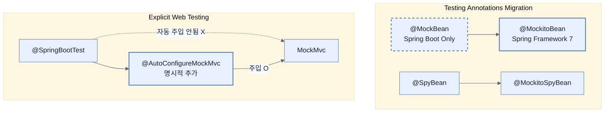

# Data layer and testing changes

## 한눈에 보기
| 관점 | 핵심 |
|---|---|
| 이 절의 질문 | Spring Boot 4의 데이터 계층은 Hibernate 7과 Jakarta Persistence 3.2로 업그레이드되며 모듈화Modularization가 진행되었다. 테스트 계층에서는 Spring Boot 전용 어노테이션이었던 @MockBean이 폐기되고 Spring Framework 7 표준인 @MockitoBea… |
| 책에서의 역할 | Chapter 15의 앞뒤 예제를 연결하는 학습 단위 |

## 1. 왜 이게 필요한가

Spring Boot 4의 데이터 계층은 **Hibernate 7**과 **Jakarta Persistence 3.2**로 업그레이드되며 모듈화(Modularization)가 진행되었다. 테스트 계층에서는 Spring Boot 전용 어노테이션이었던 `@MockBean`이 폐기되고 Spring Framework 7 표준인 **`@MockitoBean`**으로 통폐합되었으며, HTTP 엔드포인트 테스트를 위한 **RestTestClient**가 새로 추가되었다.

### 비유로 잡기
테스트를 공연 전 리허설에 비유할 수 있다. 작은 장면부터 실제 무대와 가까운 통합 리허설까지 범위를 넓혀 실패 위치를 좁힌다.

→ 비유가 깨지는 지점: 리허설이 실제 운영과 완전히 같지는 않다. 모의 객체와 임베디드 DB는 실제 네트워크·드라이버·컨테이너의 차이를 숨길 수 있다.

### 이 절의 언어
**[[hibernate-7]]**(= 자바 진영의 표준 ORM인 JPA 3.2 스펙을 구현한 최신 하이버네이트 버전), **[[mockitobean]]**(= (구 @MockBean) 스프링 통합 테스트 시 ApplicationContext 안에 들어있는 실제 객체 대신 Mockito가 만든 가짜(Mock) 객체를 주입시켜 특정 컴포넌트의 동작을 고립(Isolation) 테스트하게 해주는 애노테이션), **[[testcontainers]]**(= 로컬에 DB나 인프라를 직접 설치할 필요 없이, JUnit 테스트가 실행될 때 도커(Docker) 컨테이너를 띄워서 통합 테스트를 수행하고 끝나면 자동으로 지워주는 자바 라이브러리)

## 2. 어떻게 동작하는가

먼저 다음 세 축으로 메커니즘을 읽는다.

1. **입력과 전제 확인** — 어떤 요청·설정·데이터가 들어오는지 확인한다. 잘못된 전제를 다음 계층으로 넘기지 않기 위해서다.
2. **Spring 추상화 적용** — 스타터와 자동 구성, 어노테이션 또는 명시적 빈이 실제 처리를 연결한다. 반복 배선보다 도메인 선택에 집중하기 위해서다.
3. **결과와 경계 검증** — 응답·저장 상태·운영 신호를 확인한다. 정상 경로만 보고 장애·버전·성능 차이를 놓치지 않기 위해서다.

### 2.1 데이터 계층 모듈화 (spring-boot-persistence)
스프링 부트 내부적으로 흩어져 있던 데이터 영속성 관련 코드들이 `spring-boot-persistence`라는 독립 모듈로 뭉쳤다.
- 이에 따라 엔티티 패키지를 지정하는 `@EntityScan` 어노테이션의 패키지 경로가 변경되었다.
  - (구) `org.springframework.boot.autoconfigure.domain.EntityScan`
  - (신) **`org.springframework.boot.persistence.autoconfigure.EntityScan`**
- `spring.dao.exceptiontranslation.enabled` 속성이 `spring.persistence.exceptiontranslation.enabled`로 이름이 변경되었다.

### 2.2 Hibernate 7 & NoSQL 변경 사항
- **Hibernate 7**: JPA 3.2 스펙을 구현하는 최신 하이버네이트가 탑재되었다. 리포지토리 인터페이스나 쿼리 메서드 등 99%의 코드는 그대로 작동하지만, 정적 메타모델 생성기(Static Metamodel Generator)를 쓰는 프로젝트는 Maven/Gradle의 Annotation Processor 설정을 업데이트해야 한다.
- **Elasticsearch**: `RestClient` 기반의 구형 로우레벨 통신이 제거되고, 최신 Apache HttpClient 5 기반의 **`Rest5Client`**로 전면 교체되었다.
- **MongoDB**: Spring Data Mongo와 순수 Mongo Java Driver를 위한 설정 속성명들이 명확하게 분리되었다. (예: `spring.data.mongodb.host` ➡️ `spring.mongodb.host`)

### 2.3 테스트 계층: @MockBean의 퇴장과 @MockitoBean의 등장
기존에 스프링 컨텍스트 안의 특정 빈(Bean)을 가짜 객체(Mock)로 바꿔치기 할 때 썼던 `@MockBean` / `@SpyBean`은 스프링 부트 '전용' 애노테이션이었다.
Spring Framework 7부터 이 기능이 코어 프레임워크 수준으로 편입되면서, 표준 이름인 **`@MockitoBean`**과 **`@MockitoSpyBean`**으로 통일되었다. 
기존 테스트 코드는 임포트(import) 경로와 애노테이션 이름만 바꿔주면 완벽히 똑같이 작동한다.

### 2.4 RestTestClient와 테스트 컨테이너 2.x
- **RestTestClient**: Spring Framework 6에서 등장한 테스트용 HTTP 클라이언트로, `MockMvc`에 바인딩하여 서버를 띄우지 않고도 API를 통합 테스트할 수 있는 깔끔한(Fluent) 단언(Assertion) API를 제공한다.
- **Testcontainers 2.x**: 도커를 이용한 통합 테스트 도구인 Testcontainers의 의존성 관리 버전이 2.x로 올라갔다. 일부 모듈의 아티팩트 ID 이름이 바뀌었으므로(예: `postgresql` ➡️ `testcontainers-postgresql`), `pom.xml`이나 `build.gradle`의 이름을 갱신해야 한다. (자바 소스 코드의 `import`는 거의 안 바뀜)

### 2.5 명시적인 Web Test 자동 구성
기존에는 `@SpringBootTest`를 붙이면 웹 환경을 테스트할 수 있는 `MockMvc`나 `WebTestClient`를 몰래(자동으로) 띄워주는 경우가 있었다.
이제는 웹 테스트 도구가 필요하다면 반드시 **명시적(Explicit)**으로 어노테이션을 붙여야만 주입된다. (불필요한 컨텍스트 로딩을 방지해 테스트 속도 향상)
- `@AutoConfigureMockMvc`
- `@AutoConfigureTestRestTemplate`
- `@AutoConfigureWebTestClient`

## 3. 그림으로 보기

## 4. 이 노트에 나온 용어
| 용어 | 한 줄 | 자세히 |
|------|-------|--------|
| hibernate-7 | 자바 진영의 표준 ORM인 JPA 3.2 스펙을 구현한 최신 하이버네이트 버전 | [[_glossary#hibernate-7]] |
| @mockitobean | (구 `@MockBean`) 스프링 통합 테스트 시 ApplicationContext 안에 들어있는 실제 객체 대신 Mockito가 만든 가짜(Mock) 객체를 주입시켜 특정 컴포넌트의 동작을 고립(Isolation) 테스트하게 해주는 애노테이션 | [[_glossary#mockitobean]] |
| testcontainers | 로컬에 DB나 인프라를 직접 설치할 필요 없이, JUnit 테스트가 실행될 때 도커(Docker) 컨테이너를 띄워서 통합 테스트를 수행하고 끝나면 자동으로 지워주는 자바 라이브러리 | [[_glossary#testcontainers]] |

## 5. 자주 헷갈리는 것
- 이 주제의 **Spring 추상화**와 그 아래에서 실제로 동작하는 라이브러리·프로토콜을 같은 것으로 보지 않는다. 추상화는 기본 배선을 줄이지만 하위 계층의 비용과 실패를 없애지 않는다.

## 6. 언제 안 쓰나 / 경계
- 책의 예제는 개념을 드러내기 위한 작은 애플리케이션이다. 운영 환경에서는 인증 정보, 장애 복구, 관측성, 부하와 데이터 규모를 별도로 검증한다.
- 이 노트의 API와 기본값은 책의 Spring Boot 4.1·Java 25 맥락을 따른다. 다른 마이너 버전에서는 공식 마이그레이션 문서와 실제 의존성 버전을 함께 확인한다.

## 7. 연결
- [[02-web-api-and-security-changes]] — 같은 장의 학습 흐름에서 Data layer and testing changes의 전제 또는 다음 적용 단계와 연결된다.
- [[04-observability-native-image-and-other-changes]] — 같은 장의 학습 흐름에서 Data layer and testing changes의 전제 또는 다음 적용 단계와 연결된다.

## 8. 스스로 확인
1. 수천 개의 유닛 테스트가 존재하는 프로젝트에서, 컨트롤러 테스트 코드 상단의 `@SpringBootTest`에 `@AutoConfigureMockMvc`를 명시적으로 붙이도록 설계가 변경된 이유는 무엇일까? (힌트: 테스트 실행 속도와 불필요한 빈 로딩)
2. JPA 엔티티 클래스들이 들어있는 패키지를 스프링에게 알려주는 `@EntityScan`의 `import` 구문에서 컴파일 에러가 발생했다. 어떻게 수정해야 하는가?

<!-- ==== 아래는 내 영역 · 스킬 수정 금지 ==== -->

## 내 설명 시도

## 막혔던 지점

## 리뷰 이력
