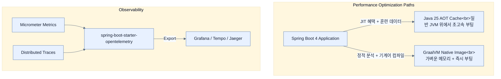

# Observability, Native Image, and other changes

## 한눈에 보기
| 관점 | 핵심 |
|---|---|
| 이 절의 질문 | Spring Boot 4는 관측성Observability을 OpenTelemetry 중심으로 재편하여 분산 시스템 모니터링을 더 쉽게 만들었다. 또한 성능 최적화를 위해 Java 25의 AOT Cache와 GraalVM Native Image 지원을 고도화하여 애플리케이션의 시작 속도Startup Time를 극적으로 단… |
| 책에서의 역할 | Chapter 15의 앞뒤 예제를 연결하는 학습 단위 |

## 1. 왜 이게 필요한가

Spring Boot 4는 관측성(Observability)을 **OpenTelemetry** 중심으로 재편하여 분산 시스템 모니터링을 더 쉽게 만들었다. 또한 성능 최적화를 위해 **Java 25의 AOT Cache**와 **GraalVM Native Image** 지원을 고도화하여 애플리케이션의 시작 속도(Startup Time)를 극적으로 단축시켰다.

### 비유로 잡기
관측성은 환자의 상태를 보는 진료와 닮았다. 사건 기록, 수치 추세, 몸 안을 지나간 경로를 함께 봐야 원인을 찾을 수 있다.

→ 비유가 깨지는 지점: 운영 신호는 진단 결과 자체가 아니다. 상관관계가 원인을 보장하지 않으며, 계측 누락과 샘플링이 판단을 왜곡할 수 있다.

### 이 절의 언어
**[[opentelemetry]]**(= (OTel) 애플리케이션의 메트릭, 분산 추적, 로그를 수집하여 모니터링 시스템(Grafana, Datadog 등)으로 전송하기 위한 벤더 중립적인 오픈소스 표준 규격), **[[task-decorator]]**(= 비동기 쓰레드 풀(TaskExecutor)로 작업을 던질 때, 원본 쓰레드에 있던 중요한 컨텍스트(Security, MDC, Trace ID 등)를 대상 쓰레드로 안전하게 복사(전파)해주는 스프링의 인터페이스), **[[aot-cache]]**(= Ahead-Of-Time Cache. JVM 애플리케이션의 초기 구동(클래스 로딩, JIT 컴파일 등) 비용을 줄이기 위해, 첫 실행 시의 상태를 디스크에 캐싱해두고 다음 실행부터는 이를 재사용해 스타트업 시간을 줄여주는 최신 Java 스펙)

## 2. 어떻게 동작하는가

먼저 다음 세 축으로 메커니즘을 읽는다.

1. **입력과 전제 확인** — 어떤 요청·설정·데이터가 들어오는지 확인한다. 잘못된 전제를 다음 계층으로 넘기지 않기 위해서다.
2. **Spring 추상화 적용** — 스타터와 자동 구성, 어노테이션 또는 명시적 빈이 실제 처리를 연결한다. 반복 배선보다 도메인 선택에 집중하기 위해서다.
3. **결과와 경계 검증** — 응답·저장 상태·운영 신호를 확인한다. 정상 경로만 보고 장애·버전·성능 차이를 놓치지 않기 위해서다.

### 2.1 관측성(Observability)과 OpenTelemetry
MSA 환경에서 메트릭(Metrics)과 분산 추적(Traces)을 OTLP(OpenTelemetry Protocol)로 수집하는 것이 업계 표준이 되었다.
- **`spring-boot-starter-opentelemetry`**: 기존에는 OTLP로 데이터를 쏘기 위해 여러 복잡한 의존성들을 일일이 조합해야 했으나, 이제 이 전용 스타터 하나만 추가하면 모든 SDK와 익스포터(Exporter)가 자동 구성된다.
- **다중 `TaskDecorator` 지원**: 비동기 쓰레드(`@Async`)로 넘어가면 기존 쓰레드의 추적 ID(Trace ID)나 로그인 정보(Security Context)가 유실된다. 이를 막기 위해 쓰레드 간 데이터를 복사해주는 래퍼(Wrapper)가 `TaskDecorator`인데, Spring Boot 4는 여러 개의 데코레이터를 동시에(`CompositeTaskDecorator`) 걸 수 있게 개선했다.
- **Actuator Health Probes**: 쿠버네티스(Kubernetes) 환경에서만 기본으로 열리던 Liveness/Readiness 헬스 체크 엔드포인트가, 이제 환경과 무관하게 **항상 기본으로 활성화(Enabled by default)** 된다.

### 2.2 GraalVM Native Image와 Java AOT Cache
애플리케이션이 뜨는 속도는 클라우드 환경(Scale-out, Serverless)에서 돈과 직결된다.
- **GraalVM Native Image 25+**: 리플렉션과 동적 프록시가 난무하는 스프링 앱을, 빌드 타임에 미리 정적으로 분석(AOT Processing)하여 초고속으로 부팅되는 기계어 바이너리로 만들어주는 기술이 더욱 정교해졌다.
- **Java AOT Cache (Java 24+)**: 네이티브 이미지는 빌드 시간이 너무 오래 걸리고 런타임 최적화(JIT)의 혜택을 잃는다는 단점이 있다. Java 24부터 도입된 AOT Cache는 일반적인 JVM 위에서 돌되, **'첫 부팅 시의 훈련(Training) 데이터'**를 캐시에 구워두고 다음 부팅부터는 그 캐시를 읽어 압도적인 속도로 켜지게 해주는 하이브리드 최적화 기술이다.

### 2.3 메시징, 배치 및 기타 변경 사항
- **Spring Retry 내재화**: 기존에 독립된 외부 라이브러리(`spring-retry`)에 의존하던 재시도(Retry) 로직이 Spring Framework 6 코어 내부로 흡수되었다. `@Retryable`을 수동으로 썼던 곳은 의존성 충돌이나 설정 이름 변경(예: 카프카 `backoff.random` ➡️ `backoff.jitter`)에 유의해야 한다.
- **Spring Batch 6 (In-memory Mode)**: 스프링 배치 테스트나 단순 실행 시 반드시 DB(JobRepository)가 있어야 했던 귀찮은 제약이 사라지고, DB 없이 램(RAM)에서만 도는 **인메모리 모드**가 기본값이 되었다. (앱이 꺼지면 배치 이력은 증발함)
- **제거된 기능들 (Deprecations Removed)**: 
  - DevTools의 브라우저 LiveReload 기본 비활성화.
  - Spock(Groovy) 테스트 프레임워크 공식 연동 제거.
  - 임베디드 쉘 실행 스크립트(`fully executable jar`) 제거.
  - Spring Session의 Hazelcast, MongoDB 전용 자동 구성 코드가 Spring Boot 코어에서 빠지고 해당 벤더(팀)에게 관리 권한이 넘어감.

## 3. 그림으로 보기

## 4. 이 노트에 나온 용어
| 용어 | 한 줄 | 자세히 |
|------|-------|--------|
| opentelemetry | (OTel) 애플리케이션의 메트릭, 분산 추적, 로그를 수집하여 모니터링 시스템(Grafana, Datadog 등)으로 전송하기 위한 벤더 중립적인 오픈소스 표준 규격 | [[_glossary#opentelemetry]] |
| task-decorator | 비동기 쓰레드 풀(TaskExecutor)로 작업을 던질 때, 원본 쓰레드에 있던 중요한 컨텍스트(Security, MDC, Trace ID 등)를 대상 쓰레드로 안전하게 복사(전파)해주는 스프링의 인터페이스 | [[_glossary#task-decorator]] |
| aot-cache | Ahead-Of-Time Cache. JVM 애플리케이션의 초기 구동(클래스 로딩, JIT 컴파일 등) 비용을 줄이기 위해, 첫 실행 시의 상태를 디스크에 캐싱해두고 다음 실행부터는 이를 재사용해 스타트업 시간을 줄여주는 최신 Java 스펙 | [[_glossary#aot-cache]] |

## 5. 자주 헷갈리는 것
- 이 주제의 **Spring 추상화**와 그 아래에서 실제로 동작하는 라이브러리·프로토콜을 같은 것으로 보지 않는다. 추상화는 기본 배선을 줄이지만 하위 계층의 비용과 실패를 없애지 않는다.

## 6. 언제 안 쓰나 / 경계
- 책의 예제는 개념을 드러내기 위한 작은 애플리케이션이다. 운영 환경에서는 인증 정보, 장애 복구, 관측성, 부하와 데이터 규모를 별도로 검증한다.
- 이 노트의 API와 기본값은 책의 Spring Boot 4.1·Java 25 맥락을 따른다. 다른 마이너 버전에서는 공식 마이그레이션 문서와 실제 의존성 버전을 함께 확인한다.

## 7. 연결
- [[03-data-layer-and-testing-changes]] — 같은 장의 학습 흐름에서 Observability, Native Image, and other changes의 전제 또는 다음 적용 단계와 연결된다.
- [[02-web-api-and-security-changes]] — 같은 장의 학습 흐름에서 Observability, Native Image, and other changes의 전제 또는 다음 적용 단계와 연결된다.

## 8. 스스로 확인
1. 쿠버네티스(K8s) 환경이 아닌 단순 리눅스 VM(EC2 등)에 애플리케이션을 배포했을 때, Spring Boot 3와 4에서 `/actuator/health/liveness` 엔드포인트의 접근 가능 여부는 어떻게 달라지는가?
2. 기존에 아주 복잡한 쿼리가 도는 Spring Batch 프로젝트를 만들었다. Spring Boot 4로 올린 뒤 배치 작업이 실패하고 재시작하려고 하니 어제 작업했던 Job 이력이 아예 남아있지 않다. 원인이 무엇이며 어떻게(어떤 스타터를 추가하여) 해결해야 하는가?

<!-- ==== 아래는 내 영역 · 스킬 수정 금지 ==== -->

## 내 설명 시도

## 막혔던 지점

## 리뷰 이력
