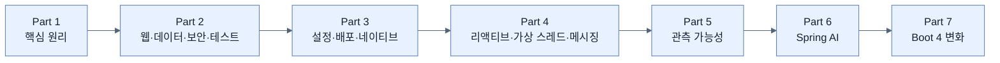

# Learning Spring Boot 4 — PDF 기반 학습 노트

이 저장소는 *Learning Spring Boot 4*의 본문을 처음부터 다시 읽어 정리한 학습 노트다. 기존 `spring-boot-notes`, `spring-boot-4-notes`, `spring-boot-4-complete-notes`의 본문을 재사용하지 않는다. 기존 폴더에서는 **Part → Chapter → 주제 파일**이라는 구조 형식만 참고했다.

## 범위와 기준

- 1차 출처: `Learning Spring Boot 4 ... .pdf` (총 538 PDF쪽)
- 학습 범위: Part 1–7, Chapter 1–15
- 제외: Chapter 16(출판사 혜택 안내), 서문, 색인
- PDF쪽은 인쇄된 책 쪽보다 25쪽 크다. 예: 책 3쪽 = PDF 28쪽.
- 한 파일은 목차의 상위 주제 하나를 다루고, 그 아래 소주제는 파일 내부 절로 정리한다.
- 설명용 시각화는 밝은 배경과 어두운 글자의 Mermaid를 우선한다. 책의 화면·구성 자체가 학습에 중요한 경우에만 PDF에서 이미지를 추출한다.
- Spring Boot 4.1 공식 문서는 사실 확인을 위한 보조 자료일 뿐이며, 노트의 순서와 핵심 서술은 PDF를 따른다.

## 읽는 순서

각 Chapter의 `_map.md`에서 주제 흐름을 먼저 보고 번호 순서대로 읽는다. 용어는 같은 폴더의 `_glossary.md`에서 확인한다. 현재 단계는 책 전체의 1차 정리이므로 인출 연습은 자동으로 진행하지 않는다. 각 노트 끝의 사용자 영역은 이후 학습 때 직접 채울 수 있도록 비워 둔다.

## 책 전체 구조

| Part | Chapter | 책 쪽 | PDF 쪽 |
|---|---|---:|---:|
| 1. The Basics of Spring Boot | 1. Core Features of Spring Boot | 3–21 | 28–46 |
| 2. Creating an Application with Spring Boot | 2–5 | 25–185 | 50–210 |
| 3. Releasing an Application with Spring Boot | 6–8 | 189–247 | 214–272 |
| 4. Scaling an Application with Spring Boot | 9–12 | 251–343 | 276–368 |
| 5. Observing Spring Boot 4 Applications | 13 | 347–397 | 372–422 |
| 6. Building Intelligent Applications with Spring AI | 14 | 401–465 | 426–490 |
| 7. What's New in Spring Boot 4 | 15 | 469–492 | 494–517 |

## 전역 문서

- [[_global/source-manifest|PDF 페이지·주제 명세]]
- [[_global/cross-bridges|Part 사이의 연결]]
- [[_global/config|진행 상태]]
- [[_global/session-log|작성 기록]]
- [[_global/gaps|남은 확인 사항]]

