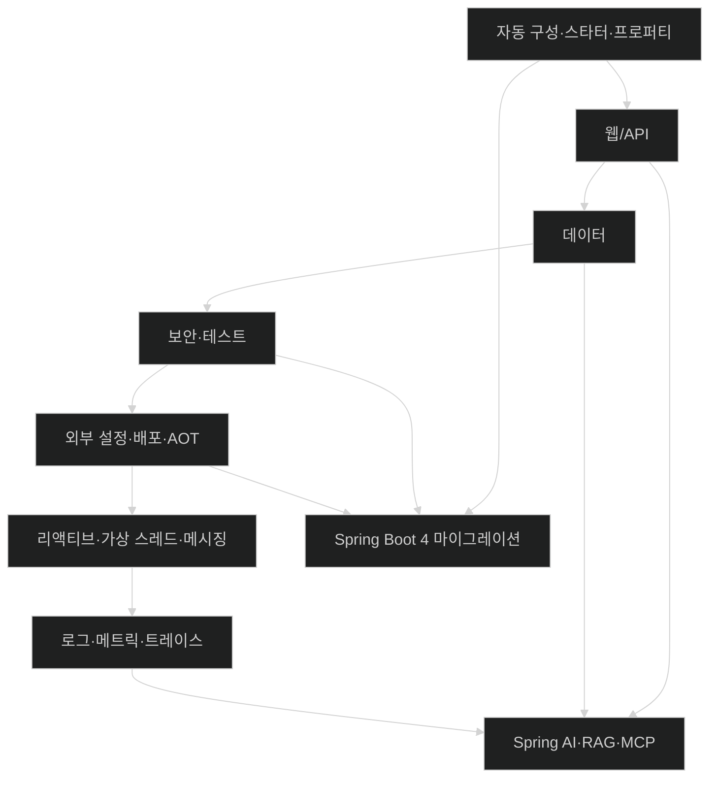

# Part 사이의 연결

- Part 1의 자동 구성은 이후 모든 스타터와 통합 기능이 작동하는 공통 기반이다.
- Part 2의 동기식 CRUD 애플리케이션은 Part 4의 리액티브·비동기 모델과 비교할 기준이 된다.
- Part 3의 배포 형태는 Part 5에서 관측할 런타임 경계를 결정한다.
- Part 6의 AI 애플리케이션도 결국 웹, 데이터, 보안, 관측 가능성 위에 놓인다.
- Part 7은 앞의 모든 코드를 Spring Boot 4 관점에서 다시 점검하는 마이그레이션 지도다.

