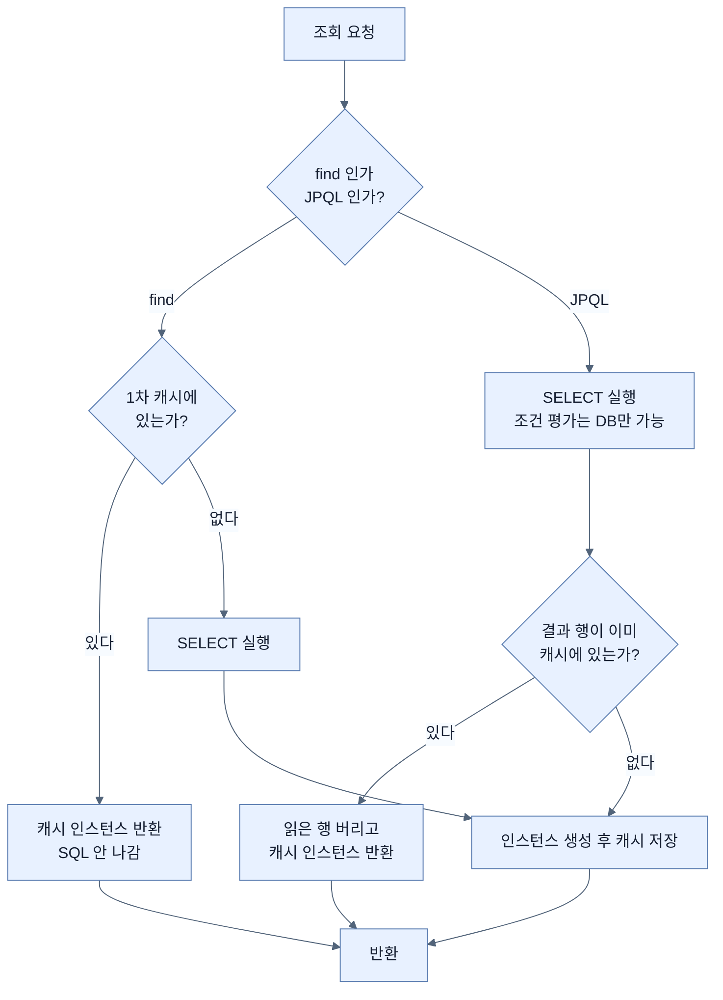

# 영속성 컨텍스트와 1차 캐시

## 한눈에 보기

| 질문 | 핵심 답 |
|---|---|
| JPA는 조회한 엔티티를 어디에 두나? | 트랜잭션마다 만들어지는 영속성 컨텍스트에 `식별자 → 인스턴스` 맵으로 담는다. |
| 같은 행을 두 번 조회하면? | 같은 자바 인스턴스가 돌아온다. `a == b`가 참이다. |
| `find()`와 JPQL이 다른 점은? | `find()`는 캐시에 있으면 SQL을 아예 안 보낸다. JPQL은 SQL을 보내되 결과를 캐시와 대조해 기존 인스턴스를 돌려준다. |
| 왜 굳이 이 층을 두나? | 같은 행이 두 개의 객체가 되면 어느 쪽이 진실인지 알 수 없어지기 때문이다. |
| 언제까지 살아 있나? | 트랜잭션이 끝나면 통째로 사라진다. 트랜잭션 사이에 공유되지 않는다. |

## 1. 왜 이게 필요한가

### 출발 장면: 같은 회사를 두 번 조회한다

CosmoRoute의 관리자 큐레이션 경로에서, 회사 하나를 수정하기 전에 검증을 위해 두 번 조회하는 코드를 생각해 보자.

```java
@Transactional
public void rename(UUID id, String newName) {
    Company a = repository.findCuratedById(id).orElseThrow();
    // ... 중간에 다른 검증 로직 ...
    Company b = repository.findCuratedById(id).orElseThrow();

    a.rename(newName);
    // b 는 손대지 않았다. 그런데 b.getCompanyName() 은 무엇을 반환할까?
}
```

`b`는 건드리지 않았으니 예전 이름이 나올 것 같다. 실제로는 **새 이름이 나온다.** `a`와 `b`가 같은 객체이기 때문이다. `a == b`가 참이다.

이 결과가 이상하게 느껴진다면, 아직 JPA가 조회한 객체를 어디에 두는지에 대한 그림이 없는 것이다. 그 그림이 **[[영속성-컨텍스트]]**(=엔티티를 담아 두고 변화를 추적하는 트랜잭션 단위의 메모리 공간)다.

### 여기서 뭐가 무너지나

영속성 컨텍스트가 없다고 해 보자. 조회할 때마다 DB 행을 읽어 **새 객체**를 만들어 돌려준다. 자연스러워 보이지만 곧 무너진다.

- **어느 쪽이 진실인가.** `a`의 이름을 바꾸고 `b`의 홈페이지를 바꿨다. 커밋할 때 DB에는 무엇을 써야 하나? 두 객체 모두 같은 행을 주장하는데 값이 다르다.
- **같은 것을 같다고 말할 수 없다.** `a == b`가 거짓이므로, 컬렉션에 담아 중복을 제거하거나 `Set`에 넣는 코드가 조용히 틀린다. 같은 회사가 두 번 들어간다.
- **왕복이 반복된다.** CosmoRoute의 발견 카탈로그에서 원료 20건을 훑으며 각각의 회사를 확인한다고 하자. 그중 절반이 같은 회사여도 SELECT는 20번 나간다.
- **연관 객체가 갈라진다.** `Material`에서 꺼낸 회사와 따로 조회한 회사가 다른 인스턴스면, 한쪽에 붙인 변경이 다른 쪽에서 보이지 않는다.

첫 번째가 가장 치명적이다. 나머지는 성능이나 편의 문제지만, 이건 **정확성** 문제다.

### 그래서 나온 생각

트랜잭션 하나가 시작되면 그 트랜잭션 전용 공간을 하나 만들어 두고, 조회한 엔티티를 전부 거기에 `식별자 → 인스턴스` 맵으로 담아 두자. 다음에 같은 식별자를 요청하면 새로 만들지 말고 그 맵에서 꺼내 주면 된다.

이 맵이 **[[1차-캐시]]**(=영속성 컨텍스트가 엔티티를 식별자로 색인해 보관하는 맵)다. 그리고 이 맵 덕분에 생기는 "같은 식별자는 항상 같은 인스턴스" 성질이 **[[동일성-보장]]**(=같은 트랜잭션 안에서 같은 식별자로 조회하면 `==`가 참인 성질)이다.

이 공간을 다루는 창구가 **[[엔티티-매니저]]**(=`persist`·`find`·`merge` 같은 조작을 제공하는 `jakarta.persistence.EntityManager` 객체)이고, 이 공간에 담겨 관리되는 상태가 **[[영속-상태]]**(=영속성 컨텍스트가 추적하고 있으며 식별자를 가진 상태)다.

비유하자면 영속성 컨텍스트는 **작업대**다. DB라는 창고에서 부품을 꺼내 작업대에 올려놓고 일한다. 같은 부품을 또 달라고 하면 창고에 다시 가지 않고 작업대 위의 그것을 가리킨다.

→ 비유가 깨지는 지점: 작업대는 물건을 올려놓기만 할 뿐 그 물건이 바뀌었는지 신경 쓰지 않는다. 영속성 컨텍스트는 다르다 — 올려놓은 순간 값을 한 벌 복사해 두고, 나중에 달라진 곳이 있으면 창고에 알아서 UPDATE를 보낸다. "보관"이 아니라 "감시"까지가 이 공간의 일이고, 그 지점부터 작업대 비유는 멈춘다.

## 2. 어떻게 동작하는가

### 2.1 `find()`로 조회할 때

1. 애플리케이션이 `entityManager.find(Company.class, id)`를 호출한다. — 어떤 타입의 어떤 식별자를 원하는지 컨텍스트에 알려야 하기 때문이다.
2. 컨텍스트가 1차 캐시에서 `(타입, 식별자)` 키로 먼저 찾는다. — 이미 이 트랜잭션이 들고 있는 객체가 있다면 DB에 다시 갈 이유가 없기 때문이다.
3. **있으면 그 인스턴스를 그대로 반환한다. SQL은 나가지 않는다.** — 같은 행에 대해 두 개의 객체가 생기는 것을 원천적으로 막기 위해서다.
4. 없으면 SELECT를 보내 행을 읽는다. — 컨텍스트에 아직 없는 데이터는 DB만이 갖고 있기 때문이다.
5. 읽은 행으로 엔티티 인스턴스를 만들고 1차 캐시에 넣는다. — 이 트랜잭션 안에서 이후의 조회가 같은 인스턴스를 받게 하기 위해서다.
6. 동시에 필드 값을 따로 복사해 둔다. — 나중에 무엇이 바뀌었는지 비교할 원본이 필요하기 때문이다. 이 복사본이 다음 노트들에서 다룰 스냅샷이다.
7. 인스턴스를 반환한다.

### 2.2 JPQL로 조회할 때는 다르다 — 그런데 결과는 같다

`find()`가 아니라 JPQL이면 이야기가 달라진다. CosmoRoute의 `CompanyRepository`는 전부 JPQL이다.

```java
@Query("SELECT c FROM Company c WHERE c.id = :id"
        + " AND c.origin = CompanyOrigin.OPERATOR_CURATED AND c.deletedAt IS NULL")
Optional<Company> findCuratedById(UUID id);
```

이 쿼리는 **1차 캐시를 조회 조건으로 쓸 수 없다.** `origin`과 `deletedAt` 조건을 평가하려면 결국 DB가 판단해야 하기 때문이다. 그래서 JPQL은 캐시에 뭐가 있든 **SQL을 보낸다.**

그런데 여기서 끝이 아니다. Hibernate는 결과 행을 엔티티로 만들기 전에 1차 캐시를 한 번 들여다본다. `StatefulPersistenceContext.getEntity(EntityKey)`가 그 일을 하고, 소스의 주석은 그 목적을 이렇게 적어 두었다 — *"이미 관리 중이면 그 인스턴스를 반환한다. 같은 DB 행에 같은 자바 동일성이 쓰이도록 보장하기 위해서다."*

1. JPQL이 SQL로 번역되어 DB로 나간다. — WHERE 조건을 평가할 수 있는 것은 DB뿐이기 때문이다.
2. 결과 행마다 `(타입, 식별자)` 키를 만든다. — 이 행이 이미 컨텍스트에 있는 엔티티인지 판정하려면 키가 필요하기 때문이다.
3. 그 키로 1차 캐시를 조회한다. — 동일성 보장을 지키기 위해서다.
4. **있으면 읽어 온 행 데이터를 버리고 캐시의 인스턴스를 반환한다.** — 이 트랜잭션에서 이미 손댔을지 모르는 객체를 DB 값으로 덮어써 변경을 잃는 일을 막기 위해서다.
5. 없으면 새 인스턴스를 만들어 캐시에 넣고 반환한다.

4번이 처음 보면 가장 의외인 단계다. **DB에서 방금 읽어 온 값이 있는데도 그걸 버린다.** 하지만 버리지 않으면 `a.rename()`으로 바꿔 둔 이름이 `b`를 조회하는 순간 DB의 옛 이름으로 되돌아간다. 정확성이 최신성을 이긴다.

### 2.3 그래서 출발 장면의 답

```text
findCuratedById(id) 1회차   SELECT 나감 → 캐시 없음 → 인스턴스 생성 → 캐시 저장 → 반환
a.rename("새 이름")          캐시 안의 그 인스턴스의 필드가 바뀜
findCuratedById(id) 2회차   SELECT 나감 → 캐시 있음 → 읽은 행 버림 → 같은 인스턴스 반환
```

- SELECT는 **두 번** 나간다 (JPQL이므로).
- `a == b`는 **참**이다 (동일성 보장).
- `b.getCompanyName()`은 **새 이름**이다 (같은 객체이므로).

세 가지를 함께 설명할 수 있어야 이 절을 이해한 것이다. "1차 캐시가 있으니까 쿼리가 한 번만 나간다"는 흔한 요약은 `find()`에서만 맞다.

### 2.4 트랜잭션이 끝나면

Spring의 기본 구성에서 영속성 컨텍스트는 트랜잭션과 수명을 같이한다.

1. `@Transactional` 메서드에 들어가면서 컨텍스트가 만들어진다. — 이 트랜잭션 동안 다룰 엔티티를 담을 공간이 필요하기 때문이다.
2. 메서드 안에서 조회·수정된 엔티티가 전부 이 컨텍스트에 쌓인다.
3. 메서드가 끝나면 커밋 직전에 변경 내용이 DB로 나간다.
4. 컨텍스트가 닫히고 1차 캐시는 통째로 사라진다. — 다음 트랜잭션이 옛 데이터를 최신인 양 쓰는 것을 막기 위해서다.

그래서 1차 캐시는 성능 최적화 장치라고 부르기 어렵다. 트랜잭션 하나 안에서만 살고, 그 안에서 같은 엔티티를 여러 번 만지는 경우에만 왕복이 줄어든다. **1차 캐시의 본업은 캐싱이 아니라 동일성 보장이다.**

## 3. 그림으로 보기

### `find()`와 JPQL이 캐시를 만나는 지점



### 컨텍스트가 없을 때와 있을 때

```text
[컨텍스트가 없는 세계]

  a = SELECT ... WHERE id = 1   →  Company@1a2b   name="구"
  b = SELECT ... WHERE id = 1   →  Company@3c4d   name="구"
  a.rename("신")

  커밋 시점에 DB에 써야 할 값은?
    Company@1a2b 는 name="신" 이라 주장
    Company@3c4d 는 name="구" 라 주장
  → 같은 행에 대해 두 개의 진실. 판정 규칙이 없다.


[영속성 컨텍스트가 있는 세계]

  영속성 컨텍스트 (트랜잭션 1개 전용)
  ┌──────────────────────────────────────────────┐
  │ 1차 캐시                                     │
  │   (Company, id=1) ──▶ Company@1a2b           │
  │                        name="신"             │
  │                                              │
  │ 스냅샷                                       │
  │   (Company, id=1) ──▶ { name="구", ... }     │
  └──────────────────────────────────────────────┘
        ▲                        ▲
        a                        b        a == b (같은 화살표)

  → 진실은 하나뿐이다. 스냅샷과의 차이가 곧 보낼 UPDATE 가 된다.
```

"영속성 컨텍스트"라는 이름은 **영속(persistent) 상태인 객체들이 사는 문맥(context)**이라는 뜻이다. 객체가 이 문맥 안에 있으면 영속이고, 밖으로 나가면 더 이상 영속이 아니다 — 이름 자체가 상태의 정의를 담고 있다.

## 4. 이 노트에 나온 용어

| 용어 | 한 줄 풀이 | 자세히 |
|---|---|---|
| 영속성 컨텍스트 | 엔티티를 담고 변화를 추적하는 트랜잭션 단위 메모리 공간 | [[_glossary#영속성-컨텍스트]] |
| 엔티티 매니저 | 그 공간을 조작하는 창구 객체 (`EntityManager`) | [[_glossary#엔티티-매니저]] |
| 1차 캐시 | 엔티티를 식별자로 색인해 보관하는 맵 | [[_glossary#1차-캐시]] |
| 동일성 보장 | 같은 식별자 조회는 항상 같은 인스턴스라는 성질 | [[_glossary#동일성-보장]] |
| 영속 상태 | 컨텍스트가 추적 중이며 식별자를 가진 상태 | [[_glossary#영속-상태]] |

## 5. 자주 헷갈리는 것

### 1차 캐시 vs 2차 캐시

| 축 | 1차 캐시 | 2차 캐시 |
|---|---|---|
| 범위 | 영속성 컨텍스트 하나 = 트랜잭션 하나 | `EntityManagerFactory` 단위, 여러 트랜잭션이 공유 |
| 켜고 끄기 | 끌 수 없다. JPA 동작의 전제다 | 기본으로 꺼져 있고 명시적으로 켠다 |
| 주 목적 | 동일성 보장 | 왕복 감소 |
| 사라지는 시점 | 트랜잭션 종료 | 만료 정책·명시적 무효화 |

"캐시"라는 같은 말을 쓰지만 존재 이유가 다르다. 1차 캐시를 성능 장치로만 이해하면, 왜 끌 수 없는지 설명하지 못한다.

### 동일성(`==`) vs 동등성(`equals`)

1차 캐시가 보장하는 것은 **동일성**이다. `equals()`가 아니라 `==`가 참이 된다. 반대로 준영속 객체 두 개는 `equals()`를 잘 구현했다면 동등할 수 있지만 동일하지는 않다. 엔티티에 `equals`/`hashCode`를 직접 구현할지 고민하는 이유가 여기 있다 — 영속 상태 안에서는 필요 없지만, 컨텍스트 밖으로 나간 객체끼리 비교하려면 필요해진다.

### 영속성 컨텍스트 vs 엔티티 매니저

컨텍스트는 **공간**이고 매니저는 그 공간을 다루는 **손잡이**다. Spring의 기본 구성에서 트랜잭션 하나에 컨텍스트 하나가 붙으므로 실무에서는 거의 같은 말처럼 쓰이지만, `EntityManager` 여러 개가 같은 컨텍스트를 공유하는 구성도 존재한다. 둘을 같은 말로 외우면 그 구성을 만났을 때 설명이 막힌다.

## 6. 언제 안 쓰나 / 경계

- **트랜잭션 밖에서는 아무 보장도 없다.** `@Transactional` 없이 리포지토리 메서드를 두 번 부르면 각각 별개의 컨텍스트에서 실행되어 `a == b`가 거짓이 된다. 동일성 보장은 트랜잭션 경계 안에서만 성립한다.
- **1차 캐시는 DB 변화를 모른다.** 같은 트랜잭션이 진행되는 동안 다른 트랜잭션이 그 행을 바꿔도, 캐시에 있는 인스턴스는 옛 값을 그대로 들고 있다. 최신 값이 꼭 필요하면 `refresh()`를 부르거나 락을 잡아야 한다.
- **컨텍스트가 크면 그 자체가 비용이다.** 조회한 엔티티가 전부 캐시와 스냅샷 양쪽에 남는다. 수만 건을 읽는 배치에서는 메모리가 늘고 플러시 때 비교 대상도 늘어난다. 이런 경로에서는 엔티티 대신 DTO로 조회하거나 주기적으로 컨텍스트를 비운다.
- **JPQL의 조회 조건에는 캐시가 개입하지 않는다.** 방금 바꾼 값으로 필터링하고 싶다면 그 변경이 먼저 DB에 나가 있어야 한다 — 이 지점이 다음 노트의 주제다.

## 7. 연결

- [[02-write-behind-and-flush]] — 컨텍스트에 쌓인 변화가 실제 SQL이 되어 나가는 시점을 다룬다. 1차 캐시가 "무엇을 들고 있는가"라면 플러시는 "언제 내보내는가"다.
- [[03-dirty-checking-and-snapshots]] — 이 노트 2.1의 6단계에서 복사해 둔 스냅샷이 무엇에 쓰이는지 설명한다. `save()` 없이 UPDATE가 나가는 이유가 거기 있다.
- [[04-entity-lifecycle-and-detachment]] — 엔티티가 이 컨텍스트 밖으로 나가면 어떤 보장이 사라지는지 다룬다. 동일성 보장과 더티 체킹이 함께 없어진다.

## 8. 스스로 확인

1. 같은 트랜잭션에서 같은 식별자를 두 번 조회했을 때 `a == b`가 참인 이유를 1차 캐시로 설명할 수 있는가?
2. `find()`와 JPQL이 1차 캐시를 다르게 다루는데도 반환되는 인스턴스는 같다. 각각 어느 단계에서 캐시를 만나는가?
3. JPQL 결과 행이 캐시에 이미 있을 때 Hibernate가 읽어 온 행을 버리는 이유는 무엇인가? 버리지 않으면 무엇이 깨지는가?
4. 1차 캐시를 끄는 설정이 없는 이유를 "본업이 캐싱이 아니다"라는 말로 설명할 수 있는가?
5. 1차 캐시와 2차 캐시를 범위·목적·수명 세 축으로 구분할 수 있는가?
6. `@Transactional`을 빼면 동일성 보장이 왜 사라지는가?
7. 수만 건을 읽는 배치에서 영속성 컨텍스트가 비용이 되는 이유를 두 가지 이상 댈 수 있는가?

<!-- ==== 아래는 내 영역 · 스킬 수정 금지 ==== -->

## 내 설명 시도


## 막혔던 지점


## 리뷰 이력
