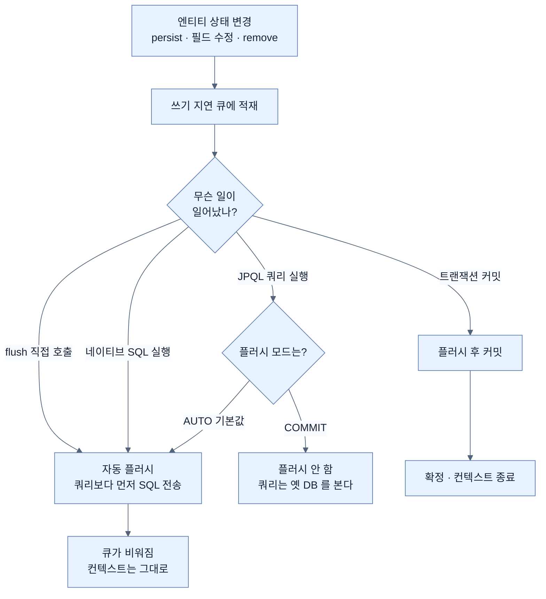

# 쓰기 지연과 플러시

## 한눈에 보기

| 질문 | 핵심 답 |
|---|---|
| `save()`를 부르면 INSERT가 바로 나가나? | 아니다. 큐에 쌓아 두었다가 플러시 시점에 내보낸다. |
| 그럼 언제 나가나? | 커밋 직전 · 결과가 달라질 쿼리 실행 직전 · `flush()` 직접 호출. |
| 왜 모아 두나? | 배치로 묶고, 중복 UPDATE를 합치고, 제약에 맞게 순서를 조정하기 위해서다. |
| 플러시하면 커밋된 건가? | 아니다. SQL을 보낸 것뿐이고 롤백하면 전부 취소된다. |
| 이 지연이 깨지는 경우는? | 식별자 전략이 `IDENTITY`면 `persist()` 시점에 INSERT가 즉시 나간다. |

## 1. 왜 이게 필요한가

### 출발 장면: 방금 저장한 회사를 방금 만든 쿼리가 찾는가

CosmoRoute의 INV-8은 *"같은 회사를 두 번 큐레이션하지 않는다"*를 요구한다. DB에는 부분 유니크 인덱스가 걸려 있고, 서비스 계층에서도 사전 검사를 한다. 그런데 한 트랜잭션 안에서 두 건을 연달아 등록하면 이런 코드가 된다.

```java
@Transactional
public void curateBoth(String nameA, String nameB) {
    repository.save(Company.curated(nameA, normalize(nameA), operatorId));

    // 두 번째 등록 전에 중복 검사를 한다.
    if (repository.existsByNormalizedNameAndDeletedAtIsNull(normalize(nameB))) {
        throw new CuratedCatalogRuleViolation("이미 등재된 회사");
    }
    repository.save(Company.curated(nameB, normalize(nameB), operatorId));
}
```

`nameA`와 `nameB`가 정규화하면 같은 이름이라고 하자. 첫 번째 `save()`의 INSERT는 아직 DB로 나가지 않았을 수도 있다. 그렇다면 `existsBy...`는 무엇을 볼까? 아직 DB에 없으니 `false`를 반환하고, 두 번째 `save()`가 통과했다가 커밋 시점에 유니크 제약 위반으로 터질까?

**터지지 않는다.** `existsBy...`가 `true`를 반환하고 의도한 예외가 나간다. 왜 그런지가 이 노트의 주제다.

### 여기서 뭐가 무너지나

먼저 "왜 SQL을 즉시 보내지 않는가"부터 정리해야 한다. `save()`를 부르는 즉시 INSERT를 보낸다면 단순하고 예측 가능하다. 대신 이런 것들을 잃는다.

- **왕복 횟수.** 원료 하나에 성분 40개를 연결한다면 INSERT가 40번, 즉 DB 왕복이 40번이다. 모아서 한 번에 보내면 JDBC 배치로 묶을 수 있다.
- **중복 UPDATE.** 한 메서드 안에서 같은 엔티티의 필드를 세 군데서 고치면 UPDATE가 세 번 나간다. 모아 두면 최종 상태 하나만 보내면 된다.
- **제약을 지키는 순서.** 회사를 만들고 그 회사에 속한 원료를 만든다면 INSERT 순서가 뒤집히면 외래 키 제약에 걸린다. 애플리케이션 코드의 호출 순서와 DB가 요구하는 순서가 항상 같지는 않다.
- **롤백 비용.** 즉시 보내면 취소할 것도 그만큼 많아진다.

그래서 JPA는 상태 변화를 곧바로 SQL로 바꾸지 않고 영속성 컨텍스트 안의 큐에 쌓아 둔다. 이 방식이 **[[쓰기-지연]]**(=상태 변화를 큐에 모아 두었다가 한꺼번에 SQL로 내보내는 방식)이다. Hibernate 공식 문서는 영속성 컨텍스트를 아예 *"트랜잭션 단위의 write-behind 캐시"*라고 정의한다.

### 그래서 나온 생각 — 그런데 지연에는 대가가 있다

모아 두기로 했으면 **언제 내보낼지**를 정해야 한다. 그리고 여기서 출발 장면의 문제가 생긴다.

컨텍스트 안에만 있고 DB에는 없는 변경이 있는 상태에서 쿼리를 보내면, **같은 트랜잭션이 방금 자기가 만든 데이터를 못 찾는다.** 이건 성능 문제가 아니라 논리적 모순이다.

그래서 JPA는 내보내는 시점을 하나로 고정하지 않는다. 쌓인 변화를 실제 SQL로 번역해 DB와 동기화하는 이 동작을 **[[플러시]]**(=컨텍스트에 쌓인 상태 변화를 INSERT·UPDATE·DELETE로 번역해 DB로 내보내는 것)라 하고, 언제 자동으로 일으킬지를 정하는 설정이 **[[플러시-모드]]**(=플러시 자동 발생 시점을 정하는 `FlushModeType` 설정)다.

비유하자면 쓰기 지연은 **장바구니**다. 물건을 담을 때마다 계산하지 않고 모아 두었다가 한 번에 계산한다.

→ 비유가 깨지는 지점: 장바구니는 내가 결제 버튼을 눌러야만 계산된다. 영속성 컨텍스트는 다르다 — 내가 조회 쿼리 하나만 날려도 **알아서 계산대로 먼저 간다.** "내가 정한 시점에만 나간다"고 믿는 순간 이 비유는 틀린 모델이 되고, 출발 장면의 답도 반대로 예측하게 된다.

## 2. 어떻게 동작하는가

### 2.1 플러시가 일어나는 세 시점

`AUTO` 모드(기본값)에서 플러시는 다음 세 가지 계기로 일어난다.

1. **트랜잭션 커밋 직전.** — 쌓인 변화가 DB에 반영되지 않은 채 커밋되면 그 트랜잭션은 아무 일도 하지 않은 것이 되기 때문이다.
2. **JPQL·Criteria 쿼리 실행 직전.** — 아직 나가지 않은 변경이 그 쿼리의 결과를 바꿀 수 있고, 그렇게 되면 같은 트랜잭션이 자기가 만든 데이터를 못 보는 모순이 생기기 때문이다. 이 자동 발생이 **[[자동-플러시]]**(=`AUTO` 모드에서 쿼리 실행 직전에 JPA가 알아서 일으키는 플러시)다.
3. **`entityManager.flush()` 직접 호출.** — 생성된 식별자를 즉시 알아야 하거나, 제약 위반을 커밋까지 미루지 않고 이 자리에서 확인하고 싶을 때 개발자가 시점을 앞당기기 위해서다.

Hibernate 공식 문서의 예제가 2번을 그대로 보여 준다.

```java
entityManager.getTransaction().begin();
entityManager.persist(book);
var books = entityManager.createQuery("from Book", Book.class).getResultList();
// 여기서 플러시가 먼저 일어난다 — 새 Book 이 쿼리 결과에 영향을 주기 때문
entityManager.getTransaction().commit();
// 커밋 시점에는 내보낼 것이 이미 없다
```

### 2.2 출발 장면의 답

이제 앞의 코드를 다시 보자.

```text
save(A)                         INSERT 를 큐에 쌓는다. SQL 은 아직 안 나감
existsByNormalizedName(...)     ← 파생 쿼리 = JPQL. 실행 직전에 자동 플러시
                                  큐의 INSERT 가 먼저 나간다
                                → SELECT 는 A 가 이미 들어간 DB 를 본다 → true
throw CuratedCatalogRuleViolation
```

`existsBy...`는 Spring Data가 메서드 이름으로 만들어 주는 파생 쿼리이고, 내부적으로 JPQL이다. 그래서 2번 계기가 발동한다. **지연되어 있던 INSERT가 이 쿼리 직전에 먼저 나가고,** 쿼리는 그 결과를 본다.

만약 자동 플러시가 없었다면 `existsBy...`는 `false`를 반환하고, 두 번째 `save()`가 통과했다가 커밋 시점에 DB 유니크 제약이 터졌을 것이다. 서비스가 던지려던 읽을 수 있는 409 대신, 정체를 알기 어려운 제약 위반 예외가 밖으로 나갔을 것이다. **자동 플러시는 편의가 아니라 정합성 장치다.**

### 2.3 플러시는 커밋이 아니다

가장 자주 섞이는 두 개념이다.

| 축 | 플러시 | 커밋 |
|---|---|---|
| 무엇을 하나 | 쌓인 변화를 SQL로 번역해 DB로 **보낸다** | 그때까지 보낸 것을 **확정한다** |
| 되돌릴 수 있나 | 있다. 롤백하면 보낸 SQL도 함께 취소된다 | 없다 |
| 다른 트랜잭션에 보이나 | 안 보인다 (격리 수준에 따름) | 보인다 |
| 영속성 컨텍스트는 | 그대로 유지된다 | 닫히고 1차 캐시가 사라진다 |

`flush()`를 불렀다고 데이터가 확정되지 않는다. 반대로 커밋은 항상 플러시를 동반한다 — 보내지 않은 변화를 확정할 방법이 없기 때문이다.

### 2.4 `COMMIT` 모드를 고르면 무엇이 달라지나

`FlushModeType.COMMIT`으로 바꾸면 2번 계기가 사라진다. 쿼리를 아무리 날려도 커밋 전까지는 플러시하지 않는다.

```java
entityManager.setFlushMode(FlushModeType.COMMIT);
```

쿼리마다 플러시 여부를 판정하는 비용이 사라지므로 조회가 많은 경로에서는 빨라질 수 있다. 대가는 명확하다 — **출발 장면의 중복 검사가 조용히 틀린다.**

여기에 알아 두면 좋은 경계가 하나 더 있다. Hibernate 문서는 `COMMIT` 모드에서 *"JPQL 쿼리를 실행할 때는 커밋 시점에만 플러시하지만, 네이티브 SQL 쿼리를 실행할 때는 플러시한다"*고 명시한다. Hibernate는 네이티브 SQL이 어느 테이블을 건드릴지 판정할 수 없으므로 안전한 쪽을 택한다. 같은 `COMMIT` 모드에서도 쿼리 종류에 따라 동작이 갈린다.

### 2.5 지연이 통째로 깨지는 경우 — 식별자 전략

쓰기 지연은 언제나 성립하지 않는다. 식별자를 **DB가 만들어 주는** 전략을 쓰면 무너진다.

- `@GeneratedValue(strategy = IDENTITY)` — PK를 DB의 auto-increment가 만든다. 그런데 영속성 컨텍스트는 엔티티를 1차 캐시에 넣으려면 식별자가 있어야 한다. 식별자를 알려면 INSERT를 보내야 한다. **그래서 `persist()` 시점에 INSERT가 즉시 나간다.** 지연할 수가 없다.
- `SEQUENCE`·`TABLE` — 식별자를 INSERT와 별개로 미리 받아올 수 있다. 그래서 INSERT는 커밋 시점까지 지연된다. Hibernate 문서가 커밋 시 자동 플러시 예제에 *"SEQUENCE와 TABLE 생성기에 유효하다"*고 단서를 단 이유가 이것이다.
- **애플리케이션이 직접 할당** — 지연이 온전히 작동한다.

CosmoRoute는 세 번째다. 엔티티 어디에도 `@GeneratedValue`가 없고, 팩터리가 값을 직접 넣는다.

```java
// Company.java
@Id
@Column(name = "id", nullable = false, updatable = false)
private UUID id;

static Company curated(String companyName, String normalizedName, UUID curatedByUserId) {
    Company company = new Company();
    company.id = UUID.randomUUID();     // 애플리케이션이 식별자를 만든다
    ...
}
```

스키마에 `DEFAULT gen_random_uuid()`가 함께 있지만 그건 JPA를 거치지 않는 경로를 위한 안전망이고, 애플리케이션 경로에서는 항상 값이 먼저 정해진다. 그래서 이 프로젝트에서는 INSERT를 커밋 직전까지 미룰 수 있고, 배치로 묶을 여지도 남는다. `IDENTITY`를 골랐다면 이 여지가 통째로 없었을 것이다.

> 다만 식별자를 직접 할당하면 다른 문제가 생긴다 — Spring Data가 "이 엔티티는 새것인가"를 판정하는 방식이 달라진다. 그 이야기는 병합을 다루는 노트에서 이어진다.

## 3. 그림으로 보기

### 세 가지 플러시 계기



### 지연 큐가 하는 일

```text
[즉시 전송 세계]

  material.rename("A")   →  UPDATE material SET name='A' ...
  material.rename("B")   →  UPDATE material SET name='B' ...
  material.publish()     →  UPDATE material SET published_at=... ...

  → DB 왕복 3회. 중간 상태 'A' 는 아무도 쓰지 않는데 네트워크를 탔다.


[쓰기 지연 세계]

  material.rename("A")   ─┐
  material.rename("B")   ─┤  큐에 상태 변화만 쌓인다
  material.publish()     ─┘

        │  플러시 시점 (커밋 직전 또는 쿼리 직전)
        ▼
  UPDATE material SET name='B', published_at=... WHERE id=?

  → DB 왕복 1회. 최종 상태만 나간다.
    "지연(behind)"은 늦게 쓴다는 뜻이 아니라
    쓰기를 읽기 뒤로(behind) 미뤄 둔다는 뜻이다 — write-behind 라는 이름의 유래.
```

## 4. 이 노트에 나온 용어

| 용어 | 한 줄 풀이 | 자세히 |
|---|---|---|
| 쓰기 지연 | 상태 변화를 큐에 모아 두었다가 한꺼번에 내보내는 방식 | [[_glossary#쓰기-지연]] |
| 플러시 | 쌓인 변화를 SQL로 번역해 DB로 내보내 동기화하는 동작 | [[_glossary#플러시]] |
| 플러시 모드 | 자동 플러시를 언제 일으킬지 정하는 `FlushModeType` 설정 | [[_glossary#플러시-모드]] |
| 자동 플러시 | `AUTO` 모드에서 쿼리 실행 직전에 알아서 일어나는 플러시 | [[_glossary#자동-플러시]] |

## 5. 자주 헷갈리는 것

### 플러시 vs 커밋

2.3의 표가 전부다. 판별 질문 하나로 정리하면 — **"지금 롤백하면 없던 일이 되는가?"** 답이 예면 플러시까지만 한 것이고, 아니오면 커밋된 것이다.

### `save()` vs 플러시

Spring Data의 `save()`는 "지금 DB에 써라"라는 뜻이 아니다. 영속성 컨텍스트에 등록하라는 뜻이다. 이미 영속 상태인 엔티티라면 `save()`를 아예 부르지 않아도 변경이 반영된다 — 그 메커니즘은 다음 노트의 주제다. 반대로 `save()`를 불렀다고 SQL이 나갔다고 단정하면 이 노트의 출발 장면을 반대로 예측하게 된다.

### `saveAndFlush()`는 무엇이 다른가

`save()` 뒤에 `flush()`를 이어 부르는 것이다. 커밋 전에 제약 위반을 확인하거나 생성된 값을 즉시 읽어야 할 때 쓴다. **트랜잭션을 끝내지는 않는다** — 이름 때문에 커밋으로 오해하기 쉽지만 여전히 롤백 가능한 상태다.

### 자동 플러시 vs 2차 캐시 무효화

둘 다 "최신 상태를 보이게 한다"는 인상이 있지만 대상이 다르다. 자동 플러시는 **내 트랜잭션이 만든 변화**를 DB로 보내는 것이고, 2차 캐시 무효화는 **다른 트랜잭션이 만든 변화**를 캐시에서 걷어내는 것이다.

## 6. 언제 안 쓰나 / 경계

- **대량 INSERT에서는 지연이 오히려 부담이 된다.** 10만 건을 넣으면 큐와 1차 캐시가 함께 커진다. 일정 건수마다 `flush()`와 `clear()`를 함께 불러 큐를 비우고 컨텍스트도 비워야 한다. `flush()`만 부르면 SQL은 나가지만 1차 캐시는 그대로 쌓인다.
- **`COMMIT` 모드는 조회 최적화 목적으로만 쓴다.** 같은 트랜잭션 안에서 쓰기와 조건 검사가 섞이는 경로에 적용하면 검사 결과가 조용히 틀린다. CosmoRoute처럼 서비스 계층 사전 검사와 DB 제약이 짝을 이루는 설계에서는 특히 위험하다.
- **`flush()`를 습관적으로 부르지 않는다.** 배치로 묶을 기회를 없애고, 트랜잭션이 락을 잡는 구간을 앞당겨 길게 만든다. 식별자를 즉시 알아야 하거나 제약 위반 시점을 앞당겨야 하는 구체적 이유가 있을 때만 부른다.
- **네이티브 쿼리를 섞으면 모드가 무의미해질 수 있다.** 2.4에서 본 대로 `COMMIT` 모드여도 네이티브 SQL은 플러시를 유발한다. 모드 하나로 전체 동작을 예측하려 하면 어긋난다.

## 7. 연결

- [[01-persistence-context-and-first-level-cache]] — 플러시가 내보내는 변화가 쌓이는 곳이 그 컨텍스트다. 컨텍스트가 "무엇을 들고 있는가"라면 이 노트는 "언제 내보내는가"다.
- [[03-dirty-checking-and-snapshots]] — `save()`를 부르지 않은 변경까지 플러시가 SQL로 만들 수 있는 이유를 다룬다. 플러시 시점에 무엇을 내보낼지 결정하는 것이 더티 체킹이다.
- [[04-entity-lifecycle-and-detachment]] — 준영속 객체의 변경은 플러시해도 나가지 않는다. 이 노트의 메커니즘이 어느 상태에서만 성립하는지 그 경계를 정한다.

## 8. 스스로 확인

1. `save()` 직후 파생 쿼리를 실행하면 방금 저장한 행이 조회되는 이유를 플러시 계기로 설명할 수 있는가?
2. 쓰기를 지연해서 얻는 것 세 가지를 각각 구체적 상황으로 댈 수 있는가?
3. 플러시와 커밋을 구분하는 판별 질문 하나를 말할 수 있는가?
4. `FlushModeType.COMMIT`으로 바꿨을 때 출발 장면의 코드는 어떻게 잘못 동작하는가?
5. `COMMIT` 모드에서 JPQL과 네이티브 SQL의 동작이 갈리는 이유는 무엇인가?
6. `IDENTITY` 전략이 쓰기 지연을 무너뜨리는 이유를 "식별자를 언제 알 수 있는가"로 설명할 수 있는가?
7. 대량 INSERT에서 `flush()`만 부르고 `clear()`를 부르지 않으면 무엇이 남는가?
8. `saveAndFlush()`를 부른 뒤 예외가 나면 저장된 데이터는 어떻게 되는가?

<!-- ==== 아래는 내 영역 · 스킬 수정 금지 ==== -->

## 내 설명 시도


## 막혔던 지점


## 리뷰 이력
