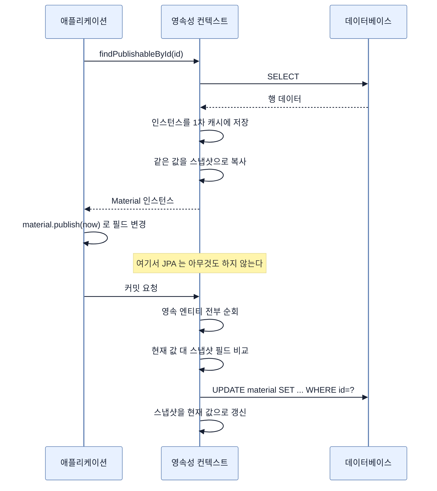

# 더티 체킹과 스냅샷

## 한눈에 보기

| 질문 | 핵심 답 |
|---|---|
| `save()`를 안 불렀는데 UPDATE가 나가는 이유는? | 조회 시점에 복사해 둔 스냅샷과 현재 값을 플러시 때 비교하기 때문이다. |
| 왜 스냅샷이 필요한가? | 자바 객체는 자기가 바뀌었다고 알려 주지 않는다. 비교할 원본이 있어야 한다. |
| 바뀐 컬럼만 UPDATE에 들어가나? | 아니다. Hibernate 기본은 **모든 컬럼**을 넣는다. `@DynamicUpdate`로 바꾼다. |
| 공짜인가? | 아니다. 조회한 엔티티 수만큼 스냅샷이 생기고 플러시마다 전부 비교한다. |
| 어떻게 끄나? | `@Transactional(readOnly = true)` 또는 애초에 엔티티 대신 DTO로 조회한다. |

## 1. 왜 이게 필요한가

### 출발 장면: `save()`가 없는데 UPDATE가 나간다

CosmoRoute의 INV-13은 *"출처 없이는 공개할 수 없다"*를 `Material.publish()`라는 도메인 게이트로 강제한다. 그 게이트를 호출하는 서비스 코드는 이렇게 생겼다.

```java
@Transactional
public void publish(UUID materialId) {
    Material material = repository.findPublishableById(materialId).orElseThrow();

    material.publish(clock.instant());   // 도메인 규칙을 통과하면 published_at 을 채운다

    // repository.save(material) 를 부르지 않는다.
}
```

`save()`가 없다. 그런데 커밋하면 `UPDATE material SET ... published_at = ? WHERE id = ?`가 나가고 원료가 실제로 공개된다.

이걸 처음 보면 두 가지 반응 중 하나가 나온다. "JPA가 알아서 해 주는구나" 하고 넘어가거나, "그럼 조회만 하고 필드를 만졌을 때도 나가는 것 아닌가?" 하고 불안해지거나. 후자가 맞는 감각이다. **실제로 나간다.** 그래서 이 메커니즘은 편의 기능이 아니라 반드시 이해하고 다뤄야 하는 동작이다.

이 자동 감지가 **[[더티-체킹]]**(=영속 상태 엔티티의 현재 값을 조회 시점 값과 비교해 달라진 것이 있으면 UPDATE를 자동 생성하는 것)이다.

### 여기서 뭐가 무너지나

더티 체킹이 없다면 어떻게 해야 할까. 세 가지 길이 있고 전부 대가가 있다.

- **개발자가 매번 `save()`를 부른다.** 단순하지만 한 번만 잊으면 데이터가 조용히 사라진다. 그리고 "무엇을 바꿨는지"는 여전히 알 수 없어서 결국 모든 컬럼을 덮어쓰게 된다.
- **엔티티의 모든 setter를 가로챈다.** 값이 바뀔 때마다 "이 필드가 더러워졌다"고 표시한다. 정확하지만 엔티티가 평범한 자바 객체가 아니게 된다 — 프록시로 감싸거나 바이트코드를 조작해야 하고, `final` 필드나 생성자 기반 불변 객체와 잘 맞지 않는다.
- **무조건 전부 UPDATE한다.** 바뀌었는지 따지지 않고 조회한 엔티티를 전부 다시 쓴다. 비교 비용은 없지만 DB 쓰기가 폭증하고, 아무도 손대지 않은 행까지 락이 걸린다.

JPA가 고른 길은 네 번째다. **조회하는 순간 값을 한 벌 복사해 두고, 나중에 비교한다.** 이 복사본이 **[[스냅샷]]**(=엔티티를 영속 상태로 만들 때 따로 복사해 두는 필드 값의 사본)이다.

이 선택의 결정적 장점은 **엔티티가 평범한 자바 객체로 남는다는 것**이다. `Material`은 JPA를 위해 아무 인터페이스도 구현하지 않고, 어떤 프레임워크 타입도 상속하지 않는다. CosmoRoute의 `Material.publish()`가 도메인 규칙을 담은 순수한 메서드로 존재할 수 있는 것도 이 덕분이다.

### 그래서 나온 생각

비유하자면 **입장할 때 사진을 한 장 찍어 두는 것**이다. 나갈 때 그 사진과 현재 모습을 대조해 달라진 곳을 찾는다. 사진이 없으면 무엇이 달라졌는지 알 방법이 없다.

→ 비유가 깨지는 지점: 사진 대조는 사람이 필요할 때 눈으로 훑는 일이다. JPA는 **플러시가 일어날 때마다 영속 상태 엔티티 전부를 자동으로 훑는다.** 내가 하나만 고쳤어도 컨텍스트에 200건이 담겨 있으면 200건을 비교한다. "필요할 때 한 번"이 아니라 "매번 전부"라는 점에서 사진 비유는 멈추고, 그 지점부터 이 메커니즘은 비용 이야기가 된다.

## 2. 어떻게 동작하는가

### 2.1 스냅샷이 만들어지고 비교되기까지

1. **조회 시점에 값을 복사한다.** 엔티티가 영속 상태가 되는 순간, JPA는 인스턴스를 1차 캐시에 넣으면서 필드 값을 별도로 한 벌 더 보관한다. — 나중에 무엇이 달라졌는지 판정하려면 비교 원본이 있어야 하기 때문이다.
2. **애플리케이션이 필드를 바꾼다.** `material.publish(...)`가 `publishedAt`을 채운다. 이 시점에 JPA는 아무것도 하지 않는다. — 엔티티는 평범한 자바 객체이고, 값이 바뀌었다고 알려 줄 방법이 없기 때문이다.
3. **플러시가 시작된다.** 커밋 직전이거나 쿼리 실행 직전이다.
4. **영속 상태 엔티티를 전부 순회한다.** — 어느 것이 바뀌었는지는 비교해 보기 전까지 알 수 없기 때문이다. 여기서 "전부"가 비용의 근원이다.
5. **각 엔티티의 현재 값과 스냅샷을 필드 단위로 비교한다.** — 달라진 필드가 하나도 없으면 UPDATE를 만들 이유가 없기 때문이다.
6. **달라진 것이 있으면 UPDATE를 만들어 쓰기 지연 큐에 넣는다.** — 실제 전송은 플러시가 담당하기 때문이다.
7. **UPDATE를 보낸 뒤 스냅샷을 현재 값으로 갱신한다.** — 같은 트랜잭션에서 다시 플러시할 때 이미 반영한 변경을 또 UPDATE하지 않기 위해서다.

`save()`가 어디에도 없다. 2번에서 필드를 바꾼 것이 곧 "저장 요청"이고, 4~6번이 그것을 SQL로 번역한다.

### 2.2 UPDATE에는 바뀐 컬럼만 들어가지 않는다

여기가 가장 자주 틀리는 지점이다. 6번에서 만들어지는 UPDATE는 **바뀐 컬럼만** 담을 것 같지만, Hibernate의 기본 동작은 반대다.

Hibernate 공식 문서는 이렇게 설명한다 — *"Hibernate는 부트스트랩 시점에 엔티티마다 정적(static) INSERT·UPDATE 문을 생성한다. 그래서 수정되지 않은 속성도 UPDATE에 포함된다."*

왜 그렇게 하는가. 애플리케이션이 시작될 때 엔티티마다 UPDATE 문을 **미리 하나 만들어 두고 계속 재사용**하기 위해서다. 바뀐 컬럼 조합마다 다른 SQL을 만들면 조합의 수만큼 문자열을 만들고 DB의 실행 계획 캐시도 그만큼 갈라진다.

바꾸고 싶으면 `@DynamicUpdate`를 붙인다.

```java
@Entity
@DynamicUpdate
public class Material { ... }
```

그러면 `UPDATE material SET published_at = ? WHERE id = ?`처럼 바뀐 컬럼만 나간다. 다만 공식 문서는 곧바로 경고를 단다 — *"엔티티에 version 속성이 없으면 `@DynamicUpdate`는 컬럼 값의 불일치를 낳을 수 있다. 동시에 실행되는 트랜잭션들이 같은 엔티티를 선택적으로 갱신할 수 있기 때문이다."*

관리자 두 명이 같은 원료를 동시에 연다고 하자. 한 명은 이름만, 한 명은 공개 여부만 바꾼다. 기본 동작(모든 컬럼 UPDATE)이면 나중에 커밋한 쪽이 앞선 변경을 통째로 덮어쓴다 — 잃어버리지만 최소한 **일관된 한 시점의 상태**가 남는다. `@DynamicUpdate`면 두 변경이 각각 자기 컬럼만 쓰므로 **어느 시점에도 존재한 적 없는 조합**이 만들어질 수 있다. 그래서 `@DynamicUpdate`는 낙관적 락과 짝을 이뤄야 안전하다. CosmoRoute의 엔티티에는 아직 `@Version`이 없으므로, 지금 `@DynamicUpdate`를 붙이면 이 위험을 그대로 떠안는다.

### 2.3 비용이 어디서 나오나

CosmoRoute의 발견 카탈로그 목록 조회를 예로 보자.

```java
@Query("SELECT c FROM Company c WHERE " + CatalogVisibility.SUPPLIER_COMPANY
        + " ORDER BY c.companyName ASC")
List<Company> findSupplierCompanies();
```

회사 200건이 돌아온다면 이 트랜잭션의 영속성 컨텍스트에는 다음이 남는다.

```text
1차 캐시    Company 인스턴스 200개
스냅샷      Company 필드값 사본 200벌
```

메모리가 두 배로 들고, 플러시가 일어날 때마다 200건 × 필드 수만큼 비교가 돌아간다. **조회만 하는 화면인데 그렇다.** 아무것도 고칠 생각이 없어도 비용은 그대로 발생한다.

게다가 위험도 함께 생긴다. 누군가 조회 결과의 엔티티를 응답 변환 과정에서 무심코 손대면, 의도하지 않은 UPDATE가 나간다. 조회 경로에서 쓰기가 발생하는 이 사고는 원인을 찾기 어렵다 — 코드 어디에도 `save()`가 없기 때문이다.

### 2.4 끄는 두 가지 방법

**첫째, 읽기 전용 트랜잭션으로 선언한다.**

```java
@Transactional(readOnly = true)
public List<CompanySummary> listSuppliers() { ... }
```

**[[읽기-전용-트랜잭션]]**(=`@Transactional(readOnly = true)`로 선언해 더티 체킹과 자동 플러시를 사실상 끄는 트랜잭션)에서는 Hibernate가 플러시 모드를 `MANUAL`로 낮춘다. 자동 플러시가 일어나지 않으므로 스냅샷 비교도 돌지 않고, 실수로 필드를 만져도 UPDATE가 나가지 않는다.

주의할 것은 이것이 **DB 수준의 읽기 전용이 아니라는 점**이다. 네이티브 쿼리로 직접 쓰거나 `flush()`를 명시적으로 부르면 여전히 쓰기가 일어날 수 있다. 안전장치이자 최적화지 봉인은 아니다.

**둘째, 애초에 엔티티로 조회하지 않는다.**

```java
@Query("SELECT new com.cosmoroute.api.catalog.CompanySummary(c.id, c.companyName, c.homepage)"
        + " FROM Company c WHERE ...")
List<CompanySummary> findSupplierSummaries();
```

엔티티가 아니라 DTO를 직접 만들어 반환하면 영속성 컨텍스트에 아무것도 담기지 않는다. 1차 캐시도 스냅샷도 생기지 않는다. 목록 화면처럼 "읽고 그대로 내보내는" 경로에는 이쪽이 더 정직한 선택이다 — 관리할 이유가 없는 객체를 관리 대상으로 만들지 않는 것이다.

CosmoRoute가 `CompanySummary`·`MaterialSummary`를 모듈의 공개 타입으로 따로 둔 것은 모듈 경계를 위한 설계지만, 이 관점에서도 이득이 있다.

## 3. 그림으로 보기

### 스냅샷이 UPDATE가 되기까지



### 조회 경로에서 실제로 무엇이 쌓이는가

```text
[엔티티로 조회]

  findSupplierCompanies()  →  Company 200건

  영속성 컨텍스트
  ┌────────────────────────────────────────────┐
  │ 1차 캐시   Company 인스턴스        × 200   │
  │ 스냅샷     필드값 사본             × 200   │  ← 조회만 해도 생긴다
  └────────────────────────────────────────────┘
        플러시마다 200건 × 필드 수 비교
        누가 실수로 필드를 만지면 UPDATE 가 나간다


[DTO 로 조회]

  findSupplierSummaries()  →  CompanySummary 200건

  영속성 컨텍스트
  ┌────────────────────────────────────────────┐
  │ (비어 있음)                                │
  └────────────────────────────────────────────┘
        비교할 것도, 실수로 바꿀 것도 없다

  → "dirty" 는 더럽다는 뜻이 아니라 "마지막 동기화 이후 변경된" 이라는 뜻이다.
    운영체제의 dirty page, 캐시의 dirty bit 와 같은 어원이다 —
    전부 "원본과 달라져서 아직 써 내려가야 할 것이 남았다" 를 가리킨다.
```

## 4. 이 노트에 나온 용어

| 용어 | 한 줄 풀이 | 자세히 |
|---|---|---|
| 더티 체킹 | 현재 값과 스냅샷을 비교해 UPDATE를 자동 생성하는 것 | [[_glossary#더티-체킹]] |
| 스냅샷 | 조회 시점에 복사해 두는 필드 값 사본. 비교의 원본 | [[_glossary#스냅샷]] |
| 읽기 전용 트랜잭션 | 더티 체킹과 자동 플러시를 사실상 끄는 트랜잭션 선언 | [[_glossary#읽기-전용-트랜잭션]] |

## 5. 자주 헷갈리는 것

### 더티 체킹 vs `save()`

| 축 | 더티 체킹 | `save()` |
|---|---|---|
| 대상 | 이미 영속 상태인 엔티티 | 비영속이거나 준영속인 엔티티 |
| 호출 필요 | 없다. 필드를 바꾸면 끝 | 명시적으로 불러야 한다 |
| 언제 SQL이 되나 | 플러시 시점 | 마찬가지로 플러시 시점 |
| 안 부르면 | 그래도 반영된다 | 아무 일도 일어나지 않는다 |

영속 상태 엔티티에 `save()`를 부르는 것은 틀리지는 않지만 아무 효과도 없다. 그 코드를 지워도 동작이 같다는 사실을 설명할 수 있어야 이 절을 이해한 것이다.

### 더티 체킹 vs 플러시

더티 체킹은 **무엇을 보낼지 결정**하고, 플러시는 **보낸다.** 순서로는 플러시가 시작되면서 더티 체킹이 그 안에서 돌아간다. 그래서 "플러시가 안 일어나면 더티 체킹도 안 돌아간다"가 성립한다 — 읽기 전용 트랜잭션이 더티 체킹을 끄는 방식이 정확히 이것이다.

### `readOnly = true` vs 진짜 읽기 전용

`readOnly = true`는 Hibernate에게 주는 **힌트**다. 플러시 모드를 낮춰 자동 쓰기를 막을 뿐, 네이티브 쿼리로 쓰거나 `flush()`를 직접 부르는 것까지 막지는 않는다. 또한 DB 커넥션을 읽기 전용으로 바꾸는지는 드라이버와 설정에 따라 다르다. "쓰기가 불가능해진다"고 이해하면 과신이다.

### 스냅샷 vs 1차 캐시

같은 조회 시점에 함께 만들어지지만 역할이 다르다. 1차 캐시는 **동일성 보장**을 위해 인스턴스를 들고 있고, 스냅샷은 **변경 감지**를 위해 값을 들고 있다. 그래서 1차 캐시가 가리키는 것은 살아 있는 객체이고, 스냅샷이 들고 있는 것은 그때의 값이다.

## 6. 언제 안 쓰나 / 경계

- **조회 전용 경로에는 켜 둘 이유가 없다.** 목록·상세 조회처럼 읽고 내보내기만 하는 경로는 `@Transactional(readOnly = true)`를 기본으로 하거나 DTO로 직접 조회한다. 비용을 줄이는 것보다 **의도치 않은 UPDATE를 구조적으로 막는 것**이 더 큰 이득이다.
- **대량 조회에서는 스냅샷이 메모리를 두 배로 만든다.** 수만 건을 읽는 배치는 엔티티 조회 자체를 피하거나, 일정 단위마다 컨텍스트를 비운다.
- **`@DynamicUpdate`를 `@Version` 없이 붙이지 않는다.** 2.2에서 본 대로, 동시 수정 시 어느 시점에도 존재한 적 없는 컬럼 조합이 만들어질 수 있다. 낙관적 락과 함께 도입하는 것이 순서다.
- **준영속 객체에는 아예 작동하지 않는다.** 컨텍스트 밖으로 나간 엔티티는 순회 대상이 아니므로 아무리 고쳐도 UPDATE가 나가지 않는다. 트랜잭션 밖에서 엔티티를 수정하는 코드가 조용히 실패하는 이유가 이것이며, 다음 노트의 주제다.

## 7. 연결

- [[02-write-behind-and-flush]] — 더티 체킹은 플러시 안에서 돌아간다. 플러시가 일어나지 않으면 변경 감지도 일어나지 않는다.
- [[01-persistence-context-and-first-level-cache]] — 스냅샷은 1차 캐시와 같은 순간에 만들어진다. 인스턴스를 들고 있는 쪽과 값을 들고 있는 쪽으로 역할이 갈린다.
- [[04-entity-lifecycle-and-detachment]] — 더티 체킹이 작동하는 조건은 "영속 상태"다. 어느 상태에서 그 조건이 깨지는지가 거기서 정리된다.

## 8. 스스로 확인

1. `save()` 없이 UPDATE가 나가는 과정을 스냅샷부터 플러시까지 순서대로 말할 수 있는가?
2. JPA가 setter 가로채기 대신 스냅샷 비교를 택해서 얻은 것은 무엇인가?
3. Hibernate 기본 UPDATE에 바뀌지 않은 컬럼까지 들어가는 이유는 무엇인가?
4. `@DynamicUpdate`를 `@Version` 없이 쓰면 동시 수정에서 무엇이 잘못되는가? 기본 동작일 때와 어떻게 다른가?
5. 조회만 하는 트랜잭션에서도 비용이 발생하는 이유를 두 가지로 댈 수 있는가?
6. `@Transactional(readOnly = true)`가 더티 체킹을 끄는 메커니즘은 무엇인가?
7. 영속 상태 엔티티에 `save()`를 부르는 코드를 지워도 되는 이유를 설명할 수 있는가?
8. 목록 조회를 DTO로 바꾸면 영속성 컨텍스트에 무엇이 사라지는가?

<!-- ==== 아래는 내 영역 · 스킬 수정 금지 ==== -->

## 내 설명 시도


## 막혔던 지점


## 리뷰 이력
