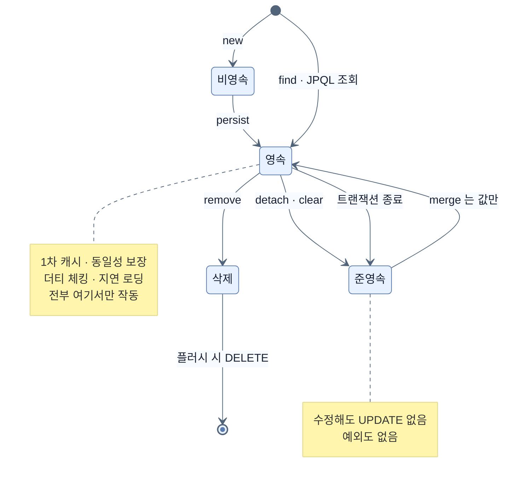

# 엔티티 생명주기와 준영속

## 한눈에 보기

| 질문 | 핵심 답 |
|---|---|
| 엔티티의 상태는 몇 가지인가? | 비영속 · 영속 · 준영속 · 삭제, 네 가지다. |
| 트랜잭션이 끝나면? | 그 안에서 다룬 엔티티가 전부 준영속이 된다. 고쳐도 반영되지 않는다. |
| `merge()`는 넘긴 객체를 영속으로 만드나? | 아니다. **다른 인스턴스**를 돌려준다. 원본은 준영속으로 남는다. |
| `save()`는 항상 `persist()`인가? | 아니다. `isNew()`가 거짓이면 `merge()`다. |
| 식별자를 직접 할당하면? | `isNew()`가 항상 거짓이 되어 INSERT마다 SELECT가 한 번 더 나간다. |

## 1. 왜 이게 필요한가

### 출발 장면: 왜 `save()`의 반환값을 돌려주는가

CosmoRoute의 `CuratedCatalogService`는 큐레이션 회사를 만들 때 이렇게 쓴다.

```java
@Transactional
public Company curate(...) {
    Company company = Company.curated(companyName, normalizedName, operatorId);
    return this.companies.save(company);   // 지역 변수 company 가 아니라 save() 의 반환값
}
```

`return company;`로 바꾸면 어떻게 될까. 같은 객체일 테니 차이가 없어 보인다. **경우에 따라 다르다.** 그리고 CosmoRoute의 구성에서는 실제로 **다른 객체**다.

이유는 두 단계로 얽혀 있다. 첫째, Spring Data의 `save()`는 무조건 `persist()`를 부르지 않는다. 둘째, `Company.curated()`가 식별자를 직접 할당한다.

```java
// SimpleJpaRepository — Spring Data JPA 의 실제 구현
@Override
@Transactional
public <S extends T> S save(S entity) {
    if (entityInformation.isNew(entity)) {
        entityManager.persist(entity);
        return entity;                    // 같은 객체
    } else {
        return entityManager.merge(entity);   // 다른 객체일 수 있다
    }
}
```

`Company`에는 `@Version`이 없고 식별자는 `UUID`다. `Company.curated()`가 `UUID.randomUUID()`로 값을 이미 채웠으므로 `isNew()`는 **거짓**을 반환한다. 그래서 `persist()`가 아니라 `merge()`가 호출되고, `merge()`는 넘긴 객체가 아니라 **다른 인스턴스**를 돌려준다.

즉 이 코드에서 `return this.companies.save(company)`는 취향이 아니라 **정확성**이다. `return company;`로 바꾸면 준영속 객체를 반환하게 되고, 호출부가 그걸 다시 고쳐도 아무 일도 일어나지 않는다.

### 여기서 뭐가 무너지나

지금까지 세 노트에서 다룬 메커니즘은 전부 하나의 조건 위에 있었다.

```text
1차 캐시 · 동일성 보장     엔티티가 영속성 컨텍스트 안에 있을 때만
쓰기 지연 · 자동 플러시     그 컨텍스트가 살아 있을 때만
더티 체킹 · 스냅샷 비교     순회 대상이 영속 상태일 때만
```

이 조건이 깨지는 순간이 언제인지 모르면, 다음 같은 코드가 **조용히** 실패한다.

```java
// 트랜잭션 밖
Company company = service.findById(id);   // 트랜잭션은 이 안에서 끝났다
company.rename("새 이름");                 // 아무 일도 일어나지 않는다
// UPDATE 가 나가지 않는다. 예외도 나지 않는다.
```

예외가 나면 차라리 낫다. **아무 일도 일어나지 않는 것**이 이 실패의 성질이다. 로그도 남지 않고 테스트도 통과할 수 있다 — 테스트가 같은 트랜잭션 안에서 돌면 더티 체킹이 작동해 버리기 때문이다.

그래서 "엔티티가 지금 어느 상태인가"를 판정할 수 있어야 한다.

### 그래서 나온 생각

JPA는 엔티티가 놓일 수 있는 자리를 네 가지로 정의한다. Hibernate 공식 문서의 표현으로는 transient · managed(persistent) · detached · removed다.

- **[[비영속-상태]]**(=`new`로 막 만들어 아직 컨텍스트에 넣지 않은 상태) — 컨텍스트도 DB 행도 없다.
- **영속 상태** — 컨텍스트가 추적하고 있다. 앞선 세 노트의 메커니즘이 전부 여기서만 작동한다.
- **[[준영속-상태]]**(=식별자는 있지만 컨텍스트가 더 이상 관리하지 않는 상태) — 한때 영속이었다가 떨어져 나왔다.
- **[[삭제-상태]]**(=`remove()`로 삭제가 예약된 상태) — 아직 컨텍스트가 관리하며 DELETE는 플러시 때 나간다.

비유하자면 **도서관 서가와 대출**이다. 책이 서가에 있으면 사서가 위치와 상태를 관리한다(영속). 빌려 나가면 사서의 관리 밖이다(준영속) — 집에서 밑줄을 그어도 도서관 목록은 바뀌지 않는다.

→ 비유가 깨지는 지점: 도서관은 빌려 간 **그 책**을 그대로 반납받는다. `merge()`는 다르다 — 내가 들고 온 책의 내용을 서가에 있는 **다른 책에 옮겨 적고, 그 서가 책을 돌려준다.** 내가 들고 온 책은 여전히 내 손에 남아 관리 밖이다. 이 지점부터 대출 비유는 틀리고, 이 차이가 출발 장면의 답이다.

## 2. 어떻게 동작하는가

### 2.1 네 상태와 전이

1. **비영속 → 영속: `persist()`** — 컨테이너가 추적을 시작해야 이후의 변경 감지와 지연 로딩이 성립하기 때문이다.
2. **없음 → 영속: `find()` · JPQL 조회** — DB에 있는 행을 이 트랜잭션에서 다룰 객체로 들여오기 위해서다.
3. **영속 → 삭제: `remove()`** — DELETE를 즉시 보내지 않고 예약해 두어야 다른 변경과 함께 순서를 조정할 수 있기 때문이다.
4. **영속 → 준영속: `detach()` · `clear()` · `close()` · 트랜잭션 종료** — 컨텍스트를 닫으면 그 안에 담긴 것을 더 이상 추적할 방법이 없기 때문이다. 이 떼어냄이 **[[분리]]**(=영속 엔티티를 컨텍스트에서 떼어 내 준영속으로 만드는 동작)다.
5. **준영속 → 영속: `merge()`** — 컨텍스트 밖에서 바뀐 값을 다시 반영하려면 그 값을 받아 줄 관리 인스턴스가 필요하기 때문이다. 이 값 옮기기가 **[[병합]]**(=준영속 객체의 값을 영속 인스턴스로 옮기고 **그 영속 인스턴스를 반환**하는 동작)이다. 화살표를 "준영속 객체가 영속이 된다"로 읽으면 안 된다 — 이동하는 것은 객체가 아니라 값이다.

실무에서 가장 자주 일어나는 전이는 4번이고, 가장 자주 오해되는 것은 5번이다.

### 2.2 `merge()`가 실제로 하는 일

Hibernate 공식 문서는 `merge()`를 이렇게 설명한다 — *"새 영속성 컨텍스트와 연결된 **구별되는(distinct)** 영속 인스턴스를 반환한다. 사실상 준영속 인스턴스를 같은 DB 행을 나타내는 영속 인스턴스와 교환하는 것이다."*

핵심은 "교환"이다. 넘긴 객체가 영속이 되는 것이 아니다.

1. **넘어온 객체의 식별자를 읽는다.** — 어느 행에 값을 옮겨 붙일지 정해야 하기 때문이다.
2. **그 식별자로 컨텍스트를 조회하고, 없으면 DB에서 SELECT한다.** — 값을 받아 줄 영속 인스턴스가 있어야 하고, 없으면 만들어야 하기 때문이다.
3. **넘어온 객체의 필드 값을 그 영속 인스턴스로 복사한다.** — 컨텍스트 밖에서 일어난 변경을 추적 대상 안으로 들여오기 위해서다.
4. **영속 인스턴스를 반환한다.** — 이후의 더티 체킹은 이 인스턴스에만 작동하므로, 호출부가 이쪽을 써야 하기 때문이다.
5. **넘어온 원본은 여전히 준영속이다.** — 컨텍스트에 등록된 적이 없기 때문이다.

2번의 SELECT가 중요하다. **`merge()`는 거의 항상 조회를 한 번 한다.** DB에 행이 없으면 그때 새 인스턴스를 만들어 INSERT로 이어진다.

### 2.3 CosmoRoute에서 실제로 일어나는 일

이제 출발 장면을 끝까지 따라갈 수 있다.

```text
Company.curated(...)              id = UUID.randomUUID()   → 비영속, 식별자 있음
companies.save(company)
  └ isNew(company)?               @Version 없음 · id != null  → false
  └ entityManager.merge(company)
       ① 식별자 UUID 로 컨텍스트 조회 → 없음
       ② DB SELECT ... WHERE id = ?  → 행 없음        ← 여분의 SELECT 1회
       ③ 새 영속 인스턴스를 만들고 값 복사
       ④ 영속 인스턴스 반환 (원본 company 와 다른 객체)
  └ 커밋 시점에 INSERT

return this.companies.save(company);   → 영속 인스턴스 반환  ✅
return company;                        → 준영속 원본 반환    ❌
```

INSERT 한 건마다 SELECT가 한 번 더 나간다. 회사 하나를 등록할 때는 무시할 만하지만, 원료에 성분 40개를 한꺼번에 붙이는 경로라면 SELECT가 40번 늘어난다.

이건 CosmoRoute의 실수가 아니라 **식별자를 애플리케이션이 할당하기로 한 결정의 대가**다. 그 결정에는 분명한 이득이 있다 — 앞 노트에서 본 대로 `IDENTITY`와 달리 쓰기 지연이 온전히 살아 있고, INSERT 전에 이미 식별자를 알 수 있어 연관 객체를 함께 조립하기 쉽다.

대가를 없애려면 Spring Data에게 "이건 새 엔티티다"를 직접 알려 주면 된다. Spring Data JPA 공식 문서가 이 상황을 위해 제시하는 방법이 `Persistable` 구현이다.

```java
@MappedSuperclass
public abstract class AbstractEntity<ID> implements Persistable<ID> {

    @Transient
    private boolean isNew = true;

    @Override
    public boolean isNew() { return isNew; }

    @PostPersist @PostLoad
    void markNotNew() { this.isNew = false; }
}
```

`@Transient`이라 DB에 저장되지 않고, `@PostPersist`·`@PostLoad` 콜백으로 "저장됐거나 조회됐다"는 사실을 표시한다. 이러면 새로 만든 객체는 `isNew()`가 참이라 `persist()`로 가고 여분의 SELECT가 사라진다.

> 다만 이건 지금 도입할 변경이 아니다. CosmoRoute의 등록 경로는 아직 건당 처리이고, 대량 삽입 경로가 생겼을 때 측정하고 결정하면 된다. 여기서는 **왜 그 선택지가 존재하는지**를 아는 것으로 충분하다.

### 2.4 `merge()`는 null 필드도 덮어쓴다

`merge()`는 넘어온 객체의 **모든 필드**를 복사한다. 채워지지 않은 필드는 `null`인 채로 복사된다.

```java
// 화면에서 이름만 받아 만든 객체
Company partial = new Company();
partial.setId(existingId);
partial.setCompanyName("새 이름");
// homepage, contactEmail, primarySourceUrl ... 전부 null

companies.save(partial);   // merge → 나머지 컬럼이 전부 null 로 덮인다
```

`update`라는 이름을 기대하고 쓰면 데이터가 지워진다. 부분 수정을 하려면 **엔티티를 먼저 조회해서 영속 상태로 만든 뒤 필요한 필드만 바꾸는 것**이 정석이다. 그러면 더티 체킹이 바뀐 것만 알아서 처리한다.

CosmoRoute가 `CuratedCatalogService`에서 조회 → 도메인 메서드 호출 방식을 쓰는 것이 이 정석에 해당한다. 요청 DTO를 그대로 엔티티로 바꿔 `save()`하는 방식은 편해 보이지만 이 함정을 그대로 밟는다.

### 2.5 삭제 상태는 즉시 삭제가 아니다

`remove()`를 부르면 엔티티는 삭제 상태가 된다. 여전히 컨텍스트가 관리하고 있고, DELETE는 플러시 시점에 나간다. `remove()` 직후 DB를 들여다봐도 행이 그대로 있는 이유가 이것이다.

CosmoRoute는 물리 삭제 대신 `deleted_at` 컬럼으로 소프트 삭제를 하므로 이 상태를 거의 쓰지 않는다. `deleted_at`을 채우는 것은 평범한 필드 변경이고, 따라서 더티 체킹으로 처리된다 — 삭제 상태 전이와는 아무 관계가 없다.

## 3. 그림으로 보기

### 네 상태와 전이



### `merge()`가 인스턴스를 교환한다

```text
[merge 를 오해한 그림 — 틀렸다]

  준영속 company ──merge()──▶ 같은 company 가 영속이 된다
                              (그래서 반환값을 안 써도 된다)


[실제로 일어나는 일]

  준영속 company            영속성 컨텍스트
  ┌──────────────┐          ┌──────────────────────────┐
  │ id  = U-1    │          │                          │
  │ name= "새"   │          │                          │
  └──────┬───────┘          └──────────────────────────┘
         │  merge()
         │  ① id 읽기 → ② SELECT WHERE id = U-1
         │  ③ 값 복사
         ▼
  ┌──────────────┐          ┌──────────────────────────┐
  │ id  = U-1    │          │  managed@7f3a            │
  │ name= "새"   │          │    id  = U-1             │
  │              │          │    name= "새"            │◀── merge() 의 반환값
  │ 여전히 준영속 │          │  스냅샷도 여기 붙는다     │
  └──────────────┘          └──────────────────────────┘
         ▲
    원본은 관리 밖에 남는다. 여기 대고 고쳐도 UPDATE 는 나가지 않는다.

  → "detach" 는 떼어낸다는 뜻이고, "merge" 는 합친다는 뜻이다.
    무엇에 합치는가 — 넘긴 객체에 합치는 게 아니라
    컨텍스트 안의 인스턴스에 합친다. 이름의 방향을 반대로 읽으면 전부 틀린다.
```

## 4. 이 노트에 나온 용어

| 용어 | 한 줄 풀이 | 자세히 |
|---|---|---|
| 비영속 상태 | `new`로 만들었고 아직 컨텍스트에 없는 상태 | [[_glossary#비영속-상태]] |
| 준영속 상태 | 식별자는 있지만 컨텍스트가 관리하지 않는 상태 | [[_glossary#준영속-상태]] |
| 삭제 상태 | `remove()`로 삭제가 예약된 상태. DELETE는 플러시 때 | [[_glossary#삭제-상태]] |
| 병합 | 준영속 객체의 값을 영속 인스턴스로 옮기고 그것을 반환 | [[_glossary#병합]] |
| 분리 | 영속 엔티티를 컨텍스트에서 떼어 내 준영속으로 만듦 | [[_glossary#분리]] |

## 5. 자주 헷갈리는 것

### `persist()` vs `merge()`

| 축 | `persist()` | `merge()` |
|---|---|---|
| 대상 상태 | 비영속 | 준영속 (또는 비영속) |
| 반환값 | 없음 (`void`) | 영속 인스턴스 — **넘긴 것과 다르다** |
| 넘긴 객체는 | 그 자체가 영속이 된다 | 준영속으로 남는다 |
| SELECT | 하지 않는다 | 거의 항상 한 번 한다 |
| 식별자 | 없어도 된다 | 있어야 한다 |

`persist()`는 반환값이 없다. 반환할 필요가 없기 때문이다 — 넘긴 그 객체가 영속이 된다. `merge()`에 반환값이 있는 것 자체가 "다른 객체를 준다"는 신호다.

### 준영속 vs 비영속

둘 다 "컨텍스트 밖"이지만 식별자 유무가 다르다. 비영속은 DB에 대응하는 행이 아직 없고, 준영속은 있다. 그래서 비영속은 `persist()`로, 준영속은 `merge()`로 들여온다. 식별자를 직접 할당하는 CosmoRoute 같은 설계에서는 이 구분이 겉보기로 안 되기 때문에 `Persistable` 같은 장치가 필요해진다.

### `save()` vs `persist()`

Spring Data의 `save()`는 JPA 메서드가 아니라 두 메서드 중 하나를 고르는 **분기**다. 2.1의 코드가 그 분기 전부다. "`save()` = `persist()`"로 외우면, 왜 어떤 경우엔 반환값이 다른 객체인지 설명할 수 없다.

### 소프트 삭제 vs 삭제 상태

CosmoRoute의 `deleted_at`을 채우는 것은 **필드 변경**이지 삭제 상태 전이가 아니다. 더티 체킹으로 UPDATE가 나갈 뿐 DELETE는 어디에도 없다. 둘을 같은 말로 쓰면 "삭제했는데 왜 DELETE 로그가 없지?"에서 막힌다.

## 6. 언제 안 쓰나 / 경계

- **`merge()`를 부분 수정에 쓰지 않는다.** 2.4에서 본 대로 `null` 필드까지 덮어쓴다. 조회 → 도메인 메서드 호출 → 더티 체킹이 정석이고, 이 방식은 도메인 규칙을 엔티티 안에 유지할 수 있다는 이득도 함께 준다.
- **트랜잭션 밖에서 엔티티를 고치지 않는다.** 준영속 상태에서의 수정은 예외 없이 조용히 무시된다. 컨트롤러나 응답 변환 계층에서 엔티티를 다루고 있다면 그 자체를 의심한다.
- **테스트가 통과한다고 안심하지 않는다.** 테스트 메서드에 `@Transactional`이 붙어 있으면 컨텍스트가 살아 있어 더티 체킹이 작동한다. 운영에서만 실패하는 코드가 이렇게 통과할 수 있다.
- **`Persistable` 도입은 측정 후에 한다.** 여분의 SELECT는 건당 처리에서는 문제가 되지 않는다. 대량 삽입 경로가 실제로 생기고, 쿼리 수를 측정해서 근거가 생겼을 때 도입한다.
- **상태 판정을 감으로 하지 않는다.** 애매하면 `entityManager.contains(entity)`로 확인할 수 있다. 이 메서드가 참이면 영속이고 거짓이면 그 컨텍스트 밖이다.

## 7. 연결

- [[03-dirty-checking-and-snapshots]] — 더티 체킹이 작동하는 조건이 "영속 상태"다. 이 노트는 그 조건이 언제 깨지는지를 정의한다.
- [[01-persistence-context-and-first-level-cache]] — 동일성 보장도 컨텍스트 안에서만 성립한다. 준영속 객체 둘은 같은 행을 가리켜도 `==`가 거짓이라, 그때부터 `equals`가 필요해진다.
- [[02-write-behind-and-flush]] — 식별자를 애플리케이션이 할당하기로 한 결정이 쓰기 지연에는 이득이고 `save()` 경로에는 대가였다. 같은 결정의 양면이다.

## 8. 스스로 확인

1. 네 가지 상태를 각각 "컨텍스트가 관리하는가 / 식별자가 있는가" 두 축으로 구분할 수 있는가?
2. `return this.companies.save(company)`를 `return company`로 바꾸면 무엇이 잘못되는가?
3. `merge()`가 넘긴 객체를 영속으로 만들지 않는다는 것을 그림으로 설명할 수 있는가?
4. `persist()`에는 반환값이 없고 `merge()`에는 있는 이유는 무엇인가?
5. 식별자를 애플리케이션이 할당하면 `isNew()`가 왜 거짓이 되고, 그 결과 무엇이 늘어나는가?
6. `Persistable`이 그 문제를 푸는 방식을 `@Transient`와 콜백으로 설명할 수 있는가?
7. `merge()`로 부분 수정을 하면 왜 데이터가 지워지는가? 정석 방식은 무엇인가?
8. 트랜잭션 밖 수정이 예외 없이 무시되는데도 테스트가 통과할 수 있는 이유는 무엇인가?
9. CosmoRoute의 `deleted_at` 갱신이 삭제 상태와 무관한 이유는 무엇인가?

<!-- ==== 아래는 내 영역 · 스킬 수정 금지 ==== -->

## 내 설명 시도


## 막혔던 지점


## 리뷰 이력
