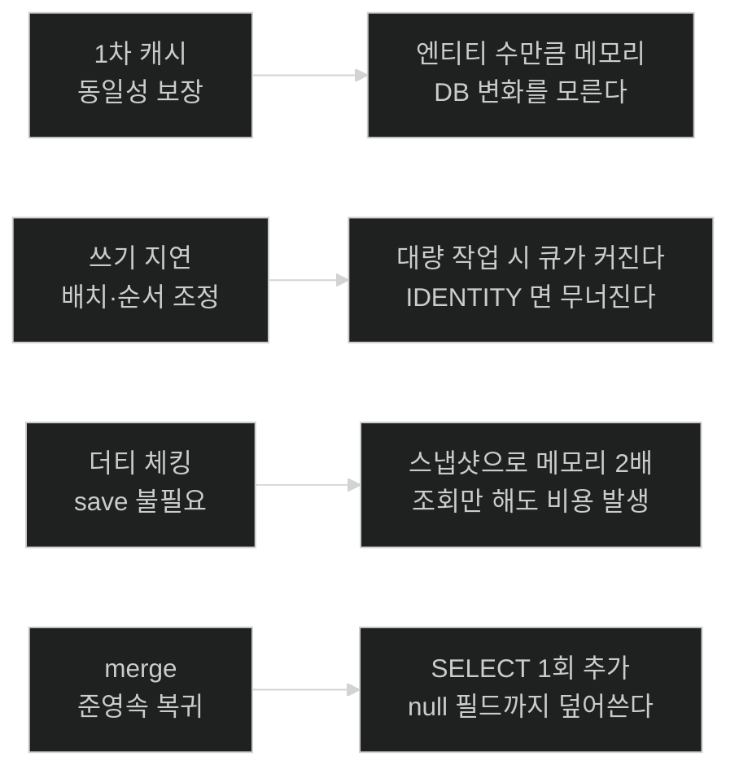

# chapter-j1 개념 지도 — 영속성 컨텍스트

> 목차가 아니라 관계도다. 세션을 열 때와 닫을 때 항상 펼친다.
>
> 이 챕터가 답하는 한 문장짜리 질문: **"내가 자바 객체의 필드를 바꿨을 때, 그것이 언제 어떤 조건에서 SQL이 되는가?"**

## 축 1: 상태 — 엔티티가 지금 어디에 있는가

앞으로 나올 모든 메커니즘은 "이 엔티티가 영속 상태인가"라는 조건 하나에 달려 있다. 그래서 이 축이 다른 모든 축의 전제다.

```text
비영속 ──persist──▶ 영속 ──remove──▶ 삭제
  ▲                  │
  │                  │ detach · clear · close · 트랜잭션 종료
  │                  ▼
  └── (아님) ──── 준영속 ──merge──▶ (값만 영속 인스턴스로)
```

- **핵심 질문**: 지금 손에 든 이 객체를 고치면 UPDATE가 나가는가? 판정 근거는 무엇인가?
- **주요 노드**: [[04-entity-lifecycle-and-detachment]]
- 준영속에서의 수정은 **예외 없이 조용히 무시된다.** 이 침묵이 이 축을 배워야 하는 이유다.

## 축 2: 시점 — 언제 무슨 일이 일어나는가

같은 메커니즘도 어느 시점의 이야기인지 구분하지 못하면 설명이 엉킨다. 특히 "플러시"와 "커밋"을 같은 시점으로 묶는 순간 절반이 틀린다.

| 시점 | 일어나는 일 | 노트 |
|---|---|---|
| 조회 | 1차 캐시 등록 + 스냅샷 복사 | [[01-persistence-context-and-first-level-cache]] |
| 필드 변경 | **아무 일도 일어나지 않는다** | [[03-dirty-checking-and-snapshots]] |
| 쿼리 실행 직전 | AUTO 모드면 자동 플러시 | [[02-write-behind-and-flush]] |
| 플러시 | 더티 체킹 → SQL 생성 → 전송 | [[02-write-behind-and-flush]], [[03-dirty-checking-and-snapshots]] |
| 커밋 | 플러시 후 확정 · 컨텍스트 종료 | [[02-write-behind-and-flush]] |
| 커밋 이후 | 모든 엔티티가 준영속 | [[04-entity-lifecycle-and-detachment]] |

- **핵심 질문**: "필드를 바꾼 시점"과 "SQL이 나가는 시점" 사이에 무엇이 끼어 있는가?

## 축 3: 비용 — 이 편의는 무엇으로 지불되는가

네 노트 전부가 편리한 자동화를 설명하지만, 각각 대가가 있다. 면접에서 갈리는 지점도 대개 이쪽이다.



- **핵심 질문**: 이 기능을 끄거나 우회하는 방법은 무엇이고, 언제 그래야 하는가?
- 답의 후보: `@Transactional(readOnly = true)` · DTO 직접 조회 · `flush()` + `clear()` · `Persistable`

## 축 4: CosmoRoute의 설계 결정과 맞물리는 지점

이 챕터의 예제는 전부 실제 저장소에서 왔다. 아래는 그 프로젝트가 이미 내린 결정이 이 챕터의 개념과 어디서 만나는지다.

| CosmoRoute의 결정 | 이 챕터에서의 결과 | 노트 |
|---|---|---|
| 식별자를 애플리케이션이 `UUID.randomUUID()`로 할당 | 쓰기 지연은 온전 · `save()`는 `merge()` 경로 | [[02-write-behind-and-flush]], [[04-entity-lifecycle-and-detachment]] |
| `JpaRepository` 대신 좁은 `Repository` 상속 | 조회가 전부 JPQL이라 `find()`의 캐시 단축이 안 걸린다 | [[01-persistence-context-and-first-level-cache]] |
| INV-8을 사전 검사 + 부분 유니크로 이중 강제 | 자동 플러시가 있어야 사전 검사가 성립 | [[02-write-behind-and-flush]] |
| 조회 경로에 `readOnly = true` 적용 | 더티 체킹·자동 플러시가 이미 꺼져 있다 | [[03-dirty-checking-and-snapshots]] |
| `@Version` 없음 | `@DynamicUpdate`를 지금 붙이면 위험 | [[03-dirty-checking-and-snapshots]] |
| 소프트 삭제(`deleted_at`) | 삭제 상태 전이를 쓰지 않는다 | [[04-entity-lifecycle-and-detachment]] |
| 도메인 게이트(`Material.publish()`) | 조회 → 도메인 메서드 → 더티 체킹이 자연스럽다 | [[03-dirty-checking-and-snapshots]] |

## 나의 취약 엣지

아직 인출 시도가 없다. 사용자가 노트를 읽고 인출 연습을 한 뒤 채운다. 추정으로 미리 채우지 않는다.

## 다음 챕터로 이어지는 곳

| 이 챕터의 끝 | 다음 챕터의 시작 |
|---|---|
| "영속 상태에서만 작동한다" | `chapter-j2` — 연관 객체는 언제 영속이 되는가 (프록시·지연 로딩) |
| "플러시 시점에 SQL이 만들어진다" | `chapter-j3` — 그 SQL이 N+1이 되는 조건 |
| "`@Version`이 없어서 `@DynamicUpdate`가 위험하다" | `chapter-j3` — 낙관적 락과 격리 수준 |
| "트랜잭션이 끝나면 준영속" | `chapter-j3` — OSIV가 그 경계를 어떻게 미루는가 |

## 관련 카테고리

- `part-2/chapter-3-querying-for-data-with-spring-boot` — 이 챕터가 그 Chapter의 **선행**이다. 책은 리포지토리와 쿼리 작성법을 다루지만 그 아래층인 영속성 컨텍스트를 다루지 않는다.
- `part-1/chapter-1-core-features-of-spring-boot` — 영속성 컨텍스트도 결국 컨테이너가 관리하는 자원이다. `@Transactional` 프록시가 그 경계를 만든다.
