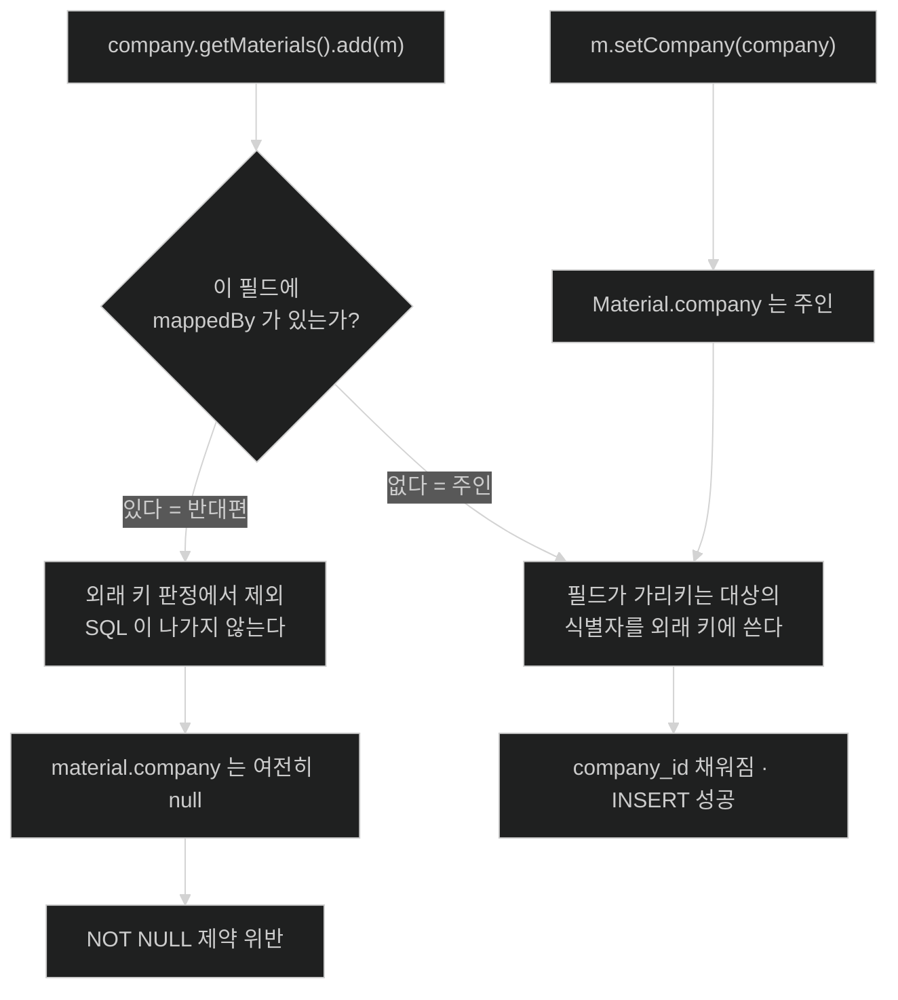

# 연관관계 주인과 mappedBy

## 한눈에 보기

| 질문 | 핵심 답 |
|---|---|
| 왜 주인을 정해야 하나? | 객체 참조는 양쪽에 둘 수 있는데 테이블의 외래 키는 하나뿐이다. |
| 누가 주인인가? | 외래 키 컬럼을 가진 테이블 쪽. 즉 `@ManyToOne`이 있는 쪽이다. |
| `mappedBy`는 무슨 뜻인가? | "나는 주인이 아니고, 외래 키는 저쪽 필드가 관리한다"는 선언이다. |
| 반대편 컬렉션에 넣으면? | 외래 키가 바뀌지 않는다. 아무 SQL도 나가지 않는다. |
| 양방향이 항상 나은가? | 아니다. 단방향으로 되면 단방향이 낫다. 동기화 책임이 안 생긴다. |

## 1. 왜 이게 필요한가

### 출발 장면: 컬렉션에 넣었는데 외래 키가 비어 있다

CosmoRoute의 `Material`은 지금 이렇게 회사를 참조한다. 이 프로젝트에 존재하는 유일한 연관관계 매핑이다.

```java
// Material.java
@ManyToOne(fetch = FetchType.LAZY, optional = false)
@JoinColumn(name = "company_id", nullable = false)
private Company company;
```

`Company` 쪽에는 아무것도 없다. 원료에서 회사로만 갈 수 있는 **[[단방향-연관]]**(=한쪽에서만 상대를 참조하는 매핑)이다.

이제 관리자 화면에서 "이 회사가 가진 원료 목록"이 필요해졌다고 하자. 반대 방향도 열어 두면 편할 것 같아 `Company`에 컬렉션을 추가한다. 이렇게 양쪽이 서로를 참조하게 만든 것이 **[[양방향-연관]]**(=양쪽이 서로를 참조하는 매핑. DB의 외래 키는 여전히 하나뿐이다)이다.

```java
// Company.java 에 추가한다고 하자
@OneToMany(mappedBy = "company")
private List<Material> materials = new ArrayList<>();
```

그리고 원료를 하나 붙인다.

```java
@Transactional
public void attach(UUID companyId, Material material) {
    Company company = repository.findCuratedById(companyId).orElseThrow();
    company.getMaterials().add(material);   // 컬렉션에 넣었다
    materials.save(material);
}
```

커밋하면 터진다. `material.company_id`가 `NULL`인 채로 INSERT되어 `NOT NULL` 제약에 걸린다. 컬렉션에 분명히 넣었는데도 그렇다.

`mappedBy`를 지우면 어떨까. 이번엔 다른 문제가 생긴다 — JPA가 이 연관을 별개의 조인 테이블로 해석해 존재하지 않는 테이블을 찾는다. `ddl-auto: validate`인 CosmoRoute에서는 **애플리케이션이 아예 뜨지 않는다.**

### 여기서 뭐가 무너지나

문제의 뿌리는 개수 불일치다.

```text
객체 세계    material.company        참조 1개
             company.materials       참조 1개      →  총 2개

테이블 세계  material.company_id     외래 키 1개   →  총 1개
```

참조 두 개를 컬럼 하나로 매핑해야 한다. 그러면 반드시 답해야 하는 질문이 생긴다 — **둘이 어긋나면 어느 쪽을 믿을 것인가.**

```java
material.setCompany(companyA);        // 원료는 A 를 가리킨다
companyB.getMaterials().add(material); // 회사 B 는 이 원료를 갖고 있다고 주장한다
```

`company_id`에 무엇을 써야 하나. 둘 다 볼 수는 없다. 매번 개발자에게 물을 수도 없다. 그래서 JPA는 **어느 쪽을 볼지 미리 고정한다.**

### 그래서 나온 생각

외래 키를 실제로 읽고 쓰는 쪽을 하나 정하고, 그쪽 필드만 본다. 그 정해진 쪽이 **[[연관관계-주인]]**(=양방향 연관에서 외래 키를 실제로 읽고 쓰는 쪽)이다. 나머지 한쪽은 **[[반대편]]**(=주인이 아닌 쪽. `mappedBy`로 그 사실을 선언한다)이다.

주인은 고를 수 있는 것이 아니다. **외래 키 컬럼을 가진 테이블에 대응하는 엔티티가 주인**이다. `material` 테이블에 `company_id`가 있으므로 `Material.company`가 주인이고, `Company.materials`는 반대편일 수밖에 없다.

`mappedBy = "company"`는 "이 컬렉션의 외래 키는 `Material` 클래스의 `company` 필드가 관리한다"는 선언이다. 즉 **소유권 주장이 아니라 소유권 포기 선언**이다. 이름이 헷갈리는 지점이 여기다 — `mappedBy`는 "내가 저것을 매핑한다"가 아니라 "나는 저것에 의해(by) 매핑된다"는 수동태다.

비유하자면 **등기부와 내 수첩**이다. 부동산 소유권의 진실은 등기부(외래 키)에 있다. 내 수첩에 "이 건물은 내 것"이라고 적는다고 등기가 바뀌지는 않는다.

→ 비유가 깨지는 지점: 수첩과 등기부가 달라지면 수첩이 그냥 낡은 상태로 남는다. 반대편 컬렉션은 다르다 — **커밋하고 트랜잭션을 새로 열면 DB에서 다시 읽어 와 저절로 맞아진다.** 어긋나는 것은 오직 **같은 트랜잭션 안에서만**이다. 그래서 이 사고는 다음 요청에서는 멀쩡해 보이고, 테스트에서도 잘 잡히지 않는다. "낡은 사본"이 아니라 "잠깐 어긋났다가 스스로 사라지는 불일치"라는 점에서 비유가 멈춘다.

## 2. 어떻게 동작하는가

### 2.1 플러시 시점에 JPA가 보는 것

1. **플러시가 시작되고 더티 체킹이 돈다.** — 앞 챕터에서 본 그대로다.
2. **연관 필드 중 주인 쪽만 검사한다.** `Material.company`를 본다. — 외래 키 컬럼과 대응하는 필드가 그것뿐이기 때문이다.
3. **`mappedBy`가 붙은 필드는 외래 키 판정에서 제외한다.** `Company.materials`는 아예 보지 않는다. — 하나의 컬럼에 두 개의 진실이 생기는 것을 막기 위해서다.
4. **주인 필드가 가리키는 대상의 식별자를 외래 키 컬럼에 쓴다.** — 참조를 컬럼 값으로 번역해야 DB에 저장할 수 있기 때문이다.
5. **주인 필드가 `null`이면 외래 키도 `null`이 된다.** — 컬렉션에 무엇이 들어 있든 상관없다.

출발 장면이 실패한 이유가 5번이다. `company.getMaterials().add(material)`은 3번에서 무시되고, `material.company`는 여전히 `null`이다.

### 2.2 그래서 무엇을 해야 하나

주인 쪽을 세팅해야 한다.

```java
material.setCompany(company);   // 이것만으로 외래 키가 채워진다
```

컬렉션에 넣는 것은 외래 키와 무관하다. 그런데 같은 트랜잭션 안에서 `company.getMaterials()`를 다시 읽는 코드가 있다면, 거기엔 방금 붙인 원료가 없다. DB에는 반영됐는데 이미 메모리에 로딩된 컬렉션은 그대로이기 때문이다.

그래서 양방향을 쓸 거면 **양쪽을 같이 맞춰야 한다.** 그 일을 한 메서드로 묶은 것이 **[[연관관계-편의-메서드]]**(=양방향 연관에서 양쪽 참조를 한 번에 맞춰 주는 메서드)다.

```java
// Company.java
void addMaterial(Material material) {
    this.materials.add(material);   // 객체 그래프 탐색을 위해
    material.setCompany(this);      // 외래 키를 위해 — 이 줄이 실제 저장을 만든다
}
```

두 줄의 역할이 다르다는 점이 중요하다. 첫 줄은 **메모리 안의 일관성**을 위한 것이고, 둘째 줄만이 **SQL을 만든다.** 첫 줄을 빼도 저장은 되고, 둘째 줄을 빼면 아무것도 저장되지 않는다.

### 2.3 그런데 CosmoRoute는 양방향이 필요한가

여기서 한 걸음 물러설 필요가 있다. Hibernate 공식 문서는 양방향 연관을 이렇게 설명한다 — *"부모와 자식 양쪽에서 탐색할 수 있게 되지만, **데이터베이스에는 여전히 외래 키가 하나뿐이다.**"*

즉 양방향은 **테이블 구조를 바꾸지 않는다.** 순전히 객체 쪽 편의이고, 그 편의의 대가로 동기화 책임이 생긴다.

"이 회사의 원료 목록"이 필요하다면 컬렉션 없이도 얻을 수 있다.

```java
// MaterialRepository
@Query("SELECT m FROM Material m WHERE m.company.id = :companyId AND " + CatalogVisibility.SUPPLY
        + " ORDER BY m.name ASC")
List<Material> findPublishedByCompany(UUID companyId);
```

이쪽이 나은 이유가 CosmoRoute의 설계와 맞물린다.

- **가시성 조건을 걸 수 있다.** `company.getMaterials()`는 숨김·삭제·미공개 원료까지 전부 가져온다. INV-14·INV-15가 요구하는 필터를 컬렉션에는 붙일 수 없다.
- **`CompanyRepository`의 철학과 일관된다.** 그 인터페이스는 *"필터 없는 조회를 공짜로 얻으면 주인 없는 큐레이션 제조사가 공급사 목록으로 샌다"*는 이유로 `JpaRepository`를 상속하지 않는다. 필터 없는 컬렉션을 엔티티에 다는 것은 같은 구멍을 다른 문으로 여는 일이다.
- **원료가 많은 회사에서 전량 로딩이 일어나지 않는다.** 컬렉션은 페이징이 어렵지만 쿼리는 자연스럽다.

**단방향으로 되면 단방향이 낫다.** 양방향은 "객체 그래프를 타고 탐색해야만 하는 이유"가 실제로 생겼을 때 추가한다.

### 2.4 반대편이 그래도 필요한 경우

전부 단방향이 답인 것은 아니다. Hibernate 문서는 양방향의 이점을 *"자식이 연관을 제어하므로 자식 엔티티를 관리하기에 더 효율적"*이라고 표현한다. 다음 경우에는 반대편을 두는 값이 있다.

- **부모가 자식의 생명주기를 소유할 때.** 영속성 전이와 고아 객체 제거를 걸려면 부모 쪽 컬렉션이 있어야 한다. 이건 다섯 번째 노트의 주제다.
- **자식 없이는 부모가 성립하지 않을 때.** 주문과 주문 항목처럼 개수가 적고 항상 함께 다뤄지는 관계.
- **도메인 규칙이 컬렉션 전체를 봐야 할 때.** "이 원료에 연결된 성분이 하나 이상이어야 한다" 같은 불변식은 컬렉션이 있어야 엔티티 안에서 검사할 수 있다.

마지막 항목이 다음 노트에서 실제로 등장한다. 원료와 성분의 연결이 그렇다.

## 3. 그림으로 보기

### 참조 두 개가 컬럼 하나로 접히는 지점

```text
[객체 세계 — 참조 2개]

   Company                              Material
   ┌──────────────────────┐             ┌──────────────────────┐
   │ materials  ──────────┼────────────▶│                      │
   │  (@OneToMany         │             │  company  ───────────┼──┐
   │   mappedBy="company")│◀────────────┼──────────────────────┘  │
   └──────────────────────┘             └─────────────────────────┘
            반대편                                주인
       외래 키 판정에서 제외              @JoinColumn(company_id)


[테이블 세계 — 외래 키 1개]

   company                    material
   ┌──────────┐               ┌──────────────────────┐
   │ id (PK)  │◀──────────────┤ company_id (FK)      │
   └──────────┘               │ name · slug · ...    │
                              └──────────────────────┘

   → 접히는 지점에서 정보가 하나 사라진다. 그 사라진 하나가
     "어느 참조를 믿을 것인가" 이고, mappedBy 가 그 답을 적어 둔다.
     mappedBy 는 능동태가 아니라 수동태다 — "나는 저 필드에 의해 매핑된다".
```

### 컬렉션에 넣었을 때 실제로 일어나는 일



## 4. 이 노트에 나온 용어

| 용어 | 한 줄 풀이 | 자세히 |
|---|---|---|
| 연관관계 주인 | 외래 키를 실제로 읽고 쓰는 쪽 | [[_glossary#연관관계-주인]] |
| 반대편 | 주인이 아닌 쪽. `mappedBy`로 선언한다 | [[_glossary#반대편]] |
| 단방향 연관 | 한쪽에서만 상대를 참조하는 매핑 | [[_glossary#단방향-연관]] |
| 양방향 연관 | 양쪽이 서로를 참조하는 매핑 | [[_glossary#양방향-연관]] |
| 연관관계 편의 메서드 | 양쪽 참조를 한 번에 맞춰 주는 메서드 | [[_glossary#연관관계-편의-메서드]] |

## 5. 자주 헷갈리는 것

### `mappedBy` vs `@JoinColumn`

| 축 | `mappedBy` | `@JoinColumn` |
|---|---|---|
| 붙는 쪽 | 반대편 | 주인 |
| 뜻 | "외래 키는 저 필드가 관리한다" | "이 필드는 이 컬럼에 매핑된다" |
| 값 | **상대 엔티티의 필드 이름** | **DB 컬럼 이름** |
| 빠뜨리면 | JPA가 조인 테이블을 가정한다 | 컬럼 이름을 규칙으로 추론한다 |

`mappedBy`의 값이 컬럼 이름이 아니라 **자바 필드 이름**이라는 점이 특히 자주 틀린다. `mappedBy = "company_id"`가 아니라 `mappedBy = "company"`다.

### 주인 vs "부모"

주인은 도메인의 부모·자식과 무관하다. 개념적으로는 회사가 원료의 부모지만, 외래 키를 가진 쪽은 자식인 원료다. 그래서 **자식이 주인**이다. "부모가 소유하니까 부모가 주인"이라고 읽으면 반대로 매핑하게 된다.

### 양방향 vs 테이블 구조

양방향으로 바꿔도 DDL은 한 글자도 바뀌지 않는다. 순전히 객체 쪽 이야기다. 반대로 말하면, 양방향으로 바꿨는데 스키마 마이그레이션이 필요하다고 느낀다면 매핑을 잘못 짚은 것이다.

### 컬렉션 초기화 vs 연관 설정

`new ArrayList<>()`로 필드를 초기화하는 것은 `NullPointerException`을 막기 위한 자바 관례일 뿐, 연관관계와 아무 상관이 없다. 초기화했다고 컬렉션이 DB와 이어지지는 않는다.

## 6. 언제 안 쓰나 / 경계

- **양방향을 기본값으로 삼지 않는다.** 탐색이 실제로 필요할 때만 추가한다. 추가하는 순간 동기화 책임과 필터 없는 전량 로딩 위험이 함께 온다.
- **반대편 컬렉션에 도메인 필터를 기대하지 않는다.** CosmoRoute처럼 가시성 규칙이 조회 시점에 계산되는(ADR-0002) 설계에서는 컬렉션이 그 규칙을 우회한다. 필터가 필요한 조회는 리포지토리 쿼리로 둔다.
- **편의 메서드를 만들었다면 반대쪽 제거도 함께 만든다.** `addMaterial`만 있고 `removeMaterial`이 없으면, 제거 경로에서 같은 불일치가 다시 생긴다.
- **`mappedBy`를 지워서 문제를 "해결"하지 않는다.** 지우면 JPA가 조인 테이블을 가정해 전혀 다른 스키마를 기대한다. `ddl-auto: validate`에서는 부팅 실패로 즉시 드러나지만, 그렇지 않은 환경에서는 엉뚱한 테이블이 만들어진다.

## 7. 연결

- [[02-join-entity-instead-of-many-to-many]] — 조인 테이블이 엔티티로 승격되면 다대다 하나가 다대일 두 개가 된다. 그 두 개 모두 이 노트의 주인 규칙을 따른다.
- [[04-proxies-and-lazy-loading]] — `Material.company`가 `LAZY`라는 사실이 무엇을 반환하게 만드는지 다룬다. 주인 쪽 참조가 실제로는 프록시다.
- [[05-cascade-orphan-removal-vs-db-cascade]] — 영속성 전이와 고아 객체 제거는 반대편 컬렉션이 있어야 걸 수 있다. 양방향을 도입할 만한 몇 안 되는 이유 중 하나다.

## 8. 스스로 확인

1. 참조가 둘인데 컬럼이 하나라는 사실에서 왜 "주인"이라는 개념이 필요해지는가?
2. `Material`과 `Company` 중 누가 주인인지, 그 판정 근거는 무엇인가?
3. `mappedBy`가 수동태라는 말은 무슨 뜻인가?
4. 반대편 컬렉션에 넣기만 했을 때 아무 SQL도 나가지 않는 이유를 플러시 단계로 설명할 수 있는가?
5. 편의 메서드의 두 줄 중 실제로 SQL을 만드는 줄은 어느 쪽인가?
6. CosmoRoute가 `Company.materials`를 두지 않고 리포지토리 쿼리를 쓰는 편이 나은 이유를 세 가지로 댈 수 있는가?
7. `mappedBy`를 지우면 왜 부팅이 실패하는가?
8. 양방향으로 바꿔도 DDL이 바뀌지 않는 이유는 무엇인가?


> 여덟 문항을 스스로 답한 **뒤에** [[_01-association-owner-and-mappedby]]에서 모범답안과 대조한다. 먼저 열면 이 문항들은 다시 인출 문제로 쓸 수 없다.

<!-- ==== 아래는 내 영역 · 스킬 수정 금지 ==== -->

## 내 설명 시도


## 막혔던 지점


## 리뷰 이력
