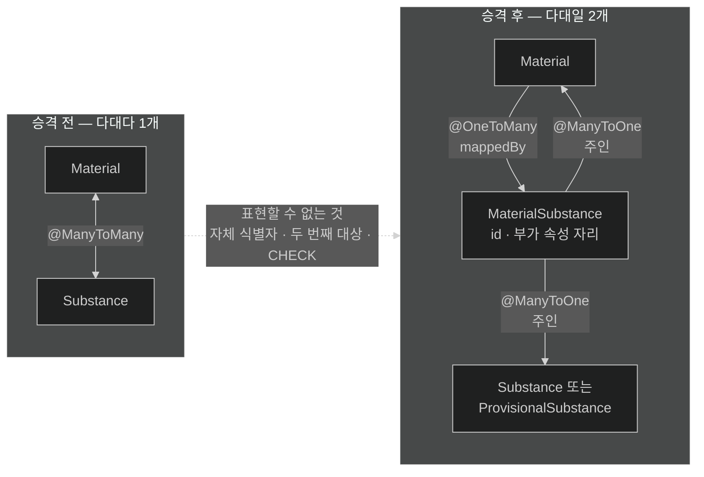

# 다대다를 연결 엔티티로 푸는 이유

## 한눈에 보기

| 질문 | 핵심 답 |
|---|---|
| `@ManyToMany`는 무엇을 가정하나? | 조인 테이블에 **외래 키 두 개만** 있다고 가정한다. |
| CosmoRoute에서 왜 못 쓰나? | `material_substance`에 자체 식별자가 있고 대상이 두 종류다. |
| 대안은? | 조인 테이블을 엔티티로 승격시킨다 — 연결 엔티티. |
| 승격하면 뭐가 달라지나? | 다대다 하나가 **다대일 두 개**가 된다. 특수 매핑이 사라진다. |
| 언제 승격하나? | "부가 속성이 생기면"이 아니라 **처음부터**다. |

## 1. 왜 이게 필요한가

### 출발 장면: 이 테이블을 `@ManyToMany`로 매핑할 수 있는가

CosmoRoute의 첫 슬라이스는 원료와 성분을 잇는 것이다. 스키마는 이미 있다.

```sql
CREATE TABLE material_substance (
    id             uuid PRIMARY KEY DEFAULT gen_random_uuid(),
    material_id    uuid NOT NULL REFERENCES material (id) ON DELETE CASCADE,
    canonical_id   text REFERENCES substance (canonical_id) ON DELETE RESTRICT,
    provisional_id uuid REFERENCES provisional_substance (id) ON DELETE RESTRICT,
    CONSTRAINT material_substance_one_target
        CHECK (num_nonnulls(canonical_id, provisional_id) = 1)
);
```

"원료 하나에 성분 여럿, 성분 하나가 원료 여럿"이니 전형적인 다대다로 보인다. JPA에는 그걸 위한 애노테이션이 있다.

```java
// 이렇게 쓰고 싶어진다
@ManyToMany
@JoinTable(name = "material_substance",
        joinColumns = @JoinColumn(name = "material_id"),
        inverseJoinColumns = @JoinColumn(name = "canonical_id"))
private List<Substance> substances = new ArrayList<>();
```

**이 매핑은 이 도메인을 표현할 수 없다.** 문법이 틀려서가 아니라, 표현할 수 있는 범위가 도메인보다 좁아서다.

### 여기서 뭐가 무너지나

`@ManyToMany`가 다루는 것은 **[[조인-테이블]]**(=두 테이블의 다대다 관계를 잇기 위해 양쪽 외래 키를 담는 테이블)인데, 그 테이블에 **외래 키 두 개만 있다고 가정**한다. 위 스키마는 그 가정을 세 군데서 벗어난다.

- **자체 식별자가 있다.** `id uuid PRIMARY KEY`. `@ManyToMany`는 조인 테이블의 기본 키를 두 외래 키의 복합키로 본다. 별도 `id` 컬럼은 매핑 대상이 아니라서 JPA가 읽지도 쓰지도 관리하지도 않는다. DB 기본값이 값을 채워 주긴 하지만, 애플리케이션은 그 행을 식별자로 지목할 수 없다.
- **대상이 두 종류다.** `canonical_id`는 정식 성분을, `provisional_id`는 잠정 성분을 가리킨다. `inverseJoinColumns`에는 컬럼 하나만 적을 수 있다. 위 매핑으로는 **정식 성분 연결만 표현되고 잠정 성분 연결은 존재하지 않는 것이 된다.**
- **테이블에 제약이 걸려 있다.** INV-9(`num_nonnulls(...) = 1`)는 "둘 중 정확히 하나"를 요구한다. `@ManyToMany`는 이 규칙을 알지 못하고, 알 방법도 없다.

두 번째가 결정적이다. 잠정 성분은 곁다리 기능이 아니다 — 운영자가 아직 정식 성분에 매칭되지 않은 성분을 임시로 등재하는 경로이고, INV-10이 *"발견 원료와 공급 원료가 이 조인을 공유한다"*고 못 박은 대상이다. **매핑이 도메인의 절반을 삼켜 버린다.**

### 그래서 나온 생각

조인 테이블을 "두 테이블 사이의 배관"으로 보지 말고, **그 자체를 하나의 개념으로 승격**시킨다. 그렇게 만든 엔티티가 **[[연결-엔티티]]**(=조인 테이블 자체를 엔티티로 승격시킨 것)다.

승격하면 구조가 바뀐다.

```text
[다대다로 볼 때]        Material ═══════多대多═══════ Substance
                                  (조인 테이블은 숨은 배관)

[연결 엔티티로 볼 때]   Material ◀──多대一── MaterialSubstance ──多대一──▶ Substance
                                             (이제 이름과 정체성을 가진 개념)
```

**다대다 하나가 다대일 두 개가 된다.** 이것이 이 방식의 핵심 이득이다. 다대다라는 특수한 매핑 종류가 아예 사라지고, 앞 노트에서 다룬 다대일 규칙 하나로 전부 설명된다.

비유하자면 **수강신청**이다. 학생과 과목은 다대다로 보이지만, 실제 도메인에는 "수강"이라는 개념이 따로 있다. 거기에 수강일·성적·재수강 여부가 붙는다. 학생과 과목 사이의 선이 아니라 **그 사이에 놓인 사물**이다.

→ 비유가 깨지는 지점: 수강은 처음부터 이름이 있고 누구나 개념으로 인정한다. `material_substance`는 그렇지 않다 — 처음에는 "그냥 연결"로 보이고, 함량이나 표시 순서나 출처가 나중에 붙는다. **언제 승격해야 하는지가 미리 보이지 않는다.** 그래서 실무 규칙이 "부가 속성이 생기면 승격"이 아니라 "**처음부터 승격**"이 된다. 이 지점부터 수강 비유는 판단 기준을 주지 못한다.

## 2. 어떻게 동작하는가

### 2.1 승격한 매핑의 뼈대

```java
@Entity
@Table(name = "material_substance")
public class MaterialSubstance {

    @Id
    @Column(name = "id", nullable = false, updatable = false)
    private UUID id;

    @ManyToOne(fetch = FetchType.LAZY, optional = false)
    @JoinColumn(name = "material_id", nullable = false)
    private Material material;

    // canonical_id 와 provisional_id 를 어떻게 다룰지는 다음 노트의 주제다.
}
```

1. **`@Entity`를 붙인다.** — 이 테이블의 행 하나를 애플리케이션이 지목하고 다룰 수 있어야 하기 때문이다.
2. **`id`를 매핑한다.** — 조인 테이블에 이미 있는 자체 식별자를 JPA가 알게 해야 하기 때문이다. CosmoRoute의 다른 엔티티처럼 애플리케이션이 값을 할당한다.
3. **`material_id`를 `@ManyToOne`으로 매핑한다.** — 앞 노트의 주인 규칙 그대로다. 외래 키를 가진 이쪽이 주인이다.
4. **`fetch = LAZY`를 명시한다.** — `@ManyToOne`의 기본값이 즉시 로딩이라, 연결 하나를 읽을 때마다 원료를 통째로 끌고 오게 되기 때문이다. 이유는 네 번째 노트에서 다룬다.
5. **`optional = false`를 붙인다.** — DDL의 `NOT NULL`과 매핑을 일치시켜야 `ddl-auto: validate`를 통과하고, Hibernate가 조인 종류를 최적화할 수 있기 때문이다.

### 2.2 원료 쪽에 컬렉션을 둘 것인가

앞 노트에서 "단방향으로 되면 단방향이 낫다"고 정리했다. 그런데 이번에는 반대편을 둘 이유가 있다.

```java
// Material.java
@OneToMany(mappedBy = "material", cascade = CascadeType.ALL, orphanRemoval = true)
private List<MaterialSubstance> substanceLinks = new ArrayList<>();
```

이유는 두 가지다.

- **생명주기가 종속적이다.** 연결 행은 원료 없이 존재할 이유가 없다. 원료가 지워지면 연결도 지워져야 하고, 실제로 DDL에 `ON DELETE CASCADE`가 이미 걸려 있다. 이 관계를 매핑에 반영하려면 부모 쪽 컬렉션이 필요하다 — 다섯 번째 노트의 주제다.
- **불변식이 컬렉션 전체를 봐야 성립한다.** "같은 원료에 같은 성분을 두 번 연결하지 않는다"는 부분 유니크 인덱스로 DB가 막고 있지만, 그 전에 읽을 수 있는 오류로 걸러 내려면 엔티티 안에서 기존 목록을 확인해야 한다. CosmoRoute가 INV-8을 사전 검사와 DB 제약으로 이중 강제한 것과 같은 방식이다.

두 번째가 특히 중요하다. 컬렉션이 있으면 도메인 규칙이 엔티티 안에 들어온다.

```java
// Material.java
void link(MaterialSubstance link) {
    if (this.substanceLinks.stream().anyMatch(link::sameTarget)) {
        throw new CuratedCatalogRuleViolation("이미 연결된 성분");
    }
    this.substanceLinks.add(link);
    link.setMaterial(this);   // 외래 키를 만드는 줄
}
```

`Material.publish()`가 INV-13의 게이트인 것과 같은 패턴이다. **규칙이 서비스가 아니라 엔티티 안에 있다.**

### 2.3 `@ManyToMany`를 실무에서 피하는 더 일반적인 이유

CosmoRoute는 스키마가 이미 승격을 강제하지만, 스키마가 순수한 조인 테이블이어도 `@ManyToMany`를 피하는 것이 보통이다.

- **속성이 붙는 순간 파괴적이다.** 나중에 함량이나 표시 순서가 필요해지면 `@ManyToMany`로는 표현할 수 없다. 그때 연결 엔티티로 바꾸면 컬렉션 타입이 `List<Substance>`에서 `List<MaterialSubstance>`로 바뀌고, 그 컬렉션을 쓰던 코드가 전부 따라 바뀐다.
- **삭제 동작이 직관과 다르다.** 컬렉션에서 하나를 빼면 Hibernate가 조인 행 전체를 지우고 남은 것을 다시 넣는 경우가 있다. 연결 엔티티면 그 행 하나만 지운다.
- **행을 지목할 수 없다.** "이 연결의 출처가 무엇인지" 같은 질문에 답하려면 연결 자체에 식별자가 있어야 한다.

세 번째는 CosmoRoute에서 곧 실제 요구가 된다. 발견 카탈로그는 출처와 확인일을 노출하는 것이 INV-13의 핵심인데, 그 정보가 연결 단위로 필요해지면 연결에 식별자가 있어야 한다.

## 3. 그림으로 보기

### `@ManyToMany`가 표현하지 못하는 부분

```text
스키마가 실제로 요구하는 것
┌─────────────────────────────────────────────────────────────┐
│ material_substance                                          │
│   id             ← 자체 식별자                               │
│   material_id    ← 외래 키 1                                 │
│   canonical_id   ┐                                          │
│   provisional_id ┘ ← 둘 중 정확히 하나 (CHECK · INV-9)       │
└─────────────────────────────────────────────────────────────┘

@ManyToMany 가 가정하는 것
┌─────────────────────────────────────────────────────────────┐
│ 조인 테이블                                                  │
│   외래 키 1                                                  │
│   외래 키 2        ← 여기까지가 전부. PK 는 이 둘의 복합키    │
└─────────────────────────────────────────────────────────────┘

           ▲ 표현할 수 없는 것: 자체 식별자 · 두 번째 대상 · CHECK

  → 매핑이 도메인보다 좁으면, 좁은 쪽에 도메인을 우겨넣게 된다.
    이번 경우 삼켜지는 것은 "잠정 성분 연결" 전체다.
```

### 승격 전후



## 4. 이 노트에 나온 용어

| 용어 | 한 줄 풀이 | 자세히 |
|---|---|---|
| 조인 테이블 | 다대다를 잇기 위해 양쪽 외래 키를 담는 테이블 | [[_glossary#조인-테이블]] |
| 연결 엔티티 | 조인 테이블 자체를 엔티티로 승격시킨 것 | [[_glossary#연결-엔티티]] |

## 5. 자주 헷갈리는 것

### `@ManyToMany` vs 연결 엔티티

| 축 | `@ManyToMany` | 연결 엔티티 |
|---|---|---|
| 조인 테이블의 정체 | 숨은 배관 | 이름을 가진 도메인 개념 |
| 매핑 종류 | 다대다 1개 | 다대일 2개 |
| 부가 속성 | 불가능 | 자유롭게 추가 |
| 행 지목 | 불가능 | 식별자로 가능 |
| 컬렉션 원소 타입 | 상대 엔티티 | 연결 엔티티 |
| 속성 추가 시 | 매핑과 사용처를 전부 교체 | 필드 하나 추가 |

### 연결 엔티티 vs 임베디드 타입

둘 다 "테이블 하나를 다른 방식으로 본다"는 인상이 있지만 다르다. 임베디드 타입은 **자체 식별자가 없고** 소유 엔티티의 일부로 취급된다. 연결 엔티티는 식별자를 갖고 독립적으로 지목된다. `material_substance`에 `id`가 있다는 사실 자체가 이미 답을 정해 준다.

### 복합키 연결 엔티티 vs 대리키 연결 엔티티

연결 엔티티의 식별자를 `(material_id, canonical_id)` 복합키로 잡는 방식도 있다. 그러면 `@IdClass`나 `@EmbeddedId`가 필요하고 코드가 늘어난다. CosmoRoute는 별도 `id` 대리키를 이미 갖고 있으므로 그 고민이 없다 — **스키마가 이미 더 단순한 쪽을 골라 뒀다.**

### 다대다처럼 보이는 것과 실제로 다대다인 것

"둘 다 여러 개를 가진다"는 관찰만으로 다대다로 결론 내리지 않는다. 연결 자체에 의미가 있는지 물어야 한다. 원료-성분 연결에는 "이 원료에 이 성분이 들어 있다"는 사실 외에 출처와 확인 시점이 붙을 자리가 이미 도메인에 있다.

## 6. 언제 안 쓰나 / 경계

- **컬렉션에 도메인 필터를 기대하지 않는다.** `material.getSubstanceLinks()`는 조건 없이 전부 가져온다. 가시성이나 삭제 여부로 걸러야 한다면 리포지토리 쿼리를 쓴다.
- **연결이 아주 많은 원료에서 컬렉션 전량 로딩을 주의한다.** 성분 수가 수백 개가 되면 목록 조회에서 문제가 된다. 이 문제의 정확한 형태와 해법은 `chapter-j3`의 N+1 절에서 다룬다.
- **`@ManyToMany`가 항상 틀린 것은 아니다.** 조인 테이블이 정말 두 외래 키뿐이고 앞으로도 그럴 것이 확실한 관계 — 예를 들어 사용자와 권한 — 라면 쓸 수 있다. 다만 "앞으로도 그럴 것"에 대한 확신이 대개 틀린다는 것이 이 절의 요지다.
- **승격은 스키마 변경이 아니다.** 테이블은 그대로다. 바뀌는 것은 그 테이블을 자바에서 어떻게 보느냐뿐이다. CosmoRoute에서는 마이그레이션 없이 매핑만 추가하면 된다.

## 7. 연결

- [[01-association-owner-and-mappedby]] — 승격하면 다대일이 두 개 생기고, 둘 다 이 노트의 주인 규칙을 그대로 따른다. 연결 엔티티가 양쪽 외래 키의 주인이다.
- [[03-exclusive-target-associations]] — 승격은 절반의 답이다. `canonical_id`와 `provisional_id` 중 하나만 가리키는 부분은 별도의 문제로 남아 있다.
- [[05-cascade-orphan-removal-vs-db-cascade]] — 연결 행의 생명주기가 원료에 종속된다는 사실을 매핑에 어떻게 반영할지 다룬다. DDL에 이미 `ON DELETE CASCADE`가 있다는 점이 판단을 바꾼다.

## 8. 스스로 확인

1. `@ManyToMany`가 조인 테이블에 대해 무엇을 가정하는가? 그 가정이 `material_substance`에서 깨지는 곳 세 군데를 댈 수 있는가?
2. 위 매핑을 그대로 쓰면 도메인의 어느 부분이 통째로 사라지는가?
3. 연결 엔티티로 승격하면 매핑 종류가 어떻게 바뀌는가? 그것이 왜 이득인가?
4. 원료 쪽에 컬렉션을 두는 것이 이번에는 정당한 이유 두 가지는 무엇인가?
5. "부가 속성이 생기면 승격"이 아니라 "처음부터 승격"인 이유를 마이그레이션 관점에서 설명할 수 있는가?
6. 연결 엔티티와 임베디드 타입을 가르는 결정적 기준은 무엇인가?
7. 승격이 스키마 변경을 요구하지 않는 이유는 무엇인가?


> 일곱 문항을 스스로 답한 **뒤에** [[_02-join-entity-instead-of-many-to-many]]에서 모범답안과 대조한다. 먼저 열면 이 문항들은 다시 인출 문제로 쓸 수 없다.

<!-- ==== 아래는 내 영역 · 스킬 수정 금지 ==== -->

## 내 설명 시도


## 막혔던 지점


## 리뷰 이력
