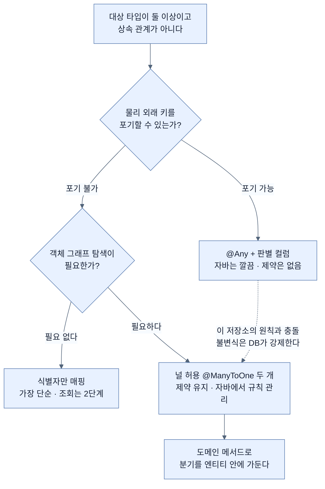

# 둘 중 하나를 가리키는 연관

## 한눈에 보기

| 질문 | 핵심 답 |
|---|---|
| 표준 JPA로 표현할 수 있나? | 없다. 연관은 대상 타입이 하나로 정해져 있다고 전제한다. |
| 선택지는? | 널 허용 `@ManyToOne` 두 개 · Hibernate `@Any` · 매핑하지 않고 식별자만. |
| `@Any`의 대가는? | **물리적 외래 키 제약을 걸 수 없다.** 공식 문서도 선호하지 않는다고 적는다. |
| CosmoRoute의 답은? | `@ManyToOne` 두 개. 이 저장소는 불변식을 DB가 강제하게 설계됐다. |
| 그 선택의 대가는? | "둘 중 하나" 규칙을 자바 쪽에서도 지켜야 한다. 엔티티 안에 가둔다. |

## 1. 왜 이게 필요한가

### 출발 장면: 대상이 두 종류인 연관

앞 노트에서 `material_substance`를 연결 엔티티로 승격시켰다. 남은 부분이 이것이다.

```sql
canonical_id   text REFERENCES substance (canonical_id) ON DELETE RESTRICT,
provisional_id uuid REFERENCES provisional_substance (id) ON DELETE RESTRICT,

CONSTRAINT material_substance_one_target
    CHECK (num_nonnulls(canonical_id, provisional_id) = 1)
```

연결 하나는 **성분 하나**를 가리킨다. 그런데 그 성분이 정식 성분(`substance`)일 수도, 아직 정식으로 확정되지 않은 잠정 성분(`provisional_substance`)일 수도 있다. 둘 다인 경우도, 둘 다 아닌 경우도 없다 — CHECK가 그것을 강제한다.

자바로 쓰고 싶은 것은 이런 모양이다.

```java
@ManyToOne
private 성분무언가 substance;   // Substance 이거나 ProvisionalSubstance
```

**표준 JPA에 이런 매핑이 없다.** 애노테이션을 못 찾는 게 아니라, JPA의 연관 모델이 애초에 이걸 전제하지 않는다.

이런 형태를 **[[배타적-연관]]**(=하나의 연관이 서로 상속 관계가 아닌 둘 이상의 타입 중 정확히 하나를 가리키는 형태)이라 부른다.

### 여기서 뭐가 무너지나

JPA의 연관은 "이 필드는 **정해진 한 타입**의 엔티티를 가리킨다"를 전제한다. 다형성은 지원하지만 **상속 계층 안에서만**이다 — `Payment`를 상속한 `CardPayment`와 `CashPayment`라면 `@ManyToOne Payment`로 충분하다.

`Substance`와 `ProvisionalSubstance`는 상속 관계가 아니다. 그럴 수도 없다.

- 서로 다른 테이블이고 **식별자 타입부터 다르다.** `canonical_id`는 `text`, `provisional_id`는 `uuid`다.
- 소유 주체가 다르다. 정식 성분은 ADR-0001에 따라 **수집 시스템이 소유하고 앱은 저작하지 않는** 투영이다. 잠정 성분은 운영자가 앱 안에서 만든다.
- 생명주기가 다르다. 정식 성분은 feed가 갱신하고, 잠정 성분은 승인되면 정식 성분으로 대체된다.

공통 상위 엔티티를 억지로 만들면 이 차이가 전부 뭉개진다. **상속이 없는 것이 설계 실수가 아니라 도메인의 사실이다.**

### 그래서 나온 생각

선택지가 세 개 있다. 각각이 무엇을 지키고 무엇을 포기하는지가 다르다.

비유하자면 **배송 수취인 칸**이다. 수취인이 개인 회원일 수도 사업자일 수도 있는데, 각각 다른 명부에 등록되어 있다. 양식을 만드는 방법이 두 가지다 — 칸을 두 개 두고 하나만 채우게 하거나, 칸 하나에 "종류" 라벨을 붙이거나.

→ 비유가 깨지는 지점: 종이 양식은 사람이 **나중에** 명부와 대조할 수 있다. DB의 외래 키 제약은 그렇지 않다 — **행이 들어오는 그 순간에만** 작동하고, 나중에 검사할 기회가 없다. 그래서 "칸 하나 + 종류 라벨"을 고르면 대조 능력을 **영구히** 잃는다. 종이 양식에서는 사소한 차이가 DB에서는 결정적인 이유가 이것이다.

## 2. 어떻게 동작하는가

### 2.1 선택지 A — 널 허용 `@ManyToOne` 두 개

```java
@ManyToOne(fetch = FetchType.LAZY)
@JoinColumn(name = "canonical_id")
private Substance canonical;

@ManyToOne(fetch = FetchType.LAZY)
@JoinColumn(name = "provisional_id")
private ProvisionalSubstance provisional;
```

컬럼 하나에 필드 하나씩 그대로 대응시킨다. 스키마를 있는 그대로 옮긴 것이라 매핑에 아무 트릭이 없다.

- **지키는 것**: 외래 키 두 개가 그대로 살아 있다. INV-9의 CHECK도 그대로 작동한다. `ddl-auto: validate`가 매핑과 스키마의 일치를 계속 검사한다.
- **포기하는 것**: 자바 쪽에서 "둘 중 정확히 하나"가 타입으로 강제되지 않는다. 두 필드를 다 채우거나 다 비우는 코드를 컴파일러가 막지 못한다.

포기한 부분은 도메인 메서드로 좁힐 수 있다. 생성자를 막고 정적 팩터리만 열면, **잘못된 상태를 만들 방법 자체가 사라진다.**

```java
private MaterialSubstance() {}   // JPA 용. 밖에서 못 부른다

static MaterialSubstance toCanonical(Material material, Substance canonical) {
    MaterialSubstance link = new MaterialSubstance();
    link.id = UUID.randomUUID();
    link.material = material;
    link.canonical = canonical;      // provisional 은 null 로 남는다
    return link;
}

static MaterialSubstance toProvisional(Material material, ProvisionalSubstance provisional) {
    ...
}
```

이러면 DB의 CHECK는 **마지막 방어선**이 되고, 평소에는 팩터리가 규칙을 지킨다. CosmoRoute가 INV-8을 사전 검사와 부분 유니크 인덱스로 이중 강제한 것과 같은 구조다.

### 2.2 선택지 B — Hibernate `@Any`

Hibernate에는 이 문제를 위한 확장 매핑이 있다. 외래 키 컬럼 하나와 **[[판별-컬럼]]**(=배타적 연관에서 지금 가리키는 대상이 어느 타입인지 적어 두는 컬럼) 하나를 짝지어 쓴다.

```java
// 공식 문서의 예제 형태
@Any
@AnyKeyJavaClass(UUID.class)
@JoinColumn(name = "payment_id")     // 외래 키 컬럼 하나
@Column(name = "payment_type")       // 판별 컬럼
@AnyDiscriminatorValue(discriminator = "CASH", entity = CashPayment.class)
@AnyDiscriminatorValue(discriminator = "CREDIT", entity = CreditCardPayment.class)
Payment payment;
```

자바 쪽은 깔끔해진다. 필드가 하나고, 상속 관계 없는 타입들을 인터페이스 하나로 받는다.

그런데 공식 문서가 곧바로 대가를 적어 둔다.

> *"복합 외래 키(외래 키 + 판별자)는 **개념적일 뿐이며 물리적 데이터베이스 제약으로 강제할 수 없다.** … `@Any` 매핑은 기능은 하지만 참조 무결성을 데이터베이스 수준에서 강제하기 어렵기 때문에 **일반적으로 선호되지 않는다.**"*

이유는 구조적이다. 컬럼 하나가 상황에 따라 다른 테이블을 가리키므로, 그 컬럼에 외래 키 제약을 걸 대상 테이블을 하나로 정할 수 없다. **제약을 안 거는 것이 아니라 걸 수가 없다.**

### 2.3 선택지 C — 매핑하지 않고 식별자만

```java
@Column(name = "canonical_id")
private String canonicalId;

@Column(name = "provisional_id")
private UUID provisionalId;
```

연관으로 매핑하지 않고 값으로만 들고 있는다. 가장 단순하고, 프록시도 지연 로딩도 신경 쓸 것이 없다.

- **지키는 것**: 외래 키와 CHECK가 그대로다. 매핑이 극도로 단순하다.
- **포기하는 것**: `link.getCanonical().getInciName()` 같은 객체 그래프 탐색이 불가능하다. 성분 이름이 필요할 때마다 리포지토리를 거쳐 따로 조회해야 한다.

성분 이름을 보여 주는 것이 발견 카탈로그의 핵심 기능이므로, 이 방식은 조회 코드가 매번 두 단계가 된다.

### 2.4 CosmoRoute가 A를 고르는 이유

세 선택지를 이 저장소의 기준으로 재본다.

| 축 | A — `@ManyToOne` 둘 | B — `@Any` | C — 식별자만 |
|---|---|---|---|
| 물리 외래 키 | 두 개 유지 | **걸 수 없다** | 두 개 유지 |
| INV-9 CHECK | 그대로 작동 | 그대로 작동 | 그대로 작동 |
| `ddl-auto: validate` | 매핑과 스키마 대조됨 | 판별 컬럼이 스키마에 없어 **마이그레이션 필요** | 대조됨 |
| 객체 그래프 탐색 | 가능 | 가능 | 불가능 |
| 자바 쪽 "둘 중 하나" 강제 | 도메인 메서드로 | 타입으로 | 도메인 메서드로 |
| 필드 수 | 2 | 1 | 2 |

B가 자바 쪽에서 가장 우아하지만, **이 저장소에서는 고를 수 없는 선택지**다.

- 이 저장소의 설계 원칙이 *"도메인 불변식을 부분 유니크·CHECK로 DB가 강제한다"*이다. 외래 키를 포기하는 매핑은 그 원칙과 정면으로 어긋난다.
- 테스트가 H2 대신 실 PostgreSQL을 쓰는 이유도 *"불변식 상당수가 DB 제약으로 강제되므로 H2로는 통과해도 의미가 없다"*였다. 그 제약을 스스로 없애면 그 결정의 근거도 함께 사라진다.
- `@Any`를 쓰려면 판별 컬럼을 추가하는 마이그레이션이 필요하다. **스키마를 바꿔서 제약을 약하게 만드는** 변경이 되므로, ADR을 쓸 만한 사안이면서 동시에 쓰기 어려운 사안이다.

C는 발견 카탈로그의 조회 코드를 매번 두 단계로 만든다. 그래서 **A가 답이다.** 자바 쪽 우아함을 조금 포기하고, DB가 지키는 것을 그대로 지킨다.

### 2.5 A를 고른 뒤 남는 일

"둘 중 하나"를 읽는 쪽도 정리해야 한다. 두 필드 중 어느 쪽이 채워졌는지 호출부가 매번 확인하게 두면, 그 확인을 빠뜨린 곳이 반드시 생긴다.

```java
// MaterialSubstance 안에 가둔다
boolean isCanonical() { return this.canonical != null; }

String displayName() {
    return this.canonical != null
            ? this.canonical.getInciName()
            : this.provisional.getRawName();
}
```

호출부는 `link.displayName()`만 부른다. **분기가 엔티티 안에 한 번만 존재한다.** 이것이 A의 대가를 실제로 갚는 방식이고, `Material.publish()`가 INV-13을 안에 가둔 것과 같은 패턴이다.

## 3. 그림으로 보기

### 세 선택지가 각각 무엇을 남기는가

```text
[A] @ManyToOne 두 개 — 스키마를 그대로 옮긴다

    material_substance                     substance
    ┌────────────────────┐                 ┌──────────────┐
    │ canonical_id   ────┼──── FK ────────▶│ canonical_id │
    │ provisional_id ────┼──── FK ──┐      └──────────────┘
    └────────────────────┘          │      provisional_substance
        CHECK: 정확히 하나          └─────▶┌──────────────┐
                                           │ id           │
                                           └──────────────┘
    → 외래 키 2개 + CHECK 전부 살아 있다


[B] @Any — 컬럼 하나 + 판별자

    material_substance
    ┌────────────────────┐
    │ target_id      ────┼──── ??? ─────▶  substance 일 수도
    │ target_type        │                 provisional_substance 일 수도
    └────────────────────┘
    → 가리킬 테이블이 실행 시점에 정해지므로
      외래 키 제약을 걸 대상을 고를 수 없다. 제약이 사라진다.


[C] 식별자만

    MaterialSubstance
    ┌────────────────────┐
    │ String canonicalId │   값일 뿐, 연관이 아니다
    │ UUID provisionalId │
    └────────────────────┘
    → 제약은 그대로지만 link.getCanonical() 이 없다.
      이름 하나 보여 주려고 매번 리포지토리를 거친다.
```

### 결정 흐름



## 4. 이 노트에 나온 용어

| 용어 | 한 줄 풀이 | 자세히 |
|---|---|---|
| 배타적 연관 | 상속 관계 없는 여러 타입 중 정확히 하나를 가리키는 연관 | [[_glossary#배타적-연관]] |
| 판별 컬럼 | 지금 가리키는 대상이 어느 타입인지 적어 두는 컬럼 | [[_glossary#판별-컬럼]] |

## 5. 자주 헷갈리는 것

### `@Any` vs 상속 다형성

| 축 | `@Any` | `@Inheritance` 다형성 |
|---|---|---|
| 대상 타입 관계 | 상속 관계 **없음** | 공통 상위 타입을 상속 |
| 판별자 위치 | **참조하는 쪽**에 저장 | 참조**되는** 쪽 테이블에 저장 |
| 외래 키 제약 | 걸 수 없다 | 걸 수 있다 |
| 쓸 상황 | 식별자 타입만 공유하는 무관한 엔티티들 | 진짜 is-a 관계 |

판별자가 **어느 쪽 테이블에 있느냐**가 결정적 차이다. 상속 다형성은 대상 테이블이 자기 종류를 적고, `@Any`는 참조하는 쪽이 상대의 종류를 적는다.

### 배타적 연관 vs 널 허용 연관 여러 개

두 필드를 널 허용으로 두는 것 자체는 배타적 연관이 아니다. "둘 중 정확히 하나"라는 **제약이 있을 때만** 배타적이다. 제약이 없으면 그냥 선택적 연관 두 개이고, 둘 다 채우는 것도 정상이다. `material_substance`에 CHECK가 있다는 사실이 이것을 배타적 연관으로 만든다.

### "JPA가 지원하지 않는다" vs "매핑할 수 없다"

표준 JPA에 전용 애노테이션이 없다는 것과, 이 스키마를 매핑할 수 없다는 것은 다르다. A와 C 모두 표준 JPA만으로 완전히 매핑된다. 없는 것은 "둘 중 하나"를 **타입 수준에서 표현하는 문법**뿐이고, 그건 도메인 메서드가 대신한다.

## 6. 언제 안 쓰나 / 경계

- **`@Any`를 성능이나 편의 때문에 고르지 않는다.** 얻는 것은 자바 필드 하나가 줄어드는 것뿐이고, 잃는 것은 참조 무결성이다. 교환비가 맞지 않는다.
- **공통 상위 엔티티를 억지로 만들지 않는다.** 식별자 타입이 다르고 소유 주체가 다르고 생명주기가 다른 두 테이블을 상속으로 묶으면, 그 차이를 표현할 곳이 사라진다.
- **두 필드를 public setter로 열지 않는다.** 잘못된 조합을 만들 수 있는 경로를 남기면 CHECK 위반이 런타임에야 드러난다. 정적 팩터리와 private 생성자로 막는다.
- **읽는 쪽 분기를 호출부에 흘리지 않는다.** `if (link.getCanonical() != null)`이 서비스 코드 여기저기에 생기는 순간, 그중 하나는 반드시 빠진다.
- **선택지가 셋이라는 사실 자체를 기록해 둔다.** CosmoRoute라면 이 결정은 ADR 감이다. 나중에 "왜 필드를 두 개나 뒀는가"를 묻는 사람에게 답이 남아야 한다.

## 7. 연결

- [[02-join-entity-instead-of-many-to-many]] — 연결 엔티티로 승격한 것이 이 문제의 절반이었다. 나머지 절반이 대상 타입이 둘이라는 사실이고, 이 노트가 그것을 다룬다.
- [[01-association-owner-and-mappedby]] — A를 고르면 `@ManyToOne`이 둘 생기고, 둘 다 자기 외래 키의 주인이다. 주인 규칙이 두 번 적용된다.
- [[04-proxies-and-lazy-loading]] — 두 연관 모두 `LAZY`로 두면 각각 프록시가 된다. 어느 쪽이 채워졌는지 확인하는 코드가 프록시를 건드리는지 아닌지가 성능을 가른다.

## 8. 스스로 확인

1. 표준 JPA가 이 형태를 표현하지 못하는 이유를 "연관의 전제"로 설명할 수 있는가?
2. `Substance`와 `ProvisionalSubstance`를 상속으로 묶으면 안 되는 이유 세 가지는 무엇인가?
3. `@Any`가 외래 키 제약을 걸 수 **없는** 구조적 이유는 무엇인가? 안 거는 것과 어떻게 다른가?
4. 세 선택지를 "물리 외래 키 · 객체 탐색 · 자바 쪽 강제" 세 축으로 비교할 수 있는가?
5. CosmoRoute가 A를 고르는 근거를 이 저장소의 기존 결정 두 개 이상과 연결해 설명할 수 있는가?
6. A의 대가를 정적 팩터리가 어떻게 갚는가?
7. 읽는 쪽 분기를 엔티티 안에 가두지 않으면 무엇이 문제가 되는가?
8. `@Any`와 상속 다형성에서 판별자가 저장되는 위치는 각각 어디인가?

<!-- ==== 아래는 내 영역 · 스킬 수정 금지 ==== -->

## 내 설명 시도


## 막혔던 지점


## 리뷰 이력
