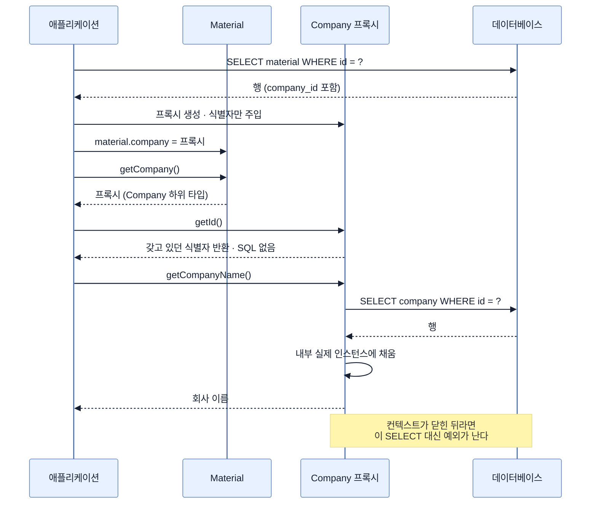

# 프록시와 지연 로딩

## 한눈에 보기

| 질문 | 핵심 답 |
|---|---|
| `LAZY` 연관의 getter는 무엇을 반환하나? | 실제 엔티티가 아니라 그것을 상속한 프록시다. |
| 언제 SQL이 나가나? | 식별자 외의 필드에 접근하는 순간. `getId()`로는 안 나간다. |
| 트랜잭션 밖에서 만지면? | `LazyInitializationException`. 예외가 나는 편이 안전한 쪽이다. |
| 기본값은? | `@ManyToOne`·`@OneToOne`은 **즉시**, `@OneToMany`·`@ManyToMany`는 지연. |
| `getReference()`는? | SELECT 없이 프록시만 얻는다. 외래 키만 채울 때 유용하다. |

## 1. 왜 이게 필요한가

### 출발 장면: `getCompany()`가 돌려주는 것은 `Company`가 아니다

CosmoRoute의 `Material`은 회사를 이렇게 참조한다.

```java
@ManyToOne(fetch = FetchType.LAZY, optional = false)
@JoinColumn(name = "company_id", nullable = false)
private Company company;
```

원료를 하나 읽고 회사를 꺼내 본다.

```java
@Transactional(readOnly = true)
public void inspect(UUID materialId) {
    Material m = materials.findById(materialId).orElseThrow();

    Company c = m.getCompany();
    System.out.println(c.getClass());          // Company 가 아니다
    System.out.println(c.getId());             // SQL 이 나가지 않는다
    System.out.println(c.getCompanyName());    // ← 여기서 SELECT 가 나간다
}
```

`c.getClass()`는 `class com.cosmoroute.api.catalog.internal.Company`가 아니라 `Company$HibernateProxy$...` 같은 이름을 찍는다. `Company`를 상속해 Hibernate가 런타임에 만든 하위 클래스다.

`getId()`는 SQL을 유발하지 않는데 `getCompanyName()`은 유발한다. 이 비대칭이 프록시 동작의 전부다.

### 여기서 뭐가 무너지나

`fetch = FetchType.EAGER`로 바꿔 보면 이 장치가 왜 있는지 보인다.

발견 카탈로그 목록 조회를 생각하자. 원료 200건을 읽는다. 즉시 로딩이면 각 원료의 회사도 함께 읽어야 한다.

```text
[즉시 로딩]
  SELECT * FROM material WHERE ...          → 200건
  SELECT * FROM company WHERE id = ?        → 200번  (원료마다 한 번)

  화면에는 회사 이름만 필요한데 회사의 모든 컬럼을 200번 읽었다.
```

그런데 문제는 쿼리 수만이 아니다. 회사가 다시 다른 것을 즉시 로딩한다면 그것도 따라온다. **객체 그래프를 하나 건드리면 연결된 것이 전부 딸려 올라온다.** Hibernate 문서가 프록시를 도입한 이유를 *"전체 객체 그래프를 한꺼번에 로딩하는 비효율을 피하기 위해"*라고 적은 것이 이것이다.

반대로 아예 안 읽으면 `m.getCompany()`가 `null`이 되어 버린다. 그러면 연관을 매핑한 의미가 없다.

### 그래서 나온 생각

**자리는 채우되 내용은 비워 둔다.** 실제 엔티티가 놓일 자리에 대역 객체를 놓고, 그 객체의 필드에 실제로 접근하는 순간 그때 DB에서 읽어 온다.

이 대역이 **[[프록시]]**(=실제 엔티티 대신 놓이는 대역 객체. 식별자만 들고 있다가 다른 필드 접근 시 상태를 읽어 온다)이고, 이 방식이 **[[지연-로딩]]**(=연관 대상을 즉시 읽지 않고 실제로 쓰는 순간 읽는 방식)이다. 반대로 함께 읽는 것이 **[[즉시-로딩]]**(=연관 대상을 원본과 함께 바로 읽는 방식)이다.

프록시가 식별자를 이미 아는 이유는 단순하다. `material.company_id`를 읽는 순간 그 값이 곧 회사의 식별자다. **회사를 조회하지 않아도 식별자만은 공짜로 안다.** 그래서 `getId()`에는 SQL이 필요 없다.

비유하자면 **도서관 대출 카드**다. 카드에는 청구기호만 적혀 있다. 책 내용이 필요하면 그 번호로 서가에 가야 한다. 번호만 알면 되는 일 — 예를 들어 반납 목록에 적는 일 — 은 서가에 가지 않고 끝난다.

→ 비유가 깨지는 지점: 카드는 도서관이 닫혀도 손에 남고 내일 다시 가면 된다. 프록시는 다르다 — **영속성 컨텍스트가 닫히면 그 자리에서 예외를 던진다.** 나중에 다시 가는 선택지가 없다. "나중에 읽으면 된다"가 아니라 "**그 트랜잭션 안에서만** 읽을 수 있다"는 점에서 카드 비유는 멈춘다.

## 2. 어떻게 동작하는가

### 2.1 프록시가 만들어지고 초기화되기까지

1. **원료를 조회한다.** `material` 행을 읽으면 `company_id` 값이 함께 들어온다. — 외래 키는 원료 행 자체에 있기 때문이다.
2. **`Company`를 상속한 프록시 인스턴스를 만들고 식별자를 넣는다.** — 자리를 비워 두면 `null`이 되어 연관이 끊기고, 실제로 읽으면 그래프 전체가 딸려 오기 때문이다.
3. **`material.company` 필드에 그 프록시를 넣는다.** 호출부는 차이를 모른다. — 프록시가 `Company`의 하위 타입이라 타입 검사를 통과하기 때문이다.
4. **`getId()`를 부르면 갖고 있는 식별자를 그대로 돌려준다.** — 이미 아는 값을 위해 DB에 갈 이유가 없기 때문이다.
5. **다른 getter를 부르면 그때 SELECT를 보낸다.** — 그 값은 프록시가 갖고 있지 않기 때문이다. 이것을 초기화라 부른다.
6. **읽어 온 값을 내부 실제 인스턴스에 채우고, 이후 호출은 거기로 위임한다.** — 같은 프록시에 두 번 SELECT를 보내지 않기 위해서다.

### 2.2 예외가 나는 지점

5번은 영속성 컨텍스트가 살아 있어야 가능하다. 없으면 **[[지연-로딩-예외]]**(=프록시를 초기화하려는데 영속성 컨텍스트가 없을 때 나는 예외)가 난다.

```java
// 트랜잭션 안
Material m = service.findById(id);   // @Transactional 이 여기서 끝난다

// 트랜잭션 밖
m.getCompany().getCompanyName();     // LazyInitializationException
```

앞 챕터에서 정리한 대로, 트랜잭션이 끝나면 엔티티는 준영속이 된다. 준영속 엔티티에 붙어 있던 프록시는 돌아갈 곳을 잃는다.

Hibernate 문서는 이 제약을 명시한다 — *"프록시는 엔티티가 영속성 컨텍스트에 연결되어 있는 동안에만 가져올 수 있다. 그렇지 않으면 `LazyInitializationException`이 던져진다."*

**예외가 나는 것이 안전한 쪽이다.** 조용히 `null`을 반환한다면 데이터가 없는 것인지 못 읽은 것인지 구분할 수 없다.

한 가지 주의할 우회로가 있다. Hibernate에는 컨텍스트 없이 프록시를 만나면 **새 세션과 트랜잭션을 열어** 읽어 오는 설정이 있다. 소스의 동작을 보면 프록시 하나를 초기화할 때마다 세션을 열고, 트랜잭션을 시작하고, 읽고, 커밋하고, 닫는다. **지연 로딩 한 번에 커넥션 하나**다. 예외를 없애 주는 것처럼 보이지만 목록 조회에서 켜면 커넥션 풀이 그대로 소진된다. 예외를 끄는 설정이 아니라 문제를 옮기는 설정이다.

### 2.3 기본값을 반드시 확인해야 하는 이유

fetch 기본값이 연관 종류마다 다르다.

| 연관 | 기본 fetch |
|---|---|
| `@ManyToOne` | **즉시** |
| `@OneToOne` | **즉시** |
| `@OneToMany` | 지연 |
| `@ManyToMany` | 지연 |

"하나를 가리키는" 연관이 즉시가 기본이다. 하나쯤은 함께 읽어도 괜찮다는 가정인데, 목록 조회에서는 그 하나가 행 수만큼 반복된다.

그래서 `Material.company`에 `fetch = FetchType.LAZY`가 **명시되어 있다는 사실 자체가 의도적인 선택**이다. 안 적었다면 즉시 로딩이 됐을 것이고, 발견 카탈로그 목록에서 회사를 원료 수만큼 읽었을 것이다.

앞 노트에서 연결 엔티티에 `fetch = LAZY`를 명시한 것도 같은 이유다. `MaterialSubstance.material`을 기본값으로 두면 연결 하나를 읽을 때마다 원료 전체가 딸려 온다.

### 2.4 프록시 때문에 조용히 틀리는 것들

**`getClass()` 비교가 깨진다.** `equals()`를 `getClass() != o.getClass()`로 시작하도록 구현하면, 프록시와 실제 인스턴스가 서로 같지 않다고 판정된다. 엔티티의 `equals()`는 `instanceof`로 쓰거나 `Hibernate.unproxy()`를 거쳐야 한다.

**타입 캐스팅과 `instanceof`가 어긋날 수 있다.** Hibernate 문서가 *"다형적 연관에서 타입 캐스트와 `instanceof` 검사가 올바르게 동작하지 않을 수 있다"*고 경고하는 지점이다. 앞 노트에서 `@Any`를 고르지 않은 이유가 하나 더 늘어난 셈이다.

**`null` 검사가 프록시를 초기화하지 않는다.** `if (link.getCanonical() != null)`은 참조가 있는지만 보므로 SQL을 유발하지 않는다. 이건 좋은 소식이다 — 앞 노트에서 배타적 연관의 어느 쪽이 채워졌는지 확인하는 코드가 프록시를 건드리지 않는다는 뜻이다.

**N+1의 씨앗이다.** Hibernate 문서도 *"지연 로딩은 주의하지 않으면 N+1 select 문제로 이어질 수 있다"*고 적는다. 목록 200건을 읽고 각각의 회사 이름을 찍으면 SELECT가 1 + 200번 나간다. 지연 로딩이 즉시 로딩보다 항상 나은 것이 아니라, **문제를 다른 모양으로 옮긴 것**이다. 이 문제의 정확한 조건과 해법은 `chapter-j3`에서 다룬다.

### 2.5 `getReference()` — 프록시를 일부러 쓰는 경우

프록시는 피할 대상만이 아니다. **식별자만 필요할 때 SELECT를 아끼는 도구**이기도 하다.

```java
Company company = entityManager.getReference(Company.class, companyId);
material.setCompany(company);   // 외래 키에는 식별자만 들어간다
```

`getReference()`가 돌려주는 것이 **[[엔티티-참조]]**(=`getReference()`가 반환하는, 상태를 읽지 않은 프록시)다. 외래 키를 채우는 데 필요한 것은 식별자뿐이므로 회사 행을 읽을 이유가 없다.

첫 슬라이스에서 이 형태가 바로 쓰인다. 원료에 성분을 연결할 때 연결 엔티티는 원료와 성분의 식별자만 있으면 만들어진다.

```java
Material material = entityManager.getReference(Material.class, materialId);
Substance substance = entityManager.getReference(Substance.class, canonicalId);
MaterialSubstance link = MaterialSubstance.toCanonical(material, substance);
```

성분 40개를 붙이면 `getReference()` 덕분에 SELECT 40번이 사라진다. 다만 대가가 있다 — **존재하지 않는 식별자를 넘겨도 그 자리에서는 알 수 없다.** 실제 접근 시점이나 외래 키 제약 위반으로 나중에 드러난다. 존재를 먼저 검증해야 하는 경로라면 `findById()`가 맞다.

## 3. 그림으로 보기

### 프록시가 초기화되는 순간



### 세 가지 로딩 전략이 만드는 쿼리 수

```text
원료 200건 목록에서 회사 이름을 보여 준다고 하자.

[즉시 로딩]              SELECT material   × 1
  fetch = EAGER          SELECT company    × 200      → 201회
                         회사의 모든 컬럼을 읽는다

[지연 로딩 + 전부 접근]   SELECT material   × 1
  fetch = LAZY           SELECT company    × 200      → 201회
                         이름만 필요한데 결국 200번 읽는다 = N+1

[DTO 직접 조회]          SELECT m.name, c.company_name
                           FROM material m JOIN company c ...   → 1회
                         필요한 컬럼만, 조인 한 번으로

  → 지연 로딩은 "읽지 않는" 장치가 아니라 "읽는 시점을 미루는" 장치다.
    전부 접근하면 즉시 로딩과 쿼리 수가 같아진다.
    proxy 는 "대리인" 이라는 뜻이다 — 본인이 올 때까지 자리를 지키는 대리인.
```

## 4. 이 노트에 나온 용어

| 용어 | 한 줄 풀이 | 자세히 |
|---|---|---|
| 프록시 | 실제 엔티티 대신 놓이는 대역 객체 | [[_glossary#프록시]] |
| 지연 로딩 | 연관 대상을 실제로 쓸 때 읽는 방식 | [[_glossary#지연-로딩]] |
| 즉시 로딩 | 연관 대상을 원본과 함께 바로 읽는 방식 | [[_glossary#즉시-로딩]] |
| 지연 로딩 예외 | 컨텍스트 없이 프록시를 초기화하려 할 때 나는 예외 | [[_glossary#지연-로딩-예외]] |
| 엔티티 참조 | `getReference()`가 주는, 상태를 읽지 않은 프록시 | [[_glossary#엔티티-참조]] |

## 5. 자주 헷갈리는 것

### `find()` vs `getReference()`

| 축 | `find()` | `getReference()` |
|---|---|---|
| SQL | 즉시 SELECT | 나가지 않는다 |
| 없는 식별자 | `null` 또는 빈 `Optional` | 그 자리에서는 모른다 |
| 반환 타입 | 실제 엔티티 (또는 1차 캐시의 것) | 프록시 |
| 쓸 상황 | 값을 읽어야 할 때 | 외래 키만 채울 때 |

### 지연 로딩 vs 안 읽음

지연 로딩은 **읽지 않는 것이 아니라 미루는 것**이다. 결국 접근하면 읽는다. "LAZY로 바꿨으니 쿼리가 줄겠지"라고만 생각하면 N+1을 만나고 원인을 못 찾는다.

### 프록시 vs 1차 캐시의 인스턴스

이미 1차 캐시에 실제 인스턴스가 있으면 프록시가 아니라 그 인스턴스가 들어온다. 앞 챕터의 동일성 보장 때문이다. 그래서 같은 코드가 상황에 따라 프록시를 주기도 하고 실제 객체를 주기도 한다 — `getClass()`로 분기하는 코드가 위험한 이유다.

### `LazyInitializationException` vs 데이터 없음

예외는 "데이터가 없다"가 아니라 "**읽을 수 없는 자리에서 읽으려 했다**"는 뜻이다. 원인은 데이터가 아니라 트랜잭션 경계에 있다. 예외를 잡아서 `null`로 바꾸는 것은 원인을 감추는 처리다.

## 6. 언제 안 쓰나 / 경계

- **컨텍스트 없이 지연 로딩을 허용하는 설정을 켜지 않는다.** 프록시 하나마다 세션과 커넥션이 새로 열린다. 목록 조회에서 켜면 커넥션 풀이 소진된다.
- **엔티티를 그대로 응답으로 내보내지 않는다.** 직렬화기가 모든 getter를 호출하므로 프록시가 전부 초기화되거나, 트랜잭션 밖이면 예외가 난다. DTO로 변환하는 경계를 트랜잭션 안에 둔다.
- **`@ManyToOne`에 `fetch`를 생략하지 않는다.** 기본값이 즉시라 의도와 반대가 된다. CosmoRoute의 두 매핑처럼 항상 명시한다.
- **엔티티 `equals`/`hashCode`를 `getClass()`로 구현하지 않는다.** 프록시와 실제 인스턴스가 다르다고 판정된다. `instanceof`를 쓰거나, 애초에 영속 상태 안에서만 비교한다면 구현하지 않는 편이 낫다.
- **`getReference()`를 존재 검증이 필요한 곳에 쓰지 않는다.** 없는 식별자를 넘겨도 그 자리에서는 통과한다. 검증이 목적이면 `findById()`다.

## 7. 연결

- [[01-association-owner-and-mappedby]] — 주인 쪽 참조가 실제로 담고 있는 것이 프록시다. `@ManyToOne`의 fetch 기본값이 즉시라는 사실이 여기서 문제가 된다.
- [[03-exclusive-target-associations]] — 배타적 연관을 널 검사로 분기하는 코드는 프록시를 초기화하지 않는다. `@Any`를 피한 이유에 `instanceof` 문제가 하나 더 붙는다.
- [[05-cascade-orphan-removal-vs-db-cascade]] — 영속성 전이는 컬렉션을 순회하므로 지연 로딩된 컬렉션을 초기화한다. 전이를 걸면 읽지 않으려던 것이 읽히는 경우가 생긴다.

## 8. 스스로 확인

1. `getId()`는 SQL을 유발하지 않는데 `getCompanyName()`은 유발하는 이유는 무엇인가?
2. 프록시가 식별자를 이미 아는 이유를 외래 키가 어느 행에 있는지로 설명할 수 있는가?
3. `LazyInitializationException`이 나는 조건을 트랜잭션 경계와 준영속으로 설명할 수 있는가?
4. 컨텍스트 없이 지연 로딩을 허용하는 설정이 왜 위험한가?
5. `@ManyToOne`의 fetch 기본값이 무엇이고, 목록 조회에서 왜 문제가 되는가?
6. 엔티티 `equals()`를 `getClass()`로 구현하면 무엇이 깨지는가?
7. "지연 로딩은 읽지 않는 것이 아니라 미루는 것"이라는 말을 쿼리 수로 설명할 수 있는가?
8. `getReference()`로 성분 40개를 연결할 때 아끼는 것과 잃는 것은 각각 무엇인가?

<!-- ==== 아래는 내 영역 · 스킬 수정 금지 ==== -->

## 내 설명 시도


## 막혔던 지점


## 리뷰 이력
