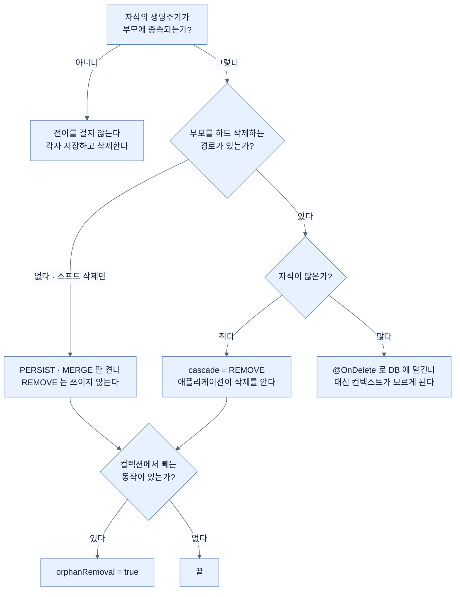

# 영속성 전이·고아 객체와 DB 연쇄 삭제

## 한눈에 보기

| 질문 | 핵심 답 |
|---|---|
| DDL에 `ON DELETE CASCADE`가 있으면 JPA에도 걸어야 하나? | 목적이 다르다. 둘 다 걸면 DELETE가 N번 나간다. |
| `cascade = REMOVE`와 `orphanRemoval`의 차이는? | 전자는 **부모가 삭제될 때**, 후자는 **관계가 끊겼을 때**. |
| DB만 믿으면? | 영속성 컨텍스트가 삭제를 모른 채 낡은 엔티티를 들고 있다. |
| CosmoRoute에서 중요한 건? | `orphanRemoval`. 소프트 삭제라 부모 하드 삭제가 거의 없다. |
| `@OnDelete`는 뭔가? | DDL 사실을 매핑에 알려 개별 DELETE를 생략하게 하는 것. |

## 1. 왜 이게 필요한가

### 출발 장면: 같은 규칙이 두 곳에 적힌다

`material_substance`의 DDL에는 삭제 규칙이 이미 있다.

```sql
material_id    uuid NOT NULL REFERENCES material (id) ON DELETE CASCADE,
canonical_id   text REFERENCES substance (canonical_id) ON DELETE RESTRICT,
provisional_id uuid REFERENCES provisional_substance (id) ON DELETE RESTRICT,
```

원료가 지워지면 연결도 지워진다. 성분은 연결이 남아 있는 한 지울 수 없다. DB가 이미 알고 있는 규칙이다.

그런데 앞 노트에서 원료 쪽 컬렉션을 이렇게 쓸 수 있다고 했다.

```java
@OneToMany(mappedBy = "material", cascade = CascadeType.ALL, orphanRemoval = true)
private List<MaterialSubstance> substanceLinks = new ArrayList<>();
```

`cascade = ALL`에는 `REMOVE`가 포함된다. **같은 규칙이 DDL과 매핑 두 곳에 적혔다.** 중복이지만 무해할까, 아니면 어느 한쪽이 틀린 걸까.

### 여기서 뭐가 무너지나

두 장치가 하는 일이 실제로 다르다.

```text
[JPA cascade = REMOVE]
  em.remove(material)
    → 컨텍스트가 컬렉션을 순회하며 각 연결에도 remove 를 전파
    → 플러시 시점에
         DELETE FROM material_substance WHERE id = ?   × 연결 수만큼
         DELETE FROM material WHERE id = ?
    → 애플리케이션이 삭제를 "알고" 있다

[DB ON DELETE CASCADE]
  DELETE FROM material WHERE id = ?
    → DB 가 자식 행을 알아서 지운다
    → SQL 한 번
    → 애플리케이션은 무슨 일이 일어났는지 모른다
```

결과는 같아 보이지만 대가가 정반대다.

**JPA 쪽만 믿으면** DELETE가 자식 수만큼 나간다. 성분 40개짜리 원료를 지우면 DELETE가 41번이다. 게다가 컬렉션을 순회해야 하므로 **지연 로딩된 컬렉션이 초기화된다** — 읽지 않으려던 것을 읽게 된다.

**DB 쪽만 믿으면** SQL은 한 번이지만 영속성 컨텍스트가 이 삭제를 모른다. 같은 트랜잭션 안에서 이미 로딩해 둔 연결 엔티티들이 **DB에는 없는데 컨텍스트에는 살아 있는** 상태가 된다. 그것들을 건드리면 존재하지 않는 행에 UPDATE가 나갈 수 있다.

**둘 다 걸면** JPA가 먼저 자식을 하나씩 지우고, 그다음 부모를 지운다. DB의 CASCADE는 지울 자식이 이미 없으니 아무 일도 하지 않는다. 결과는 맞지만 **DB 규칙이 사실상 죽은 코드**가 되고, DELETE는 여전히 N번 나간다.

### 그래서 나온 생각

세 가지를 구분해야 한다.

- **[[영속성-전이]]**(=어떤 엔티티에 수행한 연산을 연관된 엔티티에도 전파하는 설정) — 부모에 한 연산을 자식에게도 한다. `PERSIST`, `REMOVE`, `MERGE` 등 연산별로 켠다.
- **[[고아-객체-제거]]**(=부모의 컬렉션에서 빠진 자식을 자동으로 삭제하는 설정) — 부모는 살아 있는데 **관계가 끊긴** 자식을 지운다.
- **[[DB-연쇄-삭제]]**(=외래 키에 걸어 두는 DDL 수준의 연쇄 삭제) — 부모 행이 지워질 때 DB가 자식 행을 지운다.

셋을 "다 같은 삭제 전파"로 묶으면 어느 것을 언제 써야 할지 판단할 수 없다.

비유하자면 **건물 철거와 그 안의 집기**다. "건물을 철거하면 집기도 처분한다"를 계약서에 적을 수도 있고, 철거 업체가 알아서 다 밀어버리게 둘 수도 있다.

→ 비유가 깨지는 지점: 철거 업체가 밀어버려도 건물은 사라진 채로 끝이다. DB가 밀어버리면 **관리 대장(영속성 컨텍스트)에는 집기가 그대로 남는다.** 그리고 그 대장은 같은 트랜잭션 내내 잘못된 판단의 근거가 된다. 물리 세계에서는 "장부를 나중에 고치면 되는" 문제가, 여기서는 **그 트랜잭션이 끝날 때까지 계속 틀린 답을 주는** 문제다.

## 2. 어떻게 동작하는가

### 2.1 전이는 컨텍스트를 통과하는 연산에만 걸린다

이것이 영속성 전이의 가장 중요한 경계다.

1. **`em.remove(parent)`를 부른다.** — 컨텍스트가 이 연산을 알아야 전파할 대상을 찾을 수 있기 때문이다.
2. **컨텍스트가 `cascade`에 `REMOVE`가 있는 연관을 찾는다.** — 어느 연관으로 전파할지 매핑이 알려 줘야 하기 때문이다.
3. **컬렉션을 초기화한다.** — 무엇을 지울지 알려면 목록을 실제로 읽어야 하기 때문이다. 지연 로딩이었어도 여기서 SELECT가 나간다.
4. **각 자식에도 삭제를 예약한다.** — 자식이 삭제 상태가 되어야 플러시 때 DELETE가 만들어지기 때문이다.
5. **플러시 시점에 자식 DELETE를 먼저, 부모 DELETE를 나중에 보낸다.** — 외래 키 제약을 만족시키려면 참조하는 쪽이 먼저 사라져야 하기 때문이다.

**JPQL 벌크 삭제나 네이티브 SQL은 1번을 거치지 않는다.**

```java
@Modifying
@Query("DELETE FROM Material m WHERE m.hiddenAt IS NOT NULL")
int purgeHidden();
```

이 쿼리는 컨텍스트를 통과하지 않고 DB로 직행한다. 그래서 **전이가 전혀 일어나지 않는다.** 이때 자식 행을 정리하는 것은 DDL의 `ON DELETE CASCADE`뿐이다. DB 제약이 없었다면 외래 키 위반으로 터졌을 것이다.

여기서 결론 하나가 나온다. **DDL의 연쇄 삭제는 JPA 전이의 중복이 아니라, JPA를 우회하는 경로를 위한 안전망이다.** 둘은 같은 층에 있지 않다.

### 2.2 `CascadeType.REMOVE`와 `orphanRemoval`은 발동 조건이 다르다

| 축 | `cascade = REMOVE` | `orphanRemoval = true` |
|---|---|---|
| 발동 시점 | 부모가 삭제될 때 | 컬렉션에서 자식이 빠질 때 |
| 부모의 상태 | 삭제된다 | 살아 있다 |
| 전형적 코드 | `em.remove(material)` | `material.getLinks().remove(link)` |
| 의미 | "부모가 사라지면 자식도 의미 없다" | "부모에 속하지 않는 자식은 존재할 수 없다" |

`orphanRemoval = true`를 켜면 `REMOVE` 전이도 함께 적용된다. 반대는 성립하지 않는다 — `REMOVE`만 켜고 컬렉션에서 자식을 빼면, 그 자식은 외래 키가 `null`로 갱신되려다 `NOT NULL` 제약에 걸린다.

CosmoRoute에서 실제로 자주 일어나는 일은 **후자**다. 운영자가 원료의 성분 목록에서 하나를 잘못 넣었다고 판단해 뺀다. 원료는 그대로 있고 연결만 사라져야 한다.

```java
// Material.java
void unlink(UUID linkId) {
    this.substanceLinks.removeIf(l -> l.getId().equals(linkId));
    // orphanRemoval = true 이면 이것만으로 DELETE 가 나간다
}
```

`orphanRemoval` 없이 이 코드를 쓰면 컬렉션에서만 빠지고 DB에는 행이 그대로 남는다. **화면에서는 사라졌는데 데이터는 남아 있는** 상태가 된다.

### 2.3 CosmoRoute에서 무엇이 실제로 중요한가

이 저장소는 물리 삭제를 거의 하지 않는다. `deleted_at`·`hidden_at` 컬럼으로 소프트 삭제를 하고, 성분은 ADR-0001에 따라 *"출처가 삭제한 경우 앱은 소프트 삭제만 반영한다."*

그래서 판단이 이렇게 갈린다.

- **`orphanRemoval = true` — 필요하다.** 성분 연결을 해제하는 것은 실제 운영 동작이고, 연결 행은 소프트 삭제 대상이 아니다(연결에는 `deleted_at`이 없다). 물리적으로 지우는 것이 맞다.
- **`cascade = PERSIST` — 필요하다.** 원료와 연결을 한 트랜잭션에서 함께 만든다. 전이가 없으면 연결마다 `save()`를 따로 불러야 한다.
- **`cascade = REMOVE` — 거의 쓰이지 않는다.** 원료를 하드 삭제하는 경로가 없기 때문이다. `cascade = ALL`로 뭉뚱그리면 쓰지 않는 규칙까지 켜지므로, 쓰는 것만 명시하는 편이 낫다.

```java
@OneToMany(mappedBy = "material",
           cascade = {CascadeType.PERSIST, CascadeType.MERGE},
           orphanRemoval = true)
private List<MaterialSubstance> substanceLinks = new ArrayList<>();
```

`ON DELETE RESTRICT`가 성분 쪽에 걸린 것도 같은 맥락이다. 성분은 앱이 저작하지 않는 투영이므로, 연결이 남아 있는 성분을 앱이 지우는 일 자체가 없어야 한다. **`RESTRICT`는 전이의 반대편** — 전파하지 말고 막으라는 선언이다.

### 2.4 `@OnDelete` — DDL 사실을 매핑에 알리기

DB의 연쇄 삭제를 이미 걸어 뒀다면, 그 사실을 Hibernate에게 알려 개별 DELETE를 생략하게 할 수 있다.

```java
@OneToMany(mappedBy = "material")
@OnDelete(action = OnDeleteAction.CASCADE)
private List<MaterialSubstance> substanceLinks = new ArrayList<>();
```

공식 문서는 이것을 *"외래 키를 이용해 자식 레코드를 제거하는 DDL 수준 기능"*으로 설명하고, 컬렉션에 붙이면 *"`@OneToMany` 컬렉션이 `CascadeType.ALL`을 쓰더라도 외래 키 연쇄를 통해 자식이 삭제되도록 보장한다"*고 적는다. 즉 Hibernate가 자식 DELETE를 일일이 내보내지 않고 DB에 맡긴다.

부모 삭제가 잦고 자식이 많다면 유효한 최적화다. 다만 대가가 있다 — **영속성 컨텍스트는 그 삭제를 모른다.** 2.1에서 본 낡은 엔티티 문제가 그대로 돌아온다. CosmoRoute처럼 부모 하드 삭제가 없는 곳에서는 도입할 이유가 없다.

## 3. 그림으로 보기

### 세 장치가 서로 다른 층에 있다

```text
                    애플리케이션 코드
                          │
      em.remove(material) │                material.getLinks().remove(link)
                          ▼                          ▼
   ┌──────────────────────────────────────────────────────────────┐
   │  영속성 컨텍스트                                              │
   │                                                              │
   │   cascade = REMOVE  ──▶ 자식마다 DELETE 예약                  │
   │   orphanRemoval     ──▶ 빠진 자식에 DELETE 예약               │
   │                                                              │
   │   ▲ 여기를 통과하는 연산에만 적용된다                          │
   └──────────────────────────────────────────────────────────────┘
                          │  플러시
                          ▼
   ┌──────────────────────────────────────────────────────────────┐
   │  데이터베이스                                                 │
   │                                                              │
   │   ON DELETE CASCADE  ──▶ 부모 행이 사라지면 자식 행도 삭제     │
   │   ON DELETE RESTRICT ──▶ 자식이 남아 있으면 부모 삭제를 거부   │
   │                                                              │
   │   ▲ 어떤 경로로 들어온 DELETE 든 적용된다                      │
   └──────────────────────────────────────────────────────────────┘
        ▲
        └── JPQL 벌크 삭제 · 네이티브 SQL · psql 직접 실행
            컨텍스트를 건너뛰므로 위 칸의 규칙은 적용되지 않는다

  → 중복이 아니다. 위 칸은 "애플리케이션이 아는 삭제",
    아래 칸은 "무슨 경로로 들어와도 지켜지는 삭제" 다.
```

### 무엇을 켤지 고르는 흐름



## 4. 이 노트에 나온 용어

| 용어 | 한 줄 풀이 | 자세히 |
|---|---|---|
| 영속성 전이 | 부모에 한 연산을 연관 엔티티에도 전파하는 설정 | [[_glossary#영속성-전이]] |
| 고아 객체 제거 | 컬렉션에서 빠진 자식을 자동으로 삭제하는 설정 | [[_glossary#고아-객체-제거]] |
| DB 연쇄 삭제 | 외래 키에 거는 DDL 수준의 연쇄 삭제 | [[_glossary#DB-연쇄-삭제]] |

## 5. 자주 헷갈리는 것

### `cascade = REMOVE` vs `orphanRemoval`

2.2의 표가 전부다. 판별 질문 하나 — **"부모는 살아 있는가?"** 살아 있는데 자식이 사라져야 하면 `orphanRemoval`, 부모가 사라져서 자식도 사라지면 `REMOVE`다.

### JPA 전이 vs DB 연쇄 삭제

| 축 | JPA 전이 | DB 연쇄 삭제 |
|---|---|---|
| 적용 경로 | 컨텍스트를 통과하는 연산만 | 모든 경로 |
| SQL 수 | 자식 수만큼 + 1 | 1 |
| 컨텍스트 인지 | 안다 | 모른다 |
| 컬렉션 초기화 | 일어난다 | 일어나지 않는다 |
| 벌크 삭제에서 | 적용 안 됨 | 적용됨 |

### `cascade = ALL`의 위험

`ALL`은 편해 보이지만 쓰지 않는 연산까지 켠다. 특히 `REMOVE`가 켜진 줄 모르고 부모를 지웠다가 자식이 함께 사라지는 사고가 난다. 쓰는 것만 나열하는 편이 낫다.

### 전이 vs 저장 순서

`cascade = PERSIST`가 있으면 부모만 `save()`해도 자식이 함께 저장된다. 그런데 이건 **저장 순서를 보장하는 장치가 아니다.** 순서는 외래 키 제약을 보고 JPA가 정한다. "전이를 걸었으니 순서 걱정 없다"와 "전이가 순서를 정한다"는 다른 말이다.

## 6. 언제 안 쓰나 / 경계

- **연관이 있다고 전이를 거는 것이 아니다.** 전이는 "부분이 전체에 속한다"는 관계에서만 맞다. 원료와 회사처럼 서로 독립적인 생명주기를 갖는 관계에 걸면, 원료를 지웠을 때 회사가 사라진다.
- **`cascade = ALL`을 기본값으로 쓰지 않는다.** 쓰는 연산만 명시한다.
- **DDL 연쇄 삭제를 JPA 전이의 중복으로 보고 지우지 않는다.** 벌크 삭제와 운영 중 직접 실행하는 SQL이 그 규칙에 의지한다.
- **`@OnDelete`는 부모 하드 삭제가 잦을 때만 검토한다.** 컨텍스트가 삭제를 모르게 되는 대가가 있고, 소프트 삭제 기반 설계에서는 얻을 것이 없다.
- **전이가 컬렉션을 초기화한다는 점을 잊지 않는다.** 지연 로딩으로 아껴 둔 쿼리가 삭제 경로에서 되살아난다. 자식이 아주 많다면 전이 대신 벌크 삭제와 DDL 연쇄를 조합하는 편이 낫다.

## 7. 연결

- [[02-join-entity-instead-of-many-to-many]] — 연결 엔티티를 만들면서 원료 쪽 컬렉션을 두기로 한 이유 중 하나가 이 전이 설정을 걸기 위해서였다. 그 결정의 뒷부분이 이 노트다.
- [[04-proxies-and-lazy-loading]] — 전이는 컬렉션을 순회하므로 지연 로딩을 무력화한다. 읽지 않으려던 것이 삭제 경로에서 읽힌다.
- [[01-association-owner-and-mappedby]] — `orphanRemoval`은 반대편 컬렉션에만 걸 수 있다. 단방향으로 두면 이 선택지 자체가 없다.

## 8. 스스로 확인

1. JPA 전이와 DB 연쇄 삭제가 각각 어느 층에서 작동하는지, 그래서 무엇이 다른지 설명할 수 있는가?
2. JPQL 벌크 삭제에서 전이가 일어나지 않는 이유는 무엇인가? 그때 자식을 정리하는 것은 무엇인가?
3. `cascade = REMOVE`와 `orphanRemoval`의 발동 조건을 각각 한 문장으로 말할 수 있는가?
4. `orphanRemoval` 없이 컬렉션에서 자식을 빼면 무슨 일이 일어나는가?
5. CosmoRoute에서 `cascade = REMOVE`가 거의 쓰이지 않는 이유는 무엇인가?
6. 성분 쪽 외래 키가 `RESTRICT`인 것이 ADR-0001과 어떻게 이어지는가?
7. `@OnDelete`가 아끼는 것과 잃는 것은 각각 무엇인가?
8. 전이가 지연 로딩을 무력화하는 지점은 메커니즘의 몇 번째 단계인가?

<!-- ==== 아래는 내 영역 · 스킬 수정 금지 ==== -->

## 내 설명 시도


## 막혔던 지점


## 리뷰 이력
