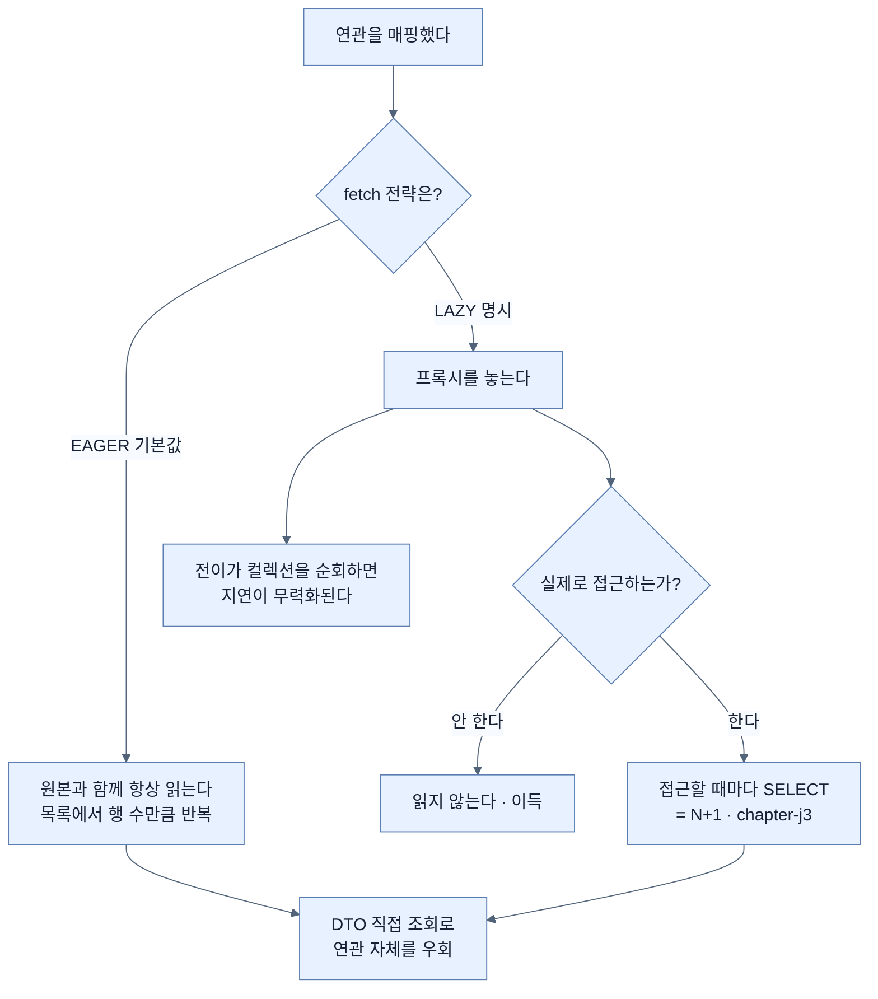

# chapter-j2 개념 지도 — 연관관계와 프록시

> 목차가 아니라 관계도다. 세션을 열 때와 닫을 때 항상 펼친다.
>
> 이 챕터가 답하는 한 문장짜리 질문: **"객체 사이의 참조를 테이블 사이의 외래 키로 옮길 때, 무엇이 사라지고 무엇을 대신 정해야 하는가?"**

## 축 1: 개수의 불일치 — 이 챕터의 모든 문제가 여기서 나온다

객체와 테이블은 관계를 표현하는 방식이 다르다. 다섯 노트 전부가 그 차이의 서로 다른 얼굴이다.

| 객체 세계 | 테이블 세계 | 사라지는 것 | 대신 정해야 하는 것 | 노트 |
|---|---|---|---|---|
| 참조 2개 (양방향) | 외래 키 1개 | "어느 참조가 진실인가" | 연관관계 주인 | [[01-association-owner-and-mappedby]] |
| 컬렉션 ↔ 컬렉션 | 조인 테이블 1개 | 조인 행의 정체성 | 연결 엔티티로 승격 | [[02-join-entity-instead-of-many-to-many]] |
| 참조 1개, 타입 2종 | 외래 키 2개 + CHECK | "어느 쪽이 채워졌나"의 타입 표현 | 세 선택지 중 하나 | [[03-exclusive-target-associations]] |
| 참조를 따라가면 객체가 있다 | 조인해야 행이 있다 | "언제 읽을 것인가" | fetch 전략 | [[04-proxies-and-lazy-loading]] |
| 객체를 버리면 사라진다 | 행은 명시적으로 지워야 한다 | 생명주기의 자동 종속 | 전이·고아 객체·DDL 연쇄 | [[05-cascade-orphan-removal-vs-db-cascade]] |

- **핵심 질문**: 이 매핑에서 "정보가 접히는 지점"은 어디이고, 접히면서 무엇을 잃는가?

## 축 2: 결정의 층 — 어디서 강제되는가

같은 규칙이 여러 층에 적힐 수 있다. 어느 층에 두느냐가 이 챕터의 반복되는 판단이다.

```text
    타입 시스템        컴파일 시점에 막는다        예: 정적 팩터리만 열기
         │
    도메인 메서드      런타임 진입점에서 막는다    예: Material.link() 의 중복 검사
         │
    JPA 매핑           영속성 컨텍스트를 통과하는 연산에 적용
         │             예: orphanRemoval · cascade
         ▼
    DB 제약            어떤 경로로 들어와도 적용   예: CHECK · 외래 키 · ON DELETE
```

- **핵심 질문**: 이 규칙이 JPA를 우회하는 경로(벌크 삭제·네이티브 SQL·psql)로 들어와도 지켜져야 하는가?
- 답이 "그렇다"면 DB 층이 필수다. CosmoRoute의 설계 원칙이 이쪽에 무게를 둔다.

## 축 3: 읽기 비용 — 언제 몇 번 읽는가



- **핵심 질문**: 이 연관을 정말 객체로 타고 다녀야 하는가, 아니면 조회 한 번으로 필요한 값만 가져오면 되는가?

## 축 4: CosmoRoute의 첫 슬라이스에서 실제로 내려야 할 결정

`slice/material-substance-mapping`이 이 챕터의 개념을 그대로 소비한다. 아래가 그 슬라이스에서 실제로 정할 항목이고, 각각의 근거가 어느 노트에 있는지다.

| 결정할 것 | 후보 | 이 챕터의 결론 | 근거 |
|---|---|---|---|
| 조인 테이블 매핑 방식 | `@ManyToMany` / 연결 엔티티 | **연결 엔티티** — 다른 선택지가 없다 | [[02-join-entity-instead-of-many-to-many]] |
| 배타적 대상 표현 | `@ManyToOne` 둘 / `@Any` / 식별자만 | **`@ManyToOne` 둘** — DB 제약을 지킨다 | [[03-exclusive-target-associations]] |
| 원료 쪽 컬렉션 | 둔다 / 두지 않는다 | **둔다** — 생명주기 종속 + 불변식 검사 | [[02-join-entity-instead-of-many-to-many]] |
| fetch 전략 | 기본값 / `LAZY` 명시 | **`LAZY` 명시** — `@ManyToOne` 기본은 즉시 | [[04-proxies-and-lazy-loading]] |
| 전이 설정 | `ALL` / 필요한 것만 | **`PERSIST`·`MERGE` + `orphanRemoval`** | [[05-cascade-orphan-removal-vs-db-cascade]] |
| 연결 생성 시 부모 조회 | `findById` / `getReference` | 대량이면 **`getReference`**, 검증 필요하면 `findById` | [[04-proxies-and-lazy-loading]] |
| "둘 중 하나" 강제 지점 | 서비스 / 엔티티 | **엔티티** — 정적 팩터리 + private 생성자 | [[03-exclusive-target-associations]] |

이 표가 그대로 슬라이스 spec의 결정 목록이 된다. **각 줄에 왜 그렇게 정했는지가 이미 있다** — ADR을 쓸 때 근거를 다시 찾을 필요가 없다.

## 나의 취약 엣지

아직 인출 시도가 없다. 사용자가 노트를 읽고 인출 연습을 한 뒤 채운다. 추정으로 미리 채우지 않는다.

## 앞 챕터에서 이어지는 곳

| `chapter-j1`의 결론 | 이 챕터에서의 전개 |
|---|---|
| 영속 상태에서만 더티 체킹이 작동한다 | 프록시 초기화도 같은 조건이다 — 컨텍스트가 없으면 예외 |
| 플러시 시점에 SQL이 만들어진다 | 연관 필드 중 **주인 쪽만** 그 판정에 참여한다 |
| `merge()`는 다른 인스턴스를 반환한다 | 전이의 `MERGE`도 같은 성질을 자식에게 전파한다 |
| 식별자를 애플리케이션이 할당한다 | 연결 엔티티도 같은 방식으로 식별자를 만든다 |

## 다음 챕터로 이어지는 곳

| 이 챕터의 끝 | `chapter-j3`의 시작 |
|---|---|
| "지연 로딩은 미루는 것이지 안 읽는 것이 아니다" | N+1의 정확한 발생 조건과 측정 방법 |
| "DTO 직접 조회로 연관을 우회한다" | fetch join · `@EntityGraph` · batch size의 적용 조건과 한계 |
| "`@DynamicUpdate`는 `@Version` 없이 위험하다" (j1) | 낙관적 락과 격리 수준 |
| "컨텍스트가 닫히면 프록시가 예외를 던진다" | OSIV가 그 경계를 어디까지 미루는가 |

## 관련 카테고리

- `part-2/chapter-3-querying-for-data-with-spring-boot` — 이 챕터가 그 Chapter의 선행이다. 책은 리포지토리와 쿼리 작성법을 다루지만 연관관계 매핑을 다루지 않는다.
- `part-0/chapter-j1-persistence-context` — 프록시 초기화와 전이가 모두 영속성 컨텍스트를 전제한다.
